# AWS 训练错题

### 问题核心概述

一家零售公司已经：

1. 建立了到 AWS 的 **Direct Connect** 专线连接。
2. 将**数据仓库**迁移到了 AWS。
3. 数据分析师使用一个**可视化工具**查询数据仓库。
4. 关键数据量：
   - 每次查询，数据仓库返回的结果平均为 **60 MB**。
   - 可视化工具返回给分析师浏览器的每个网页约为 **600 KB**。
   - 查询结果**未被缓存**。

**核心挑战**：如何设计架构，以**最小化数据传输的出口成本**？

------

### 核心概念：AWS 数据传输成本规则

要理解解决方案，必须掌握 AWS 的两条关键计费规则：

1. **数据传出收费**：
   - **Data Transfer Out**：数据从 AWS 网络流向互联网或您的本地网络时，会产生费用。这是成本的主要来源。
   - **Data Transfer In**：数据从互联网或您的本地网络流入 AWS，通常是**免费**的。
2. **区域内部传输免费**：
   - 在**同一个 AWS 区域**内，通过私有 IP 地址在不同服务之间传输数据（例如，从数据仓库到 EC2 实例），**通常是免费的**。
3. **Direct Connect 成本**：
   - 通过 Direct Connect 的数据传出费率**远低于**通过互联网的标准数据传出费率。

------

### 方案对比与分析

假设数据仓库在 `us-east-1`（弗吉尼亚北部）区域。


| 方案                                                         | 数据传输路径                                                 | 60MB 查询结果成本分析                                        | 600KB 网页成本分析                                         | **总成本评估** |
| :----------------------------------------------------------- | :----------------------------------------------------------- | :----------------------------------------------------------- | :--------------------------------------------------------- | :------------- |
| **1. 可视化工具部署在本地**                                  | 1. 查询从本地发到AWS数据仓库。 2. **60MB结果**从AWS数据仓库**传出**，经Direct Connect到本地工具。 3. 工具生成600KB网页在本地网络显示。 | **高**：60MB 通过 Direct Connect 传出，产生 **DTO 费用**。   | **零**：在本地网络传输，不涉及AWS。                        | **最高**       |
| **2. 可视化工具部署在与数据仓库不同的AWS区域**               | 1. 用户通过Direct Connect访问其他区域的工具。 2. 工具查询 `us-east-1` 的数据仓库。 3. **60MB结果**从 `us-east-1` **跨区域传输**到工具所在区域。 4. 工具生成600KB网页，传回用户。 | **非常高**：60MB 产生**跨区域数据传输费用**，费率高于Direct Connect。 | **低**：600KB 通过 Direct Connect 传出。                   | **很高**       |
| **3. 用户直接通过互联网访问AWS上的可视化工具**               | 1. 用户通过互联网访问工具。 2. 工具查询同区域数据仓库。 3. 工具将60MB结果加工成600KB网页，通过互联网传给用户。 | **零**：同区域传输，免费。                                   | **高**：600KB 通过**互联网网关**传出，这是最贵的传出方式。 | **高**         |
| **4. 【正确方案】可视化工具部署在与数据仓库相同的AWS区域，并通过同区域的Direct Connect访问** | 1. 用户通过Direct Connect访问同区域的工具。 2. 工具查询同区域数据仓库。 3. 工具将60MB结果加工成600KB网页，经Direct Connect传给用户。 | **零**：同区域传输，免费。                                   | **低**：仅 **600KB** 通过 **Direct Connect** 传出。        | **最低**       |

------

### 最终结论与原因总结

选择 **“将可视化工具部署在与数据仓库相同的 AWS 区域，并通过在同一区域的 Direct Connect 连接访问”** 能实现最低成本，原因如下：

1. **消除了最大的成本驱动因素**：60MB 的查询结果在 **AWS 区域内部** 从数据仓库传输到可视化工具。根据 AWS 规则，这部分传输是**免费的**。这是成本降低的最主要原因。
2. **最小化了付费数据出口量**：只有经过处理和大幅压缩后的 **600KB 网页** 需要传出到用户端。这使得需要付费的数据量减少了 99%（从 60MB 降至 600KB）。
3. **选择了成本最低的出口路径**：这 600KB 的数据是通过 **Direct Connect** 连接传出的，其数据传出费率远低于通过互联网的费率。

**一句话总结**：此方案通过架构设计，将绝大部分的数据传输转化为免费的内部传输，并将必须付费传出的数据量降至最低，同时选择了最经济的传出路径，从而实现了总数据传输出口成本的最小化。


## AWS Elastic Beanstalk

AWS Elastic Beanstalk 是一项旨在简化Web应用程序部署和管理的服务。它让开发者可以专注于编写代码，而无需担心底层基础设施的管理。下面这个表格汇总了它的核心信息，方便你快速了解：

| 维度           | 核心描述                                                 |
| :------------- | :------------------------------------------------------- |
| **服务定位**   | 面向开发者的**平台即服务**，用于快速部署和扩展应用       |
| **核心价值**   | **简化运维**：自动化基础设施管理，让开发者专注于业务逻辑 |
| **计费模式**   | **服务本身免费**，只为底层创建的AWS资源付费              |
| **支持技术栈** | Go, Java, .NET, Node.js, PHP, Python, Ruby, **Docker**等 |

### 🎯 核心概念解析

要顺畅使用 Elastic Beanstalk，需要理解以下几个核心概念：

- **应用程序**：是你 Elastic Beanstalk 项目的**顶层容器**，可以包含多个环境、版本和配置。通常，一个应用对应你正在开发的一个软件项目。
- **环境**：是运行你**应用程序版本**的AWS资源集合。每个环境有其专属的URL。一个典型的场景是为一个应用创建两个环境：一个用于**生产**，一个用于**测试**，它们彼此隔离。
- **应用程序版本**：指的是你**可部署代码的一个特定迭代版本**。每次你更新代码并准备部署时，就会创建一个新的应用程序版本。版本与你的源代码（例如一个WAR或ZIP文件）直接关联。
- **环境层**：决定了环境的**类型和用途**。主要分为两种：
  - **Web服务器环境层**：处理HTTP请求，适用于用户直接访问的网站或API。
  - **工作线程环境层**：处理后台任务，适合处理来自Amazon SQS队列的消息，用于执行异步或长时间运行的任务。

### ✨ 主要功能与优势

Elastic Beanstalk 的强大，体现在以下几个关键方面：

- **极简部署与自动化管理**：你只需要**上传应用程序代码**，Elastic Beanstalk 便会自动处理诸如容量预置、负载均衡、自动扩展和应用程序健康监控等部署任务。它还负责管理平台更新和安全补丁。
- **内置高可用与自动扩展**：服务内置了**高可用性**和**自动扩缩**功能。它能根据应用程序的负载情况自动增加或减少EC2实例数量，在流量激增时自动扩容避免服务中断，流量减少时自动缩容以节省成本。
- **灵活控制与广泛集成**：与某些"黑盒"式的PaaS服务不同，Elastic Beanstalk 在提供简便性的同时，并不剥夺你对资源的控制权。你可以随时访问底层EC2实例，自定义AWS资源配置。它与AWS生态系统深度集成，可以轻松地与 Amazon RDS（数据库）、Amazon S3（存储）、Amazon CloudWatch（监控）等服务配合使用。
- **支持多种技术栈与容器**：支持在 Go、Java、.NET、Node.js、PHP、Python 和 Ruby 中开发的应用程序，以及使用 Docker 容器部署。你可以选择自己的编程语言和应用程序依赖项。

### 🔄 工作流程简介

使用 Elastic Beanstalk 部署应用，通常遵循以下步骤：

1. **创建应用程序**：在AWS控制台中创建一个新的Elastic Beanstalk应用。
2. **上传代码**：将你的应用程序代码打包（例如ZIP文件）并上传。
3. **配置环境**：提供关于应用程序的信息（如选择环境类型和平台），Elastic Beanstalk 会自动启动环境并配置运行代码所需的AWS资源。
4. **管理**：通过 Elastic Beanstalk 控制台、命令行界面或API管理环境，并部署新的应用程序版本。

### 💼 主要应用场景

Elastic Beanstalk 在多种情况下都能大显身手：

- **传统应用迁移上云**：为传统的单体应用程序（如.NET、Java）提供简单的"直接迁移"路径到AWS云。
- **Web应用快速部署与原型设计**：非常适合快速部署现代Web应用（如使用Node.js、Python Django等框架）和进行原型设计。
- **容器化应用管理**：对于需要运行独立容器或微服务，但希望避免复杂容器编排的组织，可以在EC2实例上通过Elastic Beanstalk运行和管理Docker容器。

### ⚠️ 使用注意事项

在享受便利的同时，有几点需要特别注意：

- **无状态设计**：Elastic Beanstalk 的主体是 **无状态服务**。任何需要持久化存储的数据（如用户会话、上传的文件）都不应保存在单个EC2实例的本地磁盘上，而应使用外部服务如Amazon S3、Amazon EFS或数据库。这是实现可靠自动扩展的基础。
- **理解底层资源**：虽然Elastic Beanstalk简化了管理，但它创建的底层资源（如EC2实例、负载均衡器）仍然在你的AWS账户中，理解这些资源的基本概念和成本构成是有益的。


一个电子商务应用程序使用Amazon Aurora Multi-AZ部署作为数据库。性能分析显示，数据库读取导致高I/O，并增加了写入请求的延迟。解决方案架构师需要推荐一种方法将读请求与写请求分离。

### 为什么推荐设置读副本？

- **减轻主实例负载**：在Aurora Multi-AZ部署中，主实例处理所有写请求和读请求。当读请求频繁时，会导致高I/O压力，增加写请求的延迟。通过设置读副本，您可以将读请求卸载到只读的副本实例上，从而减少主实例的负载，改善写性能。
- **提高读取性能**：读副本专门处理SELECT查询等读操作，可以水平扩展以处理大量读请求，而不会影响主实例的写操作。
- **成本效益**：读副本比主实例成本更低，且易于管理。Aurora支持最多15个读副本，它们异步复制数据，确保数据最终一致性。
- **内置高可用性**：Aurora读副本自动与主实例同步，并可以在不同可用区部署，进一步提升容错能力。

### 如何实施？

1. **创建读副本**：
   - 在AWS管理控制台中，导航到Aurora数据库集群。
   - 选择“创建读副本”选项，并配置副本的实例类型、可用区等设置。Aurora会自动处理复制过程。
   - 读副本创建后，它会有一个独立的端点（例如 `cluster-name-ro-endpoint`），用于处理读请求。
2. **修改应用程序**：
   - 更新应用程序代码，将读请求（如SELECT查询）定向到读副本的端点，而写请求（如INSERT、UPDATE、DELETE）继续使用主实例的端点。
   - 许多应用程序框架和数据库连接库支持读写分离配置。例如，在应用程序中使用不同的数据库连接字符串或使用AWS SDK来自动路由请求。
   - 示例：在应用程序中，您可以使用两个数据库连接：
     - 写连接：指向主实例端点（例如 `cluster-name-cluster-endpoint`）。
     - 读连接：指向读副本端点（例如 `cluster-name-ro-endpoint`）。
3. **测试和监控**：
   - 部署更改后，监控数据库性能指标（如CPU使用率、I/O延迟）以确保读副本有效减轻了主实例负载。
   - 使用Amazon CloudWatch和Aurora的增强监控来跟踪读副本的复制延迟和负载。

### 其他考虑因素

- **一致性模型**：读副本是异步复制的，因此读请求可能会看到稍旧的数据。如果应用程序需要强一致性，确保读操作不会影响关键业务逻辑，或使用主实例进行一致性读。
- **自动故障转移**：如果读副本失败，应用程序应能够回退到主实例处理读请求，或者自动切换到其他读副本。Aurora读副本可以提升为独立集群，但通常需要手动干预或自定义脚本。
- **成本优化**：根据读负载调整读副本的数量和实例大小，以平衡性能和成本。


## Amazon Cognito

公司需要一个认证和授权机制，用于在Amazon API Gateway中授权API调用。公司希望解决方案提供内置的用户管理。

Amazon Cognito 提供两个主要组件：

1. Cognito User Pools：这是一个用户目录，提供注册、登录和用户管理功能。它支持基于标准的身份提供者，如Google、Facebook，也支持用户名和密码登录。
2. Cognito Identity Pools：这提供临时AWS凭证，用于访问其他AWS服务。它允许用户通过身份提供者（如Cognito User Pools、社交登录等）进行身份验证，然后获取临时凭证以访问AWS资源。


### 为什么 Amazon Cognito User Pools 是正确答案？

问题的核心要求是：

1. **授权API Gateway调用**
2. **提供内置的用户管理**

**Amazon Cognito User Pools** 正是为这个场景量身定做的服务。

**工作原理：**

1. **用户管理**：Cognito User Pool 作为一个独立的用户目录，直接提供了完整的用户生命周期管理功能，包括：
   - 用户注册、登录、邮箱/手机号验证。
   - 密码重置、多因素认证。
   - 自定义属性。
   - 内置的登录UI（或使用SDK构建自己的UI）。
   - 账户恢复。
2. **认证与授权**：
   - 用户通过User Pool登录后，会收到一个由AWS签名的 **JWT令牌**。
   - 在API Gateway中，您可以配置一个 **Cognito User Pool 授权方**。
   - 当客户端调用API时，需要在请求的 `Authorization` 头中携带这个JWT令牌。
   - API Gateway会自动验证该令牌的签名和有效期，并从令牌中提取用户信息（如`username`、`groups`等）。
   - 验证成功后，API Gateway将允许请求访问后端，并将用户信息传递给后端Lambda函数或其他集成服务。

------

### 澄清：Amazon Cognito Identity Pools 的作用

我之前的回答混淆了 **身份验证** 和 **授权访问AWS服务** 的概念。

- **Amazon Cognito User Pools**：核心是 **认证**。它回答“**你是谁？**” 并管理用户身份。用于对“人”进行身份验证。
- **Amazon Cognito Identity Pools**：核心是 **授权**。它回答“**你被允许访问哪些AWS资源？**” 它通过交换一个可信身份提供者（如User Pools, Facebook, Google）的令牌，来提供临时的AWS凭证（Access Key, Secret Key, Session Token）。这些凭证用于直接调用AWS服务（如向S3上传文件，或访问DynamoDB）。

**为什么 Identity Pools 不适合这个特定问题？**

- **间接且复杂**：使用Identity Pools来保护API Gateway，需要客户端先获取临时AWS凭证，然后用这些凭证对每个API请求进行复杂的SigV4签名。这个过程比简单地传递一个JWT令牌要繁琐得多。
- **不是“直接”的API授权机制**：虽然可以通过IAM策略授权API，但这通常用于服务-to-服务通信或需要直接访问其他AWS资源的场景，而不是作为面向最终用户API的主要授权方式。
- **User Pools 更直接**：对于“一个用户调用一个API”这个场景，User Pools授权方是更简单、更直接的解决方案。

### 总结与对比

| 特性                 | Amazon Cognito User Pools (正确答案) | Amazon Cognito Identity Pools (我之前的错误答案) |
| :------------------- | :----------------------------------- | :----------------------------------------------- |
| **核心功能**         | 用户目录和认证服务                   | 联合身份，提供AWS临时凭证                        |
| **用户管理**         | **直接提供内置用户管理**             | 不直接管理用户，依赖外部身份源（如User Pools）   |
| **API Gateway 集成** | 作为**授权方**，直接验证JWT令牌      | 通过**IAM授权**，验证SigV4签名                   |
| **最佳适用场景**     | 为您的应用程序管理用户并保护API      | 授予用户访问其他AWS服务（如S3, DynamoDB）的权限  |

**结论：**

对于“授权API Gateway调用”且需要“内置用户管理”的用例，最合适、最直接的解决方案是 **使用Amazon Cognito User Pools 作为API Gateway的授权方**。它完美地将用户目录管理与API授权流程结合在一起。


## S3数据监测

这家金融公司想要**识别S3存储桶中的敏感数据**，同时**监控并防范恶意活动**的需求，组合使用 **Amazon Macie** 和 **Amazon GuardDuty** 确实是AWS的标准最佳实践。

这两个服务就像你数据安全团队中两位职责不同的专家，它们各自擅长一个领域，并且可以协同工作。下面这个表格可以帮你快速了解它们的核心区别与分工：


| 特性维度           | 🕵️ Amazon Macie (敏感数据识别专家)                            | 🛡️ Amazon GuardDuty (威胁检测专家)                            |
| :----------------- | :----------------------------------------------------------- | :----------------------------------------------------------- |
| **核心功能**       | 发现、分类和保护存储在S3中的**敏感数据**。                   | 持续监控AWS环境（包括S3），检测潜在的**恶意活动和未经授权的行为**。 |
| **数据保护侧重点** | **数据本身的内容**：扫描数据，识别如PII、信用卡号等敏感信息。 | **数据的访问环境与行为**：分析日志，检测如异常API调用、已知恶意IP访问等威胁行为。 |
| **对S3的特别功能** | 提供**敏感数据发现**，为存储桶计算**敏感度分数**，并生成**数据地图**。 | 提供**Malware Protection for Amazon S3**，自动扫描新上传对象中的恶意软件。 |
| **主要检测机制**   | **机器学习、模式匹配、自定义标识符**。                       | **机器学习、异常检测、集成威胁情报**。                       |
| **输出结果**       | **敏感数据发现结果**：报告找到的敏感数据类型、位置、严重性等。 | **安全发现结果**：报告潜在威胁，如可疑登录、数据外泄、加密货币挖矿等。 |

### 🕵️ 深入了解 Amazon Macie

Macie 的核心任务是回答“我的S3存储桶里到底存了哪些敏感数据？”它通过以下方式工作：

- **自动发现与分类**：Macie可以自动地、持续地对你账户中的S3存储桶进行盘点和分析。它使用内置的、大量的**托管数据标识符**（例如，用于检测各种信用卡号、个人身份信息等）来识别常见类型的敏感数据。此外，你还可以创建**自定义数据标识符**来检测公司特有的敏感数据，比如内部员工编号或客户账号。
- **敏感度评分**：Macie会为每个S3存储桶计算一个**敏感度分数**（从-1到100）并分配一个标签（如“敏感”、“不敏感”）。这为你提供了一个直观的视角，快速定位到需要重点关注的数据存储位置。
- **生成数据地图**：它会创建一个整个S3数据资产的交互式可视化地图，清晰地展示敏感数据的分布情况。

### 🛡️ 深入了解 Amazon GuardDuty

GuardDuty 的核心任务是回答“有没有坏人在打我的数据的主意？”。它更像是一个7x24小时的智能监控中心：

- **智能威胁检测**：GuardDuty不直接扫描你存储的数据内容，而是持续分析来自多个AWS数据源（如AWS CloudTrail事件日志、Amazon VPC Flow Logs和DNS日志）的数十亿事件。它利用机器学习、异常检测和来自AWS及知名网络安全公司的威胁情报源，来识别诸如加密货币挖矿、凭证泄露、数据异常访问、与已知恶意控制服务器通信等行为。
- **S3恶意软件防护**：GuardDuty的一个关键功能是**Malware Protection for Amazon S3**。它可以自动扫描上传到S3存储桶的新对象，检测其中是否包含潜在的恶意软件，从而实现近乎实时的威胁缓解。
- **分级警报**：GuardDuty发现的安全问题会以**调查结果**的形式呈现，并根据严重程度分为高、中、低三个级别，帮助你确定处理优先级。

### 💡 如何协同工作与服务集成

在实际部署中，Macie和GuardDuty可以紧密集成，共同构建一个更强大的安全防线：

1. **工作流程**：Macie首先帮你摸清家底，找到高价值的敏感数据存放在哪里。然后，你可以针对这些被标记为“敏感”的存储桶，利用GuardDuty实施更严格的行为监控和恶意软件扫描。
2. **与AWS Security Hub集成**：两者都可以将发现结果发送到**AWS Security Hub**。在Security Hub中，你可以得到一个统一的安全态势视图，将Macie报告的“这里有机密数据”与GuardDuty报告的“这个机密数据正被异常访问”关联起来，从而更全面地识别和评估安全风险。
3. **自动化响应**：通过**Amazon EventBridge**，你可以捕获Macie或GuardDuty生成的事件，并触发自动化的响应工作流。例如，当GuardDuty检测到某个S3存储桶出现高严重性的威胁时，可以自动触发一个Lambda函数来修改存储桶策略，立即暂时限制访问。


## SQS标准队列迁移到FIFO队列

在迁移Amazon SQS标准队列到FIFO队列时，有三个关键步骤需要特别注意。我为你整理了这些步骤及其原因，希望能帮你和你的团队顺利完成任务。

### ✅ 迁移 checklist 的核心步骤

| 迁移步骤                                         | 关键原因与注意事项                                           |
| :----------------------------------------------- | :----------------------------------------------------------- |
| **确保FIFO队列名称以 .fifo 结尾**                | 这是AWS的硬性规定，以便系统识别队列类型。队列名在80字符限制内，这个后缀也计算在内。 |
| **删除现有标准队列并重建为FIFO队列**             | **无法直接转换**。你必须**创建新的FIFO队列**，或**删除现有标准队列后重建**为FIFO类型。删除队列将永久删除队列及其消息，务必提前处理完重要消息或确认队列可删除。 |
| **确保目标FIFO队列的吞吐量不超过每秒3000条消息** | 默认情况下，FIFO队列**不支持**标准队列的近无限吞吐量，**每秒处理消息上限为3000条**。高吞吐量模式可提升限额，需专门启用。 |

### 💡 理解FIFO队列的其他关键点

除了上述三个关键步骤，了解FIFO队列的以下核心特性，对迁移和后续应用设计也至关重要：

- **严格的消息顺序**：FIFO队列的核心是**严格保证消息的先后顺序**。这是通过**消息组ID（Message Group ID）** 实现的。在同一消息组内的消息会严格按序处理。使用**更细粒度的消息组ID**（例如，每个订单ID或用户ID作为一个独立的Message Group ID）有助于提高并发处理能力和吞吐量。
- **精确的一次处理**：FIFO队列通过**去重ID（Message Deduplication ID）** 来确保消息不会被重复处理。你可以在发送消息时提供此ID，或者**启用基于内容的去重**，让SQS通过哈希消息体自动生成ID。
- **延迟设置调整**：FIFO队列**不支持针对单条消息设置延迟**。如果你的应用在原标准队列中设置了每消息延迟，需要修改为**设置整个队列的延迟**。


## 关于EDA应用中"热数据"和"冷数据"存储解决方案的问题


| 服务名称                               | 服务类型                    | 核心优势                                                  | 主要适用场景                                   |
| :------------------------------------- | :-------------------------- | :-------------------------------------------------------- | :--------------------------------------------- |
| **Amazon FSx for Lustre**              | 高性能并行文件系统          | **亚毫秒级延迟**、**高吞吐**(可达数百GB/秒)，与S3原生集成 | 机器学习、高性能计算 (HPC)、芯片设计、媒体处理 |
| **Amazon FSx for Windows File Server** | 完全托管的Windows文件服务器 | 完全兼容Windows及SMB协议，与Active Directory集成          | 企业办公文件共享、需Windows兼容性的应用        |
| **Amazon EMR**                         | 大数据处理平台              | 托管Hadoop/Spark集群，处理海量数据                        | 大数据分析、数据清洗、转换、机器学习模型训练   |
| **AWS Glue**                           | 无服务器数据集成服务        | 数据目录、ETL作业编排与运行                               | 数据准备、数据编目、数据管道开发               |

### 💾 详解 Amazon FSx for Lustre 的匹配度

FSx for Lustre 的架构和功能，与EDA应用的数据处理需求高度契合：

- **应对“热数据”处理**：EDA仿真模拟会产生海量小文件，对I/O性能要求极高。FSx for Lustre作为**并行分布式文件系统**，能提供**亚毫秒级的延迟**和**高达数百GB/秒的吞吐量**，确保计算节点能快速存取数据，避免因存储瓶颈导致计算资源闲置。
- **智能分层与“冷数据”管理**：FSx for Lustre 原生集成Amazon S3。你可以将需要长期参考的“冷数据”（如旧版设计、库文件）存储在低成本的S3中，通过**数据存储库任务**，按需将数据快速加载到FSx for Lustre进行处理。此外，**Intelligent-Tiering存储类别**能自动将不常访问的数据移至成本更低的存储层，实现**性能和成本的最佳平衡**。
- **灵活的部署选项**：根据数据持久性和可用性需求，你可以选择：
  - **Scratch文件系统**：用于**短期**、**高爆发**的数据处理任务，成本优化，但硬件故障时不保留数据。
  - **Persistent文件系统**：用于**长期**存储和**对可用性敏感**的工作负载，数据会被复制，硬件故障时自动恢复。

### 🔍 其他服务为何不完全匹配

- **Amazon FSx for Windows File Server**：其核心是提供兼容SMB协议的文件服务，主要面向依赖Windows文件共享的传统应用，**并非为高性能并行计算**而设计。
- **Amazon EMR** 和 **AWS Glue**：这两者都是强大的**大数据分析**工具。它们擅长使用Spark等框架对海量数据进行**批量处理、转换和分析**（ETL）。而EDA工作流的瓶颈往往在于**海量小文件的低延迟、高吞吐读写**，这并非EMR和Glue的设计初衷。


### Amazon S3 一致性模型精要总结

#### 核心原则：强一致性

对于特定操作，S3提供**强一致性**。这意味着：

> **一旦写入操作（PUT/DELETE）成功完成（客户端收到成功响应），所有后续的读取请求将立即且始终返回最新版本的数据。**

**关键操作的行为：**

| 操作                 | 一致性保证   | 详细解释                                                     |
| :------------------- | :----------- | :----------------------------------------------------------- |
| **覆盖写入 (PUT)**   | **强一致性** | 成功覆盖后，**任何**读取都立即看到新数据。**永远不会读到旧数据。** |
| **删除 (DELETE)**    | **强一致性** | 成功删除后，**任何**读取都立即返回 `Key不存在` (404)。       |
| **新对象写入 (PUT)** | **强一致性** | 成功写入后，**任何**读取都立即可见。                         |

#### 关键澄清：“写入中” vs “写入后”

这是理解整个问题的核心分歧点。

- **写入中 (In-Progress)**：
  - **状态**：`PUT` 请求已发出，但**尚未收到**S3的“200 OK”成功响应。
  - **读取行为**：此时读取，结果不确定。**可能返回旧数据，也可能收到404**。这描述了您最初选择的选项的场景。
  - **性质**：这是一个**非正常、有风险的编程实践**，在严谨的系统（如高频交易）中应避免。
- **写入后 (Completed)**：
  - **状态**：客户端已明确收到S3的“写入成功”信号。
  - **读取行为**：从此刻起，S3 **保证** 所有读取都返回新数据。这描述了正确答案的场景。
  - **性质**：这是S3对外承诺的**服务能力 (SLA)**，是正常操作流程下可以依赖的行为。

**结论**：在描述S3的**能力和保证**时，应基于“写入成功后”这一标准前提，因此“**总是返回最新版本**”是正确的。

#### 版本控制 (Versioning) 的影响

启用版本控制**不会改变**S3的强一致性语义，但它改变了数据存储的方式。

- **不变的是**：**不指定版本ID的默认读取操作，依然是强一致的，总是返回最新版本。**
- **改变的是**：
  - 覆盖写入不再是“替换”，而是“**创建新版本**”。
  - 旧版本的数据被永久保留，您可以通过**指定版本ID** 来访问任何一个历史版本。
  - 这提供了数据恢复和审计能力，但没有改变默认读取的强一致性。

------

### 终极记忆心法

1. **记结论**：对于S3，成功的 `PUT` 和 `DELETE` 操作是**强一致的**。
2. **划界限**：强一致性的起点是 **“客户端收到成功响应”**，而不是“写入请求发出”。
3. **分场景**：您的选项描述的是“写入中”的**风险行为**，而正确答案描述的是“写入后”的**服务保证**。
4. **解疑惑**：版本控制让你能“回到过去”读旧版本，但不影响你“看现在”读最新版本。


## 使用 **AWS Global Accelerator** 来测试蓝绿部署

### 为什么 AWS Global Accelerator 是破局的关键？

AWS Global Accelerator 采用了一种完全不同的思路，它**绕开了DNS缓存这个根本问题**。

**1. 静态任播IP地址：不变的入口点**

- 你为应用程序分配一个（或两个）**静态的Anycast IP地址**。
- 这些IP地址是固定的，**永远不会改变**，无论你如何调整后端的部署。
- 用户设备、DNS缓存器缓存的是这个**固定的IP地址**。

**2. 在AWS网络内部进行智能路由**

- 这是最关键的一步。当用户向这个静态IP发起请求时，流量首先进入全球的AWS边缘站点。
- **此后，流量如何路由到最终的计算环境（蓝色或绿色），完全由AWS的全球网络内部策略决定，与用户的DNS缓存无关。**

**3. 精准的流量控制（流量拨号）**

- 在Global Accelerator的控制台，你可以配置**终端组**——一个指向蓝色环境（如ALB），另一个指向绿色环境（如新的ALB）。
- 你可以通过一个名为 **“流量拨号”** 的滑块，**实时地、精确地**控制流向每个终端组的流量百分比。
  - **初始状态**：蓝色组 100%，绿色组 0%。
  - **开始测试**：在几分钟内，将滑块调整为：蓝色组 90%，**绿色组 10%**。
  - **效果**：**立即**，全球大约10%的新连接请求会被AWS网络引导至绿色环境。这个比例是精准、实时且不受DNS缓存影响的。


### 完整的访问流程

1. **用户输入网址**：用户和往常一样，在手机浏览器或App中输入您的域名，例如 `www.retail.com`。
2. **DNS解析（第一次，也是最后一次受缓存影响）**：
   - 手机会发起DNS查询，询问 `www.retail.com` 的IP地址。
   - **关键在这里**：在Amazon Route 53（或其他DNS服务商）上，您为 `www.retail.com` 设置的**记录（A记录或AAAA记录）指向的不是您的负载均衡器，而是AWS Global Accelerator为您提供的那个/那两个静态Anycast IP地址**。
   - 手机收到这个IP后，会将其**缓存**起来。
3. **建立连接（绕过后续DNS缓存）**：
   - 当用户要访问您的应用时，手机使用它缓存的这个**GA的静态IP**来建立TCP连接。
   - 从此以后，所有通信都直接发往这个IP地址。**后续的流量路由完全由GA控制，与DNS无关。**

### 核心优势的体现

这个设计的精妙之处在于：

- **您把“变化”从“不可控”的地方转移到了“可控”的地方**：
  - **不可控的**：全球无数移动设备和本地ISP的DNS缓存。
  - **可控的**：AWS全球网络内部的流量路由策略。
- **一次缓存，终身受益**：即使用户设备的DNS缓存长达24小时，它缓存的也是GA的IP。在这24小时内，无论您在GA控制台上如何调整流量拨号（将10%、50%、90%的流量导向绿色部署），这个用户的请求都会先到达GA的边缘站点，然后由GA的智能路由系统根据**当前的、实时的配置**决定将其发往蓝色还是绿色环境。**DNS缓存不再成为障碍。**


- 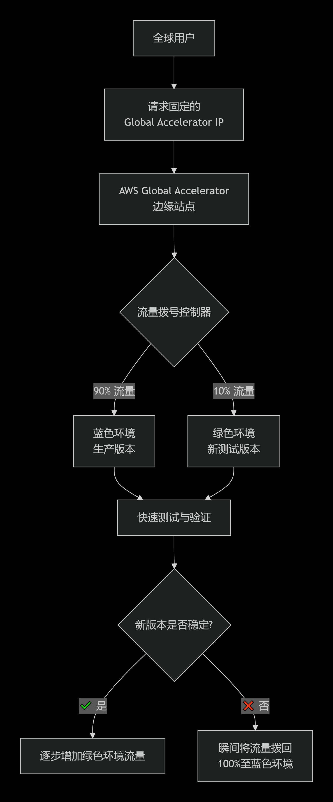

### 为什么其他选项无法解决核心矛盾？


| 选项                         | 工作原理                                                     | 为何在移动DNS缓存场景下失效                                  |
| :--------------------------- | :----------------------------------------------------------- | :----------------------------------------------------------- |
| **Amazon Route 53 加权路由** | 通过**更改DNS记录**的权重来分配流量。客户端在发起连接前，需要先查询DNS。 | **致命弱点**：移动设备或本地ISP的DNS解析器会缓存旧的DNS记录。即使用户在Route 53上已将50%流量指向新环境，一个缓存了旧IP的移动设备在接下来几个小时甚至几天内，**依然会访问旧环境**。你无法控制哪些用户能立即获得新的DNS记录，测试流量无法快速、精准地到达。 |
| **Elastic Load Balancing**   | ELB本身不直接做蓝绿流量切换。要切换流量，你依然需要通过**更改DNS记录**（如CNAME记录）将域名指向新的ELB。 | 和Route 53的问题一样，这最终**依赖于DNS更新**。切换后，受DNS缓存影响的用户将无法访问新部署，或者更糟，在回滚时依然卡在有问题的新部署上。 |
| **AWS CodeDeploy**           | 这是一个**部署工具**，用于自动化应用程序的部署过程（如安装软件、运行脚本）。 | CodeDeploy本身**不解决流量路由问题**。它需要与ELB或Route 53配合来实现蓝绿切换。因此，它无法绕过底层的DNS缓存难题。 |

### 增加补充

- **AWS Global Accelerator** 就像 **“国家空管中心”**。
- **ELB/ALB** 就像 **“单个机场的塔台”**。

让我们来详细对比一下它们的分工：

| 特性             | AWS Global Accelerator (国家空管中心)                     | ELB / ALB (机场塔台)                                         |
| :--------------- | :-------------------------------------------------------- | :----------------------------------------------------------- |
| **控制范围**     | **全局性**                                                | **区域性**                                                   |
| **核心职责**     | **跨区域流量调度**、**全局服务发现**、**故障转移**        | **区域内负载均衡**、**将流量分发到后端目标**                 |
| **流量分配依据** | **地理位置**、**端点健康状态**、**管理员配置的流量拨盘**  | **负载均衡算法**（如轮询、最少未完成请求）                   |
| **关键能力**     | **绕过DNS缓存**，提供**静态入口IP**                       | **基于内容的路由**、**路径路由**、**主机头路由**、**SSL终止** |
| **“蓝绿”控制**   | 在**空管中心级别**控制去往**不同机场（区域）** 的流量比例 | 在**塔台级别**控制去往**不同跑道或登机口（目标组）** 的流量  |

**结论是：**

1. **ELB/ALB不弱，也不随机**：在一个**区域内部**，它们的流量分配是非常智能和高效的。例如，ALB可以根据请求的URL路径（如 `/api` 和 `/web`）将流量路由到完全不同的后端服务集群（即不同的**目标组**），这是非常强大的能力。
2. **但它们不解决“第一公里”问题**：ELB/ALB的强大能力，**前提是流量已经到达了这个ELB/ALB**。而如何让用户的请求跨越互联网，精准地到达**某一个特定的ELB**，这个“第一公里”的路由问题，是ELB/ALB自身无法解决的。这必须依赖于上一层的服务——也就是 **DNS** 或者更先进的 **AWS Global Accelerator**。


### 推荐实施步骤

1. **设置 AWS Global Accelerator**：创建两个终端组，分别指向蓝色和绿色部署（例如，使用 Application Load Balancer 或 EC2 实例）。
2. **配置流量拨号**：初始设置将 100% 流量指向蓝色部署。然后，通过控制台或 API 逐步调整流量百分比（例如，将 10% 流量切换到绿色部署）。
3. **监控和测试**：使用 Global Accelerator 的监控功能（如 CloudWatch 指标）跟踪用户响应和错误率。在 48 小时内逐步增加流量到绿色部署，确保测试覆盖尽可能多的用户。
4. **快速回滚**：如果发现问题，可以立即将流量拨回 100% 蓝色部署，最小化影响。


## 蓝绿部署

### 高速公路施工的比喻

想象一下，你正在管理一条繁忙的高速公路（**你的生产环境**）。

- **蓝色环境（当前运行的生产系统）**：就像**旧的高速公路**，所有车辆（**用户流量**）都在上面正常行驶。
- **绿色环境（新版本的系统）**：就像在旁边新建了一条**全新的、完全相同的平行高速公路**，并且已经铺好沥青、画好标线，一切就绪。

**部署过程如下：**

1. **建造新路（部署）**：你在旧路旁边，悄悄地建造一条新路（**部署新版本到绿色环境**）。这个过程完全不影响旧路上的交通。
2. **最终测试**：在新路开放前，你可以派几辆测试车上去跑一圈，确保路面平整、标志清晰（**对新环境进行最终验证**）。
3. **切换交通（发布）**：一旦确认新路没问题，你只需**瞬间改变所有入口的指示牌**，让所有车辆从旧路**全部切换到新路**上行驶。
4. **观察与回滚**：
   - **如果新路畅通无阻**：那么旧路就可以暂时关闭，以备后用。
   - **如果新路发现严重坑洼（出现严重Bug）**：解决方案极其简单快速——**立即把指示牌再切换回来**！所有车辆又回到了旧路上。整个回滚过程可能在几秒钟内完成，对用户影响极小。

------

### 技术层面的实现

在AWS这样的云环境中，蓝绿部署是这样做：

- **蓝色环境**：当前正在运行应用程序版本 v1.0 的一套完整基础设施（EC2实例、负载均衡器、数据库等）。
- **绿色环境**：你预先配置好的、与蓝色环境一模一样的一套新基础设施，但上面运行的是新版本 v2.0。
- **切换开关**：通常使用**路由服务**（如之前问题中提到的 **AWS Global Accelerator**、**Route 53** 或 **ELB**）作为那个“交通指示牌”。所有用户都连接到这个路由服务。
- **发布时刻**：管理员通过改变路由服务的配置，将用户流量从指向蓝色环境**瞬间切换**到指向绿色环境。

### 蓝绿部署的核心优势


| 优势               | 解释                                                         |
| :----------------- | :----------------------------------------------------------- |
| **接近零停机发布** | 切换是瞬间的，用户可能只会感觉到一次短暂的重连。             |
| **快速回滚**       | 如果新版本有问题，只需将流量切回蓝色环境即可，恢复时间以秒或分钟计。 |
| **发布风险低**     | 在流量切换前，你有一个完全独立、干净的环境进行充分测试。     |
| **无需清理**       | 如果绿色环境部署失败，直接销毁它即可，不会影响当前生产环境。 |

### 蓝绿部署的挑战

- **成本**：你需要同时运行两套完整的环境，成本接近翻倍（但云环境的按需付费模式大大缓解了这一点）。
- **数据兼容性**：这是最大的挑战。新版本（绿色环境）的数据库结构或数据是否需要变更？如何确保在切换前后数据的一致性？通常需要配合数据库迁移脚本和回滚脚本使用。

### 回到之前的问题

现在你就能更好地理解为什么在那个零售公司的场景中（移动端DNS缓存严重，时间紧迫），**AWS Global Accelerator** 是一个比基于DNS的方案（如Route 53）更好的“交通指示牌”。因为它能**绕过DNS缓存，实现精准、实时的流量切换**，确保在48小时的测试窗口内，公司能快速、安全地将用户流量引导到绿色部署进行测试，并在发现问题时瞬间切回。

总结来说，**蓝绿部署是一种通过维护两套完全相同的环境，并通过切换流量来实现无缝发布和瞬时回滚的部署策略**，是现代化DevOps实践中追求高可用性和低发布风险的核心技术。


AWS Global Accelerator (GA) 是一项网络服务，它利用AWS的全球网络基础设施，通过智能路由和静态入口点，为你部署在多个区域的应用提供**高性能、高可用性**的访问能力。下面这个流程图概括了它的核心工作机制：

###  流量路由机制详解

GA的核心智能在于其路由决策，它主要依赖以下几个因素：

- **地理位置与网络状况**：GA利用**任播（Anycast）** 技术，让你配置的静态IP地址从全球多个AWS边缘站点同时发布。用户流量会进入**地理位置上最近**的边缘站点。之后，流量通过监控良好、无拥塞、冗余的AWS全球网络传送到端点，通过最大限度地延长流量在AWS网络上的时间，确保流量始终通过最佳网络路径进行路由。
- **端点健康状况（适用于标准加速器）**：GA会**持续监控**所有端点的健康状况。如果检测到某个端点运行状况不佳，GA会立即开始将所有**新连接**的流量引导至其他健康的端点。这为应用程序提供了高可用性。运行状况检查不用于自定义路由加速器。
- **流量拨号与端点权重（适用于标准加速器）**：你可以使用**流量拨号** 来增加或减少发送到特定端点组的流量百分比，例如用于性能测试或堆栈升级。此外，你还可以为组内端点配置**权重**，以控制流向它们的流量比例。这为蓝绿部署和A/B测试提供了便利。
- **确定性路由（适用于自定义路由加速器）**：对于自定义路由加速器，GA的路由方式不同。根据接收流量的**侦听器端口**，流量会被确定性地路由到VPC子网中的特定目标（EC2实例和端口）。这适用于需要根据自定义逻辑（如玩家技能、游戏模式）将用户引导到特定服务器的场景。

### 🛠️ 主要功能与控制选项

- **客户端亲和性**：对于有状态应用，你可以配置GA，将来自同一客户端IP地址的所有请求都引导至同一端点，以保持会话连续性。默认情况下，此设置关闭，流量在端点间平均分配。
- **运行状况检查**：对于标准加速器，GA会自动检查与静态IP地址关联的端点的运行状况，然后仅将用户流量引导至运行状况良好的端点。你可以配置自定义的运行状况检查设置。

### 🆚 两种加速器类型对比

GA提供两种类型的加速器以适应不同场景：

| 特性         | 标准加速器                           | 自定义路由加速器       |
| :----------- | :----------------------------------- | :--------------------- |
| **主要目标** | 提高应用程序的可用性和性能           | 将用户映射到特定目的地 |
| **端点类型** | 网络/应用负载均衡器、EC2实例、弹性IP | VPC子网                |
| **路由依据** | 地理位置、端点健康状况、权重         | 侦听器端口             |
| **健康检查** | 支持                                 | 不支持                 |
| **典型用例** | 蓝绿部署、A/B测试、多区域部署        | 在线游戏、VoIP应用程序 |

### 💁 典型应用场景

- **蓝绿部署与A/B测试**：通过**流量拨号**和**端点权重**，你可以精确控制流向不同应用版本的流量比例，实现平滑、低风险的部署或测试。
- **多区域高可用与容灾**：当GA检测到主区域端点故障时，会**立即将新流量路由**到其他健康区域的端点，实现快速故障转移。
- **延迟敏感型应用**：对于游戏、实时通信、金融交易等应用，GA通过智能路由和AWS骨干网，能显著**降低延迟和抖动**。
- **简化扩展与安全管理**：使用静态IP作为固定入口点，便于防火墙规则设置。后端端点变更时，客户端无需感知。同时，入口点默认受AWS Shield保护，提供DDoS攻击防护。


### 🆚 NAT网关 vs NAT实例核心对比


| 对比维度         | NAT 网关                                                     | NAT 实例                                                     |
| :--------------- | :----------------------------------------------------------- | :----------------------------------------------------------- |
| **管理与维护**   | **全托管服务**，AWS负责运维、打补丁和升级，无需用户干预。    | **用户自行管理**，需负责EC2实例的运维、安装软件更新和操作系统补丁。 |
| **可用性与容错** | **原生高可用**。在单个可用区内冗余部署，但需在不同可用区创建以实现跨AZ容错。 | **默认单点故障**，需用户**自行设计高可用架构**（如使用脚本管理故障转移、Auto Scaling组）。 |
| **性能与带宽**   | **自动扩展**，最高可达 **100 Gbps**。软件针对NAT流量深度优化。 | **取决于实例类型**，带宽固定。需要手动调整实例大小以适应流量变化。 |
| **成本模型**     | **无预留选项**。费用基于使用时长、网关数量和**处理的数据量**。 | 费用基于实例类型、大小和使用时长，对于**极低流量或可利用Spot实例**的场景可能更经济。 |
| **配置灵活性**   | **配置选项有限**。不支持安全组关联、端口转发或充当堡垒服务器。 | **高度可定制**。可配置安全组、安装自定义软件、进行端口转发，甚至可作为堡垒服务器使用。 |
| **部署与网络**   | 创建时自动从子网IP范围分配私有IP，**必须绑定一个弹性IP（EIP）**。 | 启动时从子网IP范围分配特定私有IP，可使用弹性IP或公有IP。     |

### 💡 如何选择及迁移建议

了解了核心区别后，最关键的是如何根据你的具体场景做出选择。

- **选择 NAT 网关，如果**：
  - 你运营的是**生产环境或关键业务 workload**，需要高可用性和可靠性。
  - 你的团队希望**减少运维负担**，不想管理底层服务器。
  - 你的网络**流量较大或存在波峰波谷**，需要服务能自动扩展。
  - **快速部署和简化架构**是你的首要考虑。
- **考虑 NAT 实例，如果**：
  - 你有**严格的成本控制要求**，且网络流量非常低，愿意用管理开销换取成本节约。
  - 你需要对NAT设备进行**深度定制和监控**，例如安装特定的监控工具或配置复杂的防火墙规则。
  - 你的架构需要**端口转发**或将NAT设备兼作**堡垒服务器**使用。
  - 你是一个学习环境或概念验证（PoC）项目，需要完全的控制权。

**关于成本的一个进阶提示**：提到了一种使用Auto Scaling组和Spot实例自动管理NAT实例集群的方案，该方案在特定流量模型下（如每月500GB）相比NAT网关可以显著降低成本（约74.6%）。但这引入了显著的架构复杂性和运维责任，适合有深厚运维能力的团队在成本压力极大的情况下考虑。

### 🚀 从NAT实例迁移到NAT网关

AWS官方建议将已有的NAT实例迁移到NAT网关。若你决定迁移，可以参考以下步骤：

1. **创建NAT网关**：在NAT实例所在的**同一公有子网**中创建一个新的NAT网关。在创建时，你可以选择一个新的弹性IP，或者先将旧NAT实例的EIP解绑，然后关联给新的NAT网关。
2. **更新路由表**：将指向NAT实例的私有子网路由表条目（目的地 `0.0.0.0/0`）的下一跳，**修改为新建的NAT网关**。
3. **注意事项**：
   - 在切换路由和EIP时，**所有经过NAT的现有网络连接都会中断**，需要重新建立。请务必在业务低峰期进行操作。
   - 完成迁移并确认NAT网关工作正常后，记得**终止旧的NAT实例**以避免不必要的费用。


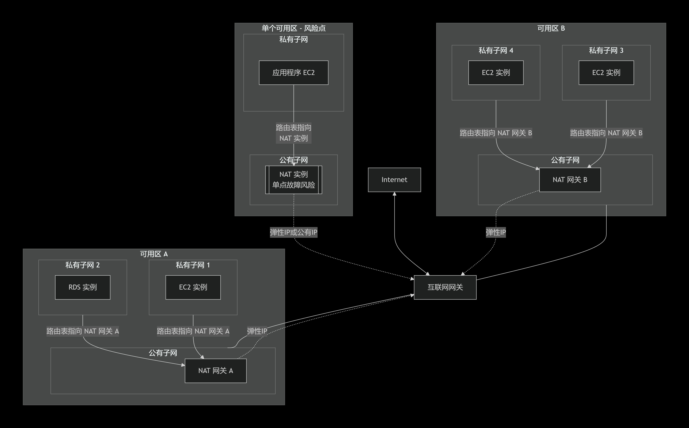


#### 一家大数据分析公司希望将现有数据文件以及任何持续的文件更新从Amazon S3流式传输到Amazon Kinesis Data Streams。需要找到最快的方法。


  为什么AWS DMS是最快的解决方案？

**AWS Database Migration Service (DMS)** 是处理这个场景的最佳选择，原因如下：

1. **同时处理现有数据和持续更新**
   - DMS支持**全量加载 + 持续复制**，能够一次性迁移所有现有S3数据文件，同时实时捕获后续的文件更新
   - 这是其他方案无法直接提供的完整功能
2. **内置的CDC（变更数据捕获）能力**
   - DMS自动检测S3桶中的新文件和文件变更
   - 无需编写额外代码来处理数据变化检测
3. **直接集成支持**
   - DMS原生支持Amazon S3作为源
   - DMS原生支持Amazon Kinesis Data Streams作为目标
   - 这种端到端的集成大大简化了架构
4. **最小开发工作量**
   - 只需配置DMS复制任务，无需编写和维护Lambda函数代码
   - 设置时间最短，符合"最快可能方式"的要求

## 其他选项的问题分析

### ❌ 选项1：S3 → SNS → Kinesis

- **技术不可行**：Amazon S3不能直接配置为将数据写入SNS
- S3事件通知可以发送到SNS，但只发送事件元数据，不包含实际文件内容
- 需要额外的处理层来读取S3文件内容

### ❌ 选项3：S3事件通知 → Lambda → Kinesis

- **只能处理新事件**：S3事件通知只在新文件创建时触发，无法处理现有数据文件
- **需要额外处理现有数据**：必须另外编写脚本来扫描和处理所有现有文件
- **开发复杂度较高**：需要编写、测试和维护Lambda函数代码

### ❌ 选项4：EventBridge → Lambda → Kinesis

- **同样无法处理现有数据**：EventBridge事件也只针对新操作
- **额外复杂度**：EventBridge在此场景中没有比直接使用S3事件通知提供额外价值
- **需要完整开发流程**：编写Lambda函数、设置权限、测试等

## 总结

| 方案               | 处理现有数据 | 处理持续更新 | 开发工作量 | 维护复杂度 |
| :----------------- | :----------- | :----------- | :--------- | :--------- |
| **AWS DMS**        | ✅ 支持       | ✅ 支持       | 低         | 低         |
| S3事件+Lambda      | ❌ 不支持     | ✅ 支持       | 高         | 中         |
| EventBridge+Lambda | ❌ 不支持     | ✅ 支持       | 高         | 中         |
| S3→SNS→Kinesis     | ❌ 不支持     | ⚠️ 部分支持   | 高         | 高         |

**AWS DMS** 胜出是因为它提供了开箱即用的完整解决方案，能够同时满足"现有数据迁移"和"持续更新流式传输"两个核心需求，且实施速度最快。


官方解释的核心逻辑可以总结为以下几点：

1. **“开箱即用”，无需编码**：
   - 这是最关键的差异点。DMS 提供了一个完全托管的、配置驱动的解决方案。您只需要通过控制台或CLI配置**源（S3）**、**目标（Kinesis）** 和**复制任务**，服务就会自动处理数据流。
   - 相比之下，使用 Lambda 方案需要您**编写、测试、部署和维护代码**，这显然不是“最快的可能方式”。
2. **同时满足两个核心需求**：
   - **流式传输现有数据文件**：DMS 的 **“全量加载”** 功能可以一次性迁移S3桶中所有已有的历史数据到Kinesis。
   - **流式传输正在进行的文件更新**：DMS 的 **“变更数据捕获”** 功能可以持续监控S3桶，并将任何新文件或变更实时推送到Kinesis。
   - **Lambda/EventBridge 方案只能满足第二点**，它们无法自动处理已有的历史数据，这是一个致命的缺陷。
3. **原生支持与无缝集成**：
   - AWS 已经明确将 S3 和 Kinesis 作为 DMS 官方支持的源和目标端点。这种深度集成意味着AWS已经为您处理了底层的复杂性和兼容性问题。

### 其他选项错误原因的再梳理

- **S3 → SNS → Kinesis**：
  - **技术上行不通**：S3 不能直接向 SNS “写入数据”，只能发送**事件通知**（一个小的JSON消息，包含文件元数据，如文件名、大小，但不包含文件内容本身）。
  - **数据未传输**：即使事件通知送到了SNS，您得到的也只是“有一个新文件”的消息，而不是文件的实际数据内容。要将数据送入Kinesis，您仍然需要一个消费者（如Lambda）去S3读取文件内容，这又回到了Lambda方案的复杂性问题。
- **S3事件通知/EventBridge → Lambda → Kinesis**：
  - **“最快”的悖论**：虽然这些服务组合起来很灵活，能够构建出解决方案，但“需要显著的自定义开发”（significant custom development）。这与题目要求的“最快可能方式”相悖。
  - **功能不完整**：正如官方指出的，它们天生无法解决“现有数据”的流式传输问题。

### 核心教训与选型思路

这道题给我们的重要启示是：

**当题目中出现“最快”、“最简单”、“无需维护代码”等关键词，并且需求涉及“历史数据迁移 + 实时数据流”时，应该优先考虑像 AWS DMS 这样的全托管、声明式的数据移动服务，而不是倾向于使用 Lambda 等需要编程的“构建块”服务来自行组装。**

您选择了基于EventBridge的方案，这确实是一个常见的、合理的架构模式，但它在此特定场景下（强调速度和处理历史数据）败给了更专用、更集成的DMS。


### 🔧 DMS 核心组件


| 组件名称                            | 核心功能与考量                                               |
| :---------------------------------- | :----------------------------------------------------------- |
| **复制实例 (Replication Instance)** | • **角色**：执行数据迁移的托管EC2实例。 • **规格选择**：生产环境建议C系列（计算密集型）或R系列（内存优化型），避免使用T系列。 • **存储**：默认50GB SSD，用于缓存和日志，需根据负载监控调整。 • **高可用**：可配置**多可用区 (Multi-AZ)** 以实现故障转移。 |
| **端点 (Endpoint)**                 | • **定义**：指向**源**和**目标**数据存储的连接信息（如服务器地址、端口、凭证）。 • **广泛支持**：支持Oracle、MySQL、PostgreSQL、MongoDB等数据库，以及**Amazon S3**、**Amazon Kinesis Data Streams**、Amazon Redshift等AWS服务。 |
| **任务 (Task)**                     | • **大脑**：定义迁移哪些数据、如何迁移。 • **迁移类型**：可选**全量迁移**、**全量迁移且持续复制** 或**仅持续复制**。 • **数据准备模式**：决定目标表在开始迁移前的处理方式（如不操作、清空数据、删除并重建）。 |

### 🗂️ DMS 支持的迁移架构与模式

了解核心组件后，我们来看看DMS支持的几种典型迁移架构和模式。

1. **一次性迁移 (One-time Migration)**
   - 适用于允许停机的场景，将数据从源一次性全量迁移到目标，任务完成后自动停止。
2. **持续复制 (Continuous Replication)**
   - 先进行全量迁移，然后持续捕获并应用源的变化（CDC），保持源和目标长期同步。这对于需要最小化停机时间或保持数据库实时同步的场景至关重要。
3. **异构数据库迁移 (Heterogeneous Database Migration)**
   - 在不同引擎的数据库间迁移（如Oracle到Aurora PostgreSQL）。此过程通常需要 **AWS Schema Conversion Tool (SCT)** 或 **DMS Schema Conversion** 先行或配合转换表结构和代码对象。
4. **以S3为枢纽的迁移**
   - 将**Amazon S3**作为迁移目标（如数据湖）或迁移过程中的中间存储。DMS支持将数据以开放格式（如CSV、Parquet）写入S3。

### 🔗 与其他AWS服务的联动

DMS的强大功能还体现在与其他AWS服务的深度集成上。

- **与 AWS Schema Conversion Tool (SCT) 联动**
  - 进行异构数据库迁移时，SCT是关键。它可自动评估迁移复杂性，将源数据库的架构（表、视图、存储过程等）和代码转换为目标数据库兼容的格式。DMS则专注于数据迁移和CDC。
- **作为流式数据源**
  - DMS支持将**Amazon Kinesis Data Streams**作为迁移目标。这意味着您可以将数据库的变更实时流式传输到Kinesis，进而支持实时分析、监控或流式处理作业。
- **与 AWS CloudFormation 集成**
  - 您可以使用**AWS CloudFormation**模板来声明和自动化部署DMS资源（复制实例、端点、任务），实现**基础设施即代码 (IaC)**，保证环境部署的一致性和可重复性。
- **安全与密钥管理**
  - DMS在数据传输过程中支持使用SSL加密。静态数据则可以通过**AWS Key Management Service (KMS)** 进行加密。

### 💡 运维与最佳实践

为了确保迁移过程顺利，下面这些运维要点和最佳实践值得关注。

- **网络配置是基石**：确保DMS复制实例与源、目标数据库间的网络连通性与低延迟。在复杂网络场景（如混合云）中需仔细规划。
- **选择合适的复制实例**：根据数据量、表数量和并发任务数选择足够容量的实例类型。**C5系列**适合计算密集型任务，**R5系列**适合内存密集型任务。
- **调整任务设置提升性能**：对于大表，可配置**并行加载**以加速全量迁移。
- **处理大型对象 (LOB)**：在任务设置中谨慎配置LOB处理模式，避免因迁移过大LOB字段导致任务失败或性能下降。
- **规范DDL操作流程**：在持续复制阶段，建议在源库执行DDL，并在目标端验证变更是否同步成功。
- **运行概念验证 (POC)**：正式迁移前，执行一次小规模的测试迁移，以评估性能、验证配置并发现潜在问题。


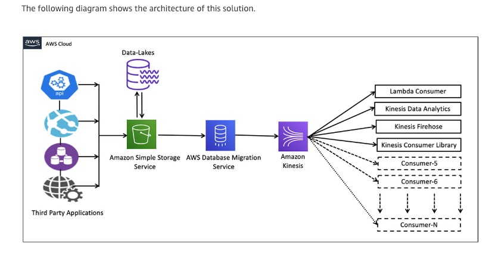


## IAM Role 的权限配置 vs 临时凭证

**IAM Role 本身的权限是持久的**：

- 当你创建一个 IAM Role 并附加权限策略后，这些权限定义会一直存在
- 只要 Role 存在，它定义的权限就持续有效
- 你不需要重复配置权限

**但使用 Role 时获得的是临时凭证**： 当 AWS 服务（如 EC2、Lambda、ECS 等）使用这个 Role 时：

1. **自动获取临时凭证**：服务通过 AWS STS (Security Token Service) 自动获取临时安全凭证
2. **凭证有过期时间**：这些临时凭证通常有效期为几小时（比如 1-12 小时，具体取决于服务）
3. **自动刷新**：AWS 服务会在凭证快过期前自动刷新，无需你手动干预
4. **安全优势**：即使凭证泄露，也会很快失效

## 实际例子

```
EC2 实例分配了 IAM Role "MyEC2Role"
├─ Role 权限（持久）：可以读取 S3、写入 DynamoDB
└─ 临时凭证（暂时）：
    ├─ AccessKeyId: ASIA...
    ├─ SecretAccessKey: ...
    ├─ SessionToken: ...
    └─ 过期时间：6小时后
```

## 总结

- **Role 的权限定义**：持久的，一直有效
- **执行时的访问凭证**：暂时的，定期自动刷新
- **你的操作**：只需配置 Role 一次，后续都是自动处理


## 📚 ACM 证书管理完整知识框架

### 1️⃣ **两种证书类型的本质区别**

```
┌─────────────────────────────────────────────────────┐
│               ACM 证书管理体系                        │
├─────────────────────────────────────────────────────┤
│                                                      │
│  🟢 ACM 颁发的证书                                    │
│  ├─ 由 AWS 直接颁发                                   │
│  ├─ AWS 拥有私钥                                      │
│  ├─ 自动续期机制                                      │
│  └─ 无需人工干预                                      │
│                                                      │
│  🟡 导入的第三方证书 (题目场景)                         │
│  ├─ 从外部 CA 购买 (如 DigiCert, Symantec)           │
│  ├─ 你拥有私钥                                        │
│  ├─ 手动续期                                          │
│  └─ 需要监控过期                                      │
│                                                      │
└─────────────────────────────────────────────────────┘
```

### 2️⃣ **ACM 颁发的证书 - 自动续期机制**

```
证书生命周期：
Day 0    ────────────── Day 335 ─────── Day 365
  │                        │              │
  创建                    开始尝试续期      过期日期
  │                        │
  │                        ├─ 验证域名所有权（DNS/Email）
  │                        ├─ 验证成功 → 自动颁发新证书
  │                        └─ 无缝替换，零停机
  │
  └─ 只需配置一次 DNS 验证记录
```

**为什么不需要监控？**

- AWS 自动完成续期
- 失败时 ACM 会通过 EventBridge 通知
- 你只需保持 DNS 验证记录存在

### 3️⃣ **导入的第三方证书 - 必须手动管理**

```
证书生命周期：
Day 0    ────────────── Day 335 ─────── Day 365
  │                        │              │
  导入                    需要人工处理      证书失效！
  │                        │
  │                        ├─ 从CA购买新证书
  │                        ├─ 手动导入到 ACM
  │                        └─ 更新相关服务配置
  │
  └─ ⚠️ 必须设置监控提醒！
```

## 🎯 题目场景深度分析

### 题目明确说了什么？

> "**third-party SSL/TLS certificates** configured on EC2 instances **via ACM**"

**解读**：

- ✅ 第三方证书 = 从外部 CA 购买的
- ✅ 通过 ACM 管理 = 导入到 ACM 中
- ✅ 不是 ACM 颁发的证书

### 为什么要导入第三方证书到 ACM？

常见原因：

1. **已有证书**：公司之前购买的证书
2. **特殊需求**：需要 EV 证书（Extended Validation）
3. **私钥要求**：需要自己保管私钥
4. **合规要求**：必须使用特定 CA

## 📊 四个选项详细对比

### **选项 1：CloudWatch + 导入证书**

~~~yaml
方案：
  监控指标: ACM导入证书的 DaysToExpiry
  告警: CloudWatch Alarm
  通知: Custom Action
```

**技术细节**：
```
1. ACM 导入证书后，会暴露 CloudWatch 指标
2. 需要创建 CloudWatch Alarm:
   - Metric: DaysToExpiry
   - Threshold: <= 30
   - Action: 需要自定义 (Lambda? SNS?)
~~~

**为什么不是最佳？**

- ⚠️ "custom action" 不明确，可能需要写 Lambda
- ⚠️ 需要为每个证书单独配置告警
- ⚠️ 维护工作量较大

## CloudWatch 不一定需要 Lambda

### CloudWatch Alarm 的通知机制

```
CloudWatch Alarm 可以直接触发：
├─ SNS Topic ✅ (不需要 Lambda)
├─ Auto Scaling Action
├─ EC2 Action (停止/终止/重启)
└─ Systems Manager Action
```

**CloudWatch 直接连 SNS 的配置**：

```json
{
  "AlarmName": "ACM-Certificate-Expiring",
  "MetricName": "DaysToExpiry",
  "Namespace": "AWS/CertificateManager",
  "Threshold": 30,
  "ComparisonOperator": "LessThanThreshold",
  "AlarmActions": [
    "arn:aws:sns:us-east-1:123456789012:SecurityTeam"
  ]
}
```

### **选项 2：CloudWatch + ACM 创建的证书**

~~~yaml
方案：
  监控指标: ACM创建证书的 DaysToExpiry
  告警: CloudWatch Alarm
```

**根本性错误**：
```
ACM 创建的证书续期流程：
Day 335: ACM 自动尝试续期
  ├─ 验证 DNS 记录
  ├─ 颁发新证书
  └─ 自动应用到服务

❌ 根本不需要监控！
❌ 题目也明确说是 "third-party" 证书
~~~

### **选项 3：AWS Config + 导入证书** ✅

~~~yaml
AWS Config Managed Rule:
  Rule Name: acm-certificate-expiration-check
  Target: 导入的证书
  Parameters:
    daysToExpiration: 30
  Notification:
    SNS Topic → 安全团队邮箱
```

**工作流程**：
```
┌──────────────────────────────────────────────┐
│         AWS Config 自动检查流程               │
├──────────────────────────────────────────────┤
│                                              │
│  每 24 小时自动检查                           │
│         ↓                                    │
│  扫描所有导入的 ACM 证书                      │
│         ↓                                    │
│  检查 DaysToExpiry 是否 <= 30               │
│         ↓                                    │
│  [如果是] → 标记为 NON_COMPLIANT            │
│         ↓                                    │
│  触发 SNS 通知                               │
│         ↓                                    │
│  发送邮件给安全团队                          │
│                                              │
└──────────────────────────────────────────────┘
~~~

**配置示例（实际操作）**：

```json
{
  "ConfigRuleName": "acm-certificate-expiration-check",
  "Source": {
    "Owner": "AWS",
    "SourceIdentifier": "ACM_CERTIFICATE_EXPIRATION_CHECK"
  },
  "InputParameters": {
    "daysToExpiration": "30"
  },
  "ConfigRuleState": "ACTIVE"
}
```

**为什么是最佳选择？**

1. ✅ **Managed Rule**：AWS 预配置，零脚本
2. ✅ **专门设计**：就是为检查导入证书过期而生
3. ✅ **自动化**：定期自动检查
4. ✅ **原生集成**：直接连接 SNS
5. ✅ **最少维护**：符合题目要求

### **选项 4：AWS Config + ACM 创建的证书**

~~~yaml
错误：
  检查对象: ACM 创建的证书
  问题: 这些证书会自动续期！
```

❌ **概念性错误**：
- ACM 创建的证书不会过期（自动续期）
- 检查它们的过期时间毫无意义
- 题目明确是"third-party"证书

## 🔄 完整对比表

| 维度 | 选项1 CloudWatch | 选项2 CloudWatch | **选项3 Config** ✅ | 选项4 Config |
|------|-----------------|-----------------|-------------------|--------------|
| **证书类型** | ✅ 导入 | ❌ ACM创建 | ✅ 导入 | ❌ ACM创建 |
| **是否需要监控** | ✅ 需要 | ❌ 不需要 | ✅ 需要 | ❌ 不需要 |
| **配置复杂度** | 🟡 中等 | 🟡 中等 | 🟢 简单 | 🟡 中等 |
| **脚本需求** | 🟡 可能需要 | 🟡 可能需要 | 🟢 零脚本 | 🟡 可能需要 |
| **维护工作** | 🟡 较多 | 🟡 较多 | 🟢 最少 | 🟡 较多 |
| **原生集成SNS** | 🟡 需配置 | 🟡 需配置 | 🟢 直接支持 | 🟢 直接支持 |

## 💡 实战应用场景

### 场景 1：公司使用 ACM 颁发的证书
```
配置：
  1. 在 Route 53 创建 DNS 验证记录
  2. ACM 颁发证书
  3. 关联到 ELB/CloudFront
  
监控：
  ❌ 不需要！ACM 自动续期
  ✅ 只需监控续期失败事件（EventBridge）
```

### 场景 2：公司使用第三方证书（题目场景）
```
配置：
  1. 从 DigiCert 购买证书
  2. 导入到 ACM
  3. 关联到 ELB/EC2
  
监控：
  ✅ 必须！使用 AWS Config
  规则: acm-certificate-expiration-check
  通知: SNS → 安全团队
  
续期流程：
  1. 收到 30 天提醒
  2. 从 CA 购买新证书
  3. 重新导入到 ACM
  4. ACM 自动更新到关联服务
~~~

## 🎓 考试技巧

看到这类题目，问自己：

1. 证书是谁颁发的？

   - ACM → 自动续期，不需要复杂监控
   - 第三方 → 需要监控

2. 题目强调什么？

   - "least scripting" → 选 Managed Rule
   - "custom solution" → 可能需要 Lambda

3. 关键词识别

   ： 

   - "third-party" = 导入的证书
   - "created via ACM" = ACM 颁发的证书

## 🎯 最终答案

**选项 3** 是完美答案，因为它：

1. 正确识别证书类型（导入的第三方证书）
2. 使用 AWS Managed Rule（零脚本）
3. 原生 SNS 集成（最少维护）
4. 专门为此场景设计


## 🎯 AWS Config 是什么？

AWS Config 是一个**持续监控和评估 AWS 资源配置**的服务，可以理解为：

```
AWS Config = 资源配置的"录像机" + 合规性检查器

功能：
├─ 📹 记录所有资源配置的历史变化
├─ 📊 评估资源是否符合规则（合规性检查）
├─ 🔍 审计资源关系和依赖
└─ 📝 生成合规报告
```

**类比理解**（结合你的工业自动化背景）：

```
就像你的 WCS 系统中的数据日志系统：
├─ 记录每个 AGV 的位置变化历史
├─ 检查 AGV 是否按规定路线行驶
├─ 追踪货物从入库到出库的完整路径
└─ 生成合规性报告（是否违反安全规则）

AWS Config 对 AWS 资源做同样的事情
```

## 🏗️ AWS Config 核心概念

### 1️⃣ **Configuration Item (CI) - 配置项**

记录资源在某个时间点的**完整快照**：

json

~~~json
{
  "version": "1.3",
  "accountId": "123456789012",
  "configurationItemCaptureTime": "2025-11-15T10:30:00.000Z",
  "configurationItemStatus": "OK",
  "resourceType": "AWS::EC2::Instance",
  "resourceId": "i-1234567890abcdef0",
  "configuration": {
    "instanceId": "i-1234567890abcdef0",
    "instanceType": "t3.micro",
    "state": "running",
    "tags": [
      {"key": "Environment", "value": "Production"}
    ],
    "securityGroups": [...],
    "vpcId": "vpc-12345678"
  },
  "relationships": [
    {
      "resourceType": "AWS::EC2::SecurityGroup",
      "resourceId": "sg-12345678"
    }
  ]
}
```

**包含信息**：
- 资源当前配置
- 资源关系（连接到哪些其他资源）
- 标签
- 元数据

### 2️⃣ **Configuration Recorder - 配置记录器**
```
Configuration Recorder 的工作：
├─ 监控指定的 AWS 资源类型
├─ 检测配置变化
├─ 创建 Configuration Item (快照)
└─ 存储到 S3 bucket
~~~

**配置示例**：

json

~~~json
{
  "name": "default",
  "roleARN": "arn:aws:iam::123456789012:role/config-role",
  "recordingGroup": {
    "allSupported": true,  // 记录所有支持的资源
    "includeGlobalResources": true  // 包括全局资源（IAM等）
  }
}
```

### 3️⃣ **Config Rules - 配置规则**

评估资源是否符合期望的配置：
```
Config Rules 类型：
│
├─ AWS Managed Rules (托管规则)
│  ├─ AWS 预定义，开箱即用
│  ├─ 涵盖常见合规场景
│  └─ 例如：加密检查、端口检查、标签要求
│
└─ Custom Rules (自定义规则)
   ├─ 用 Lambda 函数实现
   └─ 自定义业务逻辑
```

### 4️⃣ **Compliance Status - 合规状态**
```
资源合规状态：
├─ COMPLIANT (符合) ✅
├─ NON_COMPLIANT (不符合) ❌
├─ NOT_APPLICABLE (不适用) ⚪
└─ INSUFFICIENT_DATA (数据不足) ⚫
```

## 🔄 AWS Config 工作流程

### 完整流程图
```
┌─────────────────────────────────────────────────────┐
│              AWS Config 工作流程                      │
└─────────────────────────────────────────────────────┘

步骤 1: 资源配置变化
    ↓
EC2 实例的安全组被修改
    ↓
步骤 2: Configuration Recorder 检测变化
    ↓
创建新的 Configuration Item (快照)
    ↓
步骤 3: 存储快照
    ├─ 保存到 S3 bucket
    └─ 发送到 SNS topic (可选)
    ↓
步骤 4: 触发 Config Rules 评估
    ↓
检查资源是否符合规则
    │
    ├─ 规则1: 检查是否允许 SSH (端口22)
    ├─ 规则2: 检查是否有必需标签
    └─ 规则3: 检查是否使用批准的 AMI
    ↓
步骤 5: 更新合规状态
    ├─ COMPLIANT ✅
    └─ NON_COMPLIANT ❌
    ↓
步骤 6: 触发通知/修复
    ├─ SNS 通知管理员
    ├─ EventBridge 触发 Lambda
    └─ Systems Manager 自动修复
~~~

## 📋 常用的 AWS Managed Rules

### 安全相关

```
规则名称检查内容示例
encrypted-volumesEBS 卷是否加密所有生产环境 EBS 必须加密
s3-bucket-public-read-prohibitedS3 桶是否公开可读禁止公开读取
iam-password-policyIAM 密码策略至少 14 字符，包含大小写
restricted-ssh是否限制 SSH 访问不允许 0.0.0.0/0 访问 22 端口
root-account-mfa-enabledRoot 账户是否启用 MFA必须启用
```

### 标签和资源管理

```
规则名称检查内容
required-tags资源是否有必需标签
ec2-instance-managed-by-systems-managerEC2 是否被 SSM 管理
approved-amis-by-idEC2 是否使用批准的 AMI
```

### 刚才题目中的规则

```
规则名称检查内容参数
acm-certificate-expiration-checkACM 证书是否即将过期daysToExpiration: 30
```

## 🛠️ 实际配置示例

### 示例 1：检查 S3 桶加密

yaml

```yaml
Config Rule:
  Name: s3-bucket-server-side-encryption-enabled
  Type: AWS Managed Rule
  Trigger: 配置变化
  Resource: S3 Bucket
  
评估逻辑:
  IF S3 bucket 未启用服务器端加密
  THEN 标记为 NON_COMPLIANT
  
通知:
  SNS Topic: security-alerts
```

**配置命令**：

bash

```bash
aws configservice put-config-rule --config-rule '{
  "ConfigRuleName": "s3-encryption-required",
  "Source": {
    "Owner": "AWS",
    "SourceIdentifier": "S3_BUCKET_SERVER_SIDE_ENCRYPTION_ENABLED"
  }
}'
```

### 示例 2：自定义规则 - 检查特定标签

python

~~~python
# Lambda 函数 - 自定义规则
import boto3
import json

def lambda_handler(event, context):
    config = boto3.client('config')
    
    # 获取资源配置
    configuration_item = json.loads(event['configurationItem'])
    
    # 检查是否有 "CostCenter" 标签
    tags = configuration_item.get('tags', {})
    
    compliance_type = 'NON_COMPLIANT'
    if 'CostCenter' in tags:
        compliance_type = 'COMPLIANT'
    
    # 返回评估结果
    config.put_evaluations(
        Evaluations=[{
            'ComplianceResourceType': configuration_item['resourceType'],
            'ComplianceResourceId': configuration_item['resourceId'],
            'ComplianceType': compliance_type,
            'OrderingTimestamp': configuration_item['configurationItemCaptureTime']
        }],
        ResultToken=event['resultToken']
    )
```

## 🎯 AWS Config 的主要用途

### 1️⃣ **合规性审计**
```
合规场景：
├─ 满足行业标准（PCI-DSS, HIPAA, SOC 2）
├─ 内部安全政策
└─ 监管要求

示例：
"所有存储客户数据的 S3 桶必须加密"
"所有生产环境 EC2 必须有 CostCenter 标签"
"禁止将 RDS 暴露在公网"
```

### 2️⃣ **安全分析**
```
安全检查：
├─ 检测未授权的配置变更
├─ 识别安全漏洞（开放端口、公开资源）
├─ 审计 IAM 权限变化
└─ 监控加密状态

示例问题：
"谁在什么时候修改了安全组？"
"哪些 S3 桶是公开的？"
"是否有未加密的数据库？"
```

### 3️⃣ **资源清单和关系追踪**
```
查询能力：
├─ 某个 VPC 中有哪些资源？
├─ 这个 EC2 实例连接到哪些安全组？
├─ 这个 IAM 角色被哪些服务使用？
└─ 资源之间的依赖关系
```

### 4️⃣ **变更管理**
```
变更追踪：
├─ 配置历史记录（时间旅行）
├─ 对比不同时间点的配置
├─ 回答"谁改了什么"
└─ 故障排查的时间线
```

## 🔄 Config vs CloudWatch vs CloudTrail

很多人会混淆这三个服务，让我对比一下：

| 维度 | AWS Config | CloudWatch | CloudTrail |
|------|-----------|------------|------------|
| **主要用途** | 配置合规性 | 性能监控 | API 调用审计 |
| **监控对象** | 资源配置 | 指标/日志 | API 操作 |
| **回答问题** | "配置是否合规？" | "系统运行如何？" | "谁做了什么？" |
| **数据类型** | 配置快照 | 时间序列数据 | API 调用记录 |
| **触发条件** | 配置变化 | 指标阈值 | API 调用 |
| **典型场景** | 安全合规检查 | CPU 告警 | 安全审计 |

### 实际例子对比

**场景：EC2 实例的安全组被修改**
```
CloudTrail 记录：
{
  "eventName": "AuthorizeSecurityGroupIngress",
  "userIdentity": {
    "userName": "john.doe"
  },
  "eventTime": "2025-11-15T10:30:00Z",
  "requestParameters": {
    "IpPermissions": [
      {"FromPort": 22, "ToPort": 22, "IpRanges": ["0.0.0.0/0"]}
    ]
  }
}
→ 回答："谁在什么时候开放了 22 端口？"

Config 记录：
{
  "configurationItem": {
    "resourceType": "AWS::EC2::SecurityGroup",
    "configuration": {
      "ipPermissions": [
        {"fromPort": 22, "toPort": 22, "ipRanges": ["0.0.0.0/0"]}
      ]
    }
  },
  "complianceType": "NON_COMPLIANT"
}
→ 回答："当前安全组配置是否符合安全规则？"

CloudWatch 告警：
Metric: NetworkIn
Value: 突然增加
AlarmState: ALARM
→ 回答："实例网络流量是否异常？"
```

### 三者配合使用
```
完整的监控和审计方案：

CloudTrail（谁做了什么）
    ↓
触发操作："john.doe 修改了安全组"
    ↓
Config（配置是否合规）
    ↓
检测："安全组现在不符合规则（开放了 0.0.0.0/0）"
    ↓
CloudWatch（性能影响）
    ↓
监控："网络流量突然增加"
    ↓
综合分析："john.doe 的修改导致了安全风险和异常流量"
```

## 💰 Config 定价（重要）
```
收费项目：
├─ Configuration Item 记录
│  └─ 每个 CI: $0.003
│
├─ Config Rule 评估
│  └─ 每次评估: $0.001（前 100,000 次）
│       $0.0005（超过 100,000 次）
│
└─ S3 存储（额外）
   └─ 标准 S3 定价

示例成本：
100 个资源 × 每天 10 次变化 × 30 天
= 30,000 CI × $0.003 = $90/月

10 个 Config Rules × 30,000 评估
= 300,000 评估 × $0.001 = $300/月（前10万）
                + $100/月（后20万）
```

**省钱技巧**：
```
1. 只记录需要的资源类型
   recordingGroup: {
     resourceTypes: ["AWS::EC2::Instance", "AWS::S3::Bucket"]
   }

2. 使用周期性评估而非配置变化触发
   maximumExecutionFrequency: "TwentyFour_Hours"

3. 合理设置 S3 生命周期策略
```

## 🎓 AWS Config 考试重点

### 核心考点

1. **何时使用 Config**
   - ✅ 合规性检查
   - ✅ 资源配置审计
   - ✅ 资源关系追踪
   - ❌ 不是性能监控（用 CloudWatch）
   - ❌ 不是 API 审计（用 CloudTrail）

2. **Managed Rules vs Custom Rules**
   - Managed Rules：开箱即用，最少维护
   - Custom Rules：需要 Lambda，适合特定业务逻辑

3. **自动修复 (Remediation)**
```
   检测到不合规 → 自动执行修复
   
   示例：
   规则: s3-bucket-public-read-prohibited
   检测: S3 桶公开可读
   修复: 自动执行 SSM Document 关闭公开访问
```

4. **多账户聚合**
```
   Config Aggregator
   ├─ 中央账户收集多个账户的 Config 数据
   ├─ 统一合规视图
   └─ 组织级别的审计
```

### 常见考试题型

**题型 1：选择合适的服务**
```
问：需要确保所有 S3 桶都启用了加密，应该用什么？
答：AWS Config + s3-bucket-server-side-encryption-enabled 规则
```

**题型 2：最少维护工作**
```
问：需要监控证书过期，最少维护的方案？
答：AWS Config Managed Rule（不是 CloudWatch + Lambda）
```

**题型 3：审计和追踪**
```
问：需要查看 EC2 实例 6 个月前的安全组配置？
答：AWS Config（保留配置历史）
~~~

## 🚀 实战场景

### 场景 1：设置 EC2 标签合规检查

bash

```bash
# 1. 启用 Config
aws configservice put-configuration-recorder \
  --configuration-recorder name=default,roleARN=arn:aws:iam::123:role/config
aws configservice start-configuration-recorder --configuration-recorder-name default

# 2. 创建规则：检查必需标签
aws configservice put-config-rule --config-rule '{
  "ConfigRuleName": "required-tags-ec2",
  "Source": {
    "Owner": "AWS",
    "SourceIdentifier": "REQUIRED_TAGS"
  },
  "Scope": {
    "ComplianceResourceTypes": ["AWS::EC2::Instance"]
  },
  "InputParameters": "{\"tag1Key\":\"Environment\",\"tag2Key\":\"CostCenter\"}"
}'

# 3. 配置通知
aws configservice put-delivery-channel --delivery-channel '{
  "name": "default",
  "s3BucketName": "my-config-bucket",
  "snsTopicARN": "arn:aws:sns:us-east-1:123:config-alerts"
}'
```

### 场景 2：查询不合规资源

bash

~~~bash
# 查询所有不合规的资源
aws configservice describe-compliance-by-config-rule \
  --compliance-types NON_COMPLIANT

# 查询特定资源的配置历史
aws configservice get-resource-config-history \
  --resource-type AWS::EC2::Instance \
  --resource-id i-1234567890abcdef0
```

## 📝 总结
```
AWS Config 核心要点：
├─ 📹 记录资源配置变化历史
├─ ✅ 评估合规性（Config Rules）
├─ 🔍 追踪资源关系和依赖
├─ 🔔 自动通知和修复
└─ 📊 生成合规报告

适用场景：
├─ 安全合规审计
├─ 配置变更追踪
├─ 资源清单管理
└─ 自动化治理

与其他服务配合：
├─ CloudTrail: 谁做了什么操作
├─ Config: 配置是否合规
└─ CloudWatch: 性能是否正常
~~~

对于你正在准备的 SAA 考试，记住：**看到"合规性"、"配置审计"、"最少维护"这些关键词，优先考虑 AWS Config！**


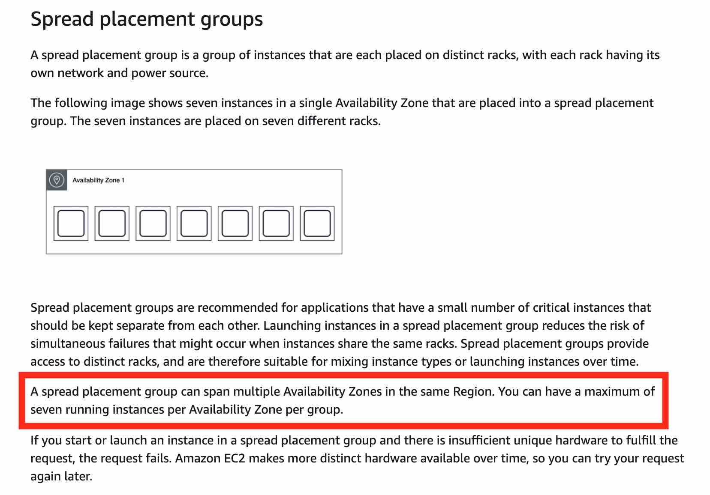


## 🔑 跨账户访问的核心原则

### AWS 的"双重同意"机制

```
跨账户访问 = 发起方授权 + 接收方授权

账户 A (Lambda)                    账户 B (S3 Bucket)
     │                                    │
     ├─ IAM Role (Execution Role)         ├─ Bucket Policy
     │  "我允许我的 Lambda 访问            │  "我允许账户 A 的
     │   账户 B 的 S3"                     │   Lambda 访问我"
     │                                    │
     └──────────── 必须两边都同意 ──────────┘
```

**如果只有一边授权，访问会失败！** ❌

## 📊 你的答案 vs 正确答案

### ❌ 你选择的答案（不完整）

```yaml
只配置了：
  账户 A - Lambda Execution Role:
    ├─ 信任关系: lambda.amazonaws.com
    └─ 权限策略:
        - Effect: Allow
          Action: s3:GetObject
          Resource: arn:aws:s3:::account-b-bucket/*

缺少：
  账户 B - S3 Bucket Policy
  ❌ 没有配置！
```

**问题**： 虽然 Lambda 的 role 说"我想访问 S3"，但 S3 bucket 没有说"我同意被访问"，所以访问会被拒绝。

### ✅ 正确答案（双向授权）

```yaml
账户 A - Lambda Execution Role:
  信任关系:
    - Service: lambda.amazonaws.com
  
  权限策略:
    - Effect: Allow
      Action:
        - s3:GetObject
        - s3:PutObject
      Resource: arn:aws:s3:::account-b-bucket/*

账户 B - S3 Bucket Policy:
  - Effect: Allow
    Principal:
      AWS: arn:aws:iam::account-a-id:role/LambdaExecutionRole
    Action:
      - s3:GetObject
      - s3:PutObject
    Resource: arn:aws:s3:::account-b-bucket/*
```

**两边都同意** → 访问成功 ✅

## 🔍 详细配置步骤

### 步骤 1：账户 A - 创建 Lambda Execution Role

json

```json
// IAM Role: LambdaExecutionRole (账户 A)
{
  "Version": "2012-10-17",
  "Statement": [
    {
      "Effect": "Allow",
      "Action": [
        "s3:GetObject",
        "s3:PutObject",
        "s3:ListBucket"
      ],
      "Resource": [
        "arn:aws:s3:::account-b-bucket",
        "arn:aws:s3:::account-b-bucket/*"
      ]
    },
    {
      "Effect": "Allow",
      "Action": [
        "logs:CreateLogGroup",
        "logs:CreateLogStream",
        "logs:PutLogEvents"
      ],
      "Resource": "arn:aws:logs:*:*:*"
    }
  ]
}
```

**信任关系（Trust Policy）**：

```json
{
  "Version": "2012-10-17",
  "Statement": [
    {
      "Effect": "Allow",
      "Principal": {
        "Service": "lambda.amazonaws.com"
      },
      "Action": "sts:AssumeRole"
    }
  ]
}
```

### 步骤 2：账户 B - 配置 S3 Bucket Policy

```json
// S3 Bucket Policy (账户 B)
{
  "Version": "2012-10-17",
  "Statement": [
    {
      "Sid": "AllowLambdaFromAccountA",
      "Effect": "Allow",
      "Principal": {
        "AWS": "arn:aws:iam::111111111111:role/LambdaExecutionRole"
      },
      "Action": [
        "s3:GetObject",
        "s3:PutObject",
        "s3:ListBucket"
      ],
      "Resource": [
        "arn:aws:s3:::account-b-bucket",
        "arn:aws:s3:::account-b-bucket/*"
      ]
    }
  ]
}
```

**关键点**：

- `Principal` 指定账户 A 的 Lambda execution role 的 ARN
- 必须明确允许具体的操作（`s3:GetObject` 等）

### 步骤 3：将 Role 附加到 Lambda

~~~python
# AWS CLI 示例
aws lambda update-function-configuration \
  --function-name my-lambda-function \
  --role arn:aws:iam::111111111111:role/LambdaExecutionRole
```

## 🚫 如果只有单边授权会怎样？

### 场景 1：只有账户 A 的 IAM Role，没有账户 B 的 Bucket Policy
```
Lambda 尝试访问 S3:
    ↓
检查 Lambda Execution Role: ✅ 允许访问 account-b-bucket
    ↓
检查 S3 Bucket Policy: ❌ 没有明确允许账户 A 的 role
    ↓
结果: Access Denied (403)
```

**错误信息**：
```
An error occurred (AccessDenied) when calling the GetObject operation: 
Access Denied
```

### 场景 2：只有账户 B 的 Bucket Policy，没有账户 A 的 IAM Role
```
Lambda 尝试访问 S3:
    ↓
检查 Lambda Execution Role: ❌ 没有访问 S3 的权限
    ↓
结果: Access Denied (403)
```

**错误信息**：
```
User: arn:aws:sts::111111111111:assumed-role/LambdaExecutionRole/my-function 
is not authorized to perform: s3:GetObject on resource: arn:aws:s3:::account-b-bucket/file.txt
```

## 🎯 权限评估流程

AWS 评估跨账户访问的完整流程：
```
┌─────────────────────────────────────────────────┐
│         AWS 跨账户访问权限评估                    │
├─────────────────────────────────────────────────┤
│                                                 │
│  Step 1: 检查发起方（账户 A）的 IAM Policy        │
│  ├─ Lambda Execution Role 是否允许访问？         │
│  │  └─ Action: s3:GetObject                     │
│  │     Resource: arn:aws:s3:::account-b-bucket/*│
│  └─ ✅ 允许                                     │
│                                                 │
│  Step 2: 检查接收方（账户 B）的 Resource Policy   │
│  ├─ S3 Bucket Policy 是否允许该 Principal？      │
│  │  └─ Principal: account-a-role ARN            │
│  │     Action: s3:GetObject                     │
│  └─ ✅ 允许                                     │
│                                                 │
│  Step 3: 检查是否有明确的 Deny                    │
│  └─ ❌ 没有 Deny                                │
│                                                 │
│  最终结果: ✅ 允许访问                           │
│                                                 │
└─────────────────────────────────────────────────┘
```

**任何一步失败，整个访问就会被拒绝！**

## 💡 为什么 AWS 需要双向授权？

### 安全性考虑
```
如果只需要单向授权：

场景：恶意账户 A 创建一个 IAM role
      给自己授权访问账户 B 的所有 S3 bucket
      
如果只检查账户 A 的 IAM:
  ❌ 账户 A 可以访问任何人的 S3！
  
有了双向授权机制:
  ✅ 账户 B 必须明确同意
  ✅ 账户 B 保持对资源的完全控制权
```

### 资源所有者控制原则
```
谁拥有资源，谁就有最终控制权

账户 B 拥有 S3 bucket
  └─ 账户 B 必须明确同意谁可以访问
  └─ 即使账户 A 给自己授权，也无法绕过账户 B 的控制
~~~

## 📋 完整的实战示例

### Lambda 代码（账户 A）

python

```python
import boto3
import json

def lambda_handler(event, context):
    # Lambda 会自动使用其 execution role 的凭证
    s3 = boto3.client('s3')
    
    try:
        # 访问账户 B 的 bucket
        response = s3.get_object(
            Bucket='account-b-bucket',  # 账户 B 的 bucket
            Key='data/file.txt'
        )
        
        content = response['Body'].read().decode('utf-8')
        
        return {
            'statusCode': 200,
            'body': json.dumps({
                'message': 'Success',
                'content': content
            })
        }
    
    except Exception as e:
        return {
            'statusCode': 500,
            'body': json.dumps({
                'error': str(e)
            })
        }
```

### 账户 A 配置

```bash
# 1. 创建 IAM Role
aws iam create-role \
  --role-name LambdaS3CrossAccountRole \
  --assume-role-policy-document file://trust-policy.json

# 2. 附加权限策略
aws iam put-role-policy \
  --role-name LambdaS3CrossAccountRole \
  --policy-name S3AccessPolicy \
  --policy-document file://s3-access-policy.json

# 3. 创建 Lambda 函数
aws lambda create-function \
  --function-name cross-account-s3-access \
  --runtime python3.9 \
  --role arn:aws:iam::111111111111:role/LambdaS3CrossAccountRole \
  --handler lambda_function.lambda_handler \
  --zip-file fileb://function.zip
```

### 账户 B 配置

```bash
# 配置 S3 Bucket Policy
aws s3api put-bucket-policy \
  --bucket account-b-bucket \
  --policy file://bucket-policy.json
```

## 🔍 故障排查

### 如何验证配置是否正确？

**1. 测试账户 A 的 IAM Policy**：

```bash
# 使用 IAM Policy Simulator
aws iam simulate-principal-policy \
  --policy-source-arn arn:aws:iam::111111111111:role/LambdaExecutionRole \
  --action-names s3:GetObject \
  --resource-arns arn:aws:s3:::account-b-bucket/file.txt
```

**2. 测试账户 B 的 Bucket Policy**：

```bash
# 查看 bucket policy
aws s3api get-bucket-policy --bucket account-b-bucket

# 验证 principal 是否正确
```

**3. 查看 Lambda 执行日志**：

~~~bash
aws logs tail /aws/lambda/cross-account-s3-access --follow
```

### 常见错误

| 错误 | 原因 | 解决方法 |
|------|------|---------|
| `Access Denied` | Bucket policy 未配置 | 在账户 B 添加 bucket policy |
| `Not authorized to perform` | Lambda role 权限不足 | 更新账户 A 的 IAM role |
| `Invalid principal` | Bucket policy 中的 ARN 错误 | 检查 principal ARN 是否正确 |

## 🎓 SAA 考试要点

### 关键概念

1. **跨账户访问需要双向授权**
   - 发起方的 IAM policy ✅
   - 接收方的 resource policy ✅

2. **Resource Policy 支持跨账户**
   - S3 Bucket Policy ✅
   - SQS Queue Policy ✅
   - SNS Topic Policy ✅
   - KMS Key Policy ✅
   - Lambda Resource Policy ✅

3. **不支持 Resource Policy 的服务**
   - EC2（用 IAM role）
   - RDS（用 security group + subnet）

### 考试题型识别

**看到这些关键词 → 需要双向授权**：
- "Lambda in account A access S3 in account B"
- "Cross-account access"
- "Different AWS accounts"
- "Multi-account"

**答案特征**：
- ✅ 同时提到 IAM policy **AND** resource policy
- ❌ 只提到一种授权方式

## 📝 总结
```
跨账户访问的完整图景：

账户 A (发起方)                 账户 B (资源方)
┌─────────────────┐           ┌─────────────────┐
│  Lambda         │           │  S3 Bucket      │
│  ├─ IAM Role    │◄─────────►│  ├─ Policy      │
│  │  ✅ 允许访问  │  双向授权  │  │  ✅ 允许被访问│
│  └─ Execution   │           │  └─ Resource    │
└─────────────────┘           └─────────────────┘

两边都要配置！缺一不可！
~~~

**核心要点**：

1. ✅ 账户 A：Lambda execution role 授予访问权限
2. ✅ 账户 B：S3 bucket policy 允许被访问
3. ❌ 只配置一边不行
4. 🔐 这是 AWS 的安全设计，保护资源所有者的控制权


## RDS Custom for Oracle

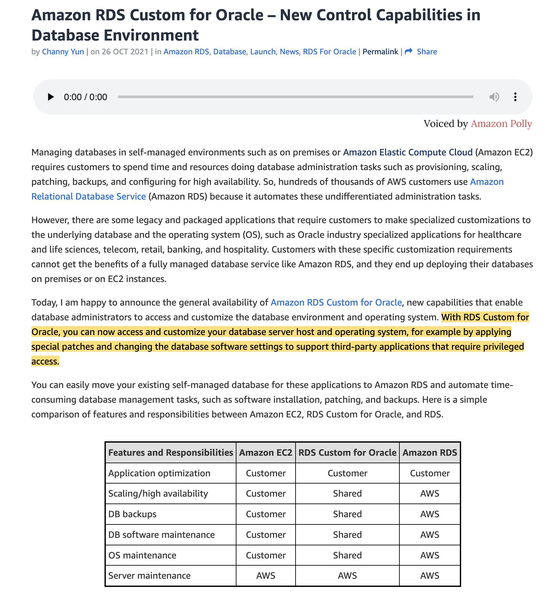


## Kinesis Data Stream Fan out

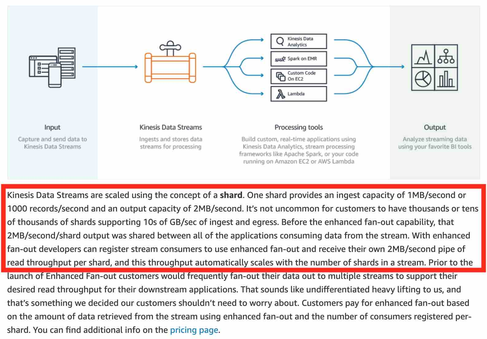


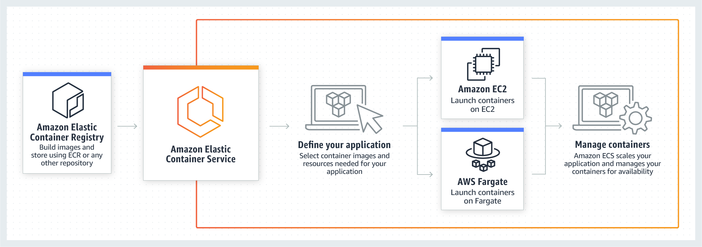


ECS with Fargate launch type：需要为执行计算任务中使用的cpu和RAM资源付费。

ECS with EC2 launch type：基于使用的EC2 instance类型付费


### 🆚 VPC Peering vs VPC Sharing 核心对比

| 对比维度         | **VPC Peering (对等连接)**                                   | **VPC Sharing (共享)**                                       |
| :--------------- | :----------------------------------------------------------- | :----------------------------------------------------------- |
| **核心模型**     | **网络互连**                                                 | **资源共置**                                                 |
| **架构模式**     | **网状或星型**（多个VPC两两连接）                            | **中心辐射型**                                               |
| **VPC所有权**    | **多个所有者**：每个参与的VPC属于不同的AWS账户。             | **单一所有者**：整个VPC属于一个中心管理账户。                |
| **管理职责**     | **分布式管理**：每个账户管理自己的VPC、路由表和安全性。      | **集中式管理**：中心账户管理VPC、子网、路由表、网关等网络基础架构。 |
| **连接性与隔离** | **双向连接**：一旦建立，两个VPC可以完全通信。                | **共享子网级隔离**：参与者账户被分配到特定的子网，默认不能相互通信。 |
| **网络CIDR**     | **必须不重叠**                                               | **共享同一CIDR块**                                           |
| **计费与成本**   | **跨区域对等连接**会产生数据传输费。同一区域对等无额外费用。 | **网络资源**由中心账户支付，**计算资源**由各参与者账户支付。 |

------

### 🗂️ 深入解析两种模式

#### 1. VPC Peering (对等连接)

**它是什么？**
一种**一对一**的私有网络连接，允许两个VPC使用私有IP地址直接通信，就像它们同属一个网络。

**工作原理：**

- 在两个VPC之间建立一条**直接的网络链路**。
- 需要在**双方VPC的路由表**中手动添加路由条目，将对端VPC的CIDR块指向Peering Connection。
- 双方VPC的**安全组和网络ACL**需要允许来自对端的流量。

**典型应用场景：**

- 连接**不同部门或不同项目**的VPC，这些VPC由不同的团队独立管理。
- 在**多云或多账户战略**中，连接不同AWS账户下的VPC。
- 连接**不同区域**的VPC（通过**Inter-Region VPC Peering**）。

**限制：**

- **非传递性**：如果VPC A 与 VPC B 对等，VPC B 与 VPC C 对等，**VPC A 和 VPC C 不能通过B进行通信**。
- **CIDR不能重叠**：这是硬性要求，否则无法建立对等连接。

#### 2. VPC Sharing (共享)

**它是什么？**
借助 **AWS Resource Access Manager (RAM)** 服务，允许一个VPC的**所有者账户**将其**子网**共享给其他AWS账户（参与者账户）。

**工作原理：**

- **中心账户**创建一个VPC，并规划好子网（如不同环境：dev, prod）。
- 通过**AWS RAM**，将特定的子网共享给指定的参与者账户。
- **参与者账户**可以看到这些被共享的子网，并能够将自己的资源（如EC2、RDS）直接部署到这些子网中。
- 所有网络基础设施（IGW, NAT GW, 路由表，网络ACL）由**中心账户**统一管理和付费。

**典型应用场景：**

- **IT组织标准化**：中心IT团队管理网络和安全（防火墙、代理），业务团队在共享的子网内自由部署资源。
- **成本优化**：共享昂贵的NAT网关、接口终端节点等资源，避免每个账户重复建设。
- **环境隔离**：在同一个VPC内，使用不同的子网和安全组来隔离开发、测试和生产环境，并由不同账户部署。

**优势：**

- **简化网络管理**：避免了复杂的对等连接矩阵。
- **资源高效利用**：集中管理共享的网络资源。
- **强隔离性**：通过安全组和网络ACL，可以严格控制参与者账户下资源之间的通信。

------

### 🎯 如何选择？

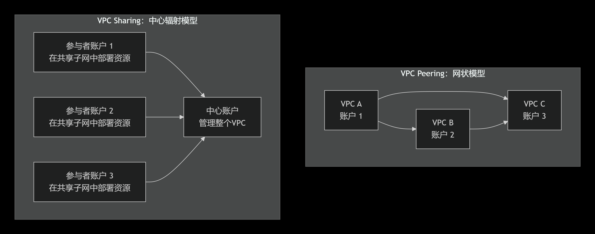

**选择 VPC Peering，当：**

- 你需要连接**两个已经存在、且由不同团队管理的独立VPC**。
- 连接的VPC位于**不同的区域**。
- 你希望保持各VPC的**管理自治权**。

**选择 VPC Sharing，当：**

- 你希望在一个组织内实现**资源的集中管理和成本控制**。
- 你正在构建一个**新的、需要多账户协作**的应用程序，并希望从一开始就统一网络规划。
- 你想要避免维护一个复杂且难以扩展的VPC对等连接网络。


## S3数据传输和同步

根据您的需求，将1PB的数据从us-west-1区域的Amazon S3桶一次性复制到us-east-1区域的另一个S3桶，且不能使用AWS Snowball，以下是最佳选项的详细解释。您需要选择两个正确选项，基于技术可行性和效率考虑，正确答案是：

- **Copy data from the source bucket to the destination bucket using the aws S3 sync command**
- **Set up Amazon S3 batch replication to copy objects across Amazon S3 buckets in another Region using S3 console and then delete the replication configuration**

### 为什么这些选项正确？

1. **使用 aws s3 sync 命令**：
   - `aws s3 sync` 是AWS CLI中的一个命令，用于同步两个S3桶之间的内容。它会比较源桶和目标桶的对象，只复制新增或更改的文件，但由于这是一次性复制所有数据，它会有效地将所有对象从us-west-1桶复制到us-east-1桶。
   - 对于1PB的大规模数据，CLI命令可以自动化处理，并通过AWS的内部网络传输，效率较高。虽然传输时间可能较长，但它是直接且可靠的方法。
   - 注意：使用CLI时，需要确保有足够的网络带宽和权限，但数据已在S3中，因此不需要从本地数据中心传输。
2. **设置Amazon S3批处理复制**：
   - S3复制功能通常用于持续复制新对象，但S3批处理复制（S3 Batch Replication）专门用于一次性复制现有对象到另一个区域的桶。
   - 操作步骤：通过S3控制台设置跨区域复制（CRR）规则，然后使用“批处理操作”来复制所有现有对象。复制完成后，可以删除复制配置以避免持续复制。
   - 这种方法针对大规模数据优化，由AWS后台处理，无需手动干预，适合1PB的数据量。

### 为什么其他选项不正确？

- **设置Amazon S3 Transfer Acceleration (S3TA)**：S3TA用于加速从客户端到S3桶的上传，尤其适用于远距离传输。但这里是从一个S3桶复制到另一个S3桶，而不是从客户端上传。S3桶之间的复制不需要S3TA，因为它不适用于桶到桶的场景。
- **使用S3控制台手动复制**：通过S3控制台可以手动选择对象并复制到另一个桶，但对于1PB的数据（可能包含数百万个对象），控制台操作不现实。控制台有界面限制，容易出错，且耗时极长，不适合大规模数据迁移。
- **使用AWS Snowball Edge设备**：虽然Snowball Edge可用于区域间数据传输，但数据已经在S3中，不需要物理设备。而且，问题明确提到本地数据中心不允许使用Snowball，因此这个选项不符合要求。此外，Snowball通常用于本地到云或云到本地的传输，而不是直接用于云区域之间的数据复制。

### 实施建议

- 对于`aws s3 sync`，您可以在EC2实例或AWS CloudShell中运行命令，确保实例与S3桶在同一区域以减少延迟。命令示例：`aws s3 sync s3://source-bucket s3://destination-bucket --region us-east-1`
- 对于S3批处理复制，先在S3控制台为源桶配置复制规则，目标桶在us-east-1，然后创建批处理作业来处理所有现有对象。作业完成后，禁用或删除复制规则。
- 由于数据量达1PB，建议监控传输进度和成本，并考虑使用AWS Data Transfer Optimizer或分阶段复制以减少潜在问题。


### 一、Lambda 的核心定位：是什么？为什么？

**一句话定义**：AWS Lambda 是一个**事件驱动**的**无服务器计算服务**，它允许您运行代码而无需预置或管理服务器。

**核心价值**：

- **零服务器管理**：您不再需要操心服务器操作系统的打补丁、安全维护、容量预估或扩展策略。
- **事件驱动与弹性扩展**：Lambda 函数由事件（如API请求、文件上传、数据库变更）自动触发，并能从零瞬间扩展到成千上万个并行执行，处理完成后又自动缩容至零。**您为实际消耗的计算资源付费，而不是为闲置的服务器付费。**
- **微服务与敏捷交付**：它将应用程序解耦为小的、独立的、功能单一的单元，每个单元可以由不同的团队独立开发、部署和扩展。

------

### 二、Lambda 的架构与关键组件

为了直观理解Lambda的各个组件如何协同工作，下图描绘了其核心架构模型：

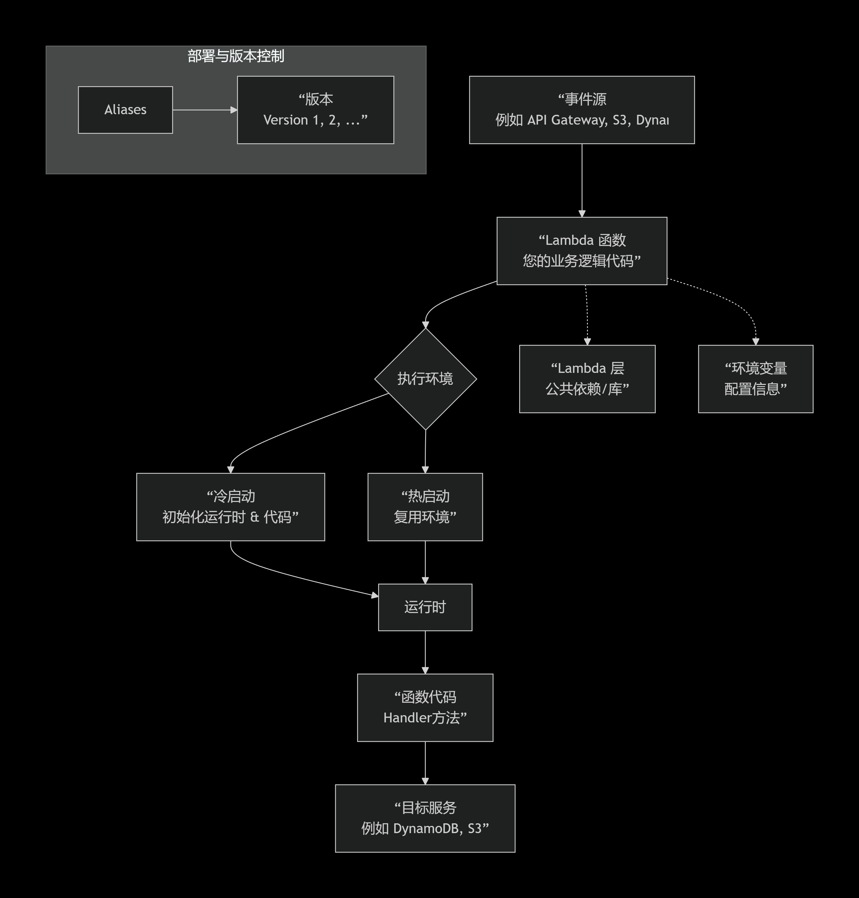

- 这是您上传的**代码**及其**依赖项**的集合，是您业务逻辑的载体。
- 每个函数都有一个 **handler** 方法，作为代码执行的入口点（例如 `index.handler`）。

#### 2. **触发器（Trigger）**

- 调用Lambda函数的**事件源**。这是Lambda事件驱动架构的“开关”。
- **常见触发器**：
  - **API Gateway**：HTTP REST API请求
  - **S3**：文件上传、删除等事件
  - **DynamoDB**：数据库表的流记录变更
  - **SNS / SQS**：消息通知和队列处理
  - **EventBridge**：自定义事件或计划事件（类似cron job）

#### 3. **运行时（Runtime）**

- 执行函数代码的环境，如Python、Node.js、Java、Go、.NET等。
- 您可以使用AWS提供的运行时，或使用**自定义运行时**（通过Lambda Layer实现）来支持其他语言。

#### 4. **层（Layer）**

- 这是一个**独立的Zip归档文件**，包含函数运行时所需的库、自定义运行时或其它依赖项。
- **核心价值**（对应之前正确答案）：
  - **代码复用**：多个函数可以共享同一个层，避免重复打包相同依赖。
  - **分离关注点**：将依赖项与业务逻辑代码分离，使得函数部署包更小，部署更快。
  - **减小部署包**：更小的部署包有助于**减少冷启动时间**。

#### 5. **版本（Version）与别名（Alias）**

- **版本**：函数代码和配置的**不可变快照**。例如，您发布Version 1、Version 2。
- **别名**：指向特定版本的**可变指针**，例如 `DEV`、`STAGING`、`PROD`。
- **核心价值**：实现**安全的蓝绿部署**。您可以将`PROD`别名从指向Version 1逐步切换到Version 2，并可以轻松回滚。

------

### 三、性能与成本优化（对应错误选项的纠正）

#### 1. **内存与CPU分配**

- **正确认知**：Lambda按您配置的**内存量计费**，同时CPU功率、网络带宽等资源会与内存**成比例地分配**。
- **最佳实践**：**不要“过度配置超时时间”**。应根据函数的历史运行数据（查看CloudWatch Logs）合理设置内存和超时时间，以优化性能和成本。可以使用 **AWS Lambda Power Tuning** 工具来寻找最优内存配置。

#### 2. **冷启动与热启动**

- **冷启动**：函数在一个全新的执行环境中首次初始化。包括启动运行时、加载代码和层。**持续时间受运行时、代码包大小、层的大小以及是否在VPC内影响**。
- **热启动**：重用已有的执行环境，速度极快。
- **优化冷启动**：
  - 减少部署包大小（使用层、精简依赖）。
  - 选择更快的运行时（如Python、Node.js通常比Java/.NET冷启动快）。
  - 对于Java，使用诸如"Spring Native"等技术。
  - 避免在函数初始化阶段（`handler`方法外部）进行繁重的操作。

#### 3. **并发执行与缩放**

- **正确认知**：Lambda可以**极快速地扩展**，这是其强大之处，但也可能是风险点。
- **最佳实践**（对应正确答案）：务必使用 **CloudWatch警报** 监控 `ConcurrentExecutions`（并发执行数）和 `Invocations`（调用次数）等指标。这有助于：
  - **成本控制**：防止因代码bug或恶意攻击导致的无限制调用而产生天价账单。
  - **性能保障**：在接近账户或函数并发限制时收到预警。

------

### 四、网络配置：VPC与互联网访问（对应正确答案）

这是Lambda架构中最容易出错的部分之一。

1. **默认情况（无VPC配置）**：
   - 函数在**AWS拥有和管理的VPC**中运行。
   - **可以直接访问互联网**和所有公共AWS API端点（如S3, DynamoDB）。
2. **配置连接到自定义VPC后**：
   - 函数将被注入到您指定的VPC的**私有子网**中。
   - **失去了默认的互联网访问能力**！因为它现在在您的私有网络内。
   - **访问互联网或公共AWS服务的方法**：
     - **方案A（推荐用于生产）**：在公有子网中部署 **NAT网关**，并在函数所在私有子网的路由表中添加指向NAT网关的默认路由（`0.0.0.0/0`）。
     - **方案B（成本优化）**：为需要访问的AWS服务（如S3, DynamoDB）创建 **VPC端点**，这是一种免费或低成本的私有连接方式。

------

### 五、部署与打包

- **ZIP包部署**：传统的部署方式，直接将代码和依赖打包成ZIP上传。
- **容器镜像部署**（**纠正错误选项**）：**完全可以**将Lambda函数打包为**容器镜像**（最大10GB），并上传到Amazon ECR进行部署。这为迁移现有容器化应用或使用特定自定义依赖提供了极大的灵活性。

### 总结：作为架构骨干的Lambda

将Lambda作为架构骨干时，请始终思考以下几点：

- **事件驱动**：我的业务逻辑是由什么事件触发的？
- **无状态性**：函数应是幂等的和无状态的，重要数据应持久化到外部存储（如DynamoDB, S3）。
- **微服务化**：每个函数应职责单一，通过事件和API组合成复杂应用。
- **监控与可观测性**：充分利用CloudWatch Logs, X-Ray来洞察函数行为和性能。
- **安全**：遵循最小权限原则，为函数配置精确的IAM执行角色。
- **成本**：理解定价模型（请求次数 + 执行时长），并通过优化内存和代码来控本。


## AWS Auto Scaling 

AWS Auto Scaling 组支持使用混合实例策略来优化成本，这种策略允许在一个 Auto Scaling 组中混合使用按需实例和 Spot 实例，并跨多种实例类型。然而，实现这种配置的关键在于必须使用**启动模板（Launch Template）**。

#### 为什么只能使用启动模板？

1. **启动模板的功能**：
   - 启动模板是 AWS 推荐的现代配置方法，支持高级功能，如混合实例策略。
   - 它允许指定多种实例类型、购买选项（按需或 Spot）、实例权重和优先级，从而实现成本优化和灵活性。
   - 通过启动模板，您可以配置 Auto Scaling 组按比例分配按需实例和 Spot 实例（例如，70% 按需，30% Spot），并跨多个实例类型分散风险。
2. **启动配置的限制**：
   - 启动配置（Launch Configuration）是旧版配置方法，功能有限。
   - **它不支持混合实例策略**，只能配置单一实例类型和单一购买选项（全部按需或全部 Spot）。
   - 因此，无法使用启动配置实现题目中要求的“跨多个实例类型混合使用按需和 Spot 实例”。

#### 其他选项错误原因：

- **选项 2（两者都不能使用）**：错误，因为启动模板可以满足需求。
- **选项 3（两者都可以使用）**：错误，因为启动配置不支持混合实例策略。
- **选项 4（只能使用启动配置）**：错误，因为启动配置无法实现此功能，且启动模板是唯一支持的方法。

#### 实施建议：

- 在创建 Auto Scaling 组时，选择启动模板并配置混合实例策略（Mixed Instances Policy）。
- 在策略中指定实例类型列表、按需实例和 Spot 实例的比例，以及 Spot 实例的分配策略（如成本优化或容量优化）。
- 这样，Auto Scaling 组会自动按配置混合启动实例，实现成本优化和高可用性。


## Transit Gateway

这是一个典型的网络架构问题，涉及到多个VPC之间的互联。让我们分析各个选项：

#### 为什么Transit Gateway是最佳解决方案？

1. **VPC对等连接的限制**：
   - VPC对等连接是**点对点**的，不具有**传递性**
   - 在当前的星型架构中：
     - VPC A ↔ VPC B （可通信）
     - VPC A ↔ VPC C （可通信）
     - 但是 VPC B ↔ VPC C **无法通信**，因为没有直接的VPC对等连接
   - 要实现所有VPC之间的全互联，需要创建 `n*(n-1)/2` 个对等连接（5个VPC需要10个连接）
2. **AWS Transit Gateway的优势**：
   - **中心辐射型架构**：所有VPC都连接到单个Transit Gateway
   - **传递性路由**：一旦连接到Transit Gateway，所有VPC自动可以相互通信
   - **可扩展性**：添加新的VPC时，只需创建一个连接到Transit Gateway，而不是与所有现有VPC建立对等连接
   - **资源效率**：5个VPC只需要5个连接，而不是10个VPC对等连接
   - **简化管理**：统一的路由策略和安全管理

#### 其他选项为什么不是最佳选择：

- **使用VPC端点**：VPC端点用于访问AWS服务（如S3、DynamoDB），而不是用于VPC之间的互联。
- **使用互联网网关**：这会将流量路由到公共互联网，不安全且产生额外成本，不是私有互联的解决方案。
- **在所有VPC之间建立VPC对等连接**：
  - 虽然技术上可行，但需要创建和维护10个独立的VPC对等连接
  - 随着VPC数量增加，连接数呈指数级增长（n个VPC需要n*(n-1)/2个连接）
  - 管理复杂，不是资源高效或可扩展的解决方案

### 推荐的Transit Gateway架构：


```
VPC B    VPC C    VPC D    VPC E
   \       |       |       /
    \      |       |      /
     \     |       |     /
      \    |       |    /
    [ AWS Transit Gateway ]
            |
          VPC A
```


**实施要点**：

1. 创建一个Transit Gateway
2. 为每个VPC创建Transit Gateway附件
3. 配置路由表，确保所有VPC之间的流量正确路由
4. 更新每个VPC的路由表，将跨VPC流量指向Transit Gateway


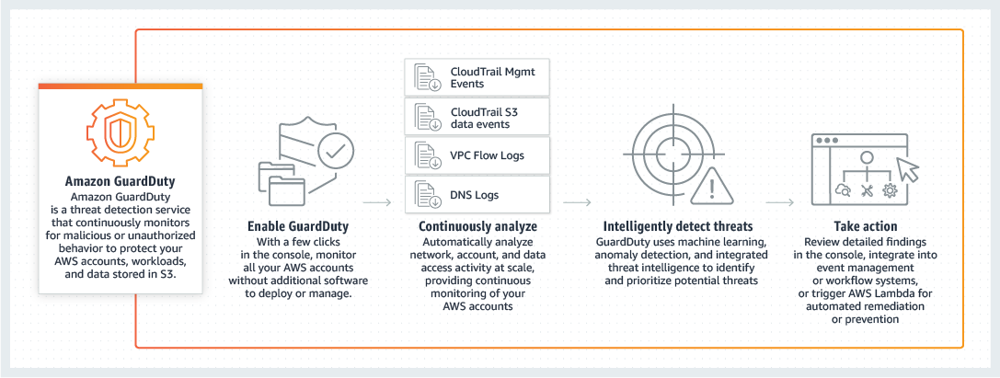


Lambda支持每个AWS账户，每个区域1000个任务同时并发。如果你的处理需求超过这个的话，需要联系AWS服务提高上限。

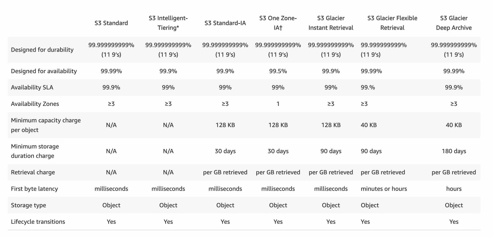


AWS S3存储数据转移的方向（从热数据到冷数据）

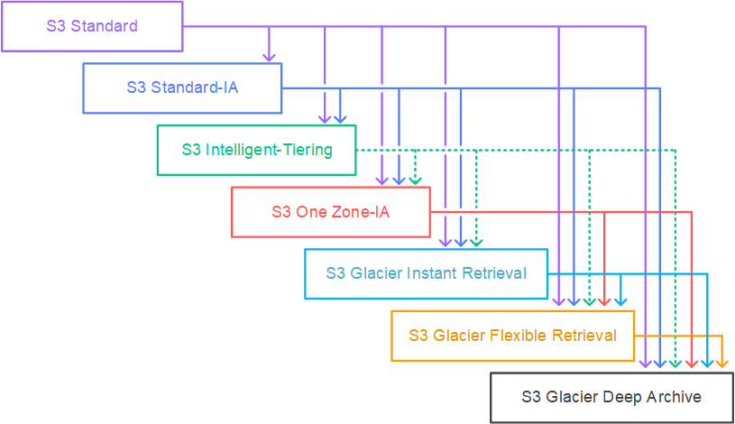


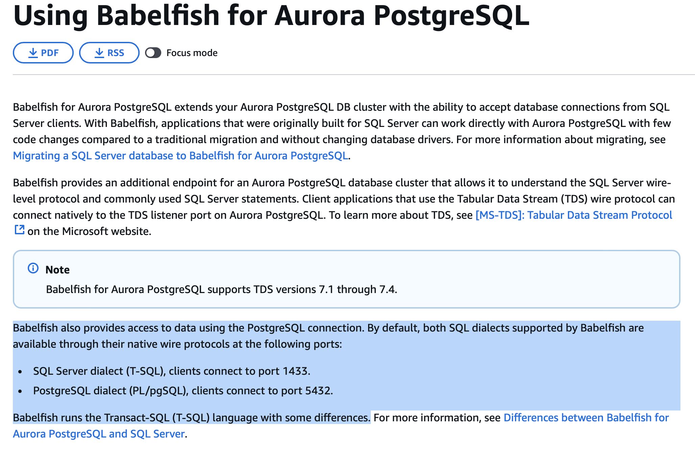


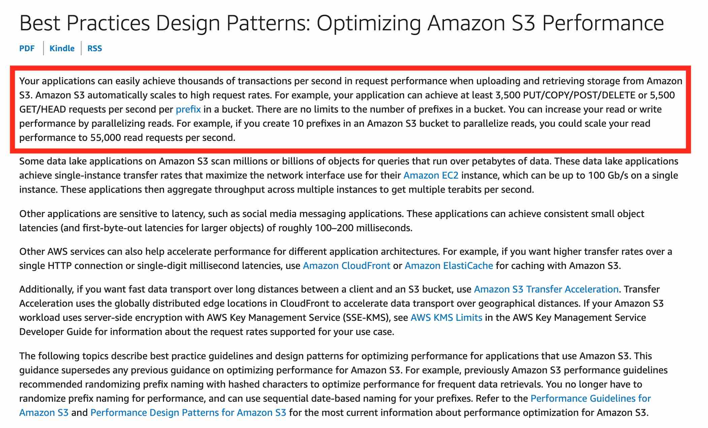


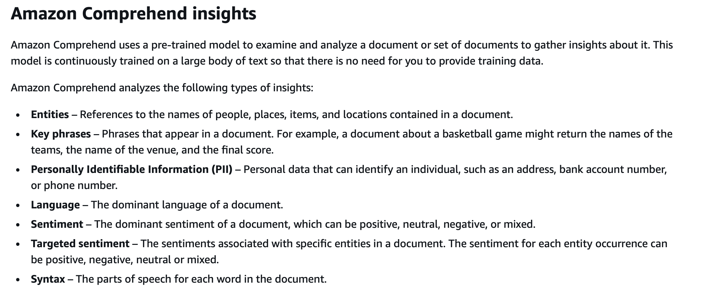


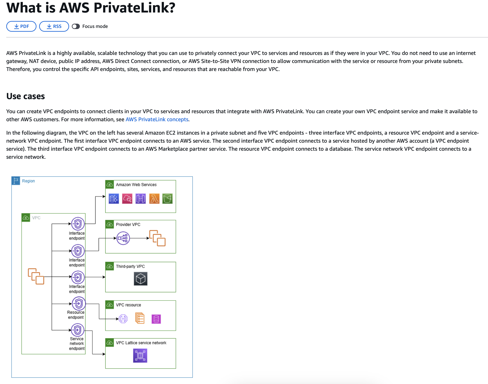


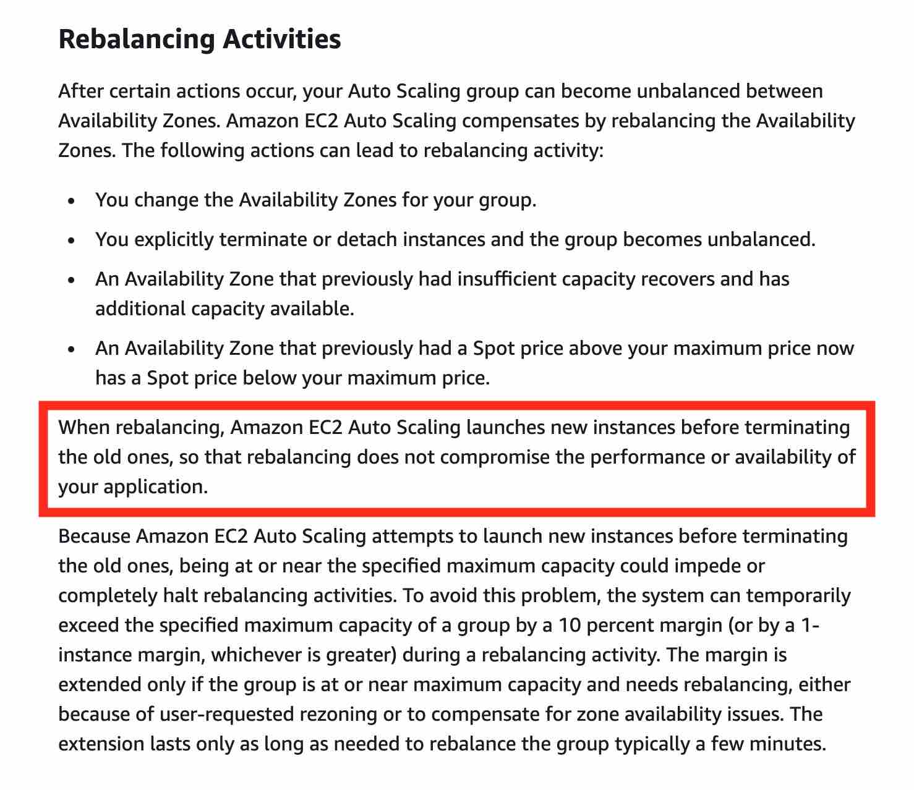


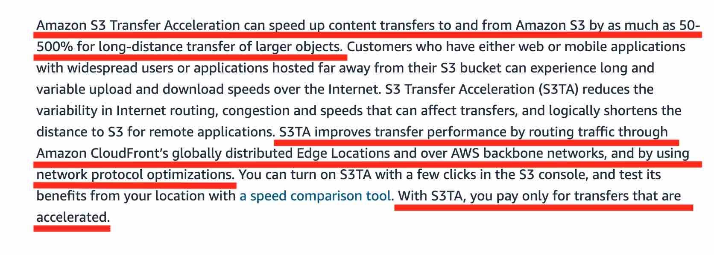


Amazon API Gateway creates RESTful APIs that:

Are HTTP-based.

Enable stateless client-server communication.

Implement standard HTTP methods such as GET, POST, PUT, PATCH, and DELETE.

Amazon API Gateway creates WebSocket APIs that:

Adhere to the WebSocket protocol, which enables stateful, full-duplex communication between client and server. Route incoming messages based on message content.

So Amazon API Gateway supports stateless RESTful APIs as well as stateful WebSocket APIs. Therefore this option is correct.


## RESTful API 核心特征总结

### 📌 六大架构约束

1. 无状态性（Stateless）

   - 每个请求独立自包含
   - 服务器不保存客户端上下文

2. 统一接口（Uniform Interface）

   - 通过 URI 标识资源
   - 使用标准格式（JSON/XML）
   - 自描述消息
   - HATEOAS（超媒体驱动）

3. 客户端-服务器分离

   - 前后端职责分离
   - 独立演化

4. 分层系统

   - 支持中间层（代理、CDN）
   - 提高扩展性和安全性

5. 可缓存性

   - 明确标记缓存策略
   - 提高性能

6. 按需代码

   （可选） 

   - 可发送可执行代码

### 🔧 实践约定

**HTTP 方法语义化**

- GET（查询）、POST（创建）、PUT（更新）、DELETE（删除）

**HTTP 状态码规范**

- 2xx 成功、4xx 客户端错误、5xx 服务器错误

**资源设计**

- 使用名词复数：`/users`
- 层级关系：`/users/123/orders`
- 版本管理：`/api/v1/`

**操作特性**

- 幂等性（GET/PUT/DELETE）
- 无副作用（GET）

### 💡 核心优势

- **可扩展** - 无状态便于水平扩展
- **可靠** - 请求独立，容错性强
- **简单** - 统一接口，易于理解
- **灵活** - 前后端解耦，独立开发

### ⚠️ 实际情况

真正完全符合 REST 所有约束的 API 较少，特别是 HATEOAS 经常被忽略。市面上的"RESTful API"多数是部分遵循 REST 原则的 HTTP API。


## 购物网站的用户状态管理策略

购物网站比较特殊，需要同时处理**登录用户**和**游客**，而且涉及支付等敏感操作。一般采用**混合策略**。

## 典型架构

### 1. 用户认证 - JWT + Refresh Token

javascript

```javascript
// 登录获取令牌
POST /api/auth/login
Response: {
  "accessToken": "eyJ...",    // 15分钟
  "refreshToken": "xyz...",   // 7-30天
  "user": {
    "id": 123,
    "name": "张三",
    "memberLevel": "vip"
  }
}

// 后续请求
GET /api/orders
Authorization: Bearer eyJ...
```

### 2. 购物车 - 三层策略

javascript

```javascript
// 游客：LocalStorage + Session
const guestCart = {
  // 浏览器本地存储
  saveLocal() {
    localStorage.setItem('cart', JSON.stringify(this.items));
  },
  
  // 临时会话ID（服务端缓存）
  sessionId: 'temp_' + uuid(),
  
  async sync() {
    // 定期同步到 Redis
    await fetch('/api/cart/guest', {
      headers: { 'X-Session-Id': this.sessionId },
      body: JSON.stringify(this.items)
    });
  }
};

// 登录用户：数据库持久化
const userCart = {
  async addItem(product) {
    await fetch('/api/cart/items', {
      method: 'POST',
      headers: { 'Authorization': `Bearer ${token}` },
      body: JSON.stringify(product)
    });
  }
};

// 登录时合并购物车
async function onLogin(token) {
  const localCart = JSON.parse(localStorage.getItem('cart') || '[]');
  
  if (localCart.length > 0) {
    await fetch('/api/cart/merge', {
      method: 'POST',
      headers: { 'Authorization': `Bearer ${token}` },
      body: JSON.stringify(localCart)
    });
    
    localStorage.removeItem('cart');
  }
}
```

## 实际案例分析

### 淘宝/天猫模式

javascript

```javascript
// 1. 双层 Cookie
document.cookie = "tracknick=用户昵称";  // 显示用户名
document.cookie = "_tb_token_=安全令牌";  // 实际认证

// 2. 购物车独立服务
// cart.taobao.com 专门处理购物车
GET https://cart.taobao.com/api/data
Cookie: _tb_token_=xxx

// 3. 未登录也能加购物车
// 使用设备指纹 + Cookie 追踪
const deviceId = generateFingerprint(); // 浏览器指纹
```

### Amazon模式

javascript

```javascript
// 1. Session + Cookie 组合
// session-id: 长期追踪（游客也有）
// ubid-main: 用户唯一标识
// session-token: 安全令牌

// 2. 购物车持久化策略
if (isLoggedIn) {
  // 保存90天
  saveToDatabase(userId, cartItems);
} else {
  // 游客购物车保存7天
  saveToRedis(sessionId, cartItems, TTL='7d');
}

// 3. A/B测试令牌
// 用于个性化推荐
headers: {
  'x-amz-user-agent': '...',
  'x-amz-rid': requestId
}
```

## 核心模块实现

### 后端架构（Node.js示例）

javascript

```javascript
// 1. 认证服务
class AuthService {
  async login(email, password) {
    const user = await User.findByEmail(email);
    if (!user || !bcrypt.compare(password, user.password)) {
      throw new Error('Invalid credentials');
    }
    
    // 生成双令牌
    const accessToken = jwt.sign(
      { userId: user.id, role: user.role },
      SECRET,
      { expiresIn: '15m' }
    );
    
    const refreshToken = crypto.randomBytes(32).toString('hex');
    await Redis.set(`refresh:${refreshToken}`, user.id, 'EX', 30*24*60*60);
    
    return { accessToken, refreshToken, user };
  }
}

// 2. 购物车服务
class CartService {
  // 游客购物车
  async getGuestCart(sessionId) {
    const cart = await Redis.get(`cart:guest:${sessionId}`);
    return cart ? JSON.parse(cart) : [];
  }
  
  // 用户购物车
  async getUserCart(userId) {
    return await CartItem.findAll({ where: { userId } });
  }
  
  // 合并购物车
  async mergeCart(userId, guestItems) {
    const userItems = await this.getUserCart(userId);
    
    for (const item of guestItems) {
      const existing = userItems.find(i => i.productId === item.productId);
      
      if (existing) {
        // 合并数量
        existing.quantity += item.quantity;
        await existing.save();
      } else {
        // 新增商品
        await CartItem.create({ userId, ...item });
      }
    }
  }
}

// 3. 订单服务（需要强认证）
class OrderService {
  async createOrder(userId, paymentInfo) {
    // 二次验证敏感操作
    const isValid = await this.verifyPayment(paymentInfo);
    if (!isValid) throw new Error('Payment verification failed');
    
    // 开启事务
    const transaction = await sequelize.transaction();
    
    try {
      // 1. 创建订单
      const order = await Order.create({ userId, ... }, { transaction });
      
      // 2. 扣减库存
      await this.deductInventory(order.items, transaction);
      
      // 3. 清空购物车
      await CartItem.destroy({ where: { userId }, transaction });
      
      await transaction.commit();
      return order;
    } catch (error) {
      await transaction.rollback();
      throw error;
    }
  }
}
```

### 前端实现（React）

javascript

```javascript
// 状态管理 (Redux/Zustand)
const useAuthStore = create((set) => ({
  user: null,
  token: localStorage.getItem('token'),
  
  login: async (credentials) => {
    const { accessToken, refreshToken, user } = await authAPI.login(credentials);
    
    localStorage.setItem('token', accessToken);
    localStorage.setItem('refreshToken', refreshToken);
    
    set({ user, token: accessToken });
    
    // 合并购物车
    await cartStore.mergeCart();
  },
  
  logout: () => {
    localStorage.clear();
    set({ user: null, token: null });
    
    // 清空本地购物车
    cartStore.clear();
  }
}));

const useCartStore = create((set, get) => ({
  items: [],
  
  // 初始化
  init: async () => {
    const { token } = useAuthStore.getState();
    
    if (token) {
      // 登录用户：从服务器加载
      const items = await cartAPI.getItems();
      set({ items });
    } else {
      // 游客：从本地加载
      const localCart = JSON.parse(localStorage.getItem('cart') || '[]');
      set({ items: localCart });
    }
  },
  
  // 添加商品
  addItem: async (product) => {
    const { token } = useAuthStore.getState();
    
    if (token) {
      // 登录用户：调用API
      await cartAPI.addItem(product);
    } else {
      // 游客：本地存储
      const items = [...get().items, product];
      localStorage.setItem('cart', JSON.stringify(items));
      set({ items });
      
      // 异步同步到服务器（可选）
      const sessionId = getSessionId();
      fetch('/api/cart/guest/sync', {
        method: 'POST',
        headers: { 'X-Session-Id': sessionId },
        body: JSON.stringify(items)
      });
    }
  }
}));
```

## 安全考虑

### 1. 支付安全

javascript

```javascript
// 支付需要额外验证
POST /api/orders/checkout
Authorization: Bearer <token>
X-Payment-Token: <一次性支付令牌>  // 防重放攻击
X-CSRF-Token: <csrf_token>         // 防CSRF

// 3D Secure 验证
{
  "orderId": "123",
  "payment": {
    "method": "card",
    "3ds": {
      "verified": true,
      "token": "..."
    }
  }
}
```

### 2. 防机器人

javascript

```javascript
// 限购商品需要验证
POST /api/cart/add-limited-item
{
  "productId": "ps5",
  "captcha": "...",        // 验证码
  "queueToken": "..."      // 排队令牌
}
```

### 3. Session固定攻击防护

javascript

```javascript
// 登录后更换Session ID
app.post('/login', (req, res) => {
  // 验证成功后
  req.session.regenerate(() => {
    req.session.userId = user.id;
    res.json({ success: true });
  });
});
```

## 性能优化

### 1. 缓存策略

javascript

```javascript
// CDN缓存静态资源
/static/* -> CDN

// Redis缓存热点数据
const getProduct = async (id) => {
  // 先查缓存
  const cached = await redis.get(`product:${id}`);
  if (cached) return JSON.parse(cached);
  
  // 查数据库
  const product = await Product.findById(id);
  
  // 写入缓存
  await redis.set(`product:${id}`, JSON.stringify(product), 'EX', 3600);
  
  return product;
};
```

### 2. 购物车优化

javascript

```javascript
// 批量操作
POST /api/cart/batch
{
  "operations": [
    { "action": "add", "productId": 1, "quantity": 2 },
    { "action": "remove", "productId": 2 },
    { "action": "update", "productId": 3, "quantity": 5 }
  ]
}

// 本地缓存 + 延迟同步
const cartSync = debounce(async (items) => {
  await fetch('/api/cart/sync', {
    method: 'POST',
    body: JSON.stringify(items)
  });
}, 2000);  // 2秒延迟
```

## 实际技术栈示例

### 大型电商（京东/淘宝级别）

yaml

```yaml
认证: 
  - OAuth 2.0 + JWT
  - 分布式Session（Redis Cluster）
  
购物车:
  - 用户: MySQL + Redis缓存
  - 游客: Redis（TTL 7天）
  
支付:
  - 支付网关（独立域名）
  - 多重验证（密码+验证码+风控）
  
架构:
  - 微服务架构
  - API网关（Kong/Zuul）
  - 消息队列（Kafka）
```

### 中型电商

yaml

```yaml
认证:
  - JWT + Cookie
  - Redis Session
  
购物车:
  - PostgreSQL + Redis
  
支付:
  - Stripe/PayPal集成
  
架构:
  - 单体应用或简单微服务
  - Nginx反向代理
  - RabbitMQ
```

## 总结

购物网站的用户状态管理特点：

1. **混合认证**：JWT（API）+ Cookie（Web）
2. **双重购物车**：游客（LocalStorage/Redis）+ 用户（数据库）
3. **登录合并**：游客购物车自动合并到用户账户
4. **安全分级**：浏览无需认证，支付强认证
5. **性能优先**：多级缓存，异步同步

关键是在**无状态的 REST 原则**和**用户体验**之间找到平衡，通过令牌机制保持无状态，同时提供流畅的购物体验。

## AWS 数据分析服务详细特性总结

## 1. 数据仓库服务

### Amazon Redshift

```yaml
核心特性:
  架构:
    - MPP（大规模并行处理）
    - 列式存储
    - 自动数据压缩
    - 区域分布（Distribution Keys）
    - 排序键（Sort Keys）
  
  版本对比:
    Redshift Provisioned:
      - 固定集群大小
      - Reserved Instance 优惠
      - 需要容量规划
      - 适合稳定工作负载
    
    Redshift Serverless:
      - 自动扩缩容
      - 按 RPU-hour 计费
      - 无需管理
      - 适合突发性负载
  
  性能优化:
    - 结果集缓存
    - 编译代码缓存
    - 自动表优化（ATO）
    - 物化视图
    - 并发扩展集群
    - Spectrum（查询 S3）
  
  最佳场景:
    ✅ 复杂 SQL 分析
    ✅ 大规模聚合
    ✅ BI 报表
    ✅ 历史数据分析
    
  不适合:
    ❌ OLTP 工作负载
    ❌ 实时流处理
    ❌ 小数据量（< 100GB）
```

### Amazon RDS

```yaml
核心特性:
  支持引擎:
    - PostgreSQL
    - MySQL  
    - MariaDB
    - Oracle
    - SQL Server
    - Aurora（见下）
  
  特点:
    - OLTP 优化
    - 行式存储
    - ACID 事务
    - 自动备份
    - Multi-AZ 高可用
    - Read Replicas
  
  扩展能力:
    垂直: 最高 128 vCPUs
    水平: 通过读副本
    存储: 自动扩展至 64TB
  
  最佳场景:
    ✅ 事务处理
    ✅ Web 应用数据库
    ✅ ERP/CRM 系统
    
  不适合:
    ❌ 大数据分析
    ❌ 数据仓库
    ❌ 非结构化数据
```

### Amazon Aurora

```yaml
核心特性:
  架构优势:
    - 云原生设计
    - 存储计算分离
    - 6 副本跨 3 AZ
    - 自动故障转移（< 30秒）
    - 存储自动扩展（10GB-128TB）
  
  版本:
    Aurora MySQL:
      - 5x MySQL 性能
      - MySQL 兼容
    
    Aurora PostgreSQL:
      - 3x PostgreSQL 性能  
      - PostgreSQL 兼容
    
    Aurora Serverless v2:
      - 0.5 - 1 ACU 细粒度扩展
      - 秒级扩缩容
      - 适合不可预测负载
  
  分析功能:
    Aurora ML:
      - SQL 调用 SageMaker
      - 集成 Comprehend/Textract
      - 简单预测任务
    
    Aurora Parallel Query:
      - 推送计算到存储层
      - 加速分析查询
  
  最佳场景:
    ✅ 高并发 OLTP
    ✅ SaaS 应用
    ✅ 需要高可用的关键业务
    
  限制:
    ❌ 不是 MPP
    ❌ 分析性能不如 Redshift
    ❌ 成本较高
```

## 2. 查询引擎服务

### Amazon Athena

```yaml
核心特性:
  基础:
    - Presto 引擎
    - 无服务器
    - 直接查询 S3
    - 支持多种格式
  
  数据格式:
    结构化:
      - Parquet（推荐）
      - ORC（推荐）
      - Avro
      - JSON
      - CSV/TSV
    
    半结构化:
      - JSON（嵌套）
      - XML（通过 SerDe）
    
    压缩:
      - Snappy
      - Gzip
      - LZO
      - Bzip2
  
  性能优化:
    - 分区（Partitioning）
    - 列式格式转换
    - 压缩
    - 投影（Projection）
    - 数据分桶（Bucketing）
  
  集成:
    Athena Federated Query:
      - 查询多数据源
      - DynamoDB, RDS, Redshift
      - 自定义连接器
    
    Athena ML:
      - 调用 SageMaker 模型
      - SQL 中使用 ML
  
  成本:
    - $5/TB 扫描数据
    - 分区和压缩可大幅降低成本
  
  最佳场景:
    ✅ 即席查询
    ✅ 日志分析
    ✅ 数据湖查询
    ✅ 一次性分析
    
  不适合:
    ❌ 高频查询（成本高）
    ❌ 需要索引的查询
    ❌ 事务处理
    ❌ 低延迟要求
```

## 3. ETL/数据处理服务

### AWS Glue

yaml

```yaml
核心特性:
  组件:
    Glue Data Catalog:
      - 中央元数据存储
      - 表/数据库定义
      - 架构版本控制
      - 与 Athena/EMR/Redshift 集成
    
    Glue Crawlers:
      - 自动发现架构
      - 推断数据类型
      - 检测分区
      - 更新 Catalog
    
    Glue ETL Jobs:
      - Spark/Python Shell
      - 可视化编辑器
      - 内置转换
      - 自动扩展
    
    Glue DataBrew:
      - 无代码数据准备
      - 250+ 转换
      - 数据质量规则
      - 可视化界面
    
    Glue Streaming:
      - 实时 ETL
      - Kafka/Kinesis 源
      - 微批处理
  
  开发选项:
    - Glue Studio（可视化）
    - Glue Notebooks（Jupyter）
    - Script Editor（代码）
  
  性能:
    DPU (Data Processing Unit):
      - Standard: 4 vCPU, 16GB RAM
      - G.1X: 4 vCPU, 16GB RAM (Spark)
      - G.2X: 8 vCPU, 32GB RAM (ML)
      - G.025X: 0.25 DPU (Python Shell)
  
  最佳场景:
    ✅ 批量 ETL
    ✅ 数据目录管理
    ✅ 无服务器需求
    ✅ 简单到中等复杂度转换
    
  限制:
    ❌ 复杂自定义逻辑
    ❌ 非 Spark 工作负载
    ❌ 实时处理（延迟高）
```

### Amazon EMR

```yaml
核心特性:
  框架支持:
    - Apache Spark
    - Apache Hadoop
    - Apache Hive
    - Apache HBase
    - Presto/Trino
    - Apache Flink
    - Jupyter/Zeppelin
  
  部署模式:
    EMR on EC2:
      - 传统集群模式
      - 完全控制
      - Spot 实例支持
      - 自动扩展
    
    EMR on EKS:
      - Kubernetes 上运行
      - 容器化
      - 多租户
      - 更好的资源利用
    
    EMR Serverless:
      - 无需管理集群
      - 按作业付费
      - 自动扩展
      - 预初始化环境
  
  特性:
    EMR Studio:
      - 集成开发环境
      - Notebook 协作
      - 调试工具
    
    EMRFS:
      - S3 优化文件系统
      - 一致性视图
      - 加密支持
  
  最佳场景:
    ✅ 大规模数据处理
    ✅ 复杂 ETL
    ✅ 机器学习管道
    ✅ 需要特定版本/配置
    
  考虑因素:
    ⚠️ 需要集群管理
    ⚠️ 成本可能较高
    ⚠️ 学习曲线陡峭
```

## 4. 流处理服务

### Amazon Kinesis

yaml

```yaml
组件:
  Kinesis Data Streams:
    - 实时数据流
    - 分片扩展
    - 7天保留（可扩展到365天）
    - 多消费者
    
  Kinesis Data Firehose:
    - 托管数据传输
    - 自动缩放
    - 数据转换
    - 目标：S3/Redshift/ES/Splunk
    - 近实时（60秒延迟）
    
  Kinesis Data Analytics:
    - SQL 流处理
    - Apache Flink
    - 窗口函数
    - 实时聚合
  
  容量模式:
    On-Demand:
      - 自动扩展
      - 按使用付费
      - 200 MB/s 默认
    
    Provisioned:
      - 固定分片
      - 可预测成本
      - 手动扩展
  
  最佳场景:
    ✅ 实时日志处理
    ✅ IoT 数据流
    ✅ 点击流分析
    ✅ 实时仪表板
```

## 5. 机器学习集成

### ML 服务对比

```yaml
Redshift ML:
  特点:
    - CREATE MODEL SQL 语法
    - 自动调用 SageMaker Autopilot
    - 模型部署为 SQL 函数
    - 批量预测优化
  
  示例:
    CREATE MODEL customer_ltv
    FROM training_data
    TARGET lifetime_value
    FUNCTION predict_ltv
    IAM_ROLE 'role-arn'
    AUTO ON;
  
  优势:
    ✅ 纯 SQL
    ✅ 无需 ML 知识
    ✅ 自动特征工程
  
  限制:
    ❌ 仅限 AutoML
    ❌ 模型类型受限

Athena ML:
  特点:
    - 调用 SageMaker 端点
    - UDF 方式使用
    - 需预部署模型
  
  示例:
    USING EXTERNAL FUNCTION predict_fraud(
      transaction_amount DOUBLE,
      merchant_id VARCHAR
    ) RETURNS DOUBLE
    SAGEMAKER 'fraud-detection-model';
  
  场景:
    ✅ S3 数据直接预测
    ✅ 已有 SageMaker 模型
    ❌ 需要先部署模型

Aurora ML:
  特点:
    - 集成 SageMaker
    - 集成 Comprehend/Textract
    - 事务数据预测
  
  示例:
    SELECT customer_id,
           aws_comprehend_detect_sentiment(
             review_text, 'en'
           ) as sentiment
    FROM reviews;
  
  场景:
    ✅ OLTP 内预测
    ✅ 文本分析
    ❌ 大规模批处理
```

## 6. 数据湖服务

### AWS Lake Formation

yaml

```yaml
核心功能:
  数据摄入:
    - 蓝图模板
    - 自动爬取
    - 增量加载
  
  安全:
    - 细粒度访问控制
    - 行/列级权限
    - 数据屏蔽
    - 跨账户共享
  
  治理:
    - 数据血缘
    - 审计日志
    - 标签管理
    
  数据准备:
    - 去重
    - 格式转换
    - 分区优化
  
  与 Glue 关系:
    - 建立在 Glue 之上
    - 增加安全和治理层
    - 简化权限管理
```

## 7. 服务选择决策树

### 基于工作负载

yaml

```yaml
OLTP (事务处理):
  小规模: RDS
  大规模/高可用: Aurora
  全球分布: DynamoDB

OLAP (分析):
  数据仓库: Redshift
  数据湖查询: Athena
  复杂 ETL: EMR

实时处理:
  流摄入: Kinesis Data Streams
  流 ETL: Kinesis Analytics
  流传输: Kinesis Firehose

批处理:
  简单 ETL: Glue
  复杂处理: EMR
  无服务器: Glue/EMR Serverless
```

### 基于数据量

```yaml
< 1TB:
  RDS/Aurora + 简单查询

1-10TB:
  Redshift + Glue ETL
  或 Athena + S3

10-100TB:
  Redshift + EMR
  Lake Formation + Athena

> 100TB:
  数据湖架构
  EMR + S3 + Redshift Spectrum
```

### 成本优化策略

```yaml
开发/测试:
  - Athena（按查询付费）
  - EMR Serverless
  - Redshift Serverless

生产环境:
  稳定负载:
    - Redshift RI
    - EMR Reserved
  
  突发负载:
    - Serverless 选项
    - Spot 实例

数据存储:
  热数据: Redshift
  温数据: S3 Standard
  冷数据: S3 Glacier
```

## 总结

选择服务的关键考虑因素：

1. **工作负载类型**（OLTP vs OLAP）
2. **数据量和增长率**
3. **查询频率和延迟要求**
4. **预算和成本敏感度**
5. **团队技能和运维能力**
6. **合规和安全要求**

通常最佳实践是**混合架构**：

- S3 作为数据湖存储
- Glue 做 ETL 和元数据管理
- Redshift 做高频分析
- Athena 做即席查询
- SageMaker 做高级 ML


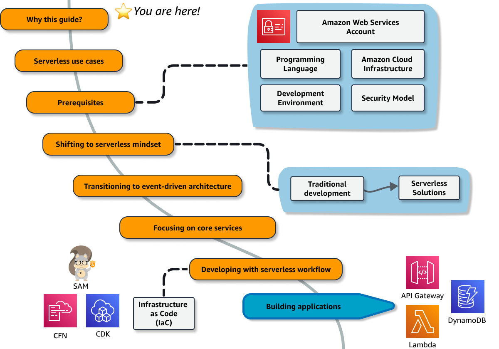


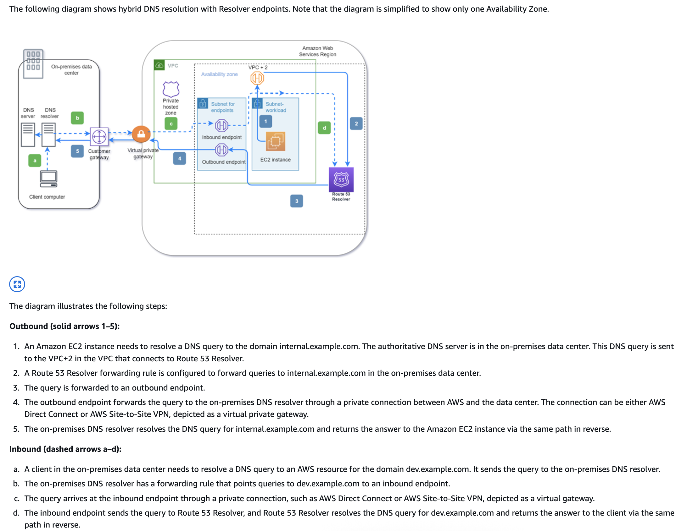


## 网络存储协议：SMB、NFS和iSCSI

## **工作层级的根本区别**

**SMB和NFS** - 文件级协议

- 在文件系统层面工作，直接共享文件和目录
- 客户端看到的是文件夹和文件
- 服务器负责管理文件系统

**iSCSI** - 块级协议

- 在块设备层面工作，提供原始磁盘块
- 客户端看到的是一个虚拟硬盘
- 客户端需要自己格式化和管理文件系统

## **具体特性对比**

### SMB (Server Message Block)

- **平台**：主要用于Windows环境，但也支持Linux/Mac
- **版本**：SMB1/2/3，最新的SMB3提供加密和更好的性能
- **认证**：支持Active Directory集成，用户级权限控制
- **典型用途**：Windows文件共享、打印机共享
- **优势**：Windows原生支持，易于配置，功能丰富

### NFS (Network File System)

- **平台**：主要用于Unix/Linux环境
- **版本**：NFSv3（无状态）、NFSv4（有状态，更安全）
- **认证**：基于主机IP或Kerberos
- **典型用途**：Linux服务器间文件共享、虚拟化存储
- **优势**：在Unix/Linux环境下性能优秀，配置简单

### iSCSI

- **平台**：平台无关，通过IP网络传输SCSI命令
- **连接**：点对点连接，一个LUN通常只能被一个客户端使用
- **认证**：CHAP认证，基于initiator和target
- **典型用途**：SAN存储、数据库存储、虚拟机磁盘
- **优势**：提供块级访问，性能接近本地磁盘

## **应用场景选择**

**选择SMB当你需要**：

- Windows环境下的文件共享
- 需要与Active Directory集成
- 多用户同时访问同一文件

**选择NFS当你需要**：

- Linux/Unix环境下的文件共享
- 虚拟化平台的共享存储（如VMware）
- 简单高效的文件共享

**选择iSCSI当你需要**：

- 数据库存储（需要块级访问）
- 虚拟机的专用磁盘
- 构建低成本的SAN存储
- 需要完全控制文件系统

## **性能和复杂度**

- **性能**：iSCSI通常提供最好的性能（接近本地磁盘），NFS在Linux环境下性能很好，SMB3也有不错的性能
- **复杂度**：NFS配置最简单，SMB次之，iSCSI需要更多的配置和管理

在工业自动化场景中，如果是Windows服务器间的文件共享，SMB可能最合适；如果涉及Linux系统或需要高性能块存储（比如数据库），则可以考虑NFS或iSCSI。


## 3种协议的具体差异

## **iSCSI - 就像添加一块新硬盘（买了一块空白硬盘，你要自己分区、格式化、建文件夹）**

**场景**：你的服务器需要更多存储空间

```
存储服务器（192.168.1.100）提供 500GB iSCSI LUN
↓
你的Windows服务器连接后：
- 在"磁盘管理"中看到一个新的"磁盘2"（未初始化）
- 需要初始化、分区、格式化
- 变成 E: 盘
- 完全属于你，别人看不到也用不了
- 可以在上面安装SQL Server数据库
- 存储服务器根本不知道你在里面放了什么文件
```

**实际操作就像**：

1. 打开Windows的"iSCSI发起程序"
2. 连接到存储服务器
3. 在磁盘管理中看到新磁盘
4. 格式化成NTFS，分配盘符E:
5. 这个E盘只有你能用，可以随意创建/删除文件

## **SMB - 就像访问共享文件夹**

**场景**：办公室文件共享

```
文件服务器（192.168.1.200）共享了一个文件夹
↓
你的电脑访问：\\192.168.1.200\共享文档
或映射为网络驱动器 Z:
- 看到的是现成的文件和文件夹
- 多人可以同时访问
- 有权限控制（读/写/修改）
```

**实际操作就像**：

1. 在Windows资源管理器输入 `\\服务器名\共享名`
2. 输入用户名密码
3. 立即看到文件夹内容
4. 可以映射成Z:盘方便访问
5. 其他同事也能同时访问这些文件

## **NFS - Linux版的共享文件夹**

**场景**：Linux服务器间共享日志目录

```
NFS服务器（192.168.1.150）导出 /data/logs
↓
你的Linux服务器挂载：
mount 192.168.1.150:/data/logs /mnt/shared_logs
- 在/mnt/shared_logs下看到所有日志文件
- 多台服务器可以同时读写
```

**实际操作就像**：

1. 在Linux执行 `mount -t nfs server:/path /local/path`
2. 立即在本地路径看到远程文件
3. 像操作本地文件一样操作


### **SMB/NFS - 服务器端管理文件系统**

```
文件服务器：我已经格式化好了，建好了文件夹结构
     ↓ (提供"文件和文件夹")
客户端：我直接使用现成的文件夹和文件
```

- 文件系统已经存在于服务器上
- 你看到的文件夹是服务器创建的
- 服务器知道所有文件的存在


## **具体应用实例对比**

### 你的WCS系统数据库场景：

**如果用iSCSI**：

```
存储设备 → iSCSI LUN（1TB） → 你的服务器看到F:盘
→ 在F:盘安装MySQL
→ 数据文件直接写入F:\MySQL\Data\
→ 只有这台服务器能访问
```

**如果用SMB**（不推荐用于数据库）：

```
文件服务器 → 共享文件夹\\Server\Database
→ 多台服务器都能访问
→ 但数据库不能直接用网络共享位置
```

### AGV系统日志收集场景：

**用SMB更合适**：

```
每台AGV的日志 → 写入 \\LogServer\AGV_Logs\AGV_001\
                → 写入 \\LogServer\AGV_Logs\AGV_002\
管理人员可以直接打开\\LogServer\AGV_Logs查看所有日志
```

## **简单记忆方式**

- **iSCSI** = 给你一块"专属硬盘"（别人看不见）
- **SMB/NFS** = 大家共用的"文件柜"（都能看见，有权限控制）

在你的工厂环境中：

- 数据库服务器需要高性能存储 → 用iSCSI
- 多个PLC需要上传生产报表 → 用SMB共享文件夹
- Linux服务器间共享配置文件 → 用NFS

| 方面           | iSCSI              | SMB/NFS      |
| -------------- | ------------------ | ------------ |
| 提供什么       | 原始磁盘块         | 文件和目录   |
| 文件系统在哪   | 客户端创建         | 服务器端已有 |
| 服务器知道什么 | 只知道块的使用情况 | 知道每个文件 |
| 共享性         | 独占（一般情况）   | 可多人共享   |
| 使用复杂度     | 需要格式化等步骤   | 即插即用     |


HPC workloads need to achieve low-latency network performance necessary for tightly-coupled node-to-node communication that is typical of HPC applications. Cluster placement groups pack instances close together inside an Availability Zone. These are recommended for applications that benefit from low network latency, high network throughput, or both.


## AWS三大ETL工具全方位深度剖析

### 一、核心定位与设计理念

#### **AWS Glue Studio - 企业级数据工程平台**

Glue Studio是AWS为专业数据工程师打造的重量级ETL开发平台。它基于Apache Spark分布式计算引擎，提供了一个可视化的作业设计器，但本质上是在生成和管理Spark代码。

**核心理念**：将复杂的Spark编程简化为可视化操作，同时保留了完整的编程灵活性。用户可以在可视化界面和代码编辑器之间自由切换，既能快速搭建数据管道，又能深入优化性能。

#### **AWS Glue DataBrew - 业务友好的数据准备工具**

DataBrew定位于"零代码数据准备"，专门服务于业务分析师和数据分析师。它提供了类似Excel的操作体验，用户通过点击和拖拽就能完成复杂的数据转换。

**核心理念**：让不懂编程的业务用户也能独立完成数据清洗和准备工作。所有操作都被记录为"Recipe"（配方），形成可重复使用的数据处理模板。

#### **Amazon AppFlow - SaaS应用数据集成器**

AppFlow是AWS的应用集成服务，专注于连接各种SaaS应用和AWS服务。它预置了70多个连接器，覆盖主流的企业应用。

**核心理念**：无需管理基础设施，通过简单配置就能实现应用间的数据自动流转。重点解决企业多系统数据孤岛问题。

### 二、技术架构深度对比

```
┌─────────────────────────────────────────────────────────────┐
│                    Glue Studio 架构                         │
├─────────────────────────────────────────────────────────────┤
│  可视化设计层  →  代码生成层  →  Spark执行层  →  数据存储层    │
│                                                             │
│  • 节点拖拽        • PySpark     • Driver节点    • S3        │
│  • 连线配置        • Scala       • Executor群    • RDS       │
│  • 参数设置        • 优化器      • 内存管理      • Redshift   │
└─────────────────────────────────────────────────────────────┘

┌─────────────────────────────────────────────────────────────┐
│                    DataBrew 架构                            │
├─────────────────────────────────────────────────────────────┤
│   数据探索层  →  转换设计层  →  Recipe引擎  →  执行环境        │
│                                                             │
│  • 数据采样        • 250+函数    • 步骤解析    • 托管节点      │
│  • 统计分析        • 可视预览    • 依赖管理    • 自动扩缩      │
│  • 质量评估        • 版本控制    • 优化执行    • 并行处理      │
└─────────────────────────────────────────────────────────────┘

┌─────────────────────────────────────────────────────────────┐
│                    AppFlow 架构                             │
├─────────────────────────────────────────────────────────────┤
│   连接器层  →  数据映射层  →  转换引擎  →  目标适配层          │
│                                                             │
│  • OAuth认证     • 字段映射    • 过滤规则    • 格式转换        │
│  • API适配       • 类型转换    • 聚合计算    • 批量写入        │
│  • 速率控制      • 验证规则    • 掩码处理    • 错误处理        │
└─────────────────────────────────────────────────────────────┘
```

### 三、数据处理能力对比

#### **数据规模处理能力**

```
数据量级                   Glue Studio                 DataBrew                     AppFlow
KB-MB级                   过度配置，成本高             适合，快速处理                  最优选择
GB级                        良好性能                    最佳选择                      可以处理
TB级                        最佳选择                    性能下降                        困难
PB级                        唯一选择                     不支持                        不支持
```

#### **处理复杂度对比**

**Glue Studio复杂度范围**：

- 简单转换：过于复杂
- 中等复杂度：合适
- 高复杂度：最优（支持机器学习、图计算、复杂JOIN）
- 极限复杂度：唯一选择（自定义算法、分布式计算）

**DataBrew复杂度范围**：

- 简单转换：最优
- 中等复杂度：良好
- 高复杂度：受限（仅支持预定义函数）
- 极限复杂度：不支持

**AppFlow复杂度范围**：

- 简单转换：最优（字段映射、简单过滤）
- 中等复杂度：受限
- 高复杂度：不支持
- 极限复杂度：不支持

### 四、用户界面与操作体验

#### **Glue Studio操作体验**

界面分为三个主要区域：

1. **组件面板**：包含各类数据源、转换节点、目标节点
2. **画布区域**：通过拖拽构建数据流程图
3. **配置面板**：设置每个节点的详细参数

操作流程：

- 第一步：拖入数据源节点（S3、RDS、Kinesis等）
- 第二步：添加转换节点（过滤、聚合、JOIN、自定义转换）
- 第三步：连接目标节点（数据湖、数据仓库）
- 第四步：配置作业参数（DPU数量、超时设置、重试策略）
- 第五步：生成代码并可选择性编辑
- 第六步：运行和监控

#### **DataBrew操作体验**

界面设计类似数据分析工具：

1. **数据网格视图**：类似Excel的表格展示
2. **Recipe面板**：显示所有转换步骤
3. **工具栏**：包含所有转换函数
4. **数据profile面板**：实时显示数据统计

操作流程：

- 第一步：导入数据集（自动采样前1000行）
- 第二步：数据探索（查看统计、分布、缺失值）
- 第三步：点选转换（从菜单选择或直接在列上操作）
- 第四步：实时预览结果
- 第五步：保存为Recipe
- 第六步：创建Job定期执行

#### **AppFlow操作体验**

界面采用向导式设计：

1. **连接配置页**：设置源和目标
2. **字段映射页**：拖拽匹配字段
3. **转换规则页**：配置过滤和转换
4. **触发设置页**：定义执行时机

操作流程：

- 第一步：选择数据源（如Salesforce）
- 第二步：授权连接（OAuth或API密钥）
- 第三步：选择数据对象（如Contacts、Leads）
- 第四步：选择目标（如S3）
- 第五步：映射字段关系
- 第六步：设置触发条件

### 五、核心功能特性详解

#### **转换能力对比表**

```
转换类型                  Glue Studio            DataBrew                     AppFlow
数据清洗
去重                     ✅ 高级去重           ✅ 简单去重                    ⚠️ 基础
缺失值处理               ✅ 多种策略           ✅ 丰富选项                        ❌
异常值处理                ✅ 自定义             ✅ 统计方法                       ❌
数据转换
类型转换                 ✅ 完全支持            ✅ 完全支持                  ✅ 基础类型
格式标准化                ✅ 可编程             ✅ 预置模板                     ⚠️ 有限
计算字段                  ✅ 任意复杂           ✅ 预定义函数                 ⚠️ 简单计算
数据整合
JOIN操作                 ✅ 所有类型             ⚠️ 基础JOIN                      ❌
UNION操作                    ✅                     ✅                           ❌
数据透视                      ✅                     ✅                           ❌
高级功能
机器学习                      ✅                     ❌                           ❌
实时处理                      ✅                     ❌                        ⚠️ 近实时
自定义函数                    ✅                     ❌                           ❌
```

### 六、Recipe vs Job vs Flow 概念对比

#### **DataBrew Recipe（配方）**

Recipe是DataBrew的核心概念，它记录了数据转换的每一个步骤：

**Recipe特点**：

- **版本控制**：每次修改都会创建新版本，可以回滚
- **可视化历史**：能看到每个步骤的添加时间和修改者
- **参数化**：支持变量替换，提高复用性
- **导入导出**：可以在不同项目间共享
- **协作友好**：团队成员能理解每个步骤的业务含义

**Recipe结构**：

```
Recipe: 客户数据清洗
├── 步骤1: 删除重复行（基于customer_id）
├── 步骤2: 填充空值（用"未知"替换）
├── 步骤3: 标准化日期格式（统一为YYYY-MM-DD）
├── 步骤4: 验证邮箱格式（不合规则标记）
├── 步骤5: 脱敏处理（隐藏SSN后四位）
└── 步骤6: 创建年龄组字段（基于出生日期）
```

#### **Glue Job（作业）**

Job是Glue Studio的执行单元，本质是一个Spark应用程序：

**Job特点**：

- **资源配置灵活**：可以精确控制计算资源
- **代码可见**：能查看和编辑生成的代码
- **错误处理完善**：支持重试、断点续传
- **性能可调优**：能深入优化Spark参数
- **监控详细**：提供执行计划、资源使用等指标

**Job组成**：

```
Glue Job: 销售数据ETL
├── 数据源配置（多个S3路径、数据库表）
├── 业务逻辑（复杂JOIN、聚合计算）
├── 性能优化（分区策略、广播变量）
├── 错误处理（重试机制、错误输出）
└── 输出配置（分区写入、格式转换）
```

#### **AppFlow Flow（数据流）**

Flow是AppFlow的配置单元，定义了数据从源到目标的流转规则：

**Flow特点**：

- **连接简单**：预置连接器，配置即用
- **实时同步**：支持事件触发
- **映射直观**：拖拽式字段匹配
- **监控便捷**：自动记录每次执行
- **成本可控**：按实际传输量计费

**Flow结构**：

```
AppFlow Flow: CRM到数据湖同步
├── 源配置（Salesforce账户）
├── 对象选择（Contacts表）
├── 字段映射（50个字段对应关系）
├── 转换规则（格式转换、过滤条件）
└── 目标配置（S3路径、文件格式）
```

### 七、数据血缘追踪能力

#### **Glue Studio的血缘追踪**

- 提供作业级别的依赖关系图
- 显示数据源到目标的完整路径
- 记录每次执行的输入输出统计
- 支持通过Glue Catalog追踪表级血缘
- 可以集成AWS Lake Formation获得列级血缘

#### **DataBrew的血缘追踪**

- Recipe提供步骤级的转换历史
- 每个步骤都记录了操作类型和参数
- 数据Profile记录转换前后的统计变化
- 支持查看数据质量的演变过程
- 可以追踪哪些用户修改了Recipe

#### **AppFlow的血缘追踪**

- 记录每次Flow执行的详细日志
- 提供字段级别的映射关系
- 显示数据过滤和转换的规则
- 记录失败记录和错误原因
- 支持通过CloudWatch查看详细指标

### 八、团队协作模式对比

#### **Glue Studio协作模式**

**适合的团队结构**：

- 数据工程师主导
- 需要版本控制（Git集成）
- 代码审查流程
- 开发、测试、生产环境分离

**协作特点**：

- Job可以导出为CloudFormation模板
- 支持IAM细粒度权限控制
- 可以共享自定义转换库
- 支持团队级别的最佳实践模板

#### **DataBrew协作模式**

**适合的团队结构**：

- 业务分析师参与
- 数据工程师支持
- 快速迭代验证

**协作特点**：

- Recipe易于理解和分享
- 支持项目级别的权限管理
- 业务用户可以独立操作
- 数据工程师可以优化Recipe

#### **AppFlow协作模式**

**适合的团队结构**：

- IT管理员配置
- 业务用户使用
- 最少技术介入

**协作特点**：

- 配置一次，长期运行
- 通过连接配置文件共享凭证
- 支持跨账户资源访问
- 业务用户可监控运行状态

### 九、成本优化策略

#### **Glue Studio成本优化**

**计费模型理解**：

- DPU（数据处理单元）按秒计费，最小计费10分钟
- 标准DPU：4 vCPU + 16GB内存
- G.1X：更多内存，适合内存密集型任务
- G.2X：最大内存，适合超大数据集

**优化策略**：

1. **资源规模优化**：从小规模DPU开始，逐步增加找到最优点
2. **并行度调优**：合理设置Spark分区数，避免资源浪费
3. **增量处理**：使用Job Bookmarks避免重复处理
4. **数据分区**：按时间或类别分区，减少扫描量
5. **压缩格式**：使用Parquet格式，减少I/O成本

#### **DataBrew成本优化**

**计费模型理解**：

- 按节点小时计费，最小计费30分钟
- 数据集存储额外收费
- Recipe执行按实际处理量

**优化策略**：

1. **采样开发**：在小数据集上开发Recipe
2. **批量处理**：合并多个小任务
3. **缓存复用**：重用数据Profile结果
4. **定时优化**：在低峰期运行Job
5. **清理历史**：定期清理不用的数据集

#### **AppFlow成本优化**

**计费模型理解**：

- 按传输记录数计费
- 每百万条记录收费
- 额外的处理步骤可能增加成本

**优化策略**：

1. **增量同步**：只传输变化的数据
2. **字段筛选**：只选择必要字段
3. **批量传输**：累积到一定量再传输
4. **压缩传输**：启用压缩减少传输量
5. **错误处理**：避免重复传输失败记录

### 十、实际应用场景决策树

```
数据处理需求分析
│
├─ 数据来源是什么？
│  ├─ 企业SaaS应用 → 考虑AppFlow
│  ├─ 数据库/文件 → 继续评估
│  └─ 混合来源 → 可能需要组合方案
│
├─ 技术团队能力？
│  ├─ 纯业务团队 → DataBrew
│  ├─ 有数据分析师 → DataBrew + AppFlow
│  ├─ 有数据工程师 → Glue Studio
│  └─ 混合团队 → 根据任务分配工具
│
├─ 数据处理复杂度？
│  ├─ 简单清洗 → DataBrew
│  ├─ 中等转换 → DataBrew或Glue Studio
│  ├─ 复杂逻辑 → Glue Studio
│  └─ 机器学习 → Glue Studio
│
├─ 数据量级别？
│  ├─ GB级以下 → DataBrew或AppFlow
│  ├─ TB级 → Glue Studio
│  └─ PB级 → 只能选Glue Studio
│
├─ 实时性要求？
│  ├─ 实时 → Glue Streaming
│  ├─ 近实时 → AppFlow
│  └─ 批处理 → 都可以
│
└─ 预算考虑？
   ├─ 成本敏感 → 仔细评估使用模式
   ├─ 性能优先 → Glue Studio
   └─ 易用性优先 → DataBrew
```

### 十一、工具组合使用模式

#### **模式一：数据湖构建**

```
外部数据收集 → 数据清洗 → 复杂转换 → 数据服务
   AppFlow → DataBrew → Glue Studio → 分析工具
```

#### **模式二：实时分析管道**

```
实时数据流 → 流处理 → 批量优化 → 可视化
Kinesis → Glue Streaming → DataBrew → QuickSight
```

#### **模式三：企业数据集成**

```
多SaaS源 → 标准化 → 数据仓库 → BI报表
AppFlow → DataBrew → Redshift → Tableau
```

### 十二、未来发展趋势

#### **Glue Studio发展方向**

- **智能化提升**：AI辅助代码生成，自动性能优化
- **实时能力增强**：更好的流批一体处理
- **生态整合**：与SageMaker深度集成
- **成本优化**：更灵活的资源调度

#### **DataBrew发展方向**

- **智能推荐**：基于数据特征自动推荐转换
- **协作增强**：更好的团队协作功能
- **可视化提升**：更丰富的数据探索工具
- **Recipe市场**：共享行业最佳实践Recipe

#### **AppFlow发展方向**

- **连接器扩展**：支持更多应用和数据源
- **转换增强**：更复杂的数据处理能力
- **智能映射**：自动字段匹配和类型推断
- **监控完善**：更详细的数据质量监控


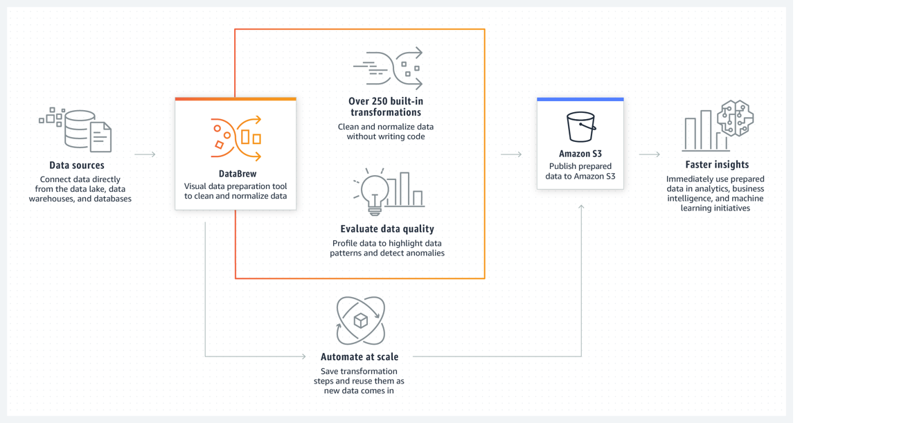


让我们结合刚才对三个ETL工具的深入理解，重新剖析这道题目。

### 一、场景需求精确解读

#### **1. 业务背景分析**

```
医疗分析公司 + S3数据湖 + Parquet格式
│
├── 数据特点：结构化医疗数据，已经是列式存储格式
├── 数据规模：多医院+设备，预计GB到TB级
├── 合规要求：医疗数据通常涉及HIPAA合规
└── 数据质量：医疗数据质量参差不齐，需要严格把控
```

#### **2. 转换需求分析**

```
三种转换类型评估：
┌─────────────────────────────────────┐
│ 异常过滤 (Anomaly filtering)         │
│ • 复杂度：中等                       │
│ • 需要统计方法识别异常值              │
│ • DataBrew有内置统计异常检测         │
└─────────────────────────────────────┘

┌─────────────────────────────────────┐
│ 日期时间标准化 (Datetime normalization)│
│ • 复杂度：简单                       │
│ • 标准格式转换                       │
│ • DataBrew有250+预置函数支持         │
└─────────────────────────────────────┘

┌─────────────────────────────────────┐
│ 患者群组聚合 (Patient cohort aggregation)│
│ • 复杂度：中等                       │
│ • 分组统计计算                       │
│ • DataBrew支持分组聚合               │
└─────────────────────────────────────┘
```

### 二、核心需求与工具能力匹配分析

#### **需求1：Code-free Interface（无代码界面）**

```
工具匹配度详细分析
DataBrew⭐⭐⭐⭐⭐• 完全图形界面
• 点击式操作
• 无需了解任何代码概念
• 类Excel体验
Glue Studio⭐⭐⭐• 虽有可视化界面
• 但需理解ETL概念
• 最终生成代码
• 偏技术导向
AppFlow⭐⭐⭐⭐• 配置式界面
• 但不适合S3内部转换
• 主要用于应用集成
Athena SQL❌• 必须写SQL
• 违反无代码要求
```

#### **需求2：数据工程师与业务分析师协作**

```
协作模式分析：
┌────────────────────────────────────┐
│         DataBrew协作优势            │
├────────────────────────────────────┤
│ 业务分析师：                        │
│ • 可独立创建Recipe                  │
│ • 直观理解每个步骤                  │
│ • 实时预览结果                      │
│                                    │
│ 数据工程师：                        │
│ • 可优化Recipe性能                  │
│ • 设置Job调度                       │
│ • 处理复杂场景                      │
│                                    │
│ 协作机制：                          │
│ • Recipe版本控制                    │
│ • 共享项目空间                      │
│ • 清晰的操作历史                    │
└────────────────────────────────────┘
```

#### **需求3：Data Lineage Tracking（数据血缘追踪）**

```
追踪能力           DataBrew              Glue Studio                 AppFlow               Athena
步骤级追踪     ✅ Recipe记录每步         ⚠️ Job级别                ⚠️ Flow级别               ❌
版本历史      ✅ 完整版本控制             ⚠️ 需Git                      ❌                   ❌
审计追踪       ✅ 谁改了什么              ⚠️ 基础                    ⚠️ 基础                 ❌
可视化展示      ✅ 图形化展示              ✅ 有                     ⚠️ 简单                 ❌
```

#### **需求4：Data Profiling Capabilities（数据分析能力）**

```
DataBrew数据分析功能详解：
┌─────────────────────────────────────────┐
│          自动数据质量报告                │
├─────────────────────────────────────────┤
│ • 列统计信息（最小/最大/平均/中位数）      │
│ • 空值分布分析                          │
│ • 唯一值计数                            │
│ • 数据类型推断                          │
│ • 异常值检测                            │
│ • 数据分布可视化                        │
│ • 相关性分析                            │
│ • 模式识别                              │
│ • 数据质量评分                          │
└─────────────────────────────────────────┘

对比其他工具：
- Glue Studio：需要额外编写profiling逻辑
- AppFlow：基本没有profiling功能
- Athena：需要写复杂SQL查询
```

#### **需求5：共享转换逻辑（无需编码）**

```
Recipe共享机制：
┌────────────────────────┐
│   Recipe导出为JSON      │
│          ↓             │
│   版本控制系统          │
│          ↓             │
│   其他项目导入          │
│          ↓             │
│   参数化重用            │
└────────────────────────┘

优势对比：
- DataBrew Recipe：业务可读，易理解
- Glue Job定义：技术性强，难理解  
- AppFlow配置：仅限于简单映射
- Athena查询：SQL语句，需技术背景
```

### 三、逐个选项深度剖析

#### **❌ 选项A：AWS Glue Studio**

**为什么不合适：**

1. 用户群体错配
   - Glue Studio设计给数据工程师
   - 业务分析师学习曲线陡峭
   - 需要理解Spark、分区、DPU等概念
2. "无代码"承诺无法兑现
   - 虽有可视化，但本质是代码生成器
   - 复杂场景仍需查看和调整代码
   - Job定义对业务用户太技术化
3. 协作模式不理想
   - Job定义分享需要技术理解
   - 业务用户难以独立操作
   - 缺少业务友好的审计追踪

#### **❌ 选项B：Amazon AppFlow**

**为什么不合适：**

1. **架构定位错误**

```
   AppFlow设计用途：
   SaaS应用 → AWS服务（✅）
   AWS服务内部转换（❌）
   
   本题需求：
   S3 → 转换 → S3（AppFlow不擅长）
```

1. 转换能力不足
   - 缺少异常检测功能
   - 聚合能力有限
   - 没有数据profiling功能
2. 不是为这个场景设计
   - AppFlow是集成工具，不是ETL工具
   - 对Parquet文件处理能力有限
   - 成本模型不适合大量数据转换

#### **✅ 选项C：AWS Glue DataBrew（正确答案）**

**为什么完美匹配：**

1. **Recipe系统完美契合需求**

```
   Recipe特性对应需求：
   ┌──────────────────────────────────┐
   │ 需求：无代码                      │
   │ Recipe：纯图形操作                │
   ├──────────────────────────────────┤
   │ 需求：数据血缘                    │
   │ Recipe：步骤级追踪                │
   ├──────────────────────────────────┤
   │ 需求：共享逻辑                    │
   │ Recipe：可导出、版本化、参数化     │
   ├──────────────────────────────────┤
   │ 需求：协作                        │
   │ Recipe：业务可读的转换步骤         │
   └──────────────────────────────────┘
```

1. 数据分析能力卓越
   - 自动生成数据质量报告
   - 内置统计分析功能
   - 异常值检测
   - 可视化数据分布
2. 医疗场景适配性
   - 支持敏感数据脱敏
   - HIPAA合规支持
   - 数据质量规则引擎
   - 适合GB-TB级医疗数据
3. 用户体验优势
   - 业务分析师可独立使用
   - 实时预览转换结果
   - 错误提示清晰
   - 学习成本低

#### **❌ 选项D：Amazon Athena**

**为什么不合适：**

1. 根本性冲突
   - 需要编写SQL（违反无代码要求）
   - 查询工具，不是ETF工具
   - 没有可视化转换界面
2. 功能缺失
   - 没有内置profiling
   - 共享机制是SQL语句
   - 缺少转换作业管理
3. 使用场景错误
   - Athena用于即席查询
   - 不适合定期数据转换
   - 成本模型不适合ETL

### 四、综合评分对比

```
评估维度DataBrewGlue StudioAppFlowAthena
无代码要求10/106/108/100/10
业务用户友好10/104/107/102/10
数据血缘追踪9/107/105/103/10
数据Profiling10/105/102/103/10
共享机制9/106/105/103/10
协作支持9/105/106/102/10
适合数据规模8/1010/106/107/10
总分65/7043/7039/7020/70
```

### 五、决策逻辑总结

```
为什么DataBrew是最佳选择？

1. 完美满足"无代码"核心要求
   └── 其他工具都有代码成分

2. Recipe = 数据血缘 + 共享逻辑 + 版本控制
   └── 一个概念解决三个需求

3. 专为"数据准备"设计
   └── 不是过度设计（Glue Studio）
   └── 不是功能不足（AppFlow）
   └── 不是场景错误（Athena）

4. 业务与技术的平衡点
   └── 业务用户能用
   └── 技术人员不觉得受限

5. 医疗数据场景适配
   └── 数据质量控制
   └── 合规性支持
   └── 适合的数据规模
```

### 六、实战应用建议

如果你在实际项目中遇到类似场景：

1. 先用DataBrew做POC
   - 快速验证数据转换逻辑
   - 让业务用户参与设计
   - 评估数据质量
2. 数据量增长后考虑混合架构
   - DataBrew处理常规清洗
   - Glue Studio处理复杂计算
   - 保持Recipe作为业务文档
3. 关注成本优化
   - 开发时用样本数据
   - 生产环境批量处理
   - 监控执行时间和成本

这道题的核心考点是理解AWS不同ETL工具的定位和适用场景，DataBrew在"无代码数据准备"这个细分领域是AWS的最佳答案。


.png)


# AWS Global Accelerator + ELB 架构详解

## 一、架构概述

### 1.1 核心概念

AWS Global Accelerator 是一个网络层服务，通过 AWS 全球网络基础设施改善应用的可用性和性能。它提供静态 IP 地址作为应用的固定入口点，同时智能地将流量路由到最优的端点。

### 1.2 整体架构图

```
┌─────────────────────────────────────────────────────────────────┐
│                         全球用户分布                             │
│  🌏 亚洲用户    🌍 欧洲用户    🌎 美洲用户    🌏 其他地区         │
└─────────────┬───────────────┬──────────────┬────────────────────┘
              │               │              │
              ↓               ↓              ↓
┌─────────────────────────────────────────────────────────────────┐
│                    AWS Edge Locations (90+ 个)                  │
│  ┌─────────┐  ┌─────────┐  ┌─────────┐  ┌─────────┐             │
│  │东京 Edge│  │ 新加坡   │  │法兰克福 │   │弗吉尼亚 │              │
│  └─────────┘  └─────────┘  └─────────┘  └─────────┘             │
│                   BGP Anycast 路由 (最近接入)                    │
└─────────────────────────────┬───────────────────────────────────┘
                              ↓
┌─────────────────────────────────────────────────────────────────┐
│              AWS Global Accelerator (控制层)                     │
│  ┌──────────────────────────────────────────────────────────┐   │
│  │  静态 IP: [192.0.2.1] [198.51.100.1]                     │   │
│  │  DNS: abc123.awsglobalaccelerator.com                    │   │
│  └──────────────────────────────────────────────────────────┘   │
│                                                                 │
│  ┌──────────────────────────────────────────────────────────┐   │
│  │                    Listeners (监听器)                     │   │
│  │  • TCP:80, 443  • UDP:53  • TCP:3306-3308                │   │
│  └──────────────────────────────────────────────────────────┘   │
└─────────────────────────────┬───────────────────────────────────┘
                              ↓
                   🔀 智能路由决策引擎 🔀
                   (延迟/健康/权重/Dial)
                              ↓
┌─────────────────────────────────────────────────────────────────┐
│                    AWS Backbone Network                         │
│                    (专用光纤骨干网)                              │
└────────┬──────────────────┬──────────────────┬──────────────────┘
         ↓                  ↓                  ↓
┌────────────────┐ ┌────────────────┐ ┌────────────────┐
│ Endpoint Group │ │ Endpoint Group │ │ Endpoint Group │
│  US-EAST-1     │ │  EU-WEST-1     │ │  AP-SOUTH-1    │
│ Traffic: 40%   │ │ Traffic: 30%   │ │ Traffic: 30%   │
└────────┬───────┘ └────────┬───────┘ └────────┬───────┘
         ↓                  ↓                  ↓
┌────────────────┐ ┌────────────────┐ ┌────────────────┐
│      ALB       │ │      ALB       │ │      NLB       │
│  10.0.1.0/24   │ │  10.1.1.0/24   │ │  10.2.1.0/24   │
└────────┬───────┘ └────────┬───────┘ └────────┬───────┘
         ↓                  ↓                  ↓
    ┌────┴────┐        ┌────┴────┐        ┌────┴────┐
    │Target   │        │Target   │        │Target   │
    │Groups   │        │Groups   │        │Groups   │
    └─────────┘        └─────────┘        └─────────┘
         ↓                  ↓                  ↓
    [EC2/ECS]          [EC2/ECS]          [EC2/ECS]
    [Lambda]           [Lambda]           [On-Prem]
```


### Endpoint 的类型

```
Global Accelerator
        ↓
   Endpoint Group
        ↓
    【Endpoints】← 这里可以是以下 4 种类型
        ↓
┌──────────────────────────────────────────┐
│           支持的 Endpoint 类型            │
├──────────────────────────────────────────┤
│ 1. Application Load Balancer (ALB)       │
│ 2. Network Load Balancer (NLB)           │
│ 3. EC2 Instance                          │
│ 4. Elastic IP (EIP)                      │
└──────────────────────────────────────────┘
```


### 二、每种 Endpoint 类型详解

#### 1. **ALB 作为 Endpoint**（最常用）

```yaml
使用场景: HTTP/HTTPS 应用
优势:
  - 7层负载均衡
  - 基于路径/主机头路由
  - 与多个后端实例集成
  
示例配置:
  EndpointId: "arn:aws:elasticloadbalancing:us-east-1:123456789012:loadbalancer/app/my-alb/50dc6c495c0c9188"
  Type: ALB
```

#### 2. **NLB 作为 Endpoint**

```yaml
使用场景: TCP/UDP 高性能应用
优势:
  - 4层负载均衡
  - 超低延迟
  - 支持静态 IP
  - 保留源 IP

示例配置:
  EndpointId: "arn:aws:elasticloadbalancing:us-east-1:123456789012:loadbalancer/net/my-nlb/50dc6c495c0c9188"
  Type: NLB
```

#### 3. **EC2 Instance 作为 Endpoint**

```yaml
使用场景: 单实例应用/特殊需求
优势:
  - 直接路由到实例
  - 无需 Load Balancer
  - 适合简单部署

示例配置:
  EndpointId: "i-0123456789abcdef0"
  Type: EC2_INSTANCE
```

#### 4. **Elastic IP 作为 Endpoint**

~~~yaml
使用场景: 需要固定 IP 的资源
优势:
  - 支持已有 EIP 资源
  - 可指向 EC2 或 NAT Gateway
  
示例配置:
  EndpointId: "eipalloc-0123456789abcdef0"
  Type: EIP
```

### 三、Endpoint 在架构中的位置
```
用户请求流程:

客户端 (日本)
    ↓
Global Accelerator (静态 IP: 192.0.2.1)
    ↓
Listener (TCP:443)
    ↓
Endpoint Group (ap-northeast-1) ←── 选择这个区域（延迟最低）
    ↓
Endpoints: ←─────── 这里是实际的目标
  ├─ ALB-Tokyo-1 (权重: 50)
  └─ ALB-Tokyo-2 (权重: 50)
    ↓
Target Groups
    ↓
实际的应用服务器 (EC2/ECS/Lambda)
~~~


## 二、数据流详细路径

### 2.1 请求流程图

```
步骤 1: DNS 解析
┌──────────┐      DNS查询       ┌─────────────┐
│  客户端   │ ----------------->│ DNS Resolver │
└──────────┘                    └─────────────┘
     ↑                                │
     │         返回 Anycast IP        ↓
     └─────────────────────────────────

步骤 2: TCP 连接建立
┌──────────┐      SYN          ┌─────────────┐
│  客户端   │ ---------------->│ Edge Location│
└──────────┘                   └─────────────┘
                                      │
                   通过 AWS Backbone   ↓
                                ┌─────────────┐
                                │   Endpoint  │
                                └─────────────┘

步骤 3: 数据传输路径
客户端 ──────> Edge ──────> Accelerator ──────> ELB ──────> 应用
  5ms         2ms           15ms              3ms       
  互联网      AWS网络        AWS网络          VPC内部
```

### 2.2 健康检查机制

```
┌────────────────────────────────────────────────┐
│         Global Accelerator Health Check        │
└──────────────────┬─────────────────────────────┘
                   │ 每 30 秒
                   ↓
    ┌──────────────────────────────┐
    │   发送 TCP/HTTP 健康检查请求   │
    └──────────────┬───────────────┘
                   │
        ┌──────────┼──────────┐
        ↓          ↓          ↓
   ┌─────────┐ ┌─────────┐ ┌─────────┐
   │Endpoint1│ │Endpoint2│ │Endpoint3│
   │ 健康 ✓  │ │ 不健康 ✗ │ │ 健康 ✓ │
   └─────────┘ └─────────┘ └─────────┘
                   │
                   ↓
    ┌──────────────────────────────┐
    │     更新路由表，排除不健康端点 │
    │     权重: E1=50%, E3=50%     │
    └──────────────────────────────┘
```

## 三、详细组件说明

### 3.1 Global Accelerator 层

| 组件               | 功能                     | 配置参数                                                     |
| ------------------ | ------------------------ | ------------------------------------------------------------ |
| **Accelerator**    | 核心资源，提供全球接入点 | • Name<br>• IP Address Type (IPv4/Dual)<br>• Enabled/Disabled<br>• DNS Name |
| **Listener**       | 处理特定端口和协议的流量 | • Protocol (TCP/UDP)<br>• Port Range (1-65535)<br>• Client Affinity |
| **Endpoint Group** | 管理特定区域的端点       | • Region<br>• Traffic Dial (0-100%)<br>• Health Check Config |
| **Endpoint**       | 实际处理流量的资源       | • Endpoint ID (ALB/NLB/EC2/EIP)<br>• Weight (0-255)<br>• Client IP Preservation |

### 3.2 流量分配算法

```python
# 简化的流量分配逻辑
class TrafficDistributor:
    def select_endpoint(self, request):
        # 1. 获取客户端位置
        client_location = get_client_location(request.source_ip)
        
        # 2. 计算到各端点组的延迟
        latencies = {}
        for group in endpoint_groups:
            if group.traffic_dial > 0:  # 只考虑开启流量的组
                latencies[group] = calculate_latency(client_location, group.region)
        
        # 3. 选择最低延迟的健康端点组
        sorted_groups = sorted(latencies.items(), key=lambda x: x[1])
        for group, latency in sorted_groups:
            healthy_endpoints = get_healthy_endpoints(group)
            if healthy_endpoints:
                # 4. 在组内根据权重选择端点
                return weighted_random_choice(healthy_endpoints)
        
        return None  # 所有端点都不健康
```

## 四、性能指标分析

### 4.1 延迟优化效果

```
传统互联网路由 vs Global Accelerator 对比

场景: 从东京访问美国东部的应用

传统路由:
东京 -> ISP1 -> ISP2 -> ISP3 -> ... -> 美国东部
├─ 跳数: 15-20跳
├─ 延迟: 180-250ms
├─ 抖动: ±50ms
└─ 丢包率: 1-3%

Global Accelerator:
东京 -> 东京Edge -> AWS Backbone -> 美国东部
├─ 跳数: 3-5跳
├─ 延迟: 120-150ms (改善 30-40%)
├─ 抖动: ±10ms (改善 80%)
└─ 丢包率: <0.1% (改善 90%+)
```

### 4.2 可用性指标

| 指标              | 数值     | 说明                   |
| ----------------- | -------- | ---------------------- |
| **SLA**           | 99.99%   | 年停机时间 < 52.6 分钟 |
| **故障转移时间**  | < 30 秒  | 端点故障时的切换时间   |
| **健康检查频率**  | 10/30 秒 | 快速/标准健康检查间隔  |
| **全球 PoP 数量** | 90+      | 全球接入点覆盖         |
| **DDoS 防护**     | 自动启用 | AWS Shield Standard    |

### 4.3 吞吐量规格

```
单个 Accelerator 规格限制:
┌─────────────────────────────────────┐
│ • 最大并发连接: 无限制                │
│ • 每秒新建连接: 100,000+             │
│ • 带宽: 10 Gbps+ (取决于端点)        │
│ • Listener 数量: 10                  │
│ • 端点组数量: 10 per Listener        │
│ • 端点数量: 10 per Endpoint Group    │
└─────────────────────────────────────┘
```

## 五、优缺点深度分析

### 5.1 优势

#### ✅ 性能优势

1. **智能路由**: 自动选择最佳路径，减少 30-60% 延迟
2. **稳定性**: 使用 AWS 专用网络，避免公网拥塞
3. **全球加速**: 90+ Edge Locations 就近接入
4. **会话保持**: Client Affinity 支持有状态应用

#### ✅ 可靠性优势

1. **自动故障转移**: 健康检查失败立即切换（<30秒）
2. **多区域冗余**: 跨区域自动负载均衡
3. **DDoS 防护**: Shield Standard 自动防护
4. **无单点故障**: Anycast IP 自动高可用

#### ✅ 运维优势

1. **静态 IP**: 永不改变，便于防火墙配置
2. **简化架构**: 无需管理多区域 DNS
3. **统一入口**: 单一全球接入点
4. **灵活控制**: Traffic Dial 精细流量控制

### 5.2 劣势

#### ❌ 成本考虑

```
成本构成（美国东部为例）:
┌──────────────────────────────────────┐
│ Accelerator 固定费用: $0.025/小时     │
│ = $18/月                             │
│                                      │
│ 数据处理费 (DT-Premium):              │
│ • 美国/欧洲: $0.015/GB                │
│ • 亚太地区: $0.023/GB                 │
│ • 中国: $0.035/GB                    │
│                                      │
│ 示例: 100TB/月 从亚洲访问             │
│ = 100,000 GB × $0.023 = $2,300       │
└──────────────────────────────────────┘
```

#### ❌ 技术限制

1. **协议限制**: 仅支持 TCP/UDP，不支持 ICMP
2. **地理限制**: 中国大陆需要 ICP 备案
3. **调试复杂**: 流量经过多层，问题定位困难
4. **配置限制**: 部分高级 LB 特性不可用

#### ❌ 场景不适用

1. **纯内网应用**: 内网流量无需 Global Accelerator
2. **单区域部署**: 没有跨区域需求时成本不划算
3. **低流量应用**: 固定成本对小应用较高
4. **UDP 视频流**: 某些实时流媒体协议支持有限

## 六、延展性分析

### 6.1 横向扩展能力

```
扩展维度图:
                    
     端点扩展 →
     ┌────┬────┬────┬────┐
     │EP1 │EP2 │EP3 │... │  单组最多 10 个端点
     └────┴────┴────┴────┘
          ↑
     ┌─────────┐
     │端点组1   │
     └─────────┘
          ↑
区   ┌─────────┬─────────┬─────────┐
域   │Region 1 │Region 2 │Region N │  支持所有 AWS 区域
扩   └─────────┴─────────┴─────────┘
展          ↑
↓    ┌──────────┐
     │Listener 1│  最多 10 个 Listeners
     └──────────┘
          ↑
     ┌────────────┐
     │Accelerator │
     └────────────┘
```

### 6.2 垂直扩展能力

| 维度            | 当前限制   | 扩展方式 | 最大容量     |
| --------------- | ---------- | -------- | ------------ |
| **带宽**        | 默认无限制 | 自动扩展 | 取决于端点   |
| **并发连接**    | 无限制     | 自动扩展 | 仅受端点限制 |
| **新建连接/秒** | 100,000+   | 自动扩展 | 可申请提高   |
| **端点数**      | 10/组      | 创建多组 | 100/Listener |
| **Listener**    | 10         | 申请提高 | 可协商       |

### 6.3 功能延展路线图

```
当前架构
    │
    ├─> 集成 AWS WAF (Web 应用防火墙)
    │    └─> 应用层安全防护
    │
    ├─> 集成 Route 53 健康检查
    │    └─> 更智能的故障转移
    │
    ├─> 自定义路由 Accelerator
    │    └─> 确定性路由到特定端点
    │
    ├─> 混合云支持
    │    └─> On-premises 端点支持
    │
    └─> 多云支持 (未来)
         └─> 非 AWS 端点集成
```

## 七、实际应用场景 - WCS 系统

### 7.1 架构映射

```
WCS 全球部署架构:

                 [全球 WCS 控制中心]
                         ↓
              [Global Accelerator]
                    静态 IP 入口
                         ↓
    ┌──────────────┼──────────────┐
    ↓              ↓              ↓
[日本工厂]     [中国工厂]     [东南亚工厂]
  ALB            ALB            NLB
    ↓              ↓              ↓
 WCS API       WCS API       WCS API
    ↓              ↓              ↓
┌────────┐    ┌────────┐    ┌────────┐
│AGV控制  │    │AGV控制 │    │AGV控制 │
│PLC通信  │    │PLC通信 │    │PLC通信 │
│输送带   │    │输送带  │    │输送带   │
└────────┘    └────────┘    └────────┘
```

### 7.2 具体收益

| 场景              | 传统方案问题         | Global Accelerator 解决方案 | 改善效果                    |
| ----------------- | -------------------- | --------------------------- | --------------------------- |
| **跨国 AGV 控制** | 延迟不稳定，命令丢失 | AWS 骨干网保证低延迟        | 延迟降低 40%，可靠性 99.99% |
| **PLC 数据采集**  | 多站点 IP 管理复杂   | 统一静态 IP 入口            | 运维成本降低 60%            |
| **灾难恢复**      | 手动切换，恢复慢     | 自动故障转移                | RTO < 30秒                  |
| **客户端接入**    | 需要记录多个地址     | 单一全球地址                | 用户体验提升                |

### 7.3 成本效益分析

```
假设: 3 个区域部署，月流量 50TB

传统多区域方案:
• 3 个 EIP: $3 × 3 = $9/月
• 多区域 DNS: $50/月
• 跨区域流量: $0.02 × 50,000 = $1,000/月
• 运维人力: 2人天/月 = $2,000
总计: ~$3,059/月

Global Accelerator 方案:
• Accelerator: $18/月
• DT-Premium: $0.023 × 50,000 = $1,150/月
• 简化运维: 0.5人天/月 = $500
总计: ~$1,668/月

节省: $1,391/月 (45.5%)
```

## 八、最佳实践建议

### 8.1 设计原则

1. **最小权限原则**: 安全组只开放必要端口
2. **多层健康检查**: Global Accelerator + ELB + 应用层
3. **渐进式部署**: 使用 Traffic Dial 逐步迁移流量
4. **监控优先**: 配置 CloudWatch 告警和日志

### 8.2 配置建议

```yaml
生产环境推荐配置:
  Accelerator:
    IpAddressType: IPV4  # 除非需要 IPv6
    FlowLogsEnabled: true  # 启用流日志
    
  Listener:
    ClientAffinity: SOURCE_IP  # 有状态应用
    
  EndpointGroup:
    HealthCheckIntervalSeconds: 10  # 快速检测
    ThresholdCount: 2  # 平衡敏感度
    TrafficDialPercentage: 10  # 初始小流量测试
    
  Endpoint:
    Weight: 100  # 默认均衡
    ClientIpPreservationEnabled: true  # 保留客户端 IP
```

### 8.3 故障处理流程

```
监控告警 → 问题定位 → 快速恢复 → 根因分析

1. 监控指标:
   - HealthyEndpointCount 下降
   - ProcessedBytesOut 异常
   - ClientLatency 增加

2. 排查步骤:
   a) 检查 Accelerator 状态
   b) 验证 Endpoint 健康状态  
   c) 查看 ELB Target Health
   d) 检查应用日志

3. 应急处理:
   - 调整 Traffic Dial 切换流量
   - 增加健康端点
   - 启用备用区域
```

## 九、总结

Global Accelerator + ELB 架构特别适合:

- ✅ 全球化部署的应用
- ✅ 对延迟敏感的实时系统
- ✅ 需要高可用的关键业务
- ✅ 多区域灾难恢复需求

不适合:

- ❌ 单区域小型应用
- ❌ 纯内网系统
- ❌ 成本极度敏感的场景

对于 WCS 这类工业自动化系统，这种架构能够提供稳定、低延迟的全球访问能力，是实现工厂数字化转型的理想选择。


### 一、题目需求拆解

~~~yaml
需求分析：
┌────────────────────────────────────────┐
│ 1. "高随机 I/O 性能"                    │
│    → 需要极低延迟的存储                  │
│    → 随机读写，不是顺序读写              │
│                                        │
│ 2. "应用本身复制数据"                    │
│    → 应用层处理数据同步                  │
│    → 不依赖存储层的持久性                │
│                                        │
│ 3. "弹性架构，实例挂了也能继续"          │
│    → 应用能容忍节点故障                  │
│    → 能自动恢复数据到新实例              │
│                                        │
│ 4. "最具成本效益和资源效率"              │
│    → 要最便宜的方案                     │
│    → 不要过度配置                       │
└────────────────────────────────────────┘
```

### 二、关键洞察：应用架构模式
```
这个应用的架构模式：

        ┌─────────────────────────┐
        │   分布式应用集群         │
        │  (自管理数据复制)        │
        └─────────────────────────┘
              ↓ 复制因子=3 ↓
    ┌──────┐ ┌──────┐ ┌──────┐ ┌──────┐
    │Node 1│ │Node 2│ │Node 3│ │Node 4│
    │Data:│  │Data: │ │Data: │ │Data: │ 
    │A,B,C│  │B,C,D │ │C,D,A │ │D,A,B │
    └──────┘ └──────┘ └──────┘ └──────┘
    
重点：每份数据在多个节点都有副本！
```

**这种架构说明什么？**
- 应用**不需要**底层存储的持久性
- 应用**自己保证**数据可用性
- 类似于 Cassandra、Elasticsearch、HDFS 等分布式系统

### 三、为什么 Instance Store 是正确答案

#### 1️⃣ **性能维度分析**
```
随机 I/O 性能测试（4KB 随机读）：

Instance Store (i3.xlarge):
├─ NVMe SSD 直连
├─ IOPS: 206,000
├─ 延迟: 0.08ms
└─ 成本: $0/月（包含在实例中）

EBS io2 (相同 IOPS):
├─ 网络连接
├─ IOPS: 200,000（需配置）
├─ 延迟: 0.5-1ms
└─ 成本: $14,500/月 😱

性能/成本比：Instance Store 胜出 ∞ 倍
```

#### 2️⃣ **成本计算对比**

假设：10个实例，每个需要 1TB 存储
```
Instance Store (i3.xlarge):
- 实例: $0.312/小时 × 10 = $3.12/小时
- 存储: $0（包含 950GB NVMe）
- 月成本: $2,246

EBS 方案 (m5.xlarge + gp3):
- 实例: $0.192/小时 × 10 = $1.92/小时  
- EBS: 1TB × $80 × 10 = $800
- 月成本: $2,182 + 持久化功能（不需要）

EFS 方案:
- 存储: 10TB × $300 = $3,000/月
- 完全过度设计！

S3 方案:
- 不支持文件系统操作 ❌
- 随机 I/O 性能差 ❌
```

#### 3️⃣ **架构适配性**
```
题目的应用架构特征 → Instance Store 特性匹配

✅ 应用自己复制数据 → 不怕数据丢失
✅ 弹性架构         → 能处理实例故障
✅ 高随机 I/O       → 本地 NVMe 最快
✅ 成本敏感         → 零额外费用
~~~

### 四、实际场景类比

这种架构模式在现实中很常见：

~~~yaml
Elasticsearch 集群:
  - 每个节点有本地存储
  - 数据自动在节点间复制
  - 节点故障时自动恢复
  
Cassandra 集群:
  - 使用本地 SSD
  - 复制因子 = 3
  - 自动处理节点替换
  
Spark/Hadoop:
  - HDFS 负责数据复制
  - 使用本地磁盘做计算
  - 容忍节点故障
```

### 五、故障恢复流程
```
使用 Instance Store 时的故障处理：

1. 正常运行：
   Node1[A,B] Node2[B,C] Node3[C,A]

2. Node2 故障：
   Node1[A,B] Node2[❌] Node3[C,A]
   
3. 启动新实例（Instance Store 是空的）：
   Node1[A,B] Node4[空] Node3[C,A]
   
4. 应用自动复制数据：
   Node1 → Node4: 复制 B
   Node3 → Node4: 复制 C
   
5. 恢复完成：
   Node1[A,B] Node4[B,C] Node3[C,A]
```

### 六、错误选项分析

#### ❌ **EBS** - 为什么不对？
```
问题1: 成本浪费
- 支付持久化存储费用
- 但应用不需要持久化

问题2: 性能限制  
- 网络延迟
- IOPS 需要额外付费

问题3: 过度工程
- 提供了不需要的功能
```

#### ❌ **EFS** - 为什么不对？
```
问题1: 完全错误的使用场景
- EFS 用于共享存储
- 题目每个实例有自己的数据副本

问题2: 性能不匹配
- NFS 协议开销大
- 不适合高随机 I/O

问题3: 成本最高
- 最贵的存储选项
```

#### ❌ **S3** - 为什么不对？
```
问题1: 不是文件系统
- 对象存储
- 不支持随机 I/O

问题2: 延迟太高
- API 调用开销
- 不适合高性能计算
```

### 七、架构决策矩阵

| 评估标准 | Instance Store | EBS | EFS | S3 |
|---------|---------------|-----|-----|-----|
| 随机 I/O 性能 | ⭐⭐⭐⭐⭐ | ⭐⭐⭐ | ⭐⭐ | ⭐ |
| 成本效益 | ⭐⭐⭐⭐⭐ | ⭐⭐⭐ | ⭐ | ⭐⭐⭐⭐ |
| 匹配需求 | ⭐⭐⭐⭐⭐ | ⭐⭐ | ⭐ | ❌ |
| 资源效率 | ⭐⭐⭐⭐⭐ | ⭐⭐⭐ | ⭐⭐ | ⭐⭐ |

### 八、核心考点

这道题实际上在考察：
```
1. 理解存储选项的本质区别
   └─ Instance Store vs EBS vs EFS vs S3

2. 识别应用架构模式
   └─ 分布式、自管理数据复制

3. 成本优化思维
   └─ 不为不需要的功能付费

4. 性能需求匹配
   └─ 高随机 I/O = 本地存储
~~~


### Instance Store 是什么？

```
Instance Store = EC2 实例的本地存储
                 ↓
         物理服务器上的硬盘
                 ↓
      直接连接到运行 EC2 的物理主机

┌─────────────────────────────────┐
│     AWS 物理服务器（Host）       │
│  ┌──────────────────────────┐   │
│  │   NVMe SSD 本地硬盘       │   │ ← Instance Store
│  └──────────────────────────┘   │
│  ┌──────────────────────────┐   │
│  │      EC2 实例            │   │
│  │   (i3.large, m5d.xlarge) │   │
│  └──────────────────────────┘   │
└─────────────────────────────────┘

对比 EBS（网络存储）：
┌──────────┐  网络连接  ┌──────────┐
│   EC2    │ =========> │   EBS    │
└──────────┘            └──────────┘
```


### 哪些 EC2 实例有 Instance Store？

不是所有 EC2 实例都有 Instance Store！只有特定实例类型才有：

~~~yaml
带 Instance Store 的实例类型：
  
存储优化型:
  - i3 系列: NVMe SSD (如 i3.large: 475GB)
  - i3en 系列: 大容量 NVMe (如 i3en.large: 1250GB)
  - d2/d3 系列: HDD 存储

带 'd' 后缀的实例:
  - m5d, m5ad, m5dn: 通用型+本地存储
  - c5d, c5ad, c5n: 计算优化+本地存储
  - r5d, r5ad, r5dn: 内存优化+本地存储
  - z1d: 高频+本地存储

不带 Instance Store 的:
  - t2, t3: 突发型（无本地存储）
  - m5, c5, r5: 标准型（无本地存储）
```

### 四、为什么你可能没听说过？
```
原因1: 默认使用 EBS
┌──────────────────────────────┐
│ AWS Console 启动 EC2 时        │
│ 默认选择 EBS 作为根卷           │
│ Instance Store 需要特别配置     │
└──────────────────────────────┘

原因2: 数据会丢失
┌──────────────────────────────┐
│ Stop/Terminate 实例后          │
│ Instance Store 数据永久丢失     │
│ 大多数应用不能接受              │
└──────────────────────────────┘

原因3: 使用场景有限
┌──────────────────────────────┐
│ 只适合：                       │
│ • 临时数据                     │
│ • 缓存                        │
│ • 可重建的数据                 │
└──────────────────────────────┘
~~~

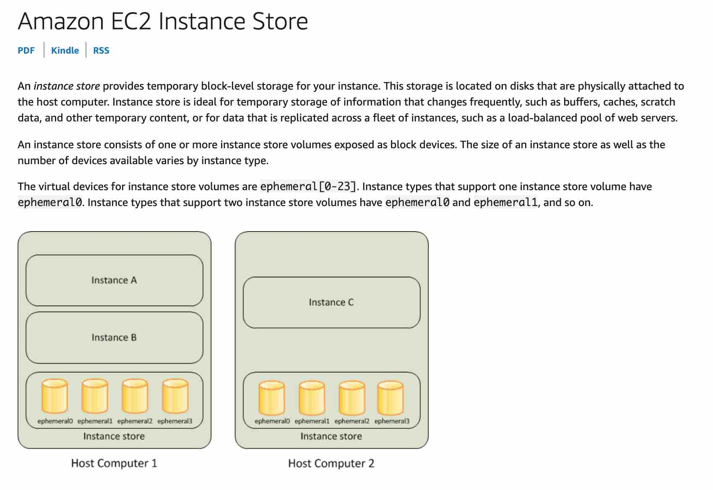


### 总结

**Instance Store 是正确答案**，因为：

1. **完美匹配需求** - 高随机 I/O 性能
2. **零额外成本** - 包含在实例价格中
3. **架构互补** - 应用处理数据持久性，存储只需提供高性能
4. **资源效率最高** - 没有任何浪费的功能或成本

这是一个典型的"**不要过度工程化**"的例子 - 当应用层已经解决了数据持久性问题时，存储层只需要提供原始性能即可。


## AWS 高速缓存服务的数据持久化机制详解


|           **服务名称**           | 服务定位              |                        数据持久化方式                        |                        核心持久化特点                        |                           适用场景                           |
| :------------------------------: | :-------------------- | :----------------------------------------------------------: | :----------------------------------------------------------: | :----------------------------------------------------------: |
|  **Amazon MemoryDB for Redis**   | 兼容Redis的内存数据库 | - **事务日志**：所有内存数据操作都同步写入一个基于多可用区架构的**持久化事务日志** 。 - **数据备份**：支持快照备份，可存储在Amazon S3中 。 | 数据**强一致性**，写入操作仅在事务日志完成后才向客户端返回成功，兼具内存性能与数据持久性 。 |      需要兼具极高读写性能和数据持久性的**主数据库** 。       |
| **Amazon ElastiCache for Redis** | 内存缓存服务          | - **快照备份**：定期将内存数据快照保存到S3 。 - **仅追加文件 (AOF)**：部分版本支持，记录每个写操作。 | **最终一致性**模型，通过**多可用区部署**和**自动故障转移**实现高可用，但可能丢失故障前最后一小部分数据 。 |    典型的**缓存层**，加速数据访问，减轻后端数据库压力 。     |
|      **缓存与存储组合方案**      | 缓存加速文件/对象存储 | - **分层存储**：将缓存层（如GPTCache、Amazon File Cache）与持久化存储层（如Amazon S3）结合 。 - **数据同步**：缓存层处理热点数据，持久化存储层确保数据最终落盘。 |         兼顾高速访问与大容量持久化存储，成本效益高。         | AI/ML训练 、大数据分析 、媒体处理 等需要处理海量数据的场景。 |

### 一、缓存服务持久化能力总览

```
┌─────────────────────────────────────────────────────────┐
│              AWS 缓存服务持久化能力对比                   │
├─────────────────────────────────────────────────────────┤
│                                                         │
│   ElastiCache Redis     ████████████  完全支持           │
│                        RDB快照 + AOF日志                 │
│                                                         │
│   ElastiCache Memcached ██  不支持                       │
│                        纯内存，重启丢失                   │
│                                                         │
│   DAX (DynamoDB加速器)  ████████████  透传持久化          │
│                        自动同步到DynamoDB                │
│                                                         │
│   CloudFront           ██████  TTL过期机制               │
│                        源站是持久化存储                   │
│                                                         │
└─────────────────────────────────────────────────────────┘
```


## 二、ElastiCache for Redis 持久化架构

### 2.1 RDB 快照机制

```
           Redis 集群 RDB 快照流程
    
    ┌─────────────────────────────────────┐
    │         Redis 主节点内存             │
    │   ┌────────────────────────┐        │
    │   │  用户数据 (实时更新)     │        │
    │   │  • 键值对               │        │
    │   │  • 列表/集合/哈希       │        │
    │   │  • 有序集合             │        │
    │   └────────────────────────┘        │
    └──────────────┬──────────────────────┘
                   │
                   ↓ 定时触发（例如：每小时）
         ┌─────────────────────┐
         │   创建子进程快照      │
         │  (不影响主进程服务)   │
         └─────────┬───────────┘
                   │
                   ↓ 生成 RDB 文件
         ┌─────────────────────┐
         │    临时 RDB 文件      │
         │   (完整内存镜像)      │
         └─────────┬───────────┘
                   │
                   ↓ 上传
    ┌──────────────────────────────────────┐
    │            Amazon S3                 │
    │  ┌──────────┐ ┌──────────┐           │
    │  │快照-Day1 │  │快照-Day2 │ ...       │
    │  └──────────┘ └──────────┘           │
    │      保留策略：最近7天                 │
    └──────────────────────────────────────┘
```

**RDB 快照特点说明：**

- **触发方式**：可设置自动触发规则（如每小时、每天）或手动触发
- **性能影响**：使用 fork 创建子进程，主进程继续服务，影响极小
- **恢复速度**：快照文件直接加载到内存，恢复速度快
- **数据完整性**：某个时间点的完整数据镜像

### 2.2 AOF 日志持久化

```
           Redis AOF 持久化架构
    
    客户端写入命令
         ↓
    ┌────────────────────────────────────┐
    │          Redis 主进程               │
    │  ┌──────────────────────────────┐  │
    │  │     执行命令并返回结果         │  │
    │  └──────────────────────────────┘  │
    └─────────────┬──────────────────────┘
                  │
                  ↓ 同时
    ┌────────────────────────────────────┐
    │        AOF 缓冲区                   │
    │   记录每个写命令                     │
    └─────────────┬──────────────────────┘
                  │
                  ↓ 根据同步策略
    ┌────────────────────────────────────┐
    │          同步策略选择               │
    ├────────────────────────────────────┤
    │                                    │
    │  总是同步    ███ 最安全/最慢        │
    │  每秒同步    ████████ 平衡          │
    │  系统决定    ████████████ 最快      │
    │                                    │
    └─────────────┬──────────────────────┘
                  │
                  ↓ 写入磁盘
    ┌────────────────────────────────────┐
    │         AOF 日志文件                │
    │  ┌──────────────────────────────┐  │
    │  │ SET user:1 "张三"            │  │
    │  │ INCR view_count              │  │
    │  │ LPUSH queue "task1"          │  │
    │  │ ZADD rank 100 "player1"      │  │
    │  │ ...                          │  │
    │  └──────────────────────────────┘  │
    │       文件会定期重写压缩             │
    └────────────────────────────────────┘
```

**AOF 持久化说明：**

- **实时性**：每个写操作都记录，数据丢失风险最小
- **文件大小**：随时间增长，需要定期重写压缩
- **恢复过程**：重放所有命令，恢复时间较长
- **灵活性**：可选择不同的同步频率平衡性能和安全

### 2.3 混合持久化模式

```
        Redis 6.0+ 混合持久化架构
    
    ┌──────────────────────────────────────┐
    │          混合持久化策略               │
    └──────────────────────────────────────┘
                     │
        ┌────────────┴────────────┐
        ↓                         ↓
    基础部分                   增量部分
        │                         │
    ┌──────────┐            ┌──────────┐
    │   RDB    │            │   AOF    │
    │ 快照文件  │            │ 增量日志  │
    │          │            │          │
    │ 每日一次  │            │ 实时记录  │
    │ 2GB数据  │             │ 100MB    │
    └──────────┘            └──────────┘
         ↓                        ↓
         └────────┬───────────────┘
                  ↓
    ┌──────────────────────────────────────┐
    │            恢复流程                   │
    │  1. 先加载 RDB (快速恢复基础数据)      │
    │  2. 再重放 AOF (应用增量更新)          │
    │  3. 总恢复时间大幅缩短                 │
    └──────────────────────────────────────┘
```

## 三、DAX 写透传持久化机制

```
          DAX 自动持久化架构
    
    应用程序写入请求
           ↓
    ┌─────────────────────────────────┐
    │          DAX 集群                │
    │  ┌──────────────────────────┐   │
    │  │    内存缓存层             │   │
    │  │  • 微秒级延迟             │   │
    │  │  • 10倍性能提升           │   │
    │  └──────────────────────────┘   │
    └──────────────┬──────────────────┘
                   │ 
                   ↓ 同步写入（写透传）
    ┌─────────────────────────────────┐
    │         DynamoDB 表             │
    │  ┌──────────────────────────┐   │
    │  │    持久化存储层           │   │
    │  │  • 自动多AZ复制           │   │
    │  │  • 99.999%持久性         │    │
    │  └──────────────────────────┘   │
    └─────────────────────────────────┘
    
    读取流程:
    1. 先查 DAX 缓存 (命中则直接返回)
    2. 未命中则查 DynamoDB
    3. 结果自动缓存到 DAX
```

**DAX 持久化特点：**

- **透明性**：应用无需关心持久化逻辑
- **一致性**：写入立即持久化到 DynamoDB
- **自动恢复**：DAX 节点故障后自动从 DynamoDB 重建缓存
- **零数据丢失**：所有数据都在 DynamoDB 中持久保存

## 四、Memcached 无持久化解决方案

```
       Memcached 伪持久化架构
    
    ┌────────────────────────────────┐
    │         应用程序                │
    └────────────┬───────────────────┘
                 │
         双写策略 ├──────────┐
                 ↓          ↓
    ┌─────────────────┐ ┌─────────────────┐
    │   Memcached     │ │   持久层         │
    │  ┌──────────┐   │ │  ┌──────────┐   │
    │  │ 纯内存    │   │ │  │DynamoDB/ │   │
    │  │ 高速缓存  │   │ │  │RDS/S3    │   │
    │  └──────────┘   │ │  └──────────┘   │
    │   重启丢失 ❌   │ │   永久保存 ✓     │
    └─────────────────┘ └─────────────────┘
    
    恢复流程:
    Memcached重启 → 缓存为空 → 从持久层重新加载
```

## 五、多层缓存架构设计

```
         企业级多层缓存持久化架构
    
    ┌──────────────────────────────────────┐
    │            用户请求                   │
    └──────────────┬───────────────────────┘
                   ↓
    ┌──────────────────────────────────────┐
    │     L1: CloudFront (边缘缓存)         │
    │     • 全球分布                        │
    │     • TTL: 5分钟                      │
    └──────────────┬───────────────────────┘
                   ↓ 未命中
    ┌──────────────────────────────────────┐
    │     L2: ElastiCache Redis (热数据)    │
    │     • 毫秒级延迟                      │
    │     • AOF每秒持久化                   │
    │     • 保存最近24小时数据               │
    └──────────────┬───────────────────────┘
                   ↓ 未命中
    ┌──────────────────────────────────────┐
    │     L3: DynamoDB (温数据)             │
    │     • 自动持久化                      │
    │     • 保存最近30天数据                │
    └──────────────┬───────────────────────┘
                   ↓ 未命中
    ┌──────────────────────────────────────┐
    │     L4: S3 (冷数据归档)               │
    │     • 永久保存                        │
    │     • 成本最低                        │
    └──────────────────────────────────────┘
```

## 六、高可用与灾难恢复

### 6.1 Redis Multi-AZ 自动故障转移

```
       Redis 多可用区高可用架构
    
    正常状态:
    ┌─────────────────────────────────────┐
    │          可用区 A                    │
    │  ┌────────────────────┐             │
    │  │  Redis 主节点       │             │
    │  │  持久化: RDB+AOF    │◄───读写──── │ 应用
    │  └────────┬───────────┘             │
    └───────────┼─────────────────────────┘
                │ 异步复制
    ┌───────────┼─────────────────────────┐
    │     可用区 B/C                       │
    │  ┌────────▼───────────┐             │
    │  │  Redis 副本节点     │◄───只读──── │
    │  │  实时同步数据       │             │
    │  └────────────────────┘             │
    └─────────────────────────────────────┘
    
    故障转移 (30秒内自动完成):
    主节点故障 → 检测(5秒) → 选举新主(10秒) → 
    DNS切换(5秒) → 服务恢复
```

### 6.2 全球数据同步

```
         Redis Global Datastore
    
    ┌──────────────────────────────────┐
    │     主区域 (美国东部)              │
    │   ┌──────────────────┐            │
    │   │  主集群           │            │
    │   │  完整读写能力     │            │
    │   └────────┬─────────┘            │
    └────────────┼──────────────────────┘
                 │ 跨区域复制 (<1秒)
      ┌──────────┼──────────┬────────────┐
      ↓          ↓          ↓            ↓
┌──────────┐ ┌──────────┐ ┌──────────┐ ┌──────────┐
│ 欧洲      ││ 亚太      │ │ 中国     │ │ 南美      │
│ 只读副本  │ │ 只读副本 │ │ 只读副本  │ │ 只读副本  │
│ 本地读取  │ │ 本地读取 │ │ 本地读取  │ │ 本地读取  │
└──────────┘ └──────────┘ └──────────┘ └──────────┘

优势: 全球用户都能获得 <10ms 的读取延迟
```

## 七、性能与成本权衡

```
    持久化策略对性能的影响
    
    性能 ↑
    100% ┤ Memcached (无持久化)
         │ ████████████████████
     90% ┤ Redis RDB (每日快照)
         │ ██████████████████
     80% ┤ Redis AOF 每秒
         │ ████████████████
     70% ┤ DAX + DynamoDB
         │ ██████████████
     40% ┤ Redis AOF 总是同步
         │ ████████
         └────────────────────────
           低 ←  数据安全性  → 高
    
    月成本对比 (1TB数据，3节点集群):
    
    Memcached        ████ $450
    Redis+RDB        █████ $473  
    Redis+AOF        █████ $530
    DAX+DynamoDB     ███ $340
    Redis全球复制     ████████████ $1,200
```

## 八、应用场景最佳实践

### 场景选择指南

```
┌────────────────────────────────────────────┐
│           缓存持久化方案选择树               │
└────────────────────────────────────────────┘
                    │
         数据可以丢失吗？
           /            \
         是/             \否
          ↓               ↓
     Memcached      需要复杂数据结构？
     (最高性能)        /          \
                     是/           \否
                      ↓             ↓
                Redis+持久化    使用DynamoDB？
                     │            /        \
              数据重要性？       是/         \否
              /    |    \        ↓           ↓
            高/   中|    \低     DAX      Redis
             ↓     ↓      ↓               基础版
         AOF总是  AOF每秒  RDB
```

### 典型应用配置建议

**电商购物车系统**

- 缓存层：Redis
- 持久化：AOF 每秒同步
- 备份：每6小时 RDB 快照
- 过期策略：7天自动清理

**金融交易系统**

- 缓存层：Redis 集群
- 持久化：AOF 总是同步
- 高可用：Multi-AZ 自动故障转移
- 备份：实时复制到备份区域

**游戏排行榜**

- 缓存层：Redis Sorted Set
- 持久化：RDB 每小时快照
- 读取分离：多个只读副本
- 归档：每日导出到 S3

**IoT 数据采集**

- 缓冲层：Redis Streams
- 持久化：AOF 每秒 + RDB 每日
- 处理后：归档到 S3 Glacier
- 清理：7天后自动删除

## 九、总结与建议

### 核心要点

**持久化能力排序**

1. **DynamoDB + DAX** - 自动持久化，最省心
2. **Redis AOF** - 实时持久化，可调节
3. **Redis RDB** - 定期快照，性能好
4. **Memcached** - 无持久化，需外部方案

### 选择建议

**当您需要：**

- **极致性能** → Memcached（接受数据丢失）
- **平衡方案** → Redis + AOF 每秒
- **金融级安全** → Redis + AOF 总是同步
- **全球分布** → Redis Global Datastore
- **最简单方案** → DAX + DynamoDB

### 对 WCS 系统的建议

1. AGV 控制指令缓存
   - 使用 Redis + AOF 每秒同步
   - 确保指令不丢失但保持高性能
2. PLC 实时数据
   - Redis 做缓冲，RDB 每小时备份
   - 历史数据定期归档到 S3
3. 系统配置信息
   - DynamoDB 持久存储
   - DAX 加速读取
4. 临时计算结果
   - Memcached 纯内存缓存
   - 可随时重新计算

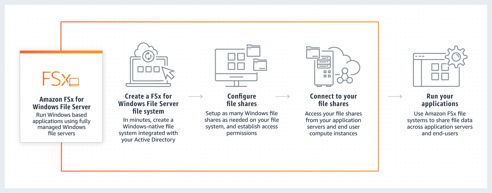


唯一能够让公司在本地完全运行与 Amazon EKS 兼容的 Kubernetes 集群，同时保持数据完整驻留并符合监管要求的方案。

AWS Outposts Rack 将 EKS、EC2、S3 和 CloudWatch 等原生 AWS 服务引入客户的本地数据中心。Amazon EKS Anywhere 是 Amazon Elastic Kubernetes Service (EKS) 的一种部署选项，允许您在自己的基础设施（例如本地服务器或边缘位置，即 AWS 之外）上创建和管理 Kubernetes 集群。借助在 Outposts 上运行的 EKS Anywhere，公司可以使用熟悉的 AWS 工具对其 Kubernetes 堆栈进行现代化改造，而无需将任何数据发送到云端。

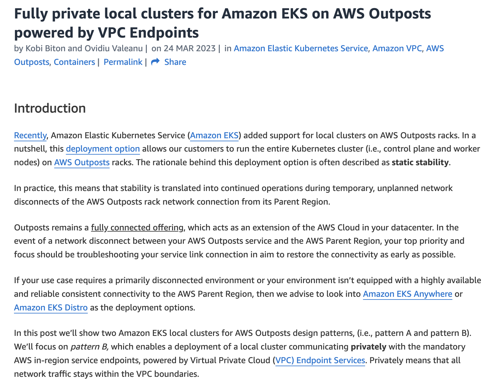


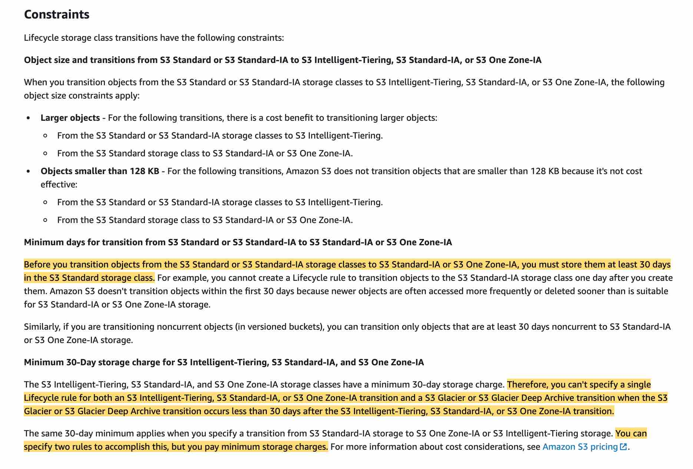