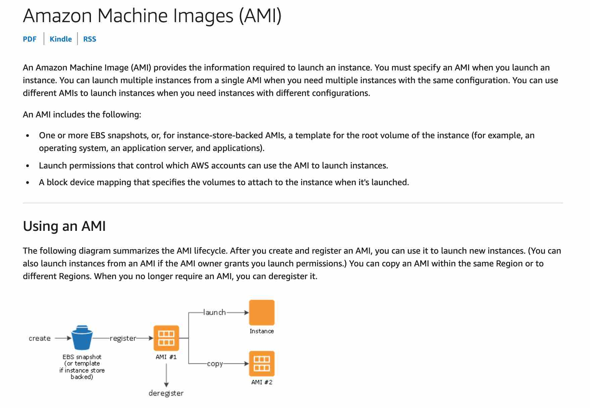
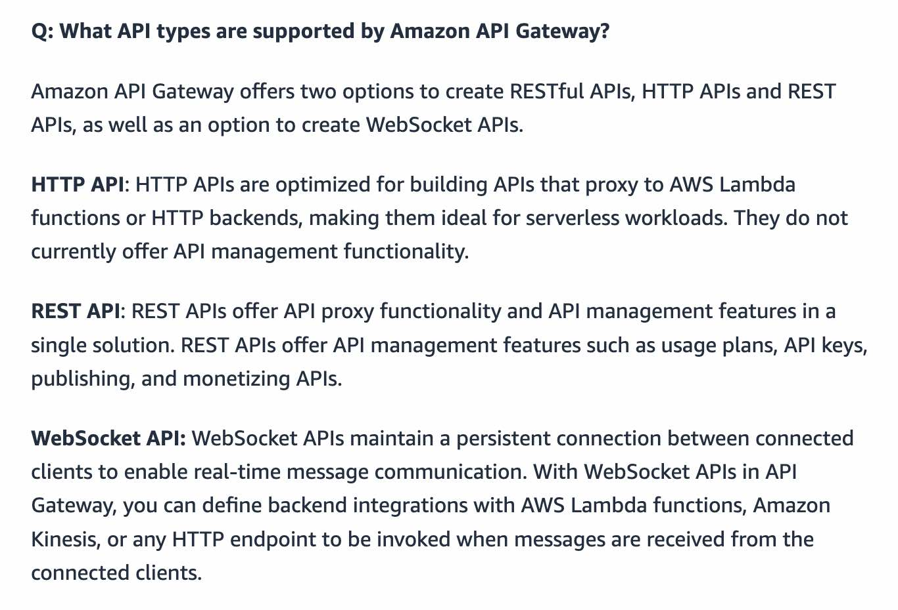
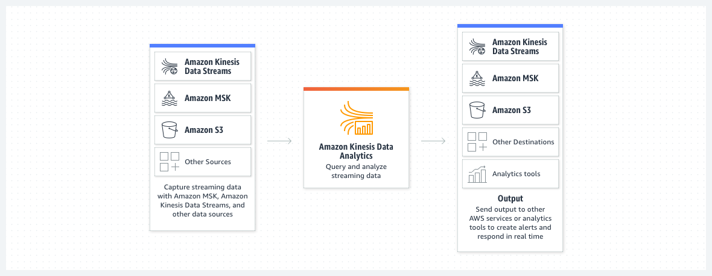
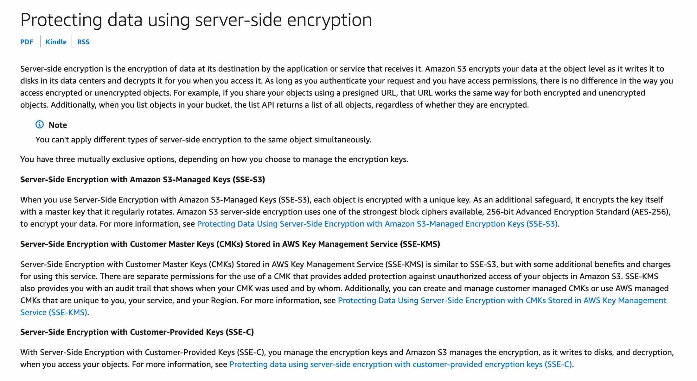
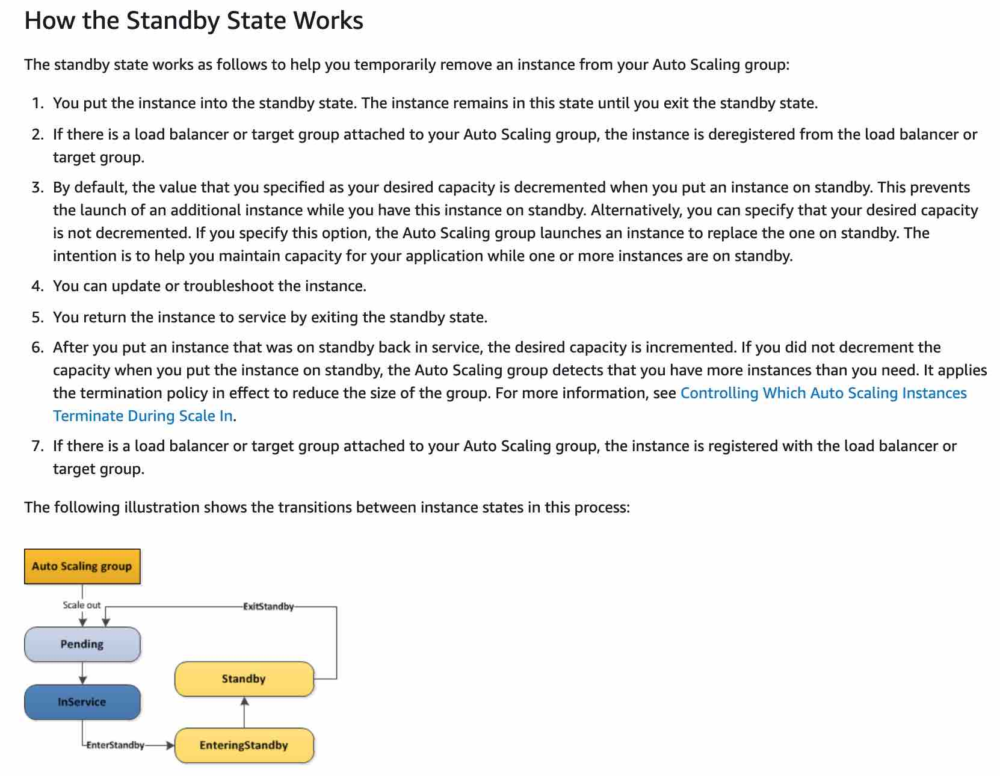
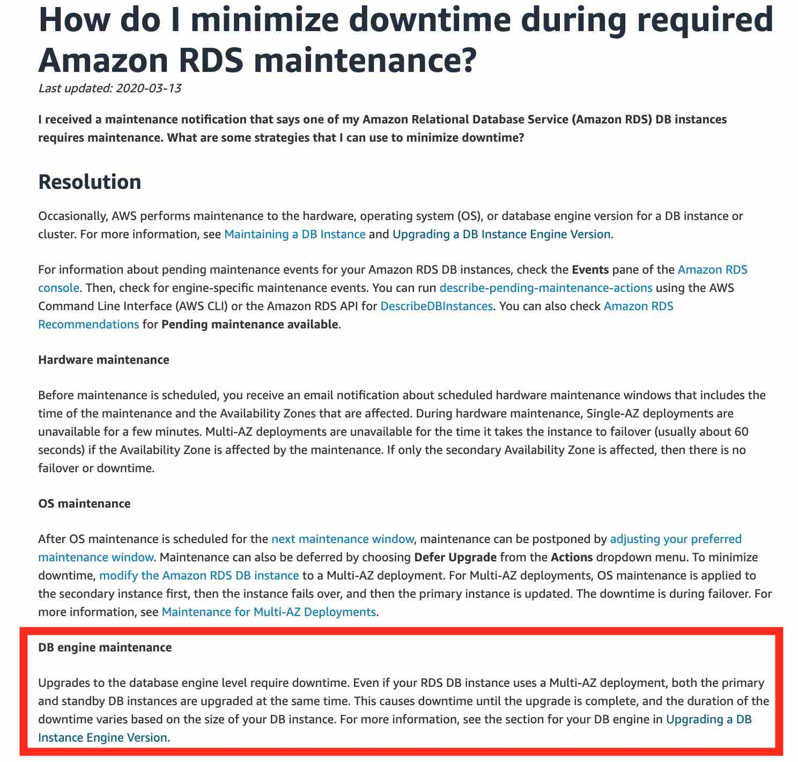
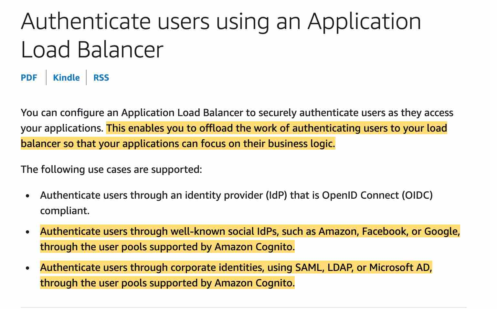

# AWS训练错题2

## Amazon FSx for Windows vs FSx for Lustre vs EMR 详细对比

### 一、服务定位与本质区别

```
         三个服务的本质定位
    
    ┌──────────────────────────────────────┐
    │      服务类型金字塔                   │
    ├──────────────────────────────────────┤
    │                                      │
    │   文件存储服务                        │
    │   ┌─────────────┬─────────────┐      │
    │   │FSx Windows  │ FSx Lustre  │      │
    │   │ 企业文件共享 │ HPC并行文件  │      │
    │   └─────────────┴─────────────┘      │
    │                                      │
    │   计算处理服务                        │
    │   ┌──────────────────────────┐       │
    │   │       Amazon EMR         │       │
    │   │   大数据处理平台          │       │
    │   └──────────────────────────┘       │
    │                                      │
    └──────────────────────────────────────┘
    
    根本区别：
    • FSx = 文件系统（存储）
    • EMR = 计算集群（处理）
```

### 二、架构对比

#### 2.1 FSx for Windows File Server 架构

```
       FSx for Windows 架构
    
    ┌──────────────────────────────────────┐
    │         Active Directory             │
    │         (AWS Managed/自建)           │
    └─────────────┬────────────────────────┘
                  │ 身份认证
    ┌─────────────▼────────────────────────┐
    │    FSx for Windows File Server       │
    │  ┌──────────────────────────────┐    │
    │  │     Windows Server 2019      │    │
    │  │  ┌──────────────────────┐    │    │
    │  │  │   SMB 协议 (2.0-3.1.1)│   │     │
    │  │  │   NTFS 文件系统       │    │    │
    │  │  │   DFS 命名空间        │    │    │
    │  │  └──────────────────────┘    │    │
    │  └──────────────────────────────┘    │
    ├──────────────────────────────────────┤
    │         存储层                        │
    │  ┌─────────┐  ┌─────────┐            │
    │  │  SSD    │  │  HDD    │            │
    │  │ 低延迟  │  │ 大容量  │             │
    │  └─────────┘  └─────────┘            │
    └──────────────────────────────────────┘
                  │
         ┌────────┼────────┐
         ▼        ▼        ▼
    ┌────────┐ ┌────────┐ ┌────────┐
    │Windows │ │ Linux  │ │  Mac   │
    │ 客户端  │ │ (CIFS) │ │ 客户端 │
    └────────┘ └────────┘ └────────┘
```


###本质理解：FSx for Windows不只是虚拟机上的 Windows Server

```
        FSx for Windows 真实架构
    
    ❌ 错误理解：
    ┌─────────────────────────────┐
    │  EC2 虚拟机                  │
    │  + Windows Server           │
    │  + 手动配置文件共享          │
    └─────────────────────────────┘
    
    ✅ 实际架构：
    ┌─────────────────────────────────────┐
    │      AWS 完全托管服务层               │
    ├─────────────────────────────────────┤
    │  • 自动化管理                        │
    │  • 高可用集群                        │
    │  • 自动备份                          │
    │  • 性能优化                          │
    │  • 安全加固                          │
    └──────────────┬──────────────────────┘
                   │
    ┌──────────────▼──────────────────────┐
    │     Windows Server 核心              │
    │  (AWS 深度优化和定制版本)             │
    ├─────────────────────────────────────┤
    │  • Windows Server 2019/2022         │
    │  • 预配置的文件服务                   │
    │  • 优化的存储驱动                     │
    │  • AWS 集成组件                      │
    └──────────────┬──────────────────────┘
                   │
    ┌──────────────▼──────────────────────┐
    │      AWS 基础设施层                  │
    │  • 专用硬件                          │
    │  • 企业级 SAN 存储                   │
    │  • 冗余网络                          │
    └─────────────────────────────────────┘
```

### 二、FSx vs 自建 Windows 文件服务器对比

```
          关键差异对比
    
    自建 Windows Server:              FSx for Windows:
    ┌──────────────────┐             ┌──────────────────┐
    │ 需要：            │             │ 自动提供：        │
    │ • 购买许可证      │             │ • 许可证包含      │
    │ • 安装配置       │             │ • 预配置完成       │
    │ • 性能调优       │             │ • AWS 优化        │
    │ • 补丁管理       │             │ • 自动更新        │
    │ • 备份策略       │             │ • 自动备份        │
    │ • 高可用设计      │             │ • Multi-AZ HA    │
    │ • 容量规划       │             │ • 弹性扩展        │
    │ • 监控告警       │             │ • CloudWatch集成  │
    └──────────────────┘             └──────────────────┘
    
    管理负担：90%                     管理负担：10%
    
    TCO (3年):                       TCO (3年):
    $150,000+                        $50,000
    (包含人力成本)                     (仅服务费用)
```

### 三、FSx 托管服务的技术栈

```
       FSx for Windows 完整技术栈
    
    ┌─────────────────────────────────────┐
    │         管理控制平面                 │
    │   AWS Console / API / CLI / SDK     │
    └──────────────┬──────────────────────┘
                   │
    ┌──────────────▼──────────────────────┐
    │         服务编排层                   │
    ├─────────────────────────────────────┤
    │ • 自动化部署引擎                     │
    │ • 配置管理系统                       │
    │ • 健康检查和自愈                     │
    │ • 性能监控和调优                     │
    └──────────────┬──────────────────────┘
                   │
    ┌──────────────▼──────────────────────┐
    │      Windows Server 层              │
    ├─────────────────────────────────────┤
    │ 核心组件:                            │
    │ • File Server 角色                  │
    │ • DFS Namespaces                    │
    │ • DFS Replication                   │
    │ • Data Deduplication                │
    │ • Volume Shadow Copy                │
    │ • Storage Spaces Direct (S2D)       │
    └──────────────┬──────────────────────┘
                   │
    ┌──────────────▼──────────────────────┐
    │         存储抽象层                   │
    ├─────────────────────────────────────┤
    │ • AWS 优化的存储驱动                 │
    │ • 智能分层 (SSD/HDD)                 │
    │ • 数据条带化                         │
    │ • 预读取优化                         │
    └──────────────┬──────────────────────┘
                   │
    ┌──────────────▼──────────────────────┐
    │      物理存储层                      │
    │  • 企业级 SSD/HDD 阵列               │
    │  • RAID 保护                         │
    │  • 多路径 I/O                        │
    └─────────────────────────────────────┘
```


#### 2.2 FSx for Lustre 架构

```
         FSx for Lustre 架构
    
    ┌──────────────────────────────────────┐
    │       FSx for Lustre 集群            │
    ├──────────────────────────────────────┤
    │   元数据服务器 (MDS)                  │
    │   ┌──────────────────────────────┐   │
    │   │  文件名、权限、位置信息        │   │
    │   │  高速 SSD 存储                │   │
    │   └──────────────────────────────┘   │
    ├──────────────────────────────────────┤
    │   对象存储服务器 (OSS)                 │
    │   ┌─────┐ ┌─────┐ ┌─────┐ ┌─────┐    │
    │   │OSS1 │ │OSS2 │ │OSS3 │ │OSS4 │    │
    │   └─────┘ └─────┘ └─────┘ └─────┘    │
    │   并行数据条带化存储                   │
    ├──────────────────────────────────────┤
    │         可选 S3 集成                  │
    │   ┌──────────────────────────────┐   │
    │   │  S3 数据仓库 (导入/导出)      │   │
    │   └──────────────────────────────┘   │
    └──────────────────────────────────────┘
                  │ POSIX 客户端
         ┌────────┼────────┐
         ▼        ▼        ▼
    ┌────────┐ ┌────────┐ ┌────────┐
    │ HPC    │ │机器学习 │ │ 媒体   │
    │ 计算   │ │ 训练    │ │ 渲染   │
    └────────┘ └────────┘ └────────┘
```

#### 2.3 Amazon EMR 架构

```
          Amazon EMR 集群架构
    
    ┌──────────────────────────────────────┐
    │         主节点 (Master)               │
    │  ┌──────────────────────────────┐    │
    │  │  • ResourceManager (YARN)    │    │
    │  │  • NameNode (HDFS)           │    │
    │  │  • Spark Driver              │    │
    │  │  • Hive Metastore            │    │
    │  └──────────────────────────────┘    │
    └─────────────┬────────────────────────┘
                  │
    ┌─────────────▼────────────────────────┐
    │         核心节点 (Core)               │
    │  ┌─────┐ ┌─────┐ ┌─────┐ ┌─────┐     │
    │  │Node1│ │Node2│ │Node3│ │Node4│     │
    │  └─────┘ └─────┘ └─────┘ └─────┘     │
    │  • DataNode (HDFS存储)               │
    │  • NodeManager (YARN)                │
    │  • 任务执行器                         │
    └──────────────────────────────────────┘
                  │
    ┌─────────────▼────────────────────────┐
    │         任务节点 (Task) - 可选        │
    │  ┌─────┐ ┌─────┐ ┌─────┐             │
    │  │Task1│ │Task2│ │Task3│             │
    │  └─────┘ └─────┘ └─────┘             │
    │  • 只计算，不存储                     │
    │  • 可使用 Spot 实例                   │
    └──────────────────────────────────────┘
                  │
    ┌─────────────▼────────────────────────┐
    │           数据源                      │
    │  ┌──────┐ ┌──────┐ ┌──────┐          │
    │  │  S3  │ │ HDFS │ │ RDS  │          │
    │  └──────┘ └──────┘ └──────┘          │
    └──────────────────────────────────────┘
```

### 三、使用场景对比

```
            典型使用场景矩阵
    
    ┌────────────────────────────────────────┐
    │        FSx for Windows                 │
    ├────────────────────────────────────────┤
    │ ✓ 企业文件共享                          │
    │ ✓ 用户主目录                            │
    │ ✓ 内容管理系统                          │
    │ ✓ Web 服务内容存储                      │
    │ ✓ Windows 应用数据                      │
    │ ✓ SQL Server 备份                      │
    │ ✓ 开发团队共享                          │
    └────────────────────────────────────────┘
    
    ┌────────────────────────────────────────┐
    │        FSx for Lustre                  │
    ├────────────────────────────────────────┤
    │ ✓ 高性能计算 (HPC)                      │
    │ ✓ 机器学习训练                          │
    │ ✓ 基因组学分析                          │
    │ ✓ 金融建模                              │
    │ ✓ 视频渲染                              │
    │ ✓ 电子设计自动化 (EDA)                  │
    │ ✓ 地震数据处理                          │
    └────────────────────────────────────────┘
    
    ┌────────────────────────────────────────┐
    │        Amazon EMR                      │
    ├────────────────────────────────────────┤
    │ ✓ 日志分析                             │
    │ ✓ ETL 数据管道                         │
    │ ✓ 实时流处理                           │
    │ ✓ 数据仓库                             │
    │ ✓ 机器学习模型训练                      │
    │ ✓ 基因组测序                           │
    │ ✓ 广告分析                             │
    └────────────────────────────────────────┘
```

### 四、性能特征对比

```
           性能指标对比图
    
    吞吐量 (GB/s)
    1000 ┤ 
     100 ┤ ████ FSx Lustre (100-1000 GB/s)
      10 ┤ 
       1 ┤ ██ FSx Windows (2-10 GB/s)
     0.1 ┤
         └──────────────────────────────
    
    IOPS (百万)
      10 ┤ ████ FSx Lustre (百万级)
       1 ┤ 
     0.1 ┤ ██ FSx Windows (10万级)
    0.01 ┤
         └──────────────────────────────
    
    延迟 (ms)
     100 ┤ 
      10 ┤ ██ EMR (网络延迟)
       1 ┤ █ FSx Windows (1-3ms)
     0.1 ┤ ▌FSx Lustre (亚毫秒)
         └──────────────────────────────
    
    并发连接数
   10000 ┤ ████ EMR (上万节点)
    1000 ┤ ███ FSx Lustre (数千客户端)
     100 ┤ ██ FSx Windows (数百连接)
      10 ┤
         └──────────────────────────────
```

### 五、存储层级与协议

```
        文件系统协议栈对比
    
    FSx for Windows:
    ┌────────────────────┐
    │   SMB/CIFS 协议    │ ← Windows 原生
    ├────────────────────┤
    │   NTFS 文件系统    │ ← ACL权限控制
    ├────────────────────┤
    │   重复数据删除      │ ← 节省空间
    ├────────────────────┤
    │   SSD/HDD 存储     │
    └────────────────────┘
    
    FSx for Lustre:
    ┌────────────────────┐
    │   POSIX 兼容       │ ← Linux 原生
    ├────────────────────┤
    │  Lustre 文件系统   │ ← 并行 I/O
    ├────────────────────┤
    │   数据条带化        │ ← 高吞吐
    ├────────────────────┤
    │   NVMe SSD        │
    └────────────────────┘
    
    EMR (存储选项):
    ┌────────────────────┐
    │   多种存储接口      │
    ├────────────────────┤
    │ • HDFS (临时)      │
    │ • S3 (持久化)      │
    │ • EBS (本地)       │
    │ • FSx 集成         │
    └────────────────────┘
```


## FSx架构工作原理

```
✅ 你的理解完全正确！

前端体验：就像打开 Windows 文件夹
     ↓
传输协议：SMB/CIFS (不是 API)
     ↓  
后端实现：AWS 托管的特制 Windows Server
```

### 二、详细的数据流架构

```
        FSx 实际工作原理
    
    你的电脑上看到的：
    ┌─────────────────────────────────────┐
    │        Windows 资源管理器            │
    │  ┌───────────────────────────────┐  │
    │  │ 📁 本地磁盘 (C:)              │  │
    │  │ 📁 本地磁盘 (D:)               │  │
    │  │ 📁 网络位置                    │  │
    │  │   └─ 📁 FSx共享 (Z:)  ←──────┼──┼─ 看起来就是个文件夹！
    │  │       ├─ 📁 Documents         │  │
    │  │       ├─ 📁 Projects          │  │
    │  │       └─ 📄 Report.xlsx       │  │
    │  └───────────────────────────────┘  │
    └─────────────────────────────────────┘
                    ↓
                    ↓ 双击打开时
                    ↓
    ┌─────────────────────────────────────┐
    │         Windows 操作系统             │
    │                                     │
    │  SMB 客户端：                        │
    │  "用户要访问 Z:\Documents"           │
    │  → 转换为 SMB 协议请求                │
    │  → 目标: \\fs-0123456.ad.local       │
    └──────────────┬──────────────────────┘
                   │
                   ↓ SMB 协议（端口 445）
                   ↓ 注意：这不是 HTTP API！
                   ↓
    ┌──────────────▼──────────────────────┐
    │            网络传输                  │
    │  通过 VPC 网络 或 VPN/Direct Connect │
    └──────────────┬──────────────────────┘
                   │
                   ↓ SMB 请求到达 FSx
                   ↓
    ┌──────────────▼──────────────────────┐
    │      FSx for Windows Service        │
    │  ┌───────────────────────────────┐  │
    │  │   AWS 托管的 Windows Server   │   │
    │  │                               │  │
    │  │  SMB 服务器：                  │  │
    │  │  "收到请求：读取 Documents"    │  │
    │  │  → 验证 AD 权限                │  │
    │  │  → 读取存储数据                │  │
    │  │  → 返回文件内容                │  │
    │  └───────────────────────────────┘  │
    │                                     │
    │  底层存储：                          │
    │  • AWS 优化的块存储                  │
    │  • 自动复制和备份                    │
    └─────────────────────────────────────┘
```

### 三、协议层次详解

```
        协议栈分层
    
    应用层（你的操作）:
    ┌─────────────────────────────────────┐
    │  • 双击文件夹                        │
    │  • 拖放文件                          │
    │  • Ctrl+C/Ctrl+V                    │
    │  • 右键菜单                          │
    └──────────────┬──────────────────────┘
                   │
    文件系统层:    ↓
    ┌─────────────────────────────────────┐
    │  Windows Shell / Explorer.exe       │
    │  "用户想要打开 Z:\Documents"         │
    └──────────────┬──────────────────────┘
                   │
    系统调用层:    ↓
    ┌─────────────────────────────────────┐
    │  Windows I/O Manager                │
    │  CreateFile(), ReadFile(), etc.     │
    └──────────────┬──────────────────────┘
                   │
    网络重定向层:  ↓
    ┌─────────────────────────────────────┐
    │  SMB Redirector (mrxsmb.sys)        │
    │  "这是网络路径，使用 SMB 协议"        │
    └──────────────┬──────────────────────┘
                   │
    协议层:        ↓
    ┌─────────────────────────────────────┐
    │  SMB 3.1.1 Protocol                 │
    │  • 协商连接                          │
    │  • 身份认证 (Kerberos)               │
    │  • 加密传输 (AES-128-GCM)            │
    └──────────────┬──────────────────────┘
                   │
    网络层:        ↓
    ┌─────────────────────────────────────┐
    │  TCP/IP (Port 445)                  │
    │  → 目标: FSx DNS 名称                │
    └─────────────────────────────────────┘
```

### 四、SMB 协议 vs API 的区别

```
        SMB 协议 vs REST API 对比
    
    文件访问用 SMB:                  服务管理用 API:
    ┌──────────────────┐             ┌──────────────────┐
    │  SMB/CIFS 协议   │             │  AWS API         │
    │                  │             │                  │
    │  用途:           │             │  用途:            │
    │  • 读写文件      │             │  • 创建文件系统    │
    │  • 浏览目录      │             │  • 调整容量        │
    │  • 设置权限      │             │  • 配置备份        │
    │                  │             │                  │
    │  例子:           │             │  例子:            │
    │  打开文件夹时     │             │  在AWS Console    │
    │  ↓               │             │  点击"创建"按钮   │
    │  SMB: TREE_CONNECT             │  ↓               │
    │  请求连接到共享   │             │  API: CreateFileSystem
    │  ↓               │             │  创建新FSx实例    │
    │  SMB: CREATE     │             │                  │
    │  打开文件/目录    │             │                  │
    └──────────────────┘             └──────────────────┘
    
    关键区别：
    SMB = 数据平面（访问数据）
    API = 控制平面（管理服务）
```

### 五、实际操作示例

```
        从双击到数据返回的完整过程
    
    Step 1: 用户双击 "Z:\Projects"
    ────────────────────────────────
    Windows Explorer
         ↓
    "用户要访问 Z:\Projects"
    
    Step 2: Windows 检查路径类型
    ────────────────────────────────
    Z:\ = 网络驱动器
         ↓
    映射到 \\fs-0123456\share\Projects
    
    Step 3: SMB 协议协商
    ────────────────────────────────
    客户端 → FSx: SMB2_NEGOTIATE
    FSx → 客户端: "我支持 SMB 3.1.1"
    
    Step 4: 身份验证
    ────────────────────────────────
    客户端 → FSx: SMB2_SESSION_SETUP
    包含: Kerberos票据 (来自AD)
    FSx → 客户端: "验证通过"
    
    Step 5: 连接到共享
    ────────────────────────────────
    客户端 → FSx: SMB2_TREE_CONNECT
    请求: 连接到 \share\Projects
    FSx → 客户端: "连接成功，Tree ID: 0x0001"
    
    Step 6: 读取目录内容
    ────────────────────────────────
    客户端 → FSx: SMB2_QUERY_DIRECTORY
    FSx → 客户端: 
    [
      {name: "ProjectA", type: "dir"},
      {name: "ProjectB", type: "dir"},
      {name: "README.md", type: "file"}
    ]
    
    Step 7: Windows 显示结果
    ────────────────────────────────
    Explorer 渲染：
    📁 ProjectA
    📁 ProjectB
    📄 README.md
```

### 六、为什么看起来像本地文件夹

```
        Windows 的网络文件系统抽象
    
    ┌─────────────────────────────────────┐
    │      Windows 统一文件系统视图         │
    ├─────────────────────────────────────┤
    │                                     │
    │  对用户来说，这些看起来都一样：        │
    │                                     │
    │  C:\Documents\file.txt              │
    │  ↑ 本地 NTFS 文件系统                │
    │                                     │
    │  D:\Projects\code.py                │
    │  ↑ 另一个本地磁盘                    │
    │                                     │
    │  Z:\Shared\report.docx              │
    │  ↑ FSx (网络位置)                   │
    │                                     │
    │  操作方式完全相同:                   │
    │  • 双击打开 ✓                       │
    │  • 拖放移动 ✓                       │
    │  • 复制粘贴 ✓                       │
    │  • 右键菜单 ✓                       │
    │                                     │
    └─────────────────────────────────────┘
    
    Windows 隐藏了复杂性：
    本地文件 → 直接读硬盘
    网络文件 → SMB协议 → 网络传输 → FSx服务器
                ↑
          用户感知不到这个过程！
```

### 七、FSx 后端的 Windows Server

```
        FSx 后端架构（AWS 托管）
    
    ┌─────────────────────────────────────┐
    │      AWS 托管的 Windows Server       │
    │         (你无法直接访问)              │
    ├─────────────────────────────────────┤
    │                                     │
    │  运行的服务:                         │
    │  ├─ Server Service (文件共享)        │
    │  ├─ Workstation Service             │
    │  ├─ NetLogon (AD认证)               │
    │  ├─ DNS Client                      │
    │  └─ DFS Namespace Service           │
    │                                     │
    │  AWS 额外组件:                       │
    │  ├─ 自动备份代理                     │
    │  ├─ CloudWatch 代理                 │
    │  ├─ 存储优化驱动                     │
    │  ├─ 高可用监控                       │
    │  └─ 自动修复服务                     │
    │                                     │
    │  你看不到的运维:                     │
    │  • Windows Update 自动安装          │
    │  • 安全补丁自动应用                  │
    │  • 性能自动优化                      │
    │  • 故障自动恢复                      │
    │                                     │
    └─────────────────────────────────────┘
```

### 八、与传统文件服务器的对比

```
        体验对比
    
    传统公司文件服务器:           FSx for Windows:
    
    访问方式:                    访问方式:
    \\fileserver\share          \\fs-0123456\share
    完全一样！✓                  完全一样！✓
    
    背后运维:                    背后运维:
    • IT部门管理服务器 ⚙️         • AWS 自动管理 🚀
    • 手动安装更新 ⚙️             • 自动更新 🚀
    • 手动备份 ⚙️                • 自动备份 🚀
    • 手动扩容 ⚙️                • 在线扩容 🚀
    • 宕机要修复 ⚙️               • 自动故障转移 🚀
```

### 九、实际案例体验

```
        真实使用场景
    
    场景：设计公司使用 FSx
    
    设计师 A 的体验：
    ┌─────────────────────────────────────┐
    │  1. 开机，Z盘自动连接                │
    │                                     │
    │  2. 打开 Photoshop                  │
    │     文件 → 打开                      │
    │     浏览到 Z:\设计项目\2024\Logo     │
    │     选择 design_v3.psd              │
    │                                     │
    │  3. 编辑后，Ctrl+S 保存              │
    │     直接保存到 Z盘                   │
    │                                     │
    │  4. 同事 B 立即能看到更新             │
    │                                     │
    │  整个过程感觉：                      │
    │  "就像文件在我电脑上一样"             │
    └─────────────────────────────────────┘
    
    背后实际发生的：
    • Photoshop → Windows API → SMB协议
    • 通过网络 → FSx 服务器
    • 文件保存在 AWS 数据中心
    • 自动备份到 S3
    • Multi-AZ 复制保护
    
    但设计师完全不需要知道这些！
```

### 十、性能体验

```
        本地磁盘 vs FSx 性能体验
    
    打开 10MB 文件:
    本地 SSD:  0.01 秒
    FSx SSD:   0.05 秒
    ↑ 几乎感觉不到差异
    
    打开 1GB 文件:
    本地 SSD:  1 秒
    FSx (1Gbps网络): 10 秒
    FSx (10Gbps网络): 1-2 秒
    ↑ 高速网络下接近本地体验
    
    多人同时访问同一文件夹:
    本地: N/A (做不到)
    FSx: ✓ 完美支持
    ↑ FSx 的优势
```

### 十一、技术细节补充

```
        SMB 协议版本和特性
    
    FSx 支持的 SMB 版本：
    ┌─────────────────────────────────────┐
    │  SMB 2.0 / 2.1                      │
    │  • Windows 7/Server 2008 R2         │
    │                                     │
    │  SMB 3.0                            │
    │  • Windows 8/Server 2012            │
    │  • SMB 透明故障转移                  │
    │  • SMB 多通道                        │
    │                                     │
    │  SMB 3.1.1 (推荐)                   │
    │  • Windows 10/Server 2016+          │
    │  • 强制加密                          │
    │  • 预认证完整性检查                   │
    └─────────────────────────────────────┘
    
    自动协商最高版本！
```

### 十二、总结图

```
        完整架构总结
    
    你的操作                实际发生的
    ─────────              ─────────────
    
    双击文件夹              Windows Explorer
       ↓                         ↓
    看到文件列表            SMB协议请求
       ↓                         ↓
    打开文件                网络传输(加密)
       ↓                         ↓
    编辑保存                FSx Windows Server
       ↓                         ↓
    关闭文件                AWS 存储层
    
    ╔═══════════════════════════════╗
    ║     核心理解                   ║
    ║                               ║
    ║  前端：标准 Windows 体验        ║
    ║  协议：SMB (不是 HTTP API)     ║
    ║  后端：AWS 托管 Windows Server  ║
    ║  结果：零运维的企业文件共享     ║
    ╚═══════════════════════════════╝
```

### 最终理解确认

**你的理解完全正确！**

1. **用户体验** = 就像打开 Windows 文件夹
2. **传输协议** = SMB/CIFS（文件共享协议，不是 REST API）
3. **后端实现** = AWS 深度定制的托管 Windows Server
4. **管理方式** = AWS API/Console（这时才用 API）

**简单类比**：

- 使用 FSx 就像使用公司的共享文件夹
- 只是这个"文件服务器"在 AWS 云端
- AWS 把所有复杂的服务器管理都包办了
- 你只管用，不用管服务器

这就是 FSx 的精髓：**让云存储用起来像本地文件夹一样简单！**


## SMB (Server Message Block) 协议详解

### 一、SMB协议简要说明

**什么是SMB协议？**

SMB（Server Message Block）是一种客户端/服务器通信协议，主要用于在网络上共享文件、打印机、串行端口和其他资源。它是Windows系统中文件共享的核心协议，允许应用程序读写远程服务器上的文件，就像操作本地文件一样。

**核心功能**

SMB协议提供了文件和目录的创建、读取、写入、删除操作；支持文件锁定机制，允许多用户安全地同时访问；提供用户认证和授权，确保只有授权用户能访问资源；支持打印机共享和进程间通信；实现了文件变更通知，应用程序可以监控文件系统的变化。

**协议版本演进**

SMB协议经历了多个版本的演进。SMB 1.0是最初版本，功能基础但存在安全和性能问题。SMB 2.0随Windows Vista推出，大幅简化协议并提升性能。SMB 3.0增加了企业级特性如透明故障转移和端到端加密。最新的SMB 3.1.1强化了安全性，成为当前的推荐版本。

**工作原理**

SMB基于请求-响应模型工作。客户端发送SMB请求到服务器的445端口（或139端口for NetBIOS），服务器处理请求并返回响应。一个典型的SMB会话包括：建立TCP连接、协商协议版本、用户认证、连接到共享资源、执行文件操作、断开连接。

**在FSx中的应用**

在AWS FSx for Windows中，SMB协议是客户端访问文件系统的标准方式。用户通过Windows资源管理器或映射网络驱动器，使用SMB协议连接到FSx文件系统。整个过程对用户透明，体验与访问传统Windows文件服务器完全相同。

### 二、SMB协议架构图解

#### 1. SMB协议栈层次架构

```
┌─────────────────────────────────────────────────┐
│              应用程序层                          │
│     (Windows Explorer, Office, 数据库等)         │
└──────────────────┬──────────────────────────────┘
                   │ 文件I/O请求
                   ↓
┌─────────────────────────────────────────────────┐
│           Windows I/O Manager                    │
│         (文件系统API：CreateFile, ReadFile)      │
└──────────────────┬──────────────────────────────┘
                   │ IRP (I/O Request Packet)
                   ↓
┌─────────────────────────────────────────────────┐
│            SMB Client (mrxsmb.sys)              │
│  ┌──────────────────────────────────────────┐   │
│  │  • SMB协议处理引擎                        │   │
│  │  • 请求队列管理                           │   │
│  │  • 缓存管理                               │   │
│  │  • 会话管理                               │   │
│  └──────────────────────────────────────────┘   │
└──────────────────┬──────────────────────────────┘
                   │ SMB消息
                   ↓
┌─────────────────────────────────────────────────┐
│              网络传输层                          │
│          TCP/IP Stack (Port 445)                │
└──────────────────┬──────────────────────────────┘
                   │ 网络数据包
                   ↓
              【 网络传输 】
                   ↓
┌─────────────────────────────────────────────────┐
│              服务器端                            │
│          TCP/IP Stack (Port 445)                │
└──────────────────┬──────────────────────────────┘
                   │ SMB消息
                   ↓
┌─────────────────────────────────────────────────┐
│          SMB Server (srv2.sys)                  │
│  ┌──────────────────────────────────────────┐   │
│  │  • 请求处理                               │   │
│  │  • 认证授权                               │   │
│  │  • 文件系统操作                           │   │
│  │  • 响应生成                               │   │
│  └──────────────────────────────────────────┘   │
└──────────────────┬──────────────────────────────┘
                   │
                   ↓
┌─────────────────────────────────────────────────┐
│              文件系统 (NTFS)                     │
│              实际的文件存储                       │
└─────────────────────────────────────────────────┘
```

#### 2. SMB会话建立流程

```
客户端                                     服务器
  │                                          │
  │       ① TCP三次握手 (Port 445)           │
  ├────────────────────────────────────────→│
  │← - - - - - - - - - - - - - - - - - - - -│
  │                                          │
  │       ② SMB协议协商                      │
  │  SMB2_NEGOTIATE_REQUEST                 │
  │  ┌────────────────────────┐             │
  │  │ • 支持的SMB版本列表     │             │
  │  │ • 客户端GUID           │             │
  │  │ • 安全模式             │             │
  │  └────────────────────────┘             │
  ├────────────────────────────────────────→│
  │                                          │
  │  SMB2_NEGOTIATE_RESPONSE                │
  │  ┌────────────────────────┐             │
  │  │ • 选定的SMB版本        │             │
  │  │ • 服务器GUID           │             │
  │  │ • 安全参数             │             │
  │  └────────────────────────┘             │
  │←──────────────────────────────────────│
  │                                          │
  │       ③ 会话建立（认证）                  │
  │  SMB2_SESSION_SETUP_REQUEST             │
  │  ┌────────────────────────┐             │
  │  │ • 用户凭据             │             │
  │  │ • 认证类型(NTLM/Kerb)  │             │
  │  └────────────────────────┘             │
  ├────────────────────────────────────────→│
  │                                          ├──→ AD/认证服务器
  │  SMB2_SESSION_SETUP_RESPONSE            │←──验证
  │  ┌────────────────────────┐             │
  │  │ • Session ID           │             │
  │  │ • 认证状态             │             │
  │  └────────────────────────┘             │
  │←──────────────────────────────────────│
  │                                          │
  │       ④ 连接到共享                       │
  │  SMB2_TREE_CONNECT_REQUEST              │
  │  ┌────────────────────────┐             │
  │  │ Path: \\server\share   │             │
  │  └────────────────────────┘             │
  ├────────────────────────────────────────→│
  │                                          │
  │  SMB2_TREE_CONNECT_RESPONSE             │
  │  ┌────────────────────────┐             │
  │  │ • Tree ID              │             │
  │  │ • 共享类型             │             │
  │  │ • 访问权限             │             │
  │  └────────────────────────┘             │
  │←──────────────────────────────────────│
  │                                          │
  │       ⑤ 文件操作                         │
  │  可以开始执行文件操作                      │
  │                                          │
```

#### 3. SMB消息结构

```
┌─────────────────────────────────────────────────┐
│               SMB2/3 消息包结构                   │
├─────────────────────────────────────────────────┤
│                                                 │
│  ┌───────────────────────────────────────────┐  │
│  │         SMB2 Header (64 bytes)            │  │
│  ├───────────────────────────────────────────┤  │
│  │  Protocol ID    : 0xFE 'S' 'M' 'B'       │   │
│  │  Header Length  : 64                      │  │
│  │  Credit Charge  : 信用消耗                 │  │
│  │  Status        : 状态码                   │   │
│  │  Command       : 命令类型                 │   │
│  │  Credits       : 信用请求/授予             │  │
│  │  Flags         : 标志位                   │   │
│  │  Chain Offset  : 下一命令偏移             │   │
│  │  Message ID    : 消息标识符               │   │
│  │  Process ID    : 进程ID                   │   │
│  │  Tree ID       : 树连接ID                 │   │
│  │  Session ID    : 会话ID                   │   │
│  │  Signature     : 签名 (16 bytes)          │   │
│  └───────────────────────────────────────────┘  │
│                                                 │
│  ┌───────────────────────────────────────────┐  │
│  │         SMB2 Body (Variable Length)       │  │
│  ├───────────────────────────────────────────┤  │
│  │  Structure Size : 结构大小                 │  │
│  │  Command Data   : 命令特定数据             │   │
│  │    - 文件名                               │   │
│  │    - 访问模式                             │   │
│  │    - 数据缓冲区                           │   │
│  │    - 其他参数                             │   │
│  └───────────────────────────────────────────┘  │
│                                                 │
└─────────────────────────────────────────────────┘
```

#### 4. SMB文件操作流程

```
              打开文件操作示例
              
客户端                                   服务器
  │                                        │
  │         SMB2_CREATE Request            │
  │  ┌──────────────────────────────┐      │
  │  │ Desired Access: Read/Write   │      │
  │  │ File Attributes: Normal       │     │
  │  │ Share Access: Read            │     │
  │  │ Create Options: Non-Directory │     │
  │  │ File Name: \Documents\file.txt│     │
  │  └──────────────────────────────┘      │
  ├───────────────────────────────────────→│
  │                                        │
  │                                        ├─→ 检查权限
  │                                        ├─→ 打开文件
  │         SMB2_CREATE Response           │
  │  ┌──────────────────────────────┐      │
  │  │ File ID: 0x0000000100000012   │     │
  │  │ Creation Time: 2024-01-15...  │     │
  │  │ File Size: 1024 bytes         │     │
  │  │ File Attributes: Archive      │     │
  │  └──────────────────────────────┘      │
  │←─────────────────────────────────────│
  │                                        │
  │         SMB2_READ Request              │
  │  ┌──────────────────────────────┐      │
  │  │ File ID: 0x0000000100000012   │     │
  │  │ Offset: 0                     │     │
  │  │ Length: 1024                  │     │
  │  └──────────────────────────────┘     │
  ├───────────────────────────────────────→│
  │                                        │
  │                                        ├─→ 读取数据
  │         SMB2_READ Response             │
  │  ┌──────────────────────────────┐      │
  │  │ Data Length: 1024             │     │
  │  │ Data: [文件内容...]           │      │
  │  └──────────────────────────────┘      │
  │←─────────────────────────────────────│
  │                                        │
```

#### 5. SMB版本对比

```
┌────────────────────────────────────────────────────┐
│              SMB协议版本演进对比                     │
├────────────────────────────────────────────────────┤
│                                                    │
│  SMB 1.0 (1983-2006)                               │
│  ├─ 特点：基础功能，100+命令                         │
│  ├─ 性能：★☆☆☆☆                                  │
│  ├─ 安全：★☆☆☆☆                                  │
│  └─ 状态：已弃用，存在严重安全漏洞                    │
│                                                    │
│  SMB 2.0 (2006)                                   │
│  ├─ 特点：简化到19个命令，请求复合                   │
│  ├─ 性能：★★★☆☆                                  │
│  ├─ 安全：★★☆☆☆                                  │
│  └─ 改进：减少往返，更大缓冲区                       │
│                                                    │
│  SMB 3.0 (2012)                                   │
│  ├─ 特点：透明故障转移，多通道，加密                 │
│  ├─ 性能：★★★★☆                                 │
│  ├─ 安全：★★★★☆                                 │
│  └─ 改进：RDMA支持，端到端加密                      │
│                                                    │
│  SMB 3.1.1 (2016)                                  │
│  ├─ 特点：预认证完整性，强制加密                     │
│  ├─ 性能：★★★★★                                  │
│  ├─ 安全：★★★★★                                  │
│  └─ 改进：AES-128-GCM，更强安全性                    │
│                                                    │
└────────────────────────────────────────────────────┘
```

#### 6. SMB在FSx架构中的位置

```
┌─────────────────────────────────────────────────┐
│           FSx for Windows 架构中的SMB            │
├─────────────────────────────────────────────────┤
│                                                 │
│   用户工作站                                     │
│   ┌────────────────────────┐                    │
│   │ Windows Explorer       │                    │
│   │ 映射驱动器 Z:\          │                    │
│   └───────────┬────────────┘                    │
│               │                                 │
│               ↓ SMB协议                         │
│   ┌────────────────────────┐                    │
│   │ SMB Client             │                    │
│   │ • 协议：SMB 3.1.1      │                    │
│   │ • 加密：AES-128-GCM    │                    │
│   │ • 端口：445            │                    │
│   └───────────┬────────────┘                    │
│               │                                 │
│               ↓ 网络传输                        │
│   ┌────────────────────────┐                   │
│   │     VPC Network        │                   │
│   │   Security Group       │                   │
│   └───────────┬────────────┘                   │
│               │                                │
│               ↓ ENI接入                        │
│   ┌────────────────────────────────────────┐   │
│   │         FSx for Windows                │   │
│   │  ┌──────────────────────────────────┐  │   │
│   │  │     SMB Server Service           │  │   │
│   │  │  • Windows Server 2019/2022      │  │   │
│   │  │  • AD集成认证                    │  │    │
│   │  │  • NTFS权限控制                  │  │    │
│   │  └──────────────────────────────────┘  │   │
│   │                ↓                       │   │
│   │  ┌──────────────────────────────────┐  │    │
│   │  │      AWS托管存储层                │  │    │
│   │  │  • SSD/HDD存储                   │  │    │
│   │  │  • 自动备份                       │  │    │
│   │  │  • Multi-AZ复制                   │  │    │
│   │  └──────────────────────────────────┘  │    │
│   └────────────────────────────────────────┘    │
│                                                 │
└─────────────────────────────────────────────────┘
```

#### 7. SMB安全机制

```
┌─────────────────────────────────────────────────┐
│              SMB安全架构                         │
├─────────────────────────────────────────────────┤
│                                                 │
│   1. 认证层                                      │
│   ┌──────────────────────────────────────────┐  │
│   │         Kerberos认证流程                  │  │
│   │                                          │  │
│   │  客户端 ←→ KDC(域控) ←→ FSx服务器         │   │
│   │     ↓         ↓           ↓              │  │
│   │   TGT票据  服务票据    验证票据            │  │
│   └──────────────────────────────────────────┘  │
│                                                 │
│   2. 传输加密                                    │
│   ┌──────────────────────────────────────────┐  │
│   │  明文数据 → AES-128-GCM加密 → 密文传输    │   │
│   └──────────────────────────────────────────┘  │
│                                                 │
│   3. 消息签名                                    │
│   ┌──────────────────────────────────────────┐  │
│   │  消息 + 密钥 → HMAC-SHA256 → 签名         │  │
│   │  接收方验证签名确保完整性                  │  │
│   └──────────────────────────────────────────┘  │
│                                                 │
│   4. 访问控制                                    │
│   ┌──────────────────────────────────────────┐  │
│   │         NTFS权限检查                      │  │
│   │  用户身份 → ACL检查 → 允许/拒绝            │  │
│   └──────────────────────────────────────────┘  │
│                                                 │
└─────────────────────────────────────────────────┘
```

#### 8. SMB性能优化特性

```
┌─────────────────────────────────────────────────┐
│           SMB3性能优化技术                       │
├─────────────────────────────────────────────────┤
│                                                 │
│  1. 请求复合 (Compounding)                       │
│  ┌──────────────────────────────────────────┐   │
│  │  传统：Open → Wait → Read → Wait → Close  │   │
│  │  优化：[Open+Read+Close] → [All Response] │   │
│  │  效果：3次往返 → 1次往返                   │   │
│  └──────────────────────────────────────────┘   │
│                                                 │
│  2. 多通道 (Multichannel)                        │
│  ┌──────────────────────────────────────────┐   │
│  │      Client          Server              │   │
│  │       NIC1 ─────────→ NIC1               │   │
│  │       NIC2 ─────────→ NIC2               │   │
│  │  带宽：1Gb × 2 = 2Gb聚合                  │   │
│  └──────────────────────────────────────────┘   │
│                                                 │
│  3. 大MTU支持                                   │
│  ┌──────────────────────────────────────────┐   │
│  │  SMB1: 最大 64KB                          │  │
│  │  SMB3: 最大 8MB                           │  │
│  │  效果：大文件传输效率提升100倍+             │  │
│  └──────────────────────────────────────────┘   │
│                                                 │
└─────────────────────────────────────────────────┘
```

### 三、总结

SMB协议是Windows环境下文件共享的核心协议，它通过客户端-服务器模型实现网络文件访问。在AWS FSx for Windows中，SMB协议使得用户可以像访问本地文件一样访问云端存储，整个过程通过标准的Windows文件共享体验实现，背后的复杂性完全由AWS管理。

协议的演进从最初的SMB 1.0到现在的SMB 3.1.1，在性能、安全性和可靠性方面都有了巨大提升。现代SMB协议支持加密、签名、多通道、透明故障转移等企业级特性，使其成为企业存储解决方案的理想选择。

通过以上的架构图，我们可以清楚地看到SMB协议如何从用户的文件操作请求，经过多个层次的处理，最终到达存储层并返回结果。这个过程虽然复杂，但对用户来说是完全透明的，这正是SMB协议和FSx服务的价值所在。


# AWS 多账户身份管理方案详细分析

------

## 一、题目需求拆解

先把题目翻译成具体需求：

```
┌────────────────────────────────────────────────────────────────────┐
│                         公司现状                                    │
├────────────────────────────────────────────────────────────────────┤
│  1. 全球分布的开发团队                                               │
│  2. 使用 AWS Organizations 管理多个 AWS 账户                         │
│  3. 本地机房已有 Microsoft Active Directory（员工账号都在这里）       │
└────────────────────────────────────────────────────────────────────┘
                                 │
                                 ▼
┌────────────────────────────────────────────────────────────────────┐
│                         公司想要                                    │
├────────────────────────────────────────────────────────────────────┤
│  1. 安全且合规的 AWS 访问                                            │
│  2. 与现有 AD 基础设施集成（不想再建一套用户系统）                     │
│  3. 集中管理身份和访问控制                                           │
│  4. 运维工作量最少 ← 这是关键筛选条件！                               │
└────────────────────────────────────────────────────────────────────┘
```

------

## 二、关键概念深入理解

### 1. 什么是 Microsoft Active Directory (AD)？

Active Directory 是微软开发的**企业目录服务**，你可以把它想象成一个"超级电话簿"：

```
┌─────────────────────────────────────────────────────────┐
│              Microsoft Active Directory                  │
├─────────────────────────────────────────────────────────┤
│  用户账户：                                              │
│    - 张三 (zhangsan@company.com)                        │
│    - 李四 (lisi@company.com)                            │
│                                                         │
│  组 (Groups)：                                          │
│    - Developers (开发者组) → 张三, 李四                  │
│    - Admins (管理员组) → 王五                            │
│    - Finance (财务组) → 赵六                             │
│                                                         │
│  策略 (Policies)：                                       │
│    - 密码策略、登录策略、权限策略等                        │
└─────────────────────────────────────────────────────────┘
```

**核心功能**：

- **集中认证**：员工用一个账号登录所有公司系统
- **集中授权**：通过组来管理权限（把用户加入组，组有对应权限）
- **单点登录 (SSO)**：登录一次，访问多个系统

### 2. On-Premises vs Cloud

```
┌──────────────────┐                    ┌──────────────────┐
│   On-Premises    │                    │      Cloud       │
│   (本地机房)      │      互联网        │    (AWS云端)      │
│                  │◄──────────────────►│                  │
│  - AD服务器       │                    │  - EC2           │
│  - 文件服务器     │                    │  - S3            │
│  - 应用服务器     │                    │  - RDS           │
└──────────────────┘                    └──────────────────┘
      公司自己管理                            AWS管理基础设施
```

题目中的公司：AD 在本地机房，但需要用它来控制 AWS 云端资源的访问。


### 1. 为什么需要身份联合？

```
没有身份联合的世界：
══════════════════════════════════════════════════════════════

  公司 AD                    AWS 账户们
  ┌──────────┐         ┌─────────────────────────────────┐
  │ 张三     │         │  开发账户    测试账户    生产账户  │
  │ 李四     │         │  ┌─────┐    ┌─────┐    ┌─────┐  │
  │ 王五     │         │  │张三A│     │张三B│    │张三C│  │
  │ ...      │         │  │李四A│     │李四B│    │李四C│  │
  └──────────┘         │  │王五A│     │王五B│    │王五C│  │
                       │  └─────┘    └─────┘    └─────┘  │
  IT要维护这边          │         IT还要维护这边           │
                       └─────────────────────────────────┘

问题：
- 用户数据重复存储，不同步
- 张三离职 → IT 要去 4 个地方删账户
- 张三要记 4 套密码
- 审计困难：谁什么时候做了什么？


有身份联合的世界：
══════════════════════════════════════════════════════════════

  公司 AD（唯一真相来源）                  AWS 账户们
  ┌──────────┐                   ┌─────────────────────────┐
  │ 张三     │───── 联合认证 ────►│ 开发账户  测试  生产      │
  │ 李四     │     （我是张三）    │                         │
  │ 王五     │                   │  "AD说你是张三，          │
  │ ...      │                   │   而且你在开发组，        │
  └──────────┘                   │   所以你可以访问开发账户" │
                                 └─────────────────────────┘
  只维护这一个地方！

好处：
- 单一身份源
- 张三离职 → AD 禁用 → AWS 访问自动失效
- 张三只需要一套密码
- 集中审计
```

### 2. AWS Organizations 是什么？

```
AWS Organizations = 多账户管理框架

                    ┌─────────────────┐
                    │   管理账户       │
                    │ (Master/Root)   │
                    └────────┬────────┘
                             │
           ┌─────────────────┼─────────────────┐
           │                 │                 │
           ▼                 ▼                 ▼
    ┌─────────────┐   ┌─────────────┐   ┌─────────────┐
    │   开发 OU    │   │   测试 OU   │   │   生产 OU   │
    │ ┌─────────┐ │   │ ┌─────────┐ │   │ ┌─────────┐ │
    │ │开发账户1 │ │   │ │测试账户1 │ │   │ │生产账户1 │ │
    │ │开发账户2 │ │   │ │测试账户2 │ │   │ │生产账户2 │ │
    │ └─────────┘ │   │ └─────────┘ │   │ └─────────┘ │
    └─────────────┘   └─────────────┘   └─────────────┘

为什么要多账户？
- 隔离：开发环境出问题不影响生产
- 计费：每个项目/部门的费用清晰
- 安全：最小权限原则
- 合规：某些数据必须在特定账户
```

### 3. IAM Identity Center 核心概念

```
┌─────────────────────────────────────────────────────────────────┐
│                    IAM Identity Center 架构                      │
├─────────────────────────────────────────────────────────────────┤
│                                                                 │
│   ┌─────────────┐                                               │
│   │  身份源      │  ← 用户从哪里来？                              │
│   │ (Identity   │     • Identity Center 自带目录                 │
│   │  Source)    │     • 外部 IdP（如 Okta）                      │
│   │             │     • AD Connector 连接的 AD  ← 本题用这个      │
│   └──────┬──────┘                                               │
│          │                                                      │
│          ▼                                                      │
│   ┌─────────────┐                                               │
│   │ Permission  │  ← 用户能做什么？                              │
│   │ Sets        │     • 一组 IAM 权限的集合                      │
│   │ (权限集)     │     • 例如："开发者权限集" = EC2 + S3 读写     │
│   │             │     • 定义一次，部署到多个账户                  │
│   └──────┬──────┘                                               │
│          │                                                      │
│          ▼                                                      │
│   ┌─────────────┐                                               │
│   │ Account     │  ← 用户能访问哪些账户？                        │
│   │ Assignments │     • AD组 "Developers" → 开发账户+测试账户    │
│   │ (账户分配)   │     • AD组 "Admins" → 所有账户                 │
│   └─────────────┘                                               │
│                                                                 │
└─────────────────────────────────────────────────────────────────┘
```

------

## 三、四个选项逐一深度分析

### 选项 A：Control Tower + 手动 IAM 角色

```
┌─────────────────────────────────────────────────────────────────┐
│                        选项 A 方案                               │
├─────────────────────────────────────────────────────────────────┤
│                                                                 │
│   AWS Control Tower                                             │
│   (账户治理和合规)                                               │
│          │                                                      │
│          ▼                                                      │
│   ┌──────────┐    ┌──────────┐    ┌──────────┐                  │
│   │ Account1 │    │ Account2 │    │ Account3 │                  │
│   │          │    │          │    │          │                  │
│   │ 手动创建  │    │ 手动创建  │    │ 手动创建  │                 │
│   │ IAM Role │    │ IAM Role │    │ IAM Role │                  │
│   └──────────┘    └──────────┘    └──────────┘                   │
│                                                                 │
│   开发者使用方式：                                                │
│   $ aws sts assume-role --role-arn arn:aws:iam::111:role/Dev    │
│   $ aws sts assume-role --role-arn arn:aws:iam::222:role/Dev    │
│   （每个账户都要手动切换）                                        │
│                                                                 │
└─────────────────────────────────────────────────────────────────┘
```

**详细问题分析**：

```
需求满足情况原因
与现有 AD 集成❌ 不满足Control Tower 本身不连接 AD，用户还是需要 AWS 凭证
集中管理❌ 不满足每个账户单独创建角色，权限分散管理
最少运维❌ 不满足手动创建和维护角色，新账户要重复操作
安全合规⚠️ 部分角色假设是安全的，但缺乏集中审计
```

**实际操作场景**：

```
新员工小王入职：
1. IT 在 AD 创建账户 ✓
2. IT 在 Account1 创建 IAM 角色/用户 ✗
3. IT 在 Account2 创建 IAM 角色/用户 ✗
4. IT 在 Account3 创建 IAM 角色/用户 ✗
5. 给小王发送各账户的凭证信息 ✗
6. 教小王怎么用 CLI assume-role ✗

工作量：巨大！而且容易出错
```

------

### 选项 B：AD Connector + IAM Identity Center ✅ 正确答案

```
┌─────────────────────────────────────────────────────────────────┐
│                        选项 B 方案                               │
├─────────────────────────────────────────────────────────────────┤
│                                                                 │
│   本地数据中心                          AWS Cloud                │
│  ┌────────────────┐                                             │
│  │                │                                             │
│  │  On-Premises   │     VPN / Direct Connect                    │
│  │  Active        │◄────────────────────────┐                   │
│  │  Directory     │                         │                   │
│  │                │                         │                   │
│  │  ┌──────────┐  │                ┌────────┴───────┐           │
│  │  │Developers│  │                │  AD Connector  │           │
│  │  │  - 张三   │  │                │                │          │
│  │  │  - 李四   │  │                │  • 不存储数据   │          │
│  │  ├──────────┤  │                │  • 转发认证请求  │          │
│  │  │ Admins   │  │                │  • 轻量级代理    │          │
│  │  │  - 王五   │  │                └────────┬───────┘           │
│  │  └──────────┘  │                         │                   │
│  └────────────────┘                         │                   │
│                                             ▼                   │
│                               ┌─────────────────────────┐       │
│                               │  IAM Identity Center    │       │
│                               │                         │       │
│                               │  Permission Sets:       │       │
│                               │  ┌───────────────────┐  │       │
│                               │  │ DevPermissionSet  │  │       │
│                               │  │ - EC2 Full        │  │       │
│                               │  │ - S3 ReadWrite    │  │       │
│                               │  │ - CloudWatch Read │  │       │
│                               │  └───────────────────┘  │       │
│                               │  ┌───────────────────┐  │       │
│                               │  │AdminPermissionSet │  │       │
│                               │  │ - AdministratorAcc│  │       │
│                               │  └───────────────────┘  │       │
│                               │                         │       │
│                               │  Account Assignments:   │       │
│                               │  Developers组 → 开发账户 │       │
│                               │  Admins组 → 所有账户     │       │
│                               └────────────┬────────────┘       │
│                                            │                    │
│              ┌─────────────────────────────┼──────────────┐     │
│              ▼                             ▼              ▼     │
│       ┌───────────┐                ┌───────────┐  ┌───────────┐ │
│       │  开发账户  │                │  测试账户  │  │  生产账户  ││
│       │           │                │           │  │           │ │
│       │DevPerm应用│                │DevPerm应用│   │AdminPerm  │ │
│       └───────────┘                └───────────┘  └───────────┘ │
│                                                                 │
└─────────────────────────────────────────────────────────────────┘
```

**用户登录流程详解**：

```
步骤 1: 开发者张三访问 Identity Center 门户
════════════════════════════════════════════
        
        浏览器访问: https://company.awsapps.com/start
        
        ┌─────────────────────────────────┐
        │      AWS Access Portal          │
        │                                 │
        │   Username: [zhangsan         ] │
        │   Password: [**************   ] │
        │                                 │
        │         [  Sign In  ]           │
        └─────────────────────────────────┘


步骤 2: AD Connector 转发认证请求
════════════════════════════════════════════

        Identity Center          AD Connector          On-Prem AD
             │                        │                     │
             │   "zhangsan要登录"      │                     │
             │ ──────────────────────► │                    │
             │                        │   验证用户名密码     │
             │                        │ ──────────────────► │
             │                        │                     │
             │                        │   ✓ 验证成功        │
             │                        │   用户属于Developers组│
             │                        │ ◄────────────────── │
             │   返回认证结果+组信息    │                     │
             │ ◄────────────────────── │                    │


步骤 3: Identity Center 显示可访问的账户
════════════════════════════════════════════

        ┌─────────────────────────────────────────┐
        │          Welcome, 张三                   │
        │                                         │
        │   Your AWS Accounts:                    │
        │                                         │
        │   ┌─────────────────────────────────┐   │
        │   │ 📁 开发账户 (111122223333)      │   │
        │   │    └─ DevPermissionSet          │   │
        │   │       [Management Console]      │   │
        │   │       [Command line access]     │   │
        │   └─────────────────────────────────┘   │
        │                                         │
        │   ┌─────────────────────────────────┐   │
        │   │ 📁 测试账户 (444455556666)       │   │
        │   │    └─ DevPermissionSet          │   │
        │   │       [Management Console]      │   │
        │   │       [Command line access]     │   │
        │   └─────────────────────────────────┘   │
        │                                         │
        └─────────────────────────────────────────┘


步骤 4: 点击进入，获取临时凭证
════════════════════════════════════════════

        张三点击 "开发账户 → Management Console"
        
        Identity Center 自动：
        1. 调用 STS AssumeRole
        2. 生成临时凭证（有效期 1-12 小时）
        3. 重定向到 AWS Console
        
        张三无感知地进入了开发账户的 Console！
```

**为什么满足所有需求**：

```
需求满足情况具体说明
与现有 AD 集成✅ 完全满足AD Connector 直接连接本地 AD，用户用现有账号登录
集中管理✅ 完全满足Identity Center 统一管理所有账户的访问权限
最少运维✅ 完全满足AD Connector 是托管服务，不存储数据，几乎免维护
安全合规✅ 完全满足临时凭证、集中审计、基于组的权限控制
多账户支持✅ 完全满足与 Organizations 原生集成
```

**实际操作场景**：

```
新员工小王入职（开发岗位）：
1. IT 在 AD 创建账户 ✓
2. IT 将小王加入 "Developers" 组 ✓
3. 完成！

小王登录 Identity Center 门户，自动看到他能访问的所有账户。
整个过程 IT 只做了 2 步，而且不需要接触 AWS！


小王离职：
1. IT 在 AD 禁用账户 ✓
2. 完成！

小王无法再登录，所有 AWS 访问立即失效。
```

------

### 选项 C：AWS Managed AD + 信任关系

```
┌─────────────────────────────────────────────────────────────────┐
│                        选项 C 方案                               │
├─────────────────────────────────────────────────────────────────┤
│                                                                 │
│   本地数据中心                          AWS Cloud                │
│  ┌────────────────┐              ┌─────────────────────┐        │
│  │                │              │                     │        │
│  │  On-Premises   │   双向信任    │  AWS Managed        │        │
│  │  Active        │◄════════════►│  Microsoft AD       │        │
│  │  Directory     │   关系       │                     │        │
│  │                │              │  • 完整 AD 功能      │        │
│  │  域: corp.local│              │  • 域: aws.corp.local│       │
│  │                │              │  • 需要持续管理      │        │
│  └────────────────┘              └──────────┬──────────┘        │
│                                             │                   │
│                                             ▼                   │
│                                    IAM Roles 关联 AD 组          │
│                                             │                   │
│              ┌──────────────────────────────┼─────────────┐     │
│              ▼                              ▼             ▼     │
│       ┌───────────┐                ┌───────────┐  ┌───────────┐ │
│       │  开发账户  │                │  测试账户  │  │  生产账户  ││
│       └───────────┘                └───────────┘  └───────────┘ │
│                                                                 │
└─────────────────────────────────────────────────────────────────┘
```

**什么是信任关系 (Trust Relationship)**：

```
信任关系 = 两个 AD 域之间的"互相认可协议"

┌──────────────┐         ┌──────────────┐
│ corp.local   │◄═══════►│aws.corp.local│
│ (本地 AD)    │  双向信任 │ (AWS AD)     │
└──────────────┘         └──────────────┘

效果：
- corp.local 的用户可以访问 aws.corp.local 的资源
- 反之亦然
- 类似于两个国家签署"互免签证协议"
```

**详细问题分析**：

```
需求满足情况原因
与现有 AD 集成✅ 满足通过信任关系连接
集中管理⚠️ 部分没有用 Identity Center，权限管理较分散
最少运维❌ 不满足AWS Managed AD 需要持续管理
安全合规✅ 满足支持组策略、Kerberos 认证
```

**为什么运维量大**：

```
AWS Managed AD 需要管理的事项：
┌─────────────────────────────────────────────┐
│  1. 域控制器健康监控                          │
│  2. 复制状态监控                             │
│  3. 信任关系维护                             │
│  4. Schema 扩展管理                          │
│  5. 组策略管理                               │
│  6. DNS 配置                                │
│  7. 安全补丁（部分由 AWS 管理）               │
│  8. 容量规划                                 │
│  9. 备份和恢复测试                           │
│  10. 与本地 AD 的同步问题排查                 │
└─────────────────────────────────────────────┘

成本：
- Standard: ~$0.10/小时 ≈ $73/月
- Enterprise: ~$0.20/小时 ≈ $146/月
- 加上 EC2 成本（域控制器）

对比 AD Connector：
- Small: ~$0.05/小时 ≈ $36/月
- 无需管理域控制器
- 无需管理信任关系
```

**适用场景**：

```
AWS Managed AD 适合：
- 需要在 AWS 运行依赖 AD 的应用（如 SharePoint, SQL Server）
- 需要 AD 原生功能（组策略、LDAP 查询）
- 没有本地 AD，需要从零开始

本题场景：
- 只需要身份认证和访问控制
- 已有本地 AD
- 追求最少运维

→ 过度设计，不是最佳选择
```

------

### 选项 D：EC2 自建 IdP

```
┌─────────────────────────────────────────────────────────────────┐
│                        选项 D 方案                               │
├─────────────────────────────────────────────────────────────────┤
│                                                                 │
│   本地数据中心                          AWS Cloud                │
│  ┌────────────────┐              ┌─────────────────────┐        │
│  │                │   用户同步    │      EC2 实例       │        │
│  │  On-Premises   │─────────────►│                     │        │
│  │  Active        │              │  开源 IdP           │        │
│  │  Directory     │              │  (Keycloak/         │        │
│  │                │              │   Shibboleth等)     │        │
│  └────────────────┘              │                     │        │
│                                  │  需要自己：          │        │
│                                  │  • 安装配置          │        │
│                                  │  • 打安全补丁        │        │
│                                  │  • 配置高可用        │        │
│                                  │  • 监控告警          │        │
│                                  │  • 备份恢复          │        │
│                                  └──────────┬──────────┘        │
│                                             │                   │
│                                        SAML │ 联合              │
│                                             ▼                   │
│                                    ┌───────────────┐            │
│                                    │   AWS IAM     │            │
│                                    │ SAML Provider │            │
│                                    └───────┬───────┘            │
│                                            │                    │
│              ┌─────────────────────────────┼──────────────┐     │
│              ▼                             ▼              ▼     │
│       ┌───────────┐                ┌───────────┐  ┌───────────┐ │
│       │  开发账户  │                │  测试账户  │  │  生产账户 │ │
│       │ SAML角色  │                │ SAML角色   │  │ SAML角色  │ │
│       └───────────┘                └───────────┘  └───────────┘ │
│                                                                 │
└─────────────────────────────────────────────────────────────────┘
```

**什么是 SAML**：

```
SAML = Security Assertion Markup Language
     = 一种身份认证的"通用语言"

工作流程：
┌──────┐      1.我要访问AWS        ┌────────┐
│      │ ──────────────────────►  │        │
│ 用户  │                          │  AWS   │
│      │ ◄──────────────────────  │        │
└──────┘   2.去找你的IdP验证身份    └────────┘
    │
    │ 3.用户去IdP登录
    ▼
┌──────────┐
│   IdP    │  4.验证成功，生成SAML断言
│(Keycloak)│     "这是张三，他属于开发组"
└────┬─────┘
     │
     │ 5.用户带着SAML断言回到AWS
     ▼
┌──────┐      6.这是IdP签名的断言      ┌────────┐
│      │ ──────────────────────────►  │        │
│ 用户  │                             │  AWS   │
│      │ ◄──────────────────────────  │        │
└──────┘   7.OK，给你临时凭证          └────────┘
```

**详细问题分析**：

```
需求满足情况原因
与现有 AD 集成✅ 满足可以同步 AD 用户
集中管理⚠️ 部分IdP 集中，但 AWS 侧权限分散
最少运维❌❌ 严重不满足自建 IdP 运维量最大！
安全合规⚠️ 风险自己负责安全，CVE 补丁要及时打
```

**为什么运维量最大**：

```
自建 IdP 需要管理的事项：
┌─────────────────────────────────────────────────────────────┐
│                                                             │
│   基础设施层：                                               │
│   • EC2 实例管理（至少2台，高可用）                           │
│   • 操作系统补丁                                             │
│   • 安全组配置                                               │
│   • 负载均衡器                                               │
│   • SSL 证书管理                                             │
│                                                             │
│   应用层：                                                   │
│   • IdP 软件安装配置（Keycloak/Shibboleth/ADFS）             │
│   • IdP 安全补丁（CVE 响应）                                 │
│   • SAML 配置                                               │
│   • 用户同步配置和监控                                       │
│   • Session 管理                                            │
│                                                             │
│   运维层：                                                   │
│   • 24/7 监控                                                │
│   • 日志管理                                                 │
│   • 备份恢复                                                 │
│   • 灾难恢复演练                                             │
│   • 容量规划                                                 │
│   • 故障排查                                                 │
│                                                             │
│   安全层：                                                   │
│   • 渗透测试                                                 │
│   • 安全审计                                                 │
│   • 合规检查                                                 │
│                                                             │
└─────────────────────────────────────────────────────────────┘

如果 IdP 挂了：
→ 所有开发者无法登录 AWS
→ 紧急响应、半夜修复...

对比 AWS 托管服务：
→ AWS 负责可用性
→ AWS 负责安全补丁
→ 你只需要配置使用
```

------

## 四、总结对比

### 运维工作量对比

```
运维量从低到高：

     B                C                A                 D
AD Connector    AWS Managed AD    手动IAM角色         自建IdP
     │                │                │                │
     ▼                ▼                ▼                ▼
┌─────────┐    ┌─────────────┐   ┌───────────┐   ┌───────────┐
│ 最少    │    │ 中等         │   │ 高        │   │ 最高      │
│         │    │             │   │           │   │           │
│ •托管服务│    │ •管理域控   │   │ •每账户    │   │ •管理EC2  │
│ •无数据  │    │ •信任关系   │   │  单独配置  │   │ •管理IdP  │
│  存储   │    │ •Schema     │   │ •手动同步  │   │ •用户同步  │
│         │    │             │   │           │   │ •SAML配置  │
│         │    │             │   │           │   │ •高可用    │
└─────────┘    └─────────────┘   └───────────┘   └───────────┘
```

### 功能完整性对比

```
                        A         B         C         D
                     Control   AD Conn   Managed    自建
                     Tower    +IdCenter    AD        IdP
────────────────────────────────────────────────────────
与本地AD集成           ❌        ✅        ✅        ✅
集中身份管理           ❌        ✅        ⚠️        ⚠️
集中权限管理           ❌        ✅        ❌        ❌
多账户支持            ✅        ✅        ⚠️        ⚠️
最少运维              ❌        ✅        ❌        ❌
用户友好登录门户       ❌        ✅        ❌        ⚠️
与Organizations集成   ✅        ✅        ❌        ❌
────────────────────────────────────────────────────────
                     不合适    最佳✅    过度设计   最复杂
```

------

## 五、最终结论

**选项 B 是正确答案**，因为：

```
1. AD Connector
   └─ 轻量级代理，只转发认证请求
   └─ 不存储用户数据，本地 AD 仍是唯一真相来源
   └─ AWS 托管，几乎零运维

2. IAM Identity Center  
   └─ AWS 原生身份管理服务
   └─ Permission Sets 一次定义，多账户部署
   └─ 基于 AD 组自动分配权限
   └─ 用户友好的单点登录门户
   └─ 与 Organizations 深度集成

3. 完美匹配题目需求
   └─ ✅ 安全合规访问
   └─ ✅ 与现有 AD 集成  
   └─ ✅ 集中管理
   └─ ✅ 最少运维
```











With Amazon EFS, you pay only for the resources that you use. The Amazon EFS Standard Storage pricing is $0.30 per GB per month. Therefore the cost for storing the test file on EFS is $0.30 for the month.

For Amazon EBS General Purpose SSD (gp2) volumes, the charges are $0.10 per GB-month of provisioned storage. Therefore, for a provisioned storage of 100GB for this use-case, the monthly cost on EBS is $0.10*100 = $10. This cost is irrespective of how much storage is actually consumed by the test file.

For S3 Standard storage, the pricing is $0.023 per GB per month. Therefore, the monthly storage cost on S3 for the test file is $0.023.








# EC2 启动卷（Boot Volume）类型详解

------

## 一、快速记忆法

```
┌─────────────────────────────────────────────────────────────────┐
│                     能否作为启动卷？                             │
├─────────────────────────────────────────────────────────────────┤
│                                                                 │
│   简单规则：                                                     │
│                                                                 │
│   ┌─────────────────────────────────────────────────────────┐   │
│   │                                                         │   │
│   │   SSD 类型 → ✅ 可以作为启动卷                           │   │
│   │   HDD 类型 → ❌ 不能作为启动卷                           │   │
│   │                                                         │   │
│   └─────────────────────────────────────────────────────────┘   │
│                                                                 │
│   为什么？                                                       │
│   • 启动操作系统需要大量随机读写（Random I/O）                     │
│   • SSD 擅长随机读写                                             │
│   • HDD 只擅长顺序读写（Sequential I/O），随机读写很慢             │
│                                                                 │
└─────────────────────────────────────────────────────────────────┘
```

------

## 二、所有 EBS 卷类型一览

```
┌────────────────────────────────────────────────────────────────────┐
│                        EBS 卷类型分类                               │
├────────────────────────────────────────────────────────────────────┤
│                                                                    │
│   SSD（固态硬盘）类型 - 可以作为启动卷 ✅                            │
│   ══════════════════════════════════════                           │
│                                                                    │
│   ┌──────────┬─────────────────┬───────────────────────────────┐   │
│   │  类型     │      名称        │          用途                │   │
│   ├──────────┼─────────────────┼───────────────────────────────┤   │
│   │  gp2     │ General Purpose │ 通用场景，平衡价格和性能        │   │
│   │  gp3     │ General Purpose │ 新一代通用 SSD，更便宜          │   │
│   │  io1     │ Provisioned IOPS│ 高性能数据库，可预置 IOPS       │   │
│   │  io2     │ Provisioned IOPS│ 更高持久性的 io1               │   │
│   └──────────┴─────────────────┴───────────────────────────────┘   │
│                                                                    │
│   特点：高 IOPS，适合随机读写                                        │
│                                                                    │
│   ──────────────────────────────────────────────────────────────   │
│                                                                    │
│   HDD（机械硬盘）类型 - 不能作为启动卷 ❌                            │
│   ══════════════════════════════════════                           │
│                                                                    │
│   ┌──────────┬─────────────────┬───────────────────────────────┐   │
│   │  类型     │      名称        │          用途                │   │
│   ├──────────┼─────────────────┼───────────────────────────────┤   │
│   │  st1     │ Throughput      │ 大数据、日志处理、数据仓库      │   │
│   │          │ Optimized HDD   │ 高吞吐量，顺序读写              │  │
│   │          │ (吞吐量优化)     │                               │   │
│   ├──────────┼─────────────────┼───────────────────────────────┤   │
│   │  sc1     │ Cold HDD        │ 冷数据存储，不常访问的数据      │   │
│   │          │ (冷存储)         │ 最便宜的 EBS 选项              │   │
│   └──────────┴─────────────────┴───────────────────────────────┘   │
│                                                                    │
│   特点：高吞吐量，但 IOPS 低，只适合顺序读写                           │
│                                                                    │
└────────────────────────────────────────────────────────────────────┘
```

------

## 三、为什么 HDD 不能作为启动卷？

```
┌─────────────────────────────────────────────────────────────────┐
│                    启动过程的 I/O 特点                           │
├─────────────────────────────────────────────────────────────────┤
│                                                                 │
│   操作系统启动时：                                               │
│   ┌─────────────────────────────────────────────────────────┐   │
│   │                                                         │   │
│   │   1. 加载内核            → 随机读取多个小文件             │   │
│   │   2. 加载驱动程序        → 随机读取                       │   │
│   │   3. 启动系统服务        → 大量随机读写                   │   │
│   │   4. 加载应用程序        → 随机读取                       │   │
│   │                                                         │   │
│   │   特点：大量小文件、随机访问                              │   │
│   │                                                         │   │
│   └─────────────────────────────────────────────────────────┘   │
│                                                                 │
│   SSD vs HDD 对比：                                             │
│   ┌─────────────────────────────────────────────────────────┐   │
│   │                                                         │   │
│   │              随机读写 (IOPS)     顺序读写 (吞吐量)        │   │
│   │   ──────────────────────────────────────────────────    │   │
│   │   SSD        ✅ 极好              ✅ 好                 │   │
│   │   HDD        ❌ 很差              ✅ 好                 │   │
│   │                                                         │   │
│   │   启动 OS 需要：随机读写 → 所以 HDD 不适合                 │   │
│   │                                                         │   │
│   └─────────────────────────────────────────────────────────┘   │
│                                                                 │
└─────────────────────────────────────────────────────────────────┘
```

------

## 四、Instance Store 的特殊情况

```
┌─────────────────────────────────────────────────────────────────┐
│                    Instance Store                                │
├─────────────────────────────────────────────────────────────────┤
│                                                                 │
│   Instance Store 可以作为启动卷吗？                              │
│   ═══════════════════════════════                               │
│                                                                 │
│   ✅ 技术上可以！                                               │
│                                                                 │
│   但有重要区别：                                                 │
│   ┌─────────────────────────────────────────────────────────┐   │
│   │                                                         │   │
│   │   Instance Store-backed AMI：                           │   │
│   │   • 操作系统存在实例本地存储上                            │   │
│   │   • 实例停止/终止 → 数据丢失！                            │   │
│   │   • 老式做法，现在很少用                                  │   │
│   │                                                         │   │
│   │   EBS-backed AMI（主流）：                               │   │
│   │   • 操作系统存在 EBS 卷上                                │   │
│   │   • 实例停止后数据保留                                   │   │
│   │   • 可以创建快照                                         │   │
│   │                                                         │   │
│   └─────────────────────────────────────────────────────────┘   │
│                                                                 │
│   所以 Instance Store 不是本题的正确答案                          │
│                                                                 │
└─────────────────────────────────────────────────────────────────┘
```

------

## 五、题目答案总结

```
┌────────────────────────────────────────────────────────────────────┐
│                        各选项分析                                   │
├────────────────────────────────────────────────────────────────────┤
│                                                                    │
│   选项                          能否作为启动卷    原因               │
│   ────────────────────────────────────────────────────────────     │
│                                                                    │
│   Instance Store                ✅ 可以         虽然数据易丢失      │
│                                                 但技术上支持        │
│                                                                    │
│   gp2 (General Purpose SSD)     ✅ 可以         SSD，最常用启动卷   │
│                                                                    │
│   sc1 (Cold HDD)                ❌ 不可以       HDD，IOPS 太低     │
│                                                                    │
│   st1 (Throughput Optimized)    ❌ 不可以       HDD，IOPS 太低     │
│                                                                    │
│   io1 (Provisioned IOPS SSD)    ✅ 可以         SSD，高性能        │
│                                                                    │
│   ──────────────────────────────────────────────────────────────   │
│                                                                    │
│   正确答案：sc1 和 st1（两个 HDD 类型）                              │
│                                                                    │
└────────────────────────────────────────────────────────────────────┘
```

------

## 六、记忆技巧

```
┌─────────────────────────────────────────────────────────────────┐
│                        快速记忆                                  │
├─────────────────────────────────────────────────────────────────┤
│                                                                 │
│   看卷类型名称的特点：                                            │
│                                                                 │
│   ┌─────────────────────────────────────────────────────────┐   │
│   │                                                         │   │
│   │   SSD 类型（可以启动）：                                  │   │
│   │   • gp = General Purpose                                │   │
│   │   • io = I/O optimized                                  │   │
│   │   → 名字里暗示"通用"或"高性能 I/O"                        │   │
│   │                                                         │   │
│   │   HDD 类型（不能启动）：                                 │   │
│   │   • st = Storage Throughput (吞吐量)                    │   │
│   │   • sc = Storage Cold (冷存储)                          │   │
│   │   → 名字里暗示"吞吐量"或"冷数据"                          │   │
│   │                                                         │   │
│   └─────────────────────────────────────────────────────────┘   │
│                                                                 │
│   简单口诀：                                                     │
│   ┌─────────────────────────────────────────────────────────┐   │
│   │                                                         │   │
│   │   "gp、io 能启动，st、sc 不能动"                         │   │
│   │                                                         │   │
│   │   或者更简单：                                           │   │
│   │   "SSD 能启动，HDD 不能"                                 │   │
│   │                                                         │   │
│   └─────────────────────────────────────────────────────────┘   │
│                                                                 │
└─────────────────────────────────────────────────────────────────┘
```

这样记住了吗？核心就是 **HDD（st1、sc1）不能作为启动卷**，因为启动操作系统需要大量随机读写，而 HDD 只擅长顺序读写。







