# AWS训练错题3

# AWS 安全日志集中化方案详解

------

## 一、题目需求分析

```
┌─────────────────────────────────────────────────────────────────┐
│                        题目关键需求                              │
├─────────────────────────────────────────────────────────────────┤
│                                                                 │
│   1. 集中安全事件数据                                            │
│      • 来自多个 AWS 账户                                         │
│      • 来自多种 AWS 服务                                         │
│                                                                 │
│   2. 评估安全态势 + 威胁检测和响应                                 │
│                                                                 │
│   3. 关键约束条件：                                              │
│      ┌─────────────────────────────────────────────────────┐    │
│      │                                                     │    │
│      │   "without requiring significant custom code        │    │
│      │    or manual integration"                           │    │
│      │                                                     │    │
│      │   不需要大量自定义代码或手动集成                       │    │
│      │                                                     │    │
│      │   = 最少开发工作量（least development effort）        │    │
│      │                                                     │    │
│      └─────────────────────────────────────────────────────┘    │
│                                                                 │
│   这意味着：需要一个开箱即用的托管服务                             │
│                                                                 │
└─────────────────────────────────────────────────────────────────┘
```

------

## 二、什么是 Amazon Security Lake？

```
┌─────────────────────────────────────────────────────────────────┐
│                    Amazon Security Lake                         │
├─────────────────────────────────────────────────────────────────┤
│                                                                 │
│   定义：专门为安全数据设计的托管数据湖服务                          │
│                                                                 │
│   ┌─────────────────────────────────────────────────────────┐   │
│   │                                                         │   │
│   │   核心功能：                                             │   │
│   │                                                         │   │
│   │   1. 自动收集安全日志                                     │   │
│   │      • AWS 服务日志（CloudTrail、VPC Flow Logs 等）      │   │
│   │      • 第三方安全工具日志                                │   │
│   │      • 自定义来源                                        │   │
│   │                                                         │   │
│   │   2. 自动标准化格式                                      │   │
│   │      • 使用 OCSF（Open Cybersecurity Schema Framework） │   │
│   │      • 不同来源的日志统一成相同格式                       │   │
│   │                                                         │   │
│   │   3. 集中存储在 S3                                       │   │
│   │      • Security Lake 自动管理存储                        │   │
│   │      • 自动分区、压缩、优化查询                           │   │
│   │                                                         │   │
│   │   4. 多账户支持                                          │   │
│   │      • 与 AWS Organizations 集成                         │   │
│   │      • 跨账户数据汇聚                                    │   │
│   │                                                         │   │
│   └─────────────────────────────────────────────────────────┘   │
│                                                                 │
│   一句话：专为安全日志设计的"一键式"数据湖                          │
│                                                                 │
└─────────────────────────────────────────────────────────────────┘
```

### Security Lake 架构图

```
┌─────────────────────────────────────────────────────────────────┐
│                  Security Lake 工作原理                          │
├─────────────────────────────────────────────────────────────────┤
│                                                                 │
│   数据源（自动收集）                                              │
│   ┌─────────────────────────────────────────────────────────┐   │
│   │                                                         │   │
│   │   AWS 原生服务                    第三方来源             │    │
│   │   ┌─────────────┐               ┌─────────────┐        │    │
│   │   │ CloudTrail  │               │ CrowdStrike │        │    │
│   │   │ VPC Flow    │               │ Palo Alto   │        │    │
│   │   │ Route 53    │               │ Splunk      │        │    │
│   │   │ S3 访问日志  │               │ 自定义来源   │        │   │
│   │   │ Lambda      │               │             │        │    │
│   │   │ EKS 审计    │               │             │        │    │
│   │   └──────┬──────┘               └──────┬──────┘        │    │
│   │          │                             │               │    │
│   └──────────┼─────────────────────────────┼───────────────┘    │
│              │                             │                    │
│              ▼                             ▼                    │
│   ┌─────────────────────────────────────────────────────────┐   │
│   │                                                         │   │
│   │              Amazon Security Lake                       │   │
│   │                                                         │   │
│   │   ┌─────────────────────────────────────────────────┐   │   │
│   │   │  自动转换为 OCSF 格式（标准化）                   │   │   │
│   │   └─────────────────────────────────────────────────┘   │   │
│   │                         │                               │   │
│   │                         ▼                               │   │
│   │   ┌─────────────────────────────────────────────────┐   │   │
│   │   │              S3 存储桶                           │   │   │
│   │   │         （自动管理、分区、压缩）                  │   │   │
│   │   └─────────────────────────────────────────────────┘   │   │
│   │                                                         │   │
│   └──────────────────────────┬──────────────────────────────┘   │
│                              │                                  │
│              ┌───────────────┼───────────────┐                  │
│              ▼               ▼               ▼                  │
│   ┌──────────────┐  ┌──────────────┐  ┌──────────────┐          │
│   │   Athena     │  │  OpenSearch  │  │  第三方 SIEM │          │
│   │   查询分析    │  │   可视化     │  │  (Splunk等)  │          │
│   └──────────────┘  └──────────────┘  └──────────────┘          │
│                                                                 │
└─────────────────────────────────────────────────────────────────┘
```

------

## 三、为什么 Security Lake 是最佳答案？

```
┌─────────────────────────────────────────────────────────────────┐
│               Security Lake 满足所有需求                         │
├─────────────────────────────────────────────────────────────────┤
│                                                                 │
│   需求 1：集中安全事件数据                                        │
│   ════════════════════════                                      │
│   ✅ 自动从多个 AWS 账户收集                                     │
│   ✅ 自动从多种服务收集                                          │
│   ✅ 支持第三方安全工具                                          │
│                                                                 │
│   需求 2：评估安全态势 + 威胁检测                                 │
│   ════════════════════════════                                  │
│   ✅ 标准化格式便于分析                                          │
│   ✅ 可与安全分析工具集成                                        │
│                                                                 │
│   需求 3：最少开发工作量                                          │
│   ════════════════════════                                      │
│   ┌─────────────────────────────────────────────────────────┐   │
│   │                                                         │   │
│   │   Security Lake 的"零代码"特点：                         │   │
│   │                                                         │   │
│   │   ✅ 自动收集 → 不用写 Lambda 函数                       │   │
│   │   ✅ 自动标准化 → 不用写 ETL 代码                         │   │
│   │   ✅ 自动管理存储 → 不用配置 S3 策略                      │   │
│   │   ✅ 自动分区优化 → 不用写 Glue 作业                      │   │
│   │   ✅ 开箱即用 → 只需在控制台点几下                        │   │
│   │                                                         │   │
│   └─────────────────────────────────────────────────────────┘   │
│                                                                 │
└─────────────────────────────────────────────────────────────────┘
```

------

## 四、其他选项为什么不对？

### 选项 A：Athena + S3 + QuickSight

```
┌─────────────────────────────────────────────────────────────────┐
│                       选项 A 分析                                │
├─────────────────────────────────────────────────────────────────┤
│                                                                 │
│   方案：                                                         │
│   "Use Amazon Athena with predefined SQL queries to scan        │
│    security logs stored in multiple S3 buckets. Visualize       │
│    the findings by exporting results to QuickSight"             │
│                                                                 │
│   架构：                                                        │
│   ┌─────────────────────────────────────────────────────────┐   │
│   │                                                         │   │
│   │   S3 Bucket 1 ──┐                                       │   │
│   │   S3 Bucket 2 ──┼──► Athena ──► QuickSight              │   │
│   │   S3 Bucket 3 ──┘     (SQL)      (可视化)                │   │
│   │                                                         │   │
│   └─────────────────────────────────────────────────────────┘   │
│                                                                 │
│   问题：                                                        │
│   ┌─────────────────────────────────────────────────────────┐   │
│   │                                                         │   │
│   │   ❌ 谁来收集日志到 S3？→ 需要自己配置                    │   │
│   │   ❌ 不同日志格式不同 → 需要写 SQL 处理各种格式           │   │
│   │   ❌ 多账户数据汇聚 → 需要自己配置跨账户访问              │   │
│   │   ❌ "predefined SQL queries" → 还是需要人来写 SQL      │   │
│   │                                                         │   │
│   │   = 需要大量手动配置和开发工作                            │   │
│   │                                                         │   │
│   └─────────────────────────────────────────────────────────┘   │
│                                                                 │
└─────────────────────────────────────────────────────────────────┘
```

### 选项 B：自定义 Lambda

```
┌─────────────────────────────────────────────────────────────────┐
│                       选项 B 分析                                │
├─────────────────────────────────────────────────────────────────┤
│                                                                 │
│   方案：                                                         │
│   "Deploy a custom Lambda function to aggregate security logs   │
│    from multiple AWS accounts. Format the data into CSV files   │
│    and upload them to a central S3 bucket"                      │
│                                                                 │
│   架构：                                                         │
│   ┌─────────────────────────────────────────────────────────┐   │
│   │                                                         │   │
│   │   Account 1 ──┐                        ┌──► S3          │   │
│   │   Account 2 ──┼──► Lambda (自定义) ────┤   (CSV)        │   │
│   │   Account 3 ──┘    聚合 + 格式化        └──► 分析        │   │
│   │                                                         │   │
│   └─────────────────────────────────────────────────────────┘   │
│                                                                 │
│   问题：                                                         │
│   ┌─────────────────────────────────────────────────────────┐   │
│   │                                                         │   │
│   │   ❌ "custom Lambda function" → 需要写代码！            │   │
│   │   ❌ 聚合多账户日志 → 复杂的跨账户逻辑                    │   │
│   │   ❌ 格式化为 CSV → 需要处理各种日志格式                  │   │
│   │   ❌ CSV 不是最优格式（Parquet 更好）                    │   │
│   │   ❌ 需要维护 Lambda 代码                                │   │
│   │                                                         │   │
│   │   = 明显违反 "without significant custom code"           │   │
│   │                                                         │   │
│   └─────────────────────────────────────────────────────────┘   │
│                                                                 │
└─────────────────────────────────────────────────────────────────┘
```

### 选项 C：Lake Formation + Glue ETL

```
┌─────────────────────────────────────────────────────────────────┐
│                       选项 C 分析                                │
├─────────────────────────────────────────────────────────────────┤
│                                                                 │
│   方案：                                                        │
│   "Set up a data lake using AWS Lake Formation to collect and   │
│    organize security event logs. Use AWS Glue to perform ETL    │
│    operations and standardize the log formats"                  │
│                                                                 │
│   架构：                                                        │
│   ┌─────────────────────────────────────────────────────────┐   │
│   │                                                         │   │
│   │   日志源 ──► Lake Formation ──► Glue ETL ──► 标准化数据   │   │
│   │              (数据湖管理)        (转换)                  │   │
│   │                                                         │   │
│   └─────────────────────────────────────────────────────────┘   │
│                                                                 │
│   问题：                                                        │
│   ┌─────────────────────────────────────────────────────────┐   │
│   │                                                         │   │
│   │   ❌ Lake Formation 是通用数据湖，不是专为安全设计        │   │
│   │   ❌ "Use Glue to perform ETL" → 需要写 ETL 作业！      │   │
│   │   ❌ "standardize log formats" → 需要自己定义格式        │   │
│   │   ❌ 日志收集需要自己配置                                │   │
│   │   ❌ 没有预置的安全日志源集成                             │   │
│   │                                                         │   │
│   │   = 需要大量开发和配置工作                                │   │
│   │                                                         │   │
│   └─────────────────────────────────────────────────────────┘   │
│                                                                 │
│   对比 Security Lake：                                          │
│   ┌─────────────────────────────────────────────────────────┐   │
│   │                                                         │   │
│   │   Lake Formation + Glue     vs    Security Lake         │   │
│   │   ────────────────────────────────────────────────      │   │
│   │   通用数据湖                      专为安全设计            │   │
│   │   需要写 ETL 作业                 自动标准化              │   │
│   │   手动配置日志源                  自动集成日志源           │   │
│   │   自己定义 Schema                 使用 OCSF 标准          │   │
│   │                                                         │   │
│   └─────────────────────────────────────────────────────────┘   │
│                                                                 │
└─────────────────────────────────────────────────────────────────┘
```

------

## 五、开发工作量对比

```
┌────────────────────────────────────────────────────────────────────┐
│                     开发工作量对比                                  │
├────────────────────────────────────────────────────────────────────┤
│                                                                    │
│   任务                    Security Lake    其他方案                 │
│   ─────────────────────────────────────────────────────────────    │
│   收集日志                 自动 ✅          手动配置 ❌             │
│   跨账户数据汇聚           自动 ✅          写代码/配置 ❌           │
│   格式标准化               自动 ✅          写 ETL/代码 ❌          │
│   存储管理                 自动 ✅          手动配置 ❌             │
│   分区优化                 自动 ✅          手动配置 ❌             │
│   与安全工具集成           内置 ✅          手动配置 ❌             │
│                                                                    │
│   ─────────────────────────────────────────────────────────────    │
│                                                                    │
│   工作量评估：                                                      │
│                                                                    │
│   Security Lake:        ████░░░░░░░░░░░░░░░░  最少                 │
│   Athena + S3:          ████████████░░░░░░░░  中等                 │
│   Lake Formation + Glue:████████████████░░░░  较多                 │
│   Custom Lambda:        ████████████████████  最多                 │
│                                                                    │
└────────────────────────────────────────────────────────────────────┘
```

------

## 六、相关服务速记

```
┌─────────────────────────────────────────────────────────────────┐
│                   AWS 安全和数据湖服务速记                        │
├─────────────────────────────────────────────────────────────────┤
│                                                                 │
│   安全日志/分析服务                                              │
│   ══════════════════                                            │
│   • Security Lake  → 安全数据湖（收集+标准化+存储）                │
│   • Security Hub   → 安全发现汇总（合规检查+告警）                 │
│   • GuardDuty      → 威胁检测（异常行为+恶意活动）                 │
│   • Detective      → 安全调查（根因分析+可视化）                   │
│   • CloudTrail     → API 审计日志                                │
│   • VPC Flow Logs  → 网络流量日志                                │
│                                                                 │
│   数据湖/分析服务                                                │
│   ════════════════                                              │
│   • Lake Formation → 通用数据湖管理                              │
│   • Glue           → ETL + 数据目录                             │
│   • Athena         → S3 数据 SQL 查询                           │
│   • QuickSight     → BI 可视化                                  │
│                                                                 │
│   记忆技巧：                                                     │
│   ┌─────────────────────────────────────────────────────────┐   │
│   │                                                         │   │
│   │   题目说 "安全日志" + "最少开发" → Security Lake          │   │
│   │   题目说 "通用数据湖" → Lake Formation                   │   │
│   │   题目说 "威胁检测" → GuardDuty                          │   │
│   │   题目说 "合规检查" → Security Hub                       │   │
│   │                                                         │   │
│   └─────────────────────────────────────────────────────────┘   │
│                                                                 │
└─────────────────────────────────────────────────────────────────┘
```

------

## 七、总结

```
┌─────────────────────────────────────────────────────────────────┐
│                        核心要点                                  │
├─────────────────────────────────────────────────────────────────┤
│                                                                 │
│   为什么选 Security Lake：                                       │
│                                                                 │
│   1. 专门为安全数据设计                                          │
│      • 不是通用数据湖                                            │
│      • 预置安全日志源集成                                        │
│                                                                 │
│   2. 自动化程度最高                                              │
│      • 自动收集                                                 │
│      • 自动标准化（OCSF 格式）                                   │
│      • 自动管理存储                                              │
│                                                                 │
│   3. 满足"最少开发工作量"                                         │
│      • 无需写 Lambda 代码                                        │
│      • 无需写 ETL 作业                                           │
│      • 无需手动配置日志收集                                       │
│                                                                 │
│   ─────────────────────────────────────────────────────────     │
│                                                                 │
│   题目关键词识别：                                               │
│   • "security event data" + "centralize" + "least effort"       │
│   → Amazon Security Lake                                        │
│                                                                 │
└─────────────────────────────────────────────────────────────────┘
```


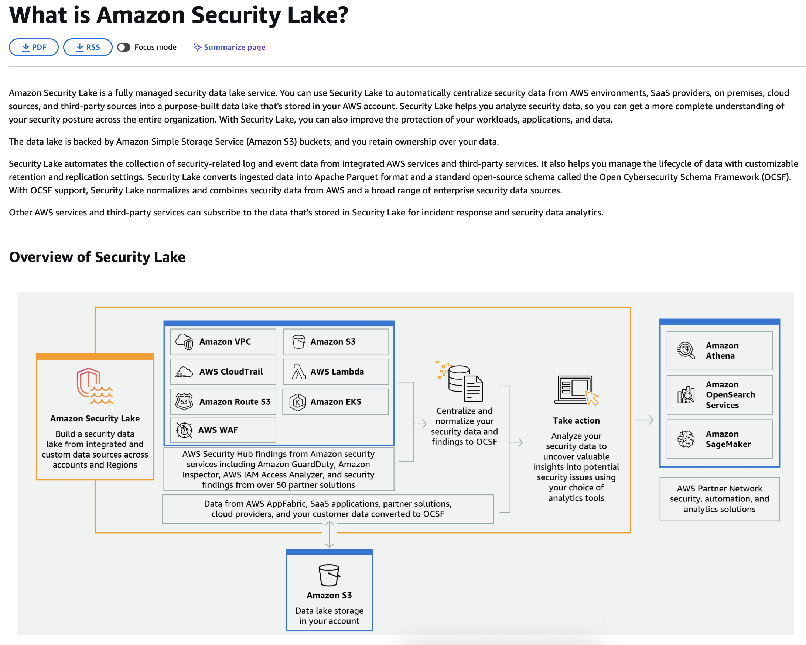


## 核心问题

当一个AWS账户（账户A）向另一个账户（账户B）拥有的S3 bucket写入数据时，**上传的对象默认归账户A所有**，即使bucket属于账户B。这导致bucket所有者无法访问自己bucket中的某些对象，这是AWS S3的权限设计机制，不是bug。

在题目场景中，Redshift集群（账户A）使用UNLOAD命令写数据到账户B的bucket，结果账户B作为bucket owner却无法访问这些文件，原因就是对象所有权仍然属于账户A。

## 为什么会这样设计

AWS将bucket所有权和对象所有权分离，是为了支持跨账户数据共享的灵活性。但这也带来了权限管理的复杂性，特别是在不了解这个机制的情况下容易出现访问拒绝的问题。

## 解决方案汇总

**写入方（如Redshift UNLOAD）的处理：**

在写入时明确授予bucket owner权限：

```sql
UNLOAD ('SELECT * FROM table')
TO 's3://bucket-name/prefix'
IAM_ROLE 'arn:aws:iam::account-a:role/redshift-role'
ACL 'bucket-owner-full-control';
```

**复制文件时的处理：**

使用AWS CLI时指定ACL：

```bash
aws s3 cp s3://source-bucket/file.txt s3://my-bucket/file.txt \
  --acl bucket-owner-full-control
```

使用C#代码时：

~~~csharp
var request = new CopyObjectRequest
{
    SourceBucket = "source-bucket",
    SourceKey = "file.txt",
    DestinationBucket = "my-bucket",
    DestinationKey = "file.txt",
    CannedACL = S3CannedACL.BucketOwnerFullControl
};
await s3Client.CopyObjectAsync(request);
```

**目标bucket的预防性配置（推荐）：**

方法1 - 启用Bucket Owner Enforced（最简单）：
```
在bucket设置中选择 Object Ownership -> Bucket owner enforced
~~~

这样所有写入的对象自动归bucket owner所有，无需每次指定ACL。

方法2 - 使用Bucket Policy强制要求ACL：

```json
{
  "Version": "2012-10-17",
  "Statement": [
    {
      "Sid": "RequireBucketOwnerFullControl",
      "Effect": "Deny",
      "Principal": "*",
      "Action": "s3:PutObject",
      "Resource": "arn:aws:s3:::my-bucket/*",
      "Condition": {
        "StringNotEquals": {
          "s3:x-amz-acl": "bucket-owner-full-control"
        }
      }
    }
  ]
}
```

## 实际应用建议

对于你正在准备的AWS Solutions Architect认证和灾难恢复方案，建议：

1. **新建的bucket统一启用"Bucket owner enforced"**，这是AWS 2021年后的最佳实践，省去了管理ACL的麻烦
2. **跨账户数据传输场景**（比如工厂数据备份到其他region或账户）时，在设计阶段就要考虑对象所有权问题
3. **编写自动化脚本**（如你用C#写的WCS数据备份程序）时，默认加上`CannedACL`参数
4. **跨region灾难恢复**通常在同一账户内，不会遇到这个问题，但如果涉及跨账户备份就需要注意

这个知识点在AWS认证考试中经常出现，因为它是实际生产环境中很容易踩的坑。你在日本工厂部署系统时，如果未来需要将多个站点的数据集中到某个账户的S3进行分析，一定要记得这个权限机制。


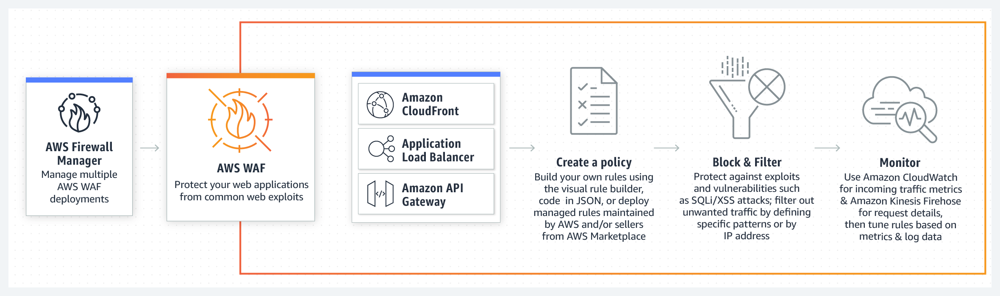


| 看到这些词                             | 选            |
| -------------------------------------- | ------------- |
| 异常行为、入侵、攻击、恶意IP、实时监控 | **GuardDuty** |
| CVE漏洞、软件版本、配置错误、端口开放  | **Inspector** |


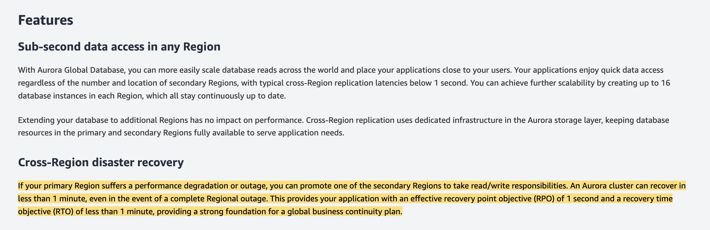


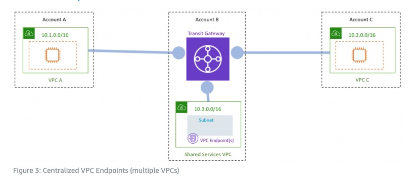


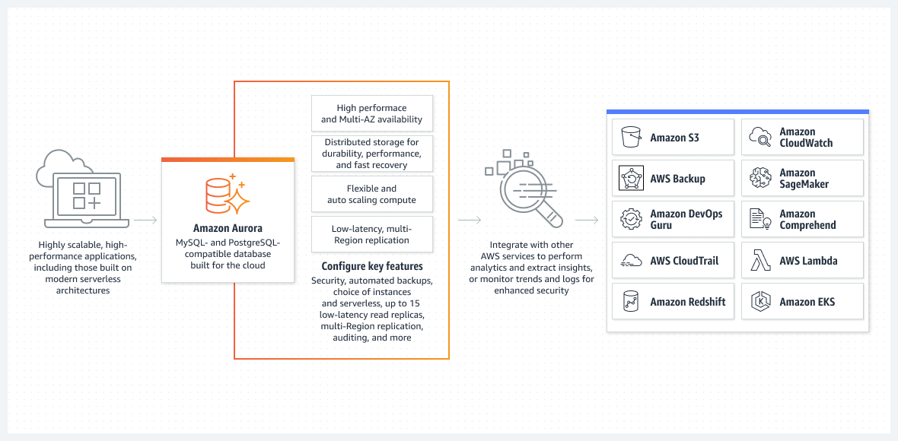


题目关键点：

1. 从本地迁移到AWS
2. 需要提升读扩展能力和可用性
3. 现有使用Microsoft SQL Server，有大量读负载
4. 每天业务开始时做生产库的完整拷贝到开发库
5. 这个拷贝过程导致用户高延迟，体验差
6. 公司愿意迁移数据库引擎

需要解决的问题：

- 读扩展
- 高可用
- 开发库复制不影响生产环境


## 题目分析

### 核心需求

1. **读扩展能力**（read-scaling）
2. **高可用性**（availability）
3. **创建 dev 数据库时不影响生产环境**（关键痛点）

------

### 各选项分析

```
选项问题
Aurora + mysqldumpmysqldump 是逻辑备份，执行时会锁表/消耗资源，和现有问题一样会导致高延迟 ❌
Aurora + 从自动备份恢复自动备份在后台持续进行，恢复时完全不影响生产库 ✅
RDS MySQL + 用 standby 做 devMulti-AZ standby 是故障切换用的，不能用于读取或开发 ❌
RDS SQL Server + read replica 做 devRead replica 应该用于生产读负载，不应当 dev 库用；且 SQL Server 读副本功能有限 ❌
```

------

### 为什么你选的 mysqldump 不对？

```
mysqldump = 逻辑导出 = 需要读取源数据库的每一行
```

这和他们现在 "full copy" 的问题**本质相同**，依然会：

- 消耗生产库 CPU/IO
- 造成锁竞争
- 导致用户高延迟

------

### 为什么从自动备份恢复是正确的？

**Aurora 自动备份的特点：**

- **持续增量备份**到 S3（后台自动进行）
- 备份过程对生产库**零影响**
- 恢复时是从 S3 创建新实例，**不触碰生产库**

这完美解决了"复制数据库导致高延迟"的痛点。

------

### 考试技巧

看到 **"copy/clone database without impacting production"** 这类需求：

- ✅ Aurora Clone（秒级克隆）
- ✅ 从自动备份/快照恢复
- ❌ mysqldump / pg_dump / 逻辑备份 


**题目核心需求：**

1. 迁移 cron 脚本到 AWS
2. 执行时间最长 30 分钟
3. 不想做大改动（minimal refactoring）
4. 容器化、无服务器架构（containerized, serverless）
5. 自动扩展
6. 未来能响应事件触发
7. 最小化基础设施管理

## 题目分析

### 核心需求

```
需求关键点
执行时间最长 30 分钟
迁移方式最小改动（without significant changes）
架构要求容器化 + 无服务器（containerized, serverless）
调度方式cron 调度 + 未来支持事件触发
运维目标最小化基础设施管理
```

------

### 各选项分析

```
选项问题
A: Step Functions + Wait state + ECS FargateWait state 是用于流程中延迟的，不是用来做 cron 调度，架构过于复杂 ❌
B: Lambda + EventBridgeLambda 超时上限 15 分钟，脚本最长 30 分钟，不满足；且需要重写为 Lambda 函数 ❌
C: AWS Batch + EC2EC2 不是 serverless，需要管理计算环境 ❌
D: 容器 + EventBridge Scheduler + ECS Fargate✅ 全部满足
```

------

### 为什么 D 是正确答案？

**完美匹配所有需求：**

```
✅ 容器化        → 把脚本打包成 Docker 镜像（最小改动）
✅ 无服务器      → Fargate 无需管理服务器
✅ 30 分钟执行   → Fargate 任务无时间限制
✅ cron 调度     → EventBridge Scheduler 原生支持 cron 表达式
✅ 事件触发      → EventBridge 可响应各种 AWS 事件
✅ 自动扩展      → Fargate 按需启动容器
✅ 最小运维      → 完全托管，无基础设施管理
```

------

### 考试技巧

遇到 **cron 脚本迁移** 题目时，注意这些关键词：

```
关键词排除选项
执行时间 > 15 分钟排除 Lambda
serverless排除 EC2、自管理容器
minimal changes / refactoring排除需要重写代码的方案
containerized + serverless + scheduling→ ECS Fargate + EventBridge Scheduler
```


## Cron 调度

Cron 是 Linux/Unix 系统中的**定时任务调度器**，可以让你按照设定的时间规则自动执行脚本或命令。

------

### Cron 表达式格式

```
┌───────────── 分钟 (0-59)
│ ┌───────────── 小时 (0-23)
│ │ ┌───────────── 日 (1-31)
│ │ │ ┌───────────── 月 (1-12)
│ │ │ │ ┌───────────── 星期 (0-6, 0=周日)
│ │ │ │ │
* * * * *  命令/脚本
```

------

### 常见示例

```
Cron 表达式含义
0 9 * * *每天早上 9:00 执行
*/15 * * * *每 15 分钟执行一次
0 0 * * 0每周日午夜执行
0 8 1 * *每月 1 号早上 8:00 执行
30 18 * * 1-5周一到周五下午 6:30 执行
```

------

### 在 AWS 中的对应

```
场景AWS 服务
定时触发 Lambda/ECSAmazon EventBridge Scheduler
旧版定时规则CloudWatch Events
批处理作业调度AWS Batch
```

EventBridge Scheduler 支持标准 cron 表达式，所以从本地 Linux cron 迁移到 AWS 时，调度逻辑几乎不用改。

------

### 一句话总结

> **Cron = 定时任务**，就像手机上的闹钟，到点自动执行指定的任务。

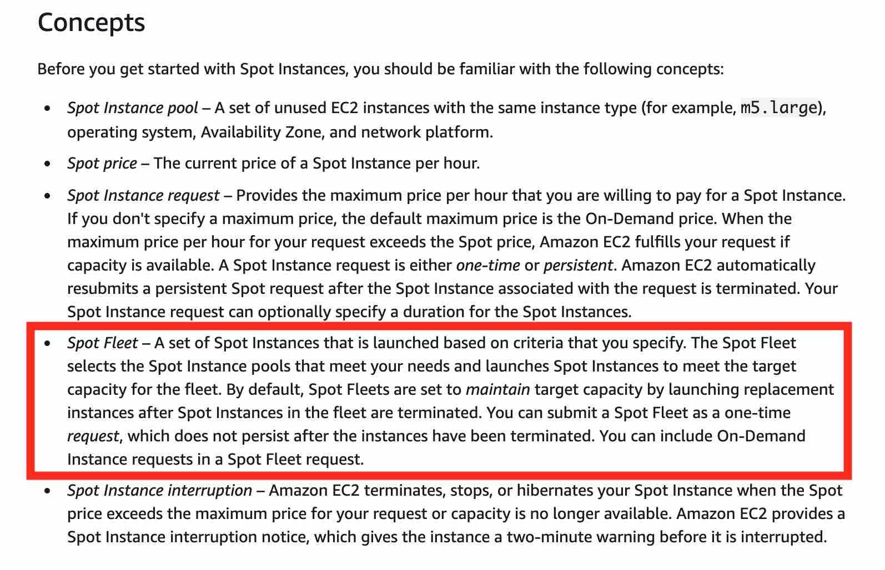


题目核心需求：

1. 需要 SMB 协议访问共享文件
2. 托管存储解决方案（managed）
3. 简单设置
4. 最小化运维开销


### 各选项分析

```
选项问题
A: S3 + Transfer AccelerationS3 是对象存储，只支持 HTTPS API，不支持 SMB ❌
B: FSx for Windows File Server原生支持 SMB，完全托管 ✅
C: EC2 手动配置文件共享需要自己管理 EC2、打补丁、备份，运维开销大 ❌
D: Storage Gateway Volume Gateway是 iSCSI 块存储，不是文件共享协议 ❌
```

------

## 记忆技巧：文件共享协议 vs AWS 服务

```
协议用于AWS 托管服务
SMBWindows 环境FSx for Windows File Server
NFSLinux 环境EFS 或 FSx for OpenZFS
Lustre高性能计算 (HPC)FSx for Lustre
```

------

### 简单记忆口诀

```
SMB = Windows = FSx for Windows
NFS = Linux = EFS
```

> **S**MB → **S**erver **M**essage **B**lock → **W**indows 的东西 → F**S**x for **W**indows

------

### 补充：Storage Gateway 的三种模式

```
类型协议用途
File GatewayNFS / SMB本地访问 S3 数据
Volume GatewayiSCSI块存储备份到 S3
Tape GatewayiSCSI VTL磁带备份替代方案
```

如果题目说 Storage Gateway + SMB，那应该是 **File Gateway**，不是 Volume Gateway。

------

### 考试关键词速查

看到这些词 → 选这个服务：

```
关键词答案
SMB + managed + WindowsFSx for Windows
NFS + Linux + sharedEFS
HPC + high throughputFSx for Lustre
On-premises + cloud storageStorage Gateway
```


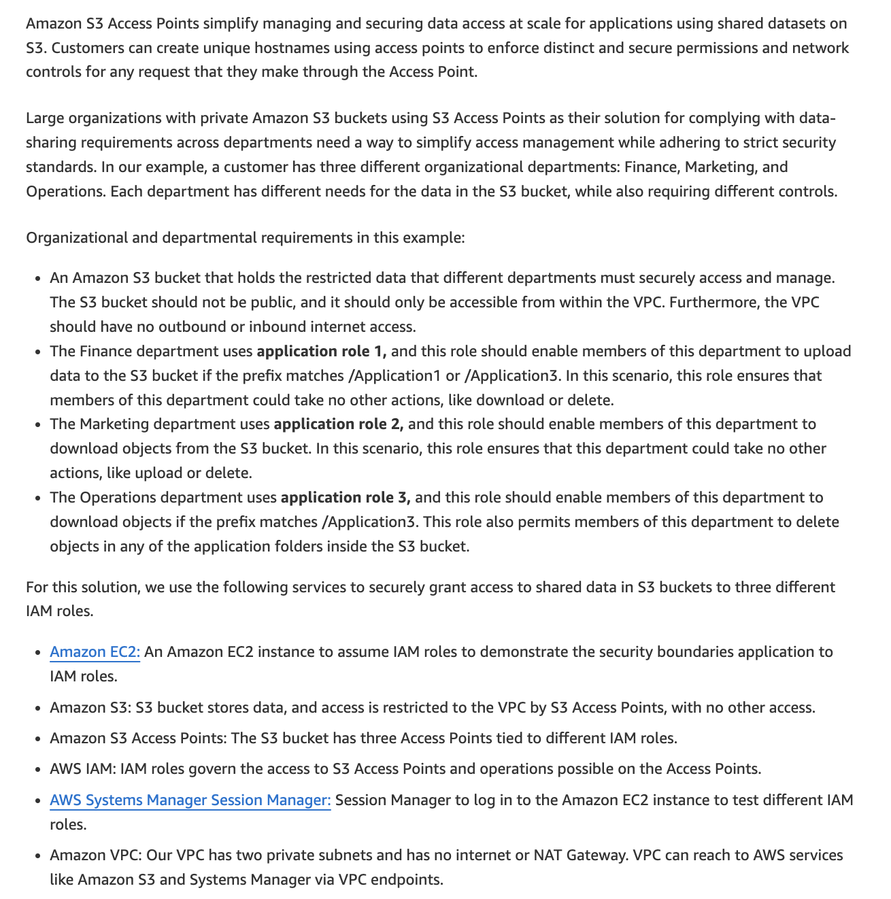


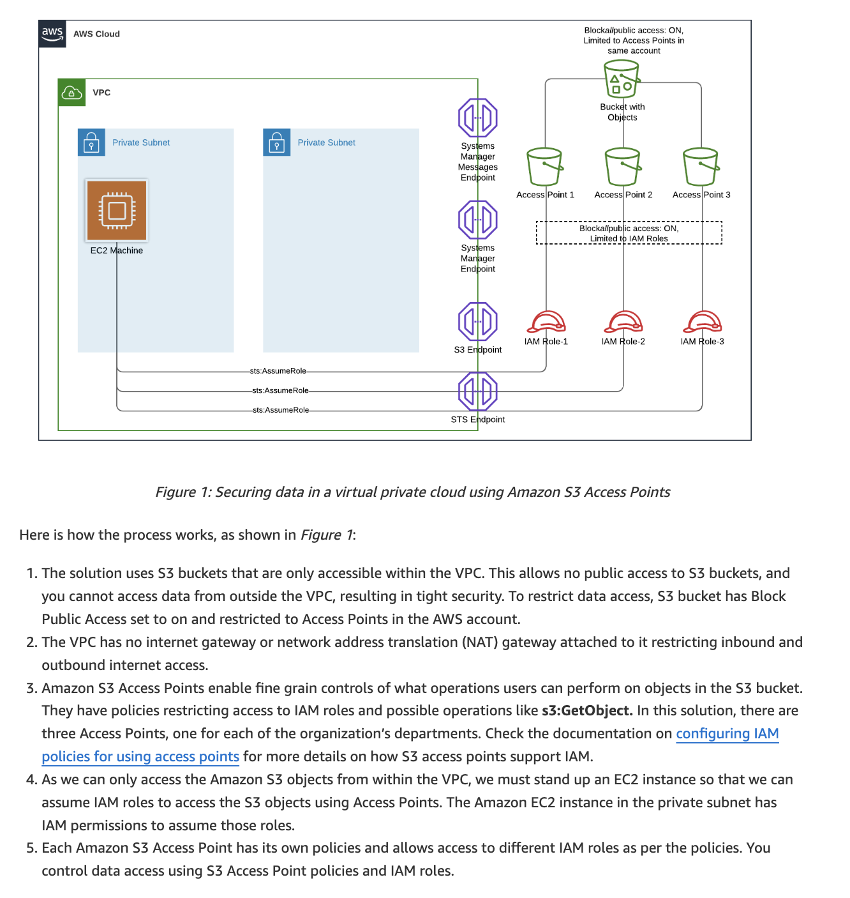


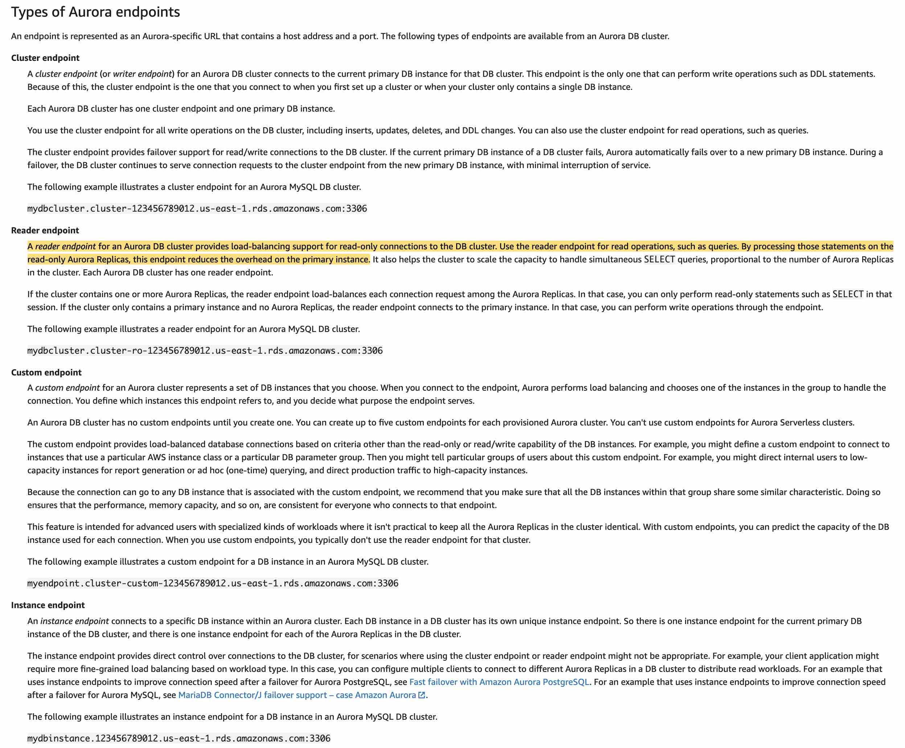


核心需求：

1. 从PDF中提取文本（已选择Textract）
2. 分析文本的**情感基调**（emotional tone）和**主题内容**（subject matter）
3. **最小运维负担**
4. **完全托管的AWS服务**

关键词：

- emotional tone = sentiment analysis（情感分析）
- subject matter = entity detection（实体检测）
- least operational burden = 托管服务
- fully managed AWS services


### 各选项分析

```
选项问题
A: Redshift + RekognitionRekognition 是图像/视频分析服务（人脸、物体识别），不能分析文本情感 ❌
B: Lambda + Athena + QuickSight只是数据处理和可视化，没有情感分析能力 ❌
C: Amazon Comprehend完全托管的 NLP 服务，原生支持情感分析和实体检测 ✅
D: SageMaker 自定义模型需要自己训练模型，运维负担大，违反 "least operational burden" ❌
```

------

### 为什么 Amazon Comprehend 是正确答案？

**Comprehend 的核心功能：**

```
Amazon Comprehend（完全托管的 NLP 服务）
├── Sentiment Analysis  → 分析文本情感（正面/负面/中性/混合）
├── Entity Detection    → 识别人物、地点、组织、日期等
├── Key Phrase Extraction → 提取关键短语
├── Language Detection  → 检测语言
└── Topic Modeling      → 主题建模
```

**完美匹配题目需求：**

- emotional tone → **Sentiment Analysis**
- subject matter → **Entity Detection**
- fully managed → **无需管理服务器**
- least operational burden → **API 调用即可，无需训练**

------

### AWS AI/ML 服务速查表

```
服务用途记忆点
Comprehend文本/NLP 分析情感、实体、关键词
Rekognition图像/视频分析人脸、物体、场景
Textract文档提取OCR、表格、表单
Transcribe语音转文字音频 → 文本
Polly文字转语音文本 → 音频
Translate翻译多语言翻译
SageMaker自定义 ML需要自己训练模型
```

------

### 考试技巧

```
看到这些关键词选择
sentiment, tone, emotion, NLP, text analysisComprehend
face, image, video, object detectionRekognition
OCR, PDF, scanned document, form extractionTextract
custom ML model, trainingSageMaker
```


这道题考的是如何限制 API Gateway 只能从特定 IP 地址访问。

### 核心需求

- 只允许**特定 IP 地址**访问 API
- **最小运维复杂度**

------

### 你选错的关键原因

> "Modify the security group that is attached to API Gateway"

**API Gateway 没有安全组！**

这是一个常见的考试陷阱：

```
服务是否有安全组
EC2✅ 有
RDS✅ 有
Lambda (VPC 模式)✅ 有
API Gateway❌ 没有
CloudFront❌ 没有
S3❌ 没有
```

API Gateway 是**完全托管的公共服务**，不在你的 VPC 内运行，所以不能用安全组控制。

------

### 各选项分析

```
选项问题
A: Resource Policy + IP 白名单API Gateway 原生支持，正确做法 ✅
B: 部署在 public subnet + 安全组API Gateway 不部署在子网中，无法这样配置 ❌
C: 修改安全组API Gateway 没有安全组 ❌
D: AWS Outposts过度复杂，且 Outposts 用于混合云场景，不是这个用途 ❌
```

------

### 正确做法：API Gateway Resource Policy

json

~~~json
{
  "Version": "2012-10-17",
  "Statement": [
    {
      "Effect": "Deny",
      "Principal": "*",
      "Action": "execute-api:Invoke",
      "Resource": "arn:aws:execute-api:region:account-id:api-id/*",
      "Condition": {
        "NotIpAddress": {
          "aws:SourceIp": [
            "192.168.1.0/24",
            "10.0.0.0/8"
          ]
        }
      }
    }
  ]
}
```

这个策略的逻辑：**如果请求 IP 不在白名单内 → 拒绝**

---

### API Gateway 访问控制方式

| 控制方式 | 用途 |
|----------|------|
| **Resource Policy** | IP 白名单/黑名单、VPC 端点限制 |
| **IAM** | AWS 身份认证 |
| **Lambda Authorizer** | 自定义认证逻辑 |
| **Cognito** | 用户池认证 |
| **API Key** | 简单的调用限制（不是安全措施） |

---

### 考试记忆点
```
API Gateway 限制 IP 访问 → Resource Policy
                         （不是安全组！）
服务限制 IP 的方式
EC2 / RDS / Lambda (VPC)安全组
API GatewayResource Policy
S3Bucket Policy
CloudFrontWAF 或 地理限制
~~~


## EC2 实例购买选项

### 总览对比

```
类型价格承诺期中断风险适用场景
On-Demand最贵 (100%)无无短期、不可预测的工作负载
Reserved便宜 (最高72% off)1年或3年无稳定、可预测的工作负载
Savings Plans便宜 (最高72% off)1年或3年无灵活的长期承诺
Spot最便宜 (最高90% off)无有可中断的批处理任务
Dedicated Host贵可选无合规/许可证要求
Dedicated Instance较贵无无硬件隔离需求
Capacity ReservationOn-Demand 价格无无确保容量可用
```

------

### 详细说明

#### 1. On-Demand Instance（按需实例）

```
特点：用多少付多少，随时启动随时停止
优点缺点
无预付、无承诺价格最高
完全灵活长期使用不划算
```

**适用场景：**

- 开发测试环境
- 短期项目
- 流量突发时临时扩容
- 不确定需要多少资源时

------

#### 2. Reserved Instance（预留实例）

```
特点：承诺使用 1 年或 3 年，换取大幅折扣
```

**三种付款方式：**

```
付款方式折扣力度
全预付 (All Upfront)最大折扣
部分预付 (Partial Upfront)中等折扣
无预付 (No Upfront)最小折扣
```

**两种类型：**

```
类型灵活性折扣
Standard RI不能改实例类型更高
Convertible RI可以换实例类型较低
```

**适用场景：**

- 生产数据库
- 7x24 运行的核心应用
- 已知的稳定工作负载

------

#### 3. Savings Plans（节省计划）

```
特点：承诺每小时花费 X 美元，换取折扣（比 RI 更灵活）
```

**两种类型：**

```
类型适用范围灵活性
Compute Savings PlansEC2 + Fargate + Lambda最灵活，可换区域、实例族
EC2 Instance Savings Plans仅 EC2（特定区域、实例族）较少灵活，折扣更高
```

**适用场景：**

- 想要 RI 的折扣但需要更多灵活性
- 使用多种计算服务（EC2 + Lambda + Fargate）

------

#### 4. Spot Instance（竞价实例）⭐ 考试重点

```
特点：使用 AWS 闲置容量，价格最低但可能被中断
优点缺点
最高 90% 折扣AWS 可以随时回收（提前 2 分钟通知）
适合大规模计算不适合关键业务
```

**适用场景：**

- 大数据分析 / EMR
- CI/CD 构建任务
- 批处理作业
- 容器化无状态应用
- 机器学习训练

**不适用场景：**

- 数据库
- 关键生产系统
- 任何不能中断的任务

------

#### 5. Dedicated Host（专用主机）

```
特点：租用整台物理服务器
优点用途
完全控制物理服务器使用自带许可证（BYOL）
满足合规要求监管要求硬件隔离
查看 socket/core 信息按 socket/core 计费的软件许可
```

**适用场景：**

- Windows Server / SQL Server 自带许可证
- 强合规要求（如某些金融、医疗行业）

------

#### 6. Dedicated Instance（专用实例）

```
特点：实例运行在专用硬件上，但不控制具体哪台物理机
对比Dedicated HostDedicated Instance
控制物理服务器✅❌
查看 socket/core✅❌
BYOL 支持✅部分
价格更贵较便宜
```

------

#### 7. Capacity Reservation（容量预留）

```
特点：在特定 AZ 预留容量，确保需要时一定能启动实例
```

- 按 On-Demand 价格收费（无折扣）
- 可以和 Savings Plans / RI 组合使用
- 解决"想启动实例但没有容量"的问题

------

### 考试常见场景速查

```
场景选择
短期测试，随时可能停On-Demand
生产数据库，7x24 运行Reserved Instance
大数据批处理，可中断Spot Instance
需要 Windows Server 自带许可证Dedicated Host
想要折扣但需要灵活换实例类型Savings Plans 或 Convertible RI
必须确保容量可用Capacity Reservation
最大程度省钱 + 可中断Spot Instance
最大程度省钱 + 不可中断Reserved Instance / Savings Plans
```

------

### 组合使用策略

实际生产中通常混合使用：

```
基线负载（稳定）    → Reserved Instance / Savings Plans
峰值负载（临时）    → On-Demand
批处理任务（可中断） → Spot Instance
```


题目核心需求：

1. Kubernetes 微服务应用迁移到 AWS
2. 使用 AMQP 协议（Advanced Message Queuing Protocol）
3. 最小代码改动
4. 减少基础设施管理开销
5. 高扩展性、低运维


## 题目分析

### 核心需求

```
需求关键点
现有架构Kubernetes + AMQP 消息队列
迁移目标最小代码改动
运维目标减少基础设施管理
消息协议必须继续使用 AMQP
扩展性高可扩展
```

------

### 各选项分析

```
选项分析结果
A: EKS + FargateEKS = 托管 Kubernetes（最小改动）；Fargate = 无需管理 EC2 节点✅
B: Amazon MQ完全托管，原生支持 AMQP，无需改代码✅
C: SQSSQS 不支持 AMQP，需要重构代码使用 SQS SDK❌
D: EC2 + 自托管 RabbitMQ需要自己管理 EC2 和 RabbitMQ，运维开销大❌
E: ECS on EC2 + SNSSNS 是发布/订阅服务，不支持 AMQP；EC2 需要管理❌
```

------

### 为什么 A 正确：EKS + Fargate

```
现有：Kubernetes on-premises
迁移：Amazon EKS（托管 Kubernetes）

EKS + Fargate 的优势：
├── 继续使用 Kubernetes → 最小代码改动
├── Fargate 模式 → 无需管理 EC2 worker 节点
├── 自动扩展 → 高可扩展性
└── 完全托管 → 低运维
```

------

### 为什么 B 正确：Amazon MQ

```
Amazon MQ 支持的协议：
├── AMQP ✅（题目要求）
├── MQTT
├── OpenWire
├── STOMP
└── WebSocket

基于两种引擎：
├── Apache ActiveMQ
└── RabbitMQ ← 原生 AMQP 支持
```

**关键点**：应用只需改 endpoint 地址，消息格式和协议不用改。

------

### AWS 消息服务对比

```
服务协议特点
Amazon MQAMQP, MQTT, STOMP 等兼容现有消息系统，迁移用
SQSAWS SDK / HTTP API云原生，需要改代码
SNSAWS SDK / HTTP API发布/订阅，不是队列
KinesisAWS SDK流数据处理
```

------

### 考试技巧

```
看到这些关键词                                     选择
AMQP / MQTT / 现有消息系统迁移                  Amazon MQ
云原生队列、解耦、无需兼容                          SQS
Kubernetes 迁移 + 最小改动                         EKS
无服务器容器 + 不管理节点                         Fargate
自托管 / 自己管理                       ❌ 通常不选（运维开销大）
```


### 协议总览对比

```
协议全称设计目标典型场景
AMQPAdvanced Message Queuing Protocol企业级可靠消息金融交易、企业应用
MQTTMessage Queuing Telemetry Transport轻量级、低带宽IoT、传感器、移动设备
STOMPSimple Text Oriented Messaging Protocol简单、易实现Web 应用、脚本集成
OpenWire-ActiveMQ 原生协议Java/ActiveMQ 生态
WebSocket-浏览器双向通信Web 实时应用
```


### 详细说明

#### 1. AMQP（高级消息队列协议）

```
特点：企业级、功能丰富、可靠性强
特性说明
可靠性支持消息确认、持久化、事务
路由灵活Exchange + Binding + Queue 模型
协议层面标准化不同厂商实现可互通
开销较重，头部信息多
```

**消息模型：**

```
Producer → Exchange → Binding → Queue → Consumer
              ↓
        (路由规则)
```

**典型使用：**

- 银行/金融系统（要求消息不丢失）
- 企业 ERP/CRM 集成
- 订单处理系统

**代表产品：** RabbitMQ, Apache Qpid

------

#### 2. MQTT（消息队列遥测传输）

```
特点：轻量级、低带宽、低功耗
特性说明
极简设计最小头部仅 2 字节
发布/订阅模式Topic-based
QoS 级别0（最多一次）、1（至少一次）、2（恰好一次）
保持连接心跳机制，适合不稳定网络
```

**消息模型：**

```
Publisher → Broker → Subscriber
              ↓
           (Topic)

例：sensor/temperature/room1
```

**典型使用：**

- IoT 设备（传感器、智能家居）
- 移动应用推送
- 车联网
- 带宽受限的环境

**AWS 服务：** AWS IoT Core 原生支持 MQTT

------

#### 3. STOMP（简单文本消息协议）

```
特点：基于文本、简单易读、易于实现
特性说明
纯文本类似 HTTP，人类可读
简单容易用任何语言实现
帧结构COMMAND + Headers + Body
```

**消息格式示例：**

```
SEND
destination:/queue/orders
content-type:application/json

{"orderId": "12345"}
^@
```

**典型使用：**

- Web 应用（配合 WebSocket）
- 脚本/快速集成
- 需要简单调试的场景

------

#### 4. OpenWire

```
特点：Apache ActiveMQ 的原生二进制协议
特性说明
高效二进制格式，性能好
功能完整支持 ActiveMQ 全部特性
生态绑定主要用于 Java / ActiveMQ
```

**典型使用：**

- Java 企业应用
- 已使用 ActiveMQ 的系统

------

#### 5. WebSocket

```
特点：浏览器与服务器的全双工通信
特性说明
双向通信服务器可主动推送
基于 HTTP 升级握手后切换协议
低延迟持久连接，无需轮询
```

**典型使用：**

- 实时聊天
- 在线游戏
- 股票行情推送
- 协作编辑

------

### 协议选择指南

```
需要企业级可靠消息？
├── 是 → AMQP (RabbitMQ)
└── 否 ↓

设备资源受限 / IoT？
├── 是 → MQTT
└── 否 ↓

需要浏览器实时通信？
├── 是 → WebSocket (+ STOMP)
└── 否 ↓

Java / ActiveMQ 生态？
├── 是 → OpenWire
└── 否 → STOMP (简单场景)
```

------

### AWS 服务与协议映射

```
AWS 服务支持的协议
Amazon MQ (ActiveMQ)AMQP, MQTT, STOMP, OpenWire, WebSocket
Amazon MQ (RabbitMQ)AMQP
AWS IoT CoreMQTT, WebSocket, HTTPS
Amazon SQSAWS SDK / HTTP（无标准协议）
Amazon SNSAWS SDK / HTTP
```

------

### 考试常见场景

```
场景协议AWS 服务
现有企业应用迁移，使用 AMQPAMQPAmazon MQ
IoT 传感器数据收集MQTTAWS IoT Core
云原生应用，无协议要求-SQS / SNS
实时 Web 应用WebSocketAPI Gateway WebSocket
```

------

### 一句话总结

```
AMQP  = 企业级、可靠、功能强大
MQTT  = IoT、轻量、省电省带宽
STOMP = 简单、文本、易调试
```


### 一、AWS Direct Connect 基础

#### Direct Connect 是什么？

```
Direct Connect = 专线连接

你的数据中心 ←──专用物理线路──→ AWS

vs 普通互联网连接：
你的数据中心 ←──公共互联网──→ AWS
对比互联网Direct Connect
带宽不稳定稳定、可选 1G/10G/100G
延迟较高、波动低、稳定
安全性走公网专用线路，不走公网
成本按流量按端口 + 流量
```

------

#### VIF（Virtual Interface）类型

Direct Connect 物理连接建立后，需要创建 **VIF** 来实际传输数据：

```
Direct Connect 物理连接
        │
        ├── Public VIF   → 访问 AWS 公共服务（S3 公共端点等）
        │
        ├── Private VIF  → 访问你的 VPC 内资源
        │
        └── Transit VIF  → 通过 Transit Gateway 访问多个 VPC
VIF 类型用途访问什么
Public VIF访问 AWS 公共端点S3 公共 URL、DynamoDB 公共端点
Private VIF访问 VPC 内资源EC2、RDS、EFS、PrivateLink 端点
Transit VIF多 VPC 连接通过 Transit Gateway 连接多个 VPC
```

------

### 二、VPC Endpoint 详解

#### 两种类型对比

```
┌─────────────────────────────────────────────────────────────────┐
│                    Gateway Endpoint                              │
├─────────────────────────────────────────────────────────────────┤
│  支持服务：仅 S3 和 DynamoDB                                      │
│  实现方式：在路由表中添加路由条目                                   │
│  访问方式：VPC 内部通过路由表转发                                   │
│  费用：免费                                                       │
│  从本地访问：❌ 不能通过 Direct Connect 访问                        │
└─────────────────────────────────────────────────────────────────┘

┌─────────────────────────────────────────────────────────────────┐
│              Interface Endpoint (PrivateLink)                    │
├─────────────────────────────────────────────────────────────────┤
│  支持服务：大多数 AWS 服务（EFS、ECS、SNS、SQS、KMS...）            │
│  实现方式：在子网中创建 ENI（弹性网络接口）                          │
│  访问方式：通过私有 IP 地址访问                                     │
│  费用：按小时 + 数据处理量收费                                      │
│  从本地访问：✅ 可以通过 Direct Connect + Private VIF 访问          │
└─────────────────────────────────────────────────────────────────┘
```

#### 图解区别

```
Gateway Endpoint（只能 VPC 内部用）：

┌─────────────────────────────────────────────┐
│                    VPC                       │
│  ┌─────────┐      路由表        ┌─────────┐ │
│  │   EC2   │ ──────────────────→│   S3    │ │
│  └─────────┘   pl-xxxxx 条目    │ Gateway │ │
│                                 │Endpoint │ │
└─────────────────────────────────────────────┘
       ↑
       │ ❌ 本地无法通过这个路由访问
       │
┌──────────────┐
│  On-premises │
└──────────────┘
Interface Endpoint / PrivateLink（可以从本地访问）：

┌─────────────────────────────────────────────┐
│                    VPC                       │
│  ┌─────────┐                 ┌────────────┐ │
│  │   EC2   │ ───────────────→│ Interface  │ │
│  └─────────┘                 │ Endpoint   │ │
│                              │(ENI: 私有IP)│ │
│                              │10.0.1.100  │ │
│                              └────────────┘ │
└──────────────────────│──────────────────────┘
                       │
       Direct Connect  │ Private VIF
       ────────────────│────────────────
                       │
                       ↓ ✅ 可以访问！
                ┌──────────────┐
                │  On-premises │
                │  10.0.1.100  │ ← 通过私有 IP 访问
                └──────────────┘
```

------

### 三、AWS DataSync 详解

#### DataSync 是什么？

```
DataSync = 数据迁移/同步服务

特点：
├── 完全托管
├── 自动处理加密、压缩、校验
├── 支持定时任务
└── 比 rsync/scp 快 10 倍
```

#### DataSync 支持的源和目标

```
源（Source）                    目标（Destination）
├── NFS 文件系统         ───→   ├── Amazon S3
├── SMB 文件共享         ───→   ├── Amazon EFS ← 直接支持！
├── HDFS                ───→   ├── Amazon FSx
├── S3                  ───→   └── 其他 NFS/SMB
└── 其他存储
```

**关键点**：DataSync **原生支持直接写入 EFS**，不需要通过 S3 中转！

------

### 四、回到题目：四个选项详细分析

#### 选项 A（你选的）❌

```
路径：NFS → DataSync → S3 (Gateway Endpoint) → Lambda → EFS

问题 1：Gateway Endpoint 无法从本地访问
┌──────────────┐                      ┌─────────────────┐
│  On-premises │ ──Direct Connect──→  │      VPC        │
│              │                      │                 │
│  DataSync    │ ─────────────────X   │  S3 Gateway     │
│   Agent      │   无法到达！         │  Endpoint       │
└──────────────┘                      └─────────────────┘

Gateway Endpoint 的路由只存在于 VPC 内部的路由表中，
本地服务器的流量无法通过这个路由。

问题 2：架构复杂
NFS → S3 → Lambda → EFS = 三步转换

问题 3：Lambda 增加运维负担
需要编写代码、处理错误、监控运行
```

#### 选项 B ❌

```
路径：NFS → DataSync → S3 (Public VIF) → Lambda → EFS

问题 1：使用 Public VIF 走公网
虽然技术上可行，但数据走公共网络，不如 Private VIF 安全

问题 2：架构同样复杂
NFS → S3 → Lambda → EFS

问题 3：同样需要 Lambda
```

#### 选项 C ❌

```
路径：NFS → DataSync → EFS (VPC Peering endpoint)

问题：术语错误
"VPC Peering endpoint for Amazon EFS" 根本不存在！

VPC Peering 是 VPC 之间的连接，不是访问 EFS 的方式。
这个选项是干扰项，用错误术语迷惑你。
```

#### 选项 D ✅ 正确答案

```
路径：NFS → DataSync → EFS (PrivateLink Interface Endpoint + Private VIF)

┌──────────────────┐                         ┌─────────────────────────┐
│   On-premises    │                         │          VPC            │
│                  │                         │                         │
│  ┌────────────┐  │     Direct Connect      │  ┌──────────────────┐  │
│  │ NFS Server │  │      Private VIF        │  │    Interface     │  │
│  └─────┬──────┘  │ ──────────────────────→ │  │    Endpoint      │  │
│        │         │                         │  │   (PrivateLink)  │  │
│        ↓         │                         │  │        │         │  │
│  ┌────────────┐  │                         │  │        ↓         │  │
│  │  DataSync  │  │ ──────────────────────→ │  │      EFS         │  │
│  │   Agent    │  │       直接传输！         │  │                  │  │
│  └────────────┘  │                         │  └──────────────────┘  │
│                  │                         │                         │
└──────────────────┘                         └─────────────────────────┘

优势：
✅ 一步到位：NFS → EFS
✅ 走私网：Private VIF，数据不走公网
✅ 无需 Lambda：DataSync 原生支持 EFS
✅ 定时任务：DataSync 内置调度功能
✅ 最少运维：完全托管，无中间环节
```

------

### 五、总结对比表

```
选项路径步骤数能否工作运维复杂度
ANFS→S3→Lambda→EFS3❌ Gateway Endpoint 不可达高
BNFS→S3→Lambda→EFS3⚠️ 可行但走公网高
CNFS→EFS (VPC Peering)-❌ 术语错误，不存在-
DNFS→EFS (PrivateLink)1✅最低
```

------

### 六、考试要点记忆

```
┌────────────────────────────────────────────────────────────┐
│              从本地访问 AWS 服务的正确方式                    │
├────────────────────────────────────────────────────────────┤
│                                                            │
│   Direct Connect + Private VIF + PrivateLink Endpoint      │
│                                                            │
│   ❌ 不要用 Gateway Endpoint（只能 VPC 内部用）              │
│   ❌ 不要用 Public VIF（走公网，不安全）                      │
│                                                            │
└────────────────────────────────────────────────────────────┘

┌────────────────────────────────────────────────────────────┐
│                    DataSync 记忆点                          │
├────────────────────────────────────────────────────────────┤
│                                                            │
│   DataSync 可以直接传输到：S3 / EFS / FSx                   │
│                                                            │
│   不需要通过 S3 中转再用 Lambda 复制！                        │
│                                                            │
└────────────────────────────────────────────────────────────┘
```


题目关键点：

1. 金融服务公司在EC2实例上部署应用
2. 处理敏感客户数据
3. 需要监控第三方SSL/TLS证书（通过ACM配置在EC2上）
4. 在证书过期前30天通知安全团队
5. 需要最少的脚本和维护工作

### 关键考点：ACM证书的两种类型

这道题的核心在于区分 **ACM颁发的证书** 和 **导入ACM的第三方证书**：

```
证书类型续订方式是否需要监控过期
ACM颁发的证书自动续订❌ 不需要
导入的第三方证书手动续订✅ 需要
```

### 为什么你的答案错误

题目明确说的是 **"third-party SSL/TLS certificates"（第三方证书）**：

- **你选的答案**：监控 "certificates **created via ACM**"
- **正确答案**：监控 "certificates **imported into ACM**"

ACM自己颁发的证书会自动续订，根本不存在过期问题，所以监控它们没有意义。只有**导入的第三方证书**才需要手动续订和过期监控。

### 为什么不选CloudWatch选项

虽然ACM确实为导入的证书提供 `DaysToExpiry` CloudWatch指标，但：

1. **AWS Config managed rule** 是预构建的托管规则，开箱即用
2. CloudWatch方案需要手动创建告警、配置阈值等，维护工作更多
3. 题目要求 **"least amount of scripting and maintenance effort"**

### 总结

正确答案选择 **AWS Config + 导入的第三方证书** 是因为：

1. ✅ 针对正确的证书类型（导入的第三方证书）
2. ✅ 使用托管规则，最少维护工作
3. ✅ 可直接触发SNS通知


## AWS Config vs CloudWatch 方案对比

### 方案概览

```
对比维度AWS Config Managed RuleCloudWatch Alarm
监控方式合规性检查（定期评估）指标监控（持续监控）
配置复杂度低 - 选择托管规则即可中 - 需创建告警、设阈值
维护工作几乎无需维护告警配置
脚本需求❌ 不需要可能需要 Lambda 自定义操作
通知集成原生支持 SNS原生支持 SNS
```

------

### AWS Config 方案

```
ACM证书 → AWS Config Rule → 检测不合规 → SNS → 安全团队
         (acm-certificate-expiration-check)
```

**优点：**

- ✅ **托管规则开箱即用**，只需启用并设置天数参数
- ✅ 无需编写任何代码
- ✅ 提供合规性仪表板，可视化管理
- ✅ 可以查看历史合规状态

**缺点：**

- ❌ 按评估次数收费
- ❌ 非实时（按配置的频率检查）

------

### CloudWatch 方案

```
ACM证书 → CloudWatch Metric → CloudWatch Alarm → SNS → 安全团队
          (DaysToExpiry)        (阈值≤30天)
```

**优点：**

- ✅ 实时监控
- ✅ 灵活的告警条件设置

**缺点：**

- ❌ 需要**手动为每个证书创建告警**
- ❌ 新证书导入时需要额外配置
- ❌ 维护工作量更大

------

### 为什么本题选 Config？

题目关键要求：**"least amount of scripting and maintenance effort"**

```
评估标准AWS ConfigCloudWatch
脚本工作量⭐ 零可能需要自动化脚本
维护工作量⭐ 最少需持续维护告警
新证书处理⭐ 自动覆盖需手动添加监控
```

**结论**：AWS Config 的托管规则 `acm-certificate-expiration-check` 完全符合 "最少脚本和维护" 的要求。


## CloudWatch + Lambda 的常见组合

你观察得很对！这是 AWS 中非常经典的组合。

### 为什么经常绑定在一起？

**CloudWatch 原生支持的操作有限：**

```
CloudWatch Alarm 原生动作说明
SNS 通知✅ 发送邮件/短信
Auto Scaling✅ 扩缩容
EC2 操作✅ 停止/终止/重启实例
自定义业务逻辑❌ 不支持
```

当你需要执行**复杂操作**时，就必须引入 Lambda：

```
CloudWatch Alarm → SNS → Lambda → 自定义操作
```

------

### 常见场景对比

```
场景仅 CloudWatch + SNS需要 + Lambda
发邮件通知✅不需要
CPU高时扩容✅不需要
证书过期前自动续订❌✅ 需要
告警时创建 Jira 工单❌✅ 需要
异常时自动修复配置❌✅ 需要
发送 Slack/钉钉 通知❌✅ 需要
```

------

### 架构示例

**简单通知（不需要 Lambda）：**

```
CloudWatch Alarm → SNS → Email/SMS
```

**自定义操作（需要 Lambda）：**

```
CloudWatch Alarm → SNS → Lambda → Slack API
                               → JIRA API  
                               → 自动修复脚本
                               → 调用其他 AWS 服务
```

------

### 回到本题

题目只要求**通知安全团队**，这是简单的 SNS 邮件通知：

- **CloudWatch 方案**：CloudWatch Alarm → SNS → 邮件 ✅ 可以实现
- **Config 方案**：Config Rule → SNS → 邮件 ✅ 可以实现

两者都**不需要 Lambda**，但 Config 方案维护工作更少，所以是最佳答案。

------

### 总结

```
情况是否需要 Lambda
只发通知（邮件/短信）❌ 不需要
需要调用第三方 API✅ 需要
需要执行自定义业务逻辑✅ 需要
需要自动修复/补救措施✅ 需要
```

记住：**Lambda 是 CloudWatch 的"手脚"**，让它能做更多复杂的事情。


**Permission Boundary 不能附加到 IAM Group！**

这是一个关键的 AWS 限制：

```
Permission Boundary 可附加到支持
IAM User✅
IAM Role✅
IAM Group❌ 不支持
```

------

### 各选项分析

```
选项问题
附加 IAM Policy 阻止❌ 开发者可能先移除限制策略，再提权
Permission Boundary 在每个用户上✅ 正确 - 用户无法移除自己的 boundary
使用 SCP❌ SCP 作用于账户/OU 级别，不能针对单个用户
Permission Boundary 在 Group 上❌ 技术上不支持
```

------

### Permission Boundary 工作原理

```
实际权限 = IAM Policy ∩ Permission Boundary
┌─────────────────────────────────┐
│     Permission Boundary         │  ← 权限上限（天花板）
│  ┌─────────────────────────┐    │
│  │                         │    │
│  │    IAM Policy           │    │  ← 实际生效的权限
│  │    (被限制后)            │    │
│  └─────────────────────────┘    │
└─────────────────────────────────┘
```

即使开发者给自己附加了 `AdministratorAccess`，如果 Permission Boundary 不包含这些权限，也**不会生效**。

------

### 为什么不能用 Group？

AWS 设计 Permission Boundary 时做了这个限制：

```
方式说明
直接附加到 User/Role✅ 一对一绑定，清晰可控
附加到 Group❌ AWS 不支持此设计
```

如果有多个开发者，你需要：

- 为**每个用户单独设置** Permission Boundary
- 或者创建一个通用的 boundary policy，然后分别附加到每个用户

------

### 考试要点

> **记住**：Permission Boundary 只能附加到 **User** 和 **Role**，不能附加到 **Group**！


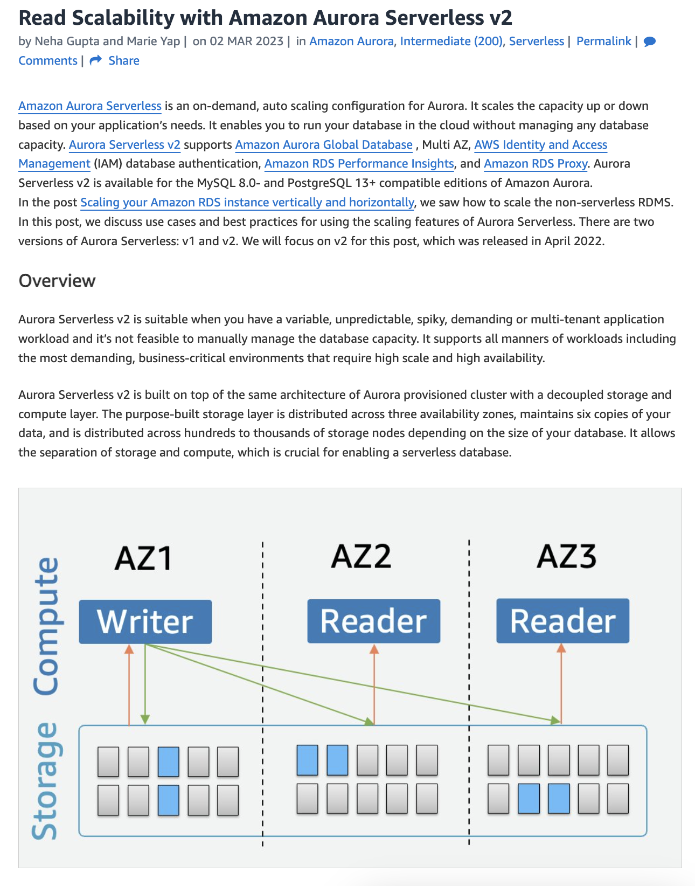


### 题目关键需求

```
需求说明
MySQL 兼容必须使用 MySQL-compatible 引擎
自动扩展应用层 + 数据库层都需要
高可用消除单点故障
成本效益Cost-effective
低运维Managed solution, minimal overhead
```

------

### 各选项分析

```
选项数据库问题
AAmazon Neptune❌ Neptune 是图数据库，不是 MySQL 兼容
BAurora Serverless v2✅ 完全符合所有要求
CRDS MySQL Multi-AZ⚠️ 可行但数据库不能自动扩展
DElastiCache Redis❌ Redis 是内存缓存，不是 MySQL 兼容
```

------

### 为什么 B 最优？

```
                    ┌─────────────────┐
                    │       ALB       │
                    └────────┬────────┘
                             │
              ┌──────────────┼──────────────┐
              ▼              ▼              ▼
         ┌────────┐    ┌────────┐    ┌────────┐
         │  EC2   │    │  EC2   │    │  EC2   │  ← Auto Scaling Group
         └────────┘    └────────┘    └────────┘
              │              │              │
              └──────────────┼──────────────┘
                             ▼
                ┌─────────────────────────┐
                │  Aurora Serverless v2   │  ← 自动扩展 + 高可用
                │      (MySQL)            │
                └─────────────────────────┘
组件满足需求
EC2 + Auto Scaling✅ 应用层自动扩展
ALB✅ 流量分发 + 高可用
Aurora Serverless v2✅ MySQL 兼容
✅ 数据库自动扩展（ACU自动调整）
✅ 内置高可用（跨AZ复制）
✅ 成本效益（按使用量付费）
✅ 全托管，低运维
```

------

### B vs C 的关键区别

```
对比Aurora Serverless v2RDS MySQL Multi-AZ
数据库扩展✅ 自动扩展❌ 需手动调整实例大小
成本模式按使用量付费固定实例费用
运维工作最少需要容量规划
```

题目强调 **"automatic scaling"** 和 **"cost-effective"**，Aurora Serverless v2 完美匹配！


## Redis 的正确定位

你观察得很对！Redis 确实经常出现，但它的角色是**缓存层**，不是**替代数据库**。

### 典型架构

```
         用户请求
             │
             ▼
         ┌───────┐
         │  ALB  │
         └───┬───┘
             │
             ▼
         ┌───────┐
         │  EC2  │
         └───┬───┘
             │
     ┌───────┴───────┐
     │               │
     ▼               ▼
┌─────────┐    ┌──────────┐
│  Redis  │    │  MySQL   │
│ (缓存)  │    │ (主数据库)│
└─────────┘    └──────────┘
```

------

### Redis vs 关系型数据库

```
特性Redis (ElastiCache)MySQL / Aurora
数据存储内存（易失）磁盘（持久化）
用途缓存热点数据存储核心业务数据
数据结构Key-Value关系型表结构
查询能力简单 K-V 操作复杂 SQL 查询
数据持久性⚠️ 有限✅ 完整 ACID
```

------

### Redis 的典型使用场景

```
场景说明
Session 存储用户登录状态
热点数据缓存减少数据库压力
排行榜利用 Sorted Set
消息队列Pub/Sub 功能
限流计数API Rate Limiting
```

------

### 回到本题

题目中选项 D 的问题：

> "Use Amazon ElastiCache for Redis **as the database**"

❌ 把 Redis **当作主数据库**使用是错误的！

✅ 正确架构应该是：

```
Aurora (主数据库) + Redis (缓存层)
```

------

### 考试技巧

看到 Redis/ElastiCache 时，问自己：

```
问题判断
是作为缓存加速？✅ 正确用法
是替代关系型数据库？❌ 错误用法
题目要求 MySQL 兼容？❌ Redis 不兼容
```

Redis 是数据库的**好搭档**，但不能**替代**数据库！


用户问的是 Redis 能和什么数据库兼容。这个问题有点误解 - Redis 不是"兼容"某个数据库的概念，而是作为缓存层可以和任何数据库一起使用。

我需要解释清楚：

1. Redis 不是"兼容"的概念 - 它是独立的缓存/数据存储系统
2. Redis 可以和几乎任何数据库配合使用
3. 在 AWS 上，ElastiCache 支持 Redis 和 Memcached 两种引擎
4. "兼容"这个词在 AWS 考试中通常指的是 Aurora 兼容 MySQL/PostgreSQL 这种概念

让我澄清这个概念。

## 澄清一个概念

Redis 不存在"兼容"某个数据库的说法 —— 它是**独立的缓存系统**，可以和**任何数据库**配合使用。

### Redis 可以搭配的数据库

```
数据库类型AWS 服务与 Redis 配合
关系型RDS MySQL✅
关系型RDS PostgreSQL✅
关系型Aurora✅
NoSQLDynamoDB✅
文档型DocumentDB✅
图数据库Neptune✅
```

**Redis 是通用缓存，和什么数据库都能配合！**

------

### "兼容"的正确语境

在 AWS 考试中，"兼容"通常指这个意思：

```
说法含义
Aurora MySQL-compatibleAurora 可以用 MySQL 的驱动/语法/工具
Aurora PostgreSQL-compatibleAurora 可以用 PostgreSQL 的驱动/语法/工具
DocumentDB MongoDB-compatibleDocumentDB 可以用 MongoDB 的驱动/语法
```

这意味着**应用代码几乎不用改**就能迁移。

------

### Redis 在 AWS 的对应服务

```
服务引擎
ElastiCache for RedisRedis
ElastiCache for MemcachedMemcached
MemoryDB for RedisRedis（持久化增强版）
```

------

### 典型架构示例

```
┌─────────────────────────────────────────┐
│              应用层 (EC2)                │
└─────────────────┬───────────────────────┘
                  │
        ┌─────────┴─────────┐
        ▼                   ▼
┌───────────────┐   ┌───────────────┐
│ ElastiCache   │   │    Aurora     │
│ (Redis)       │   │   (MySQL)     │
│               │   │               │
│  - 缓存热数据  │   │  - 持久存储   │
│  - Session    │   │  - 事务处理   │
│  - 排行榜     │   │  - 复杂查询   │
└───────────────┘   └───────────────┘
     缓存层              数据库层
```

------

### 总结

```
概念说明
Redis "兼容"❌ 这个说法不准确
Redis "配合/搭配"✅ 可以和任何数据库一起用
Aurora MySQL-compatible✅ 这才是"兼容"的正确用法
```


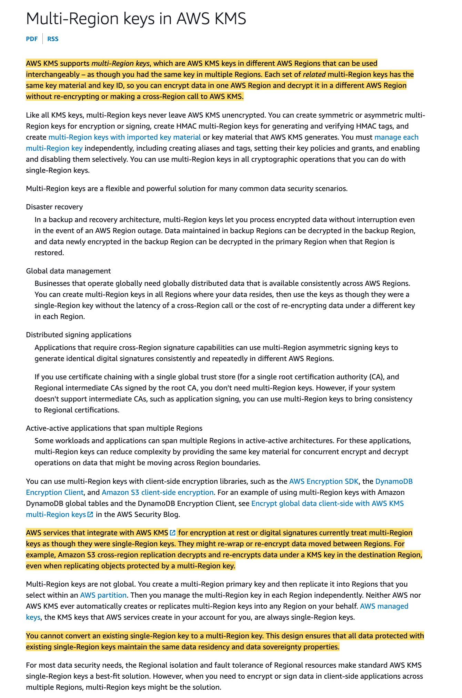

You can use multi-region AWS KMS keys in Amazon S3. However, Amazon S3 currently treats multi-region keys as though they were single-region keys, and does not use the multi-region features of the key.


## AWS KMS 多区域密钥在 S3 中的限制

### 先理解多区域密钥的设计目的

```
┌─────────────────┐         ┌─────────────────┐
│   us-east-1     │         │   eu-west-1     │
│                 │         │                 │
│  ┌───────────┐  │         │  ┌───────────┐  │
│  │ MRK Key   │◄─┼─────────┼─►│ MRK Key   │  │
│  │ (主密钥)   │  │  同步     │  │ (副本)    │  │
│  └───────────┘  │         │  └───────────┘  │
│                 │         │                 │
│  加密数据 ──────┼─────────┼──► 直接解密     │
│                 │         │   (无需跨区域)  │
└─────────────────┘         └─────────────────┘
```

**多区域密钥的优势**：在 A 区域加密的数据，可以在 B 区域用密钥副本**本地解密**，无需跨区域调用 KMS。

------

### S3 为什么不支持这个特性？

**S3 的加密机制设计**：

```
S3 行为说明
绑定特定 ARNS3 对象加密时绑定到具体区域的密钥 ARN
不识别密钥关系S3 不知道两个区域的 MRK 是"同一把密钥"
跨区域复制时会重新加密，而不是复用密钥副本
```

------

### 实际表现

```
┌──────────────────────────────────────────────────────┐
│                    你期望的行为                        │
├──────────────────────────────────────────────────────┤
│  S3 us-east-1                S3 eu-west-1            │
│  ┌─────────┐                 ┌─────────┐             │
│  │ 对象 A  │  ──复制──►      │ 对象 A  │             │
│  │(MRK加密)│                 │(同MRK解密)│            │
│  └─────────┘                 └─────────┘             │
│       ↓                           ↓                  │
│   MRK us-east-1    ═══════   MRK eu-west-1          │
│                    (利用同一密钥)                     │
└──────────────────────────────────────────────────────┘

┌──────────────────────────────────────────────────────┐
│                    实际的行为                         │
├──────────────────────────────────────────────────────┤
│  S3 us-east-1                S3 eu-west-1            │
│  ┌─────────┐                 ┌─────────┐             │
│  │ 对象 A  │  ──复制──►      │ 对象 A  │             │
│  │(MRK加密)│    重新加密      │(新密钥)  │            │
│  └─────────┘                 └─────────┘             │
│       ↓                           ↓                  │
│   MRK us-east-1              目标区域密钥             │
│              (当作普通单区域密钥处理)                  │
└──────────────────────────────────────────────────────┘
```

------

### 为什么 AWS 这样设计？

```
原因说明
S3 架构历史S3 加密功能早于 MRK，未设计支持
安全考量每个区域独立加密更符合数据主权要求
复杂性跨区域密钥同步状态管理复杂
```

------

### 总结

```
要点说明
能用吗？✅ 可以在 S3 中使用多区域密钥
有多区域优势吗？❌ 没有，S3 把它当单区域密钥用
跨区域复制仍需配置目标区域的密钥，会重新加密
```

**简单记忆**：S3 + MRK = 功能可用，但特性不生效 🙃


用户在问是否还有其他 AWS 服务也像 S3 一样，虽然支持使用多区域密钥（MRK），但实际上并没有利用 MRK 的多区域特性。

让我想想有哪些服务支持 MRK 的多区域特性，哪些不支持：

支持 MRK 多区域特性的服务：

- DynamoDB Global Tables - 支持
- Aurora Global Database - 支持
- 一些客户端加密场景

不支持/部分支持的服务：

- S3 - 不支持多区域特性
- 可能还有其他服务

我需要搜索一下确认这些信息，因为这是比较具体的技术细节。

## AWS 服务对多区域密钥 (MRK) 的支持情况

这是个好问题！让我帮你整理一下。

### 支持 MRK 多区域特性的服务 ✅

```
服务说明
DynamoDB Global Tables✅ 完整支持，跨区域复制时可用同一 MRK
Aurora Global Database✅ 完整支持
客户端加密 (Encryption SDK)✅ 应用层自己控制，完整利用 MRK
Secrets Manager✅ 跨区域复制 secrets 时支持
```

------

### 不支持 MRK 特性的服务 ❌

```
服务行为
S3当作单区域密钥处理
EBS快照跨区域复制时需重新加密
RDS (非 Aurora Global)跨区域只读副本需要不同密钥
```

------

### 对比示例

**DynamoDB Global Tables（支持 MRK）**：

```
┌─────────────────┐         ┌─────────────────┐
│   us-east-1     │         │   eu-west-1     │
│   ┌─────────┐   │  自动    │   ┌─────────┐   │
│   │ DynamoDB│◄──┼──复制───┼──►│ DynamoDB│   │
│   └────┬────┘   │         │   └────┬────┘   │
│        │        │         │        │        │
│   ┌────▼────┐   │         │   ┌────▼────┐   │
│   │   MRK   │◄──┼─────────┼──►│   MRK   │   │
│   └─────────┘   │  同一密钥 │   └─────────┘   │
└─────────────────┘         └─────────────────┘
        ✅ 两边用同一把 MRK，无需重新加密
```

**S3 跨区域复制（不支持 MRK 特性）**：

```
┌─────────────────┐         ┌─────────────────┐
│   us-east-1     │         │   eu-west-1     │
│   ┌─────────┐   │  复制    │   ┌─────────┐   │
│   │   S3    │───┼────────►│   │   S3    │   │
│   └────┬────┘   │ 重新加密  │   └────┬────┘   │
│        │        │         │        │        │
│   ┌────▼────┐   │         │   ┌────▼────┐   │
│   │ Key A   │   │         │   │ Key B   │   │
│   └─────────┘   │         │   └─────────┘   │
└─────────────────┘         └─────────────────┘
        ❌ 必须指定目标区域密钥，重新加密
```

------

### 考试要点

```
场景推荐方案
DynamoDB 全球表加密✅ 使用 MRK
Aurora Global Database✅ 使用 MRK
S3 跨区域复制分别配置每个区域的密钥
EBS 快照跨区域复制目标区域指定新密钥
```

------

### 总结

> **记住**：MRK 主要为**全球分布式数据库**设计（DynamoDB Global Tables、Aurora Global Database），S3 和 EBS 这类存储服务暂不支持其多区域特性。


## 题目解析

关键词：**CHEAPEST cost**（最低成本）

### 各选项成本对比

```
方案费用组成成本级别
VPC Peering免费建立 + 跨VPC数据传输费💰💰
Transit Gateway连接费/小时 + 数据处理费💰💰💰
PrivateLinkEndpoint费/小时 + 数据处理费💰💰💰
RAM 共享子网免费✅ 最便宜
```

------

### 为什么 RAM 共享子网最便宜？

**架构对比：**

**Transit Gateway 方案：**

```
┌──────────────┐   ┌──────────────┐   ┌──────────────┐
│  Account A   │   │  Account B   │   │  Account C   │
│  ┌────────┐  │   │  ┌────────┐  │   │  ┌────────┐  │
│  │ VPC A  │  │   │  │ VPC B  │  │   │  │ VPC C  │  │
│  │  EC2   │  │   │  │  EC2   │  │   │  │  EC2   │  │
│  └───┬────┘  │   │  └───┬────┘  │   │  └───┬────┘  │
└──────┼───────┘   └──────┼───────┘   └──────┼───────┘
       │                  │                  │
       └──────────────────┼──────────────────┘
                          ▼
                 ┌─────────────────┐
                 │ Transit Gateway │  ← 💰 按小时收费
                 │                 │  ← 💰 数据处理费
                 └─────────────────┘
```

**RAM 共享子网方案：**

```
┌─────────────────────────────────────────────────────┐
│                    Account A (Owner)                 │
│  ┌───────────────────────────────────────────────┐  │
│  │                  共享 VPC                      │  │
│  │  ┌─────────────共享子网─────────────────────┐ │  │
│  │  │                                          │ │  │
│  │  │   EC2        EC2         EC2             │ │  │
│  │  │ (Acct A)   (Acct B)    (Acct C)          │ │  │
│  │  │                                          │ │  │
│  │  │      同一子网内，私有IP直接通信            │ │  │
│  │  │            💰 = 0                        │ │  │
│  │  └──────────────────────────────────────────┘ │  │
│  └───────────────────────────────────────────────┘  │
└─────────────────────────────────────────────────────┘
```

------

### 费用明细对比

```
项目Transit GatewayRAM 共享子网
服务费~$0.05/小时/连接免费
数据处理费~$0.02/GB免费（同VPC内）
管理复杂度中等低
```

------

### 其他选项问题

```
选项问题
VPC Peering多账户时连接数爆炸（n*(n-1)/2），且有跨VPC流量费
Transit Gateway功能强大但费用最高
PrivateLink设计用于暴露服务，不是 EC2 互联方案
```

------

### RAM 共享子网的工作原理

```
1. Account A 创建 VPC 和子网
2. 通过 RAM 共享子网给 Account B, C
3. Account B, C 在共享子网中启动 EC2
4. 所有 EC2 在同一子网内，用私有 IP 直接通信
特点说明
网络隔离同一 VPC，无需跨网络
资源归属EC2 仍属于各自账户
计费各账户为自己的 EC2 付费
网络费用同子网内通信免费
```

------

### 考试技巧

```
关键词推荐方案
最便宜 / CHEAPESTRAM 共享子网
最简单管理 / 大规模Transit Gateway
两个 VPC 互联VPC Peering
暴露服务给其他 VPCPrivateLink
```

> **记住**：看到 "cheapest" + "多账户 EC2 通信" = **RAM 共享子网**！


### 题目场景

```
管理员做了两件事：
1. ✅ 创建了 Private Hosted Zone
2. ✅ 关联到了 VPC

结果：DNS 查询无法解析 ❌
```

------

### 问题出在哪？

回顾刚才讲的 Private Hosted Zone 工作原理：

```
┌─────────────────── VPC ───────────────────┐
│                                           │
│   EC2 实例                                 │
│      │                                    │
│      │ 查询 db.internal.company.com       │
│      ▼                                    │
│   VPC DNS 服务器 (169.254.169.253)        │
│      │                                    │
│      │ 需要这两个开关都打开才能工作！        │
│      │ - enableDnsSupport = true          │
│      │ - enableDnsHostnames = true        │
│      ▼                                    │
│   Route 53 Private Hosted Zone            │
│                                           │
└───────────────────────────────────────────┘
```

**关键点**：VPC 内的实例要解析私有域名，必须通过 VPC 提供的 DNS 服务器。如果 VPC 的 DNS 功能没开启，这条路就不通。

------

### 逐个分析选项

| 选项                                          | 分析                                                         |
| --------------------------------------------- | ------------------------------------------------------------ |
| **Enable DNS hostnames and DNS resolution** ✅ | 这就是打开 VPC DNS 开关，让 VPC 内实例能使用 Amazon DNS 服务器去查询 Private Hosted Zone |
| Fix Resolver rule conflicts                   | Resolver 是更高级的 DNS 转发功能，题目场景是"完全无法解析"，不是"解析冲突" |
| Fix NS/SOA records                            | 这些由 Route 53 自动创建且正确，不需要手动修复               |
| Remove overlapping namespaces                 | 即使公私域名重叠，私有会优先解析，不会导致"无法解析"         |

------

### 类比你熟悉的场景

就像你在工厂部署 WCS 系统时：

```
情况：PLC 和 WCS 服务器在同一个网段，但 ping 不通

可能原因：
- ❌ IP 配错了？
- ❌ 网线没插？
- ✅ 交换机端口没启用！  ← 类似这题的情况

VPC 的 DNS 设置就像"交换机端口"
- 东西都接好了（创建 Zone、关联 VPC）
- 但开关没打开（DNS 设置没启用）
- 所以不通
```

------

### 总结

```
Private Hosted Zone 工作三要素：

1. 创建 Private Hosted Zone     ✅ 题目说做了
2. 关联到 VPC                   ✅ 题目说做了
3. VPC 启用 DNS 设置            ❓ 题目没说 → 这就是答案！
   - enableDnsSupport = true
   - enableDnsHostnames = true
```

这道题本质上考的是：**你知不知道 Private Hosted Zone 依赖 VPC 的 DNS 功能才能工作**。


## 题目分析：DFSR 迁移到 AWS

### 首先理解 DFSR 是什么

```
DFSR (Distributed File System Replication)
= Windows 服务器之间的文件同步服务

┌─────────────┐     自动同步     ┌─────────────┐
│ Windows     │ ◄──────────────► │ Windows     │
│ Server A    │   共享文件夹      │ Server B    │
│ (东京)      │                  │ (大阪)      │
└─────────────┘                  └─────────────┘
```

**关键特征：**

- Windows 环境
- SMB 协议
- 多服务器文件同步
- 通常集成 Active Directory

------

### 逐个分析选项

| 选项                              | 分析                                                         |
| --------------------------------- | ------------------------------------------------------------ |
| **FSx for Windows File Server** ✅ | 专为 Windows 设计，原生支持 SMB、NTFS、AD 集成，支持 DFS 命名空间和复制 |
| FSx for Lustre                    | 高性能计算用的（HPC、机器学习），Linux 环境，跟 Windows 没关系 |
| Amazon S3                         | 对象存储，不是文件系统，不支持 SMB 协议                      |
| Amazon EFS                        | Linux 用的 NFS 文件系统，Windows 不能直接用                  |

------

### FSx for Windows File Server 为什么是正确答案

```
DFSR 需要什么？              FSx for Windows 提供什么？
─────────────────────────────────────────────────────
SMB 协议                  ✅ 原生 SMB 支持
NTFS 权限                 ✅ 完整 NTFS 支持  
Active Directory 集成     ✅ 原生 AD 集成
多站点同步                ✅ Multi-AZ 部署 + DFS 复制
Windows ACL               ✅ 完整支持
```

------

### 类比你的工作场景

假设你公司各工厂的 WCS 服务器需要共享配置文件：

```
本地方案 (DFSR)：
┌──────────┐        ┌──────────┐
│ 上海工厂  │ ◄────► │ 苏州工厂  │
│ Windows  │  DFSR  │ Windows  │
└──────────┘        └──────────┘

AWS 方案 (FSx for Windows)：
┌──────────┐        ┌─────────────────────┐        ┌──────────┐
│ 上海工厂  │ ──────►│ FSx for Windows     │◄────── │ 苏州工厂  │
│ Windows  │  SMB   │ (托管、自动备份、HA) │  SMB   │ Windows  │
└──────────┘        └─────────────────────┘        └──────────┘
```

迁移到 FSx 后，你不用管服务器维护、备份、高可用，AWS 全包了。

------

### 考试记忆点

```
看到 Windows + 文件共享/同步 → FSx for Windows File Server
看到 Linux + 文件共享        → EFS
看到 高性能计算/HPC/ML       → FSx for Lustre
看到 对象存储/静态资源        → S3
```


### 题目关键词

```
1. file storage service ← 文件存储服务
2. concurrently accessed by hundreds of EC2 instances ← 并发访问
3. less frequently accessed ← 不常访问
4. immediate access ← 即时访问
```

------

### S3 vs EFS：根本不是同一种东西

| 特性     | EFS（文件存储）                          | S3（对象存储）               |
| -------- | ---------------------------------------- | ---------------------------- |
| 存储类型 | 文件系统                                 | 对象存储                     |
| 访问方式 | **挂载到 EC2，像本地硬盘一样读写**       | 通过 API 调用（GET/PUT）     |
| 操作方式 | 打开文件、读取一部分、追加内容、随机访问 | 必须下载整个对象，改完再上传 |
| 并发访问 | 多个 EC2 同时挂载，像共享网络硬盘        | 多个 EC2 通过 API 分别请求   |

------

### 具体例子

假设你要处理一个 1GB 的日志文件，只需要读取最后 100 行：

```
EFS 方式：
┌─────────────┐
│ EC2 实例     │
│             │
│ mount /efs  │  ← 挂载 EFS
│             │
│ tail -100 /efs/log.txt  ← 直接读最后 100 行
└─────────────┘

S3 方式：
┌─────────────┐
│ EC2 实例     │
│             │
│ aws s3 cp s3://bucket/log.txt ./  ← 先下载整个 1GB 文件
│ tail -100 ./log.txt               ← 然后再读
└─────────────┘
```

------

### 并发访问的区别

```
EFS（真正的并发文件访问）：
┌───────┐
│ EC2-1 │──┐
├───────┤  │    ┌─────────────────┐
│ EC2-2 │──┼───►│ EFS             │
├───────┤  │    │ /shared/data.txt│  所有 EC2 看到同一个文件
│ EC2-3 │──┘    └─────────────────┘
└───────┘

S3（API 访问，不是文件系统挂载）：
┌───────┐  GET object
│ EC2-1 │─────────────┐
├───────┤             │    ┌─────────────────┐
│ EC2-2 │─────────────┼───►│ S3 Bucket       │
├───────┤             │    │ object.txt      │
│ EC2-3 │─────────────┘    └─────────────────┘
└───────┘  每次都是独立的 API 请求
```

------

### 类比你熟悉的场景

```
EFS = 工厂里的共享网络文件夹（NAS）
      - 所有电脑都能挂载
      - 打开 Excel 文件直接编辑保存
      - 多人可以同时访问同一个文件夹

S3 = 云端网盘（像百度云）
      - 要用必须先下载
      - 改完要重新上传
      - 不能直接当本地硬盘用
```

------

### 所以这题为什么选 EFS

```
题目要求：
✅ file storage service    → S3 是对象存储，不是文件存储
✅ concurrently accessed   → EFS 可以被数百个 EC2 同时挂载
✅ immediate access        → EFS 即时访问，不需要下载

S3 不满足 "file storage service" 这个要求
EBS 不满足 "hundreds of EC2 instances" 这个要求（EBS 只能挂载到一个 EC2）
```

------

### 考试记忆点

```
看到 "file storage" + "多个 EC2 共享访问" → EFS
看到 "object storage" 或 静态文件/备份   → S3
看到 "block storage" 或 单个 EC2 硬盘    → EBS
```


### 题目关键词

```
1. file storage service ← 文件存储服务
2. concurrently accessed by hundreds of EC2 instances ← 并发访问
3. less frequently accessed ← 不常访问
4. immediate access ← 即时访问
```

------

### S3 vs EFS：根本不是同一种东西

| 特性     | EFS（文件存储）                          | S3（对象存储）               |
| -------- | ---------------------------------------- | ---------------------------- |
| 存储类型 | 文件系统                                 | 对象存储                     |
| 访问方式 | **挂载到 EC2，像本地硬盘一样读写**       | 通过 API 调用（GET/PUT）     |
| 操作方式 | 打开文件、读取一部分、追加内容、随机访问 | 必须下载整个对象，改完再上传 |
| 并发访问 | 多个 EC2 同时挂载，像共享网络硬盘        | 多个 EC2 通过 API 分别请求   |

------

### 具体例子

假设你要处理一个 1GB 的日志文件，只需要读取最后 100 行：

```
EFS 方式：
┌─────────────┐
│ EC2 实例     │
│             │
│ mount /efs  │  ← 挂载 EFS
│             │
│ tail -100 /efs/log.txt  ← 直接读最后 100 行
└─────────────┘

S3 方式：
┌─────────────┐
│ EC2 实例     │
│             │
│ aws s3 cp s3://bucket/log.txt ./  ← 先下载整个 1GB 文件
│ tail -100 ./log.txt               ← 然后再读
└─────────────┘
```

------

### 并发访问的区别

```
EFS（真正的并发文件访问）：
┌───────┐
│ EC2-1 │──┐
├───────┤  │    ┌─────────────────┐
│ EC2-2 │──┼───►│ EFS             │
├───────┤  │    │ /shared/data.txt│  所有 EC2 看到同一个文件
│ EC2-3 │──┘    └─────────────────┘
└───────┘

S3（API 访问，不是文件系统挂载）：
┌───────┐  GET object
│ EC2-1 │─────────────┐
├───────┤             │    ┌─────────────────┐
│ EC2-2 │─────────────┼───►│ S3 Bucket       │
├───────┤             │    │ object.txt      │
│ EC2-3 │─────────────┘    └─────────────────┘
└───────┘  每次都是独立的 API 请求
```

------

### 类比你熟悉的场景

```
EFS = 工厂里的共享网络文件夹（NAS）
      - 所有电脑都能挂载
      - 打开 Excel 文件直接编辑保存
      - 多人可以同时访问同一个文件夹

S3 = 云端网盘（像百度云）
      - 要用必须先下载
      - 改完要重新上传
      - 不能直接当本地硬盘用
```

------

### 所以这题为什么选 EFS

```
题目要求：
✅ file storage service    → S3 是对象存储，不是文件存储
✅ concurrently accessed   → EFS 可以被数百个 EC2 同时挂载
✅ immediate access        → EFS 即时访问，不需要下载

S3 不满足 "file storage service" 这个要求
EBS 不满足 "hundreds of EC2 instances" 这个要求（EBS 只能挂载到一个 EC2）
```

------

### 考试记忆点

```
看到 "file storage" + "多个 EC2 共享访问" → EFS
看到 "object storage" 或 静态文件/备份   → S3
看到 "block storage" 或 单个 EC2 硬盘    → EBS
```


### 题目关键词

```
1. file storage service ← 文件存储服务
2. concurrently accessed by hundreds of EC2 instances ← 并发访问
3. less frequently accessed ← 不常访问
4. immediate access ← 即时访问
```

------

### S3 vs EFS：根本不是同一种东西

| 特性     | EFS（文件存储）                          | S3（对象存储）               |
| -------- | ---------------------------------------- | ---------------------------- |
| 存储类型 | 文件系统                                 | 对象存储                     |
| 访问方式 | **挂载到 EC2，像本地硬盘一样读写**       | 通过 API 调用（GET/PUT）     |
| 操作方式 | 打开文件、读取一部分、追加内容、随机访问 | 必须下载整个对象，改完再上传 |
| 并发访问 | 多个 EC2 同时挂载，像共享网络硬盘        | 多个 EC2 通过 API 分别请求   |

------

### 具体例子

假设你要处理一个 1GB 的日志文件，只需要读取最后 100 行：

```
EFS 方式：
┌─────────────┐
│ EC2 实例     │
│             │
│ mount /efs  │  ← 挂载 EFS
│             │
│ tail -100 /efs/log.txt  ← 直接读最后 100 行
└─────────────┘

S3 方式：
┌─────────────┐
│ EC2 实例     │
│             │
│ aws s3 cp s3://bucket/log.txt ./  ← 先下载整个 1GB 文件
│ tail -100 ./log.txt               ← 然后再读
└─────────────┘
```

------

### 并发访问的区别

```
EFS（真正的并发文件访问）：
┌───────┐
│ EC2-1 │──┐
├───────┤  │    ┌─────────────────┐
│ EC2-2 │──┼───►│ EFS             │
├───────┤  │    │ /shared/data.txt│  所有 EC2 看到同一个文件
│ EC2-3 │──┘    └─────────────────┘
└───────┘

S3（API 访问，不是文件系统挂载）：
┌───────┐  GET object
│ EC2-1 │─────────────┐
├───────┤             │    ┌─────────────────┐
│ EC2-2 │─────────────┼───►│ S3 Bucket       │
├───────┤             │    │ object.txt      │
│ EC2-3 │─────────────┘    └─────────────────┘
└───────┘  每次都是独立的 API 请求
```

------

### 类比你熟悉的场景

```
EFS = 工厂里的共享网络文件夹（NAS）
      - 所有电脑都能挂载
      - 打开 Excel 文件直接编辑保存
      - 多人可以同时访问同一个文件夹

S3 = 云端网盘（像百度云）
      - 要用必须先下载
      - 改完要重新上传
      - 不能直接当本地硬盘用
```

------

### 所以这题为什么选 EFS

```
题目要求：
✅ file storage service    → S3 是对象存储，不是文件存储
✅ concurrently accessed   → EFS 可以被数百个 EC2 同时挂载
✅ immediate access        → EFS 即时访问，不需要下载

S3 不满足 "file storage service" 这个要求
EBS 不满足 "hundreds of EC2 instances" 这个要求（EBS 只能挂载到一个 EC2）
```

------

### 考试记忆点

```
看到 "file storage" + "多个 EC2 共享访问" → EFS
看到 "object storage" 或 静态文件/备份   → S3
看到 "block storage" 或 单个 EC2 硬盘    → EBS
```


### 先理清题目要求

```
1. 供应商只会用 SFTP（不会用 S3 API）
2. 文件要上传到 S3
3. 必须完全托管（不能自己管服务器）
4. 需要身份联合 + 细粒度权限控制（每个供应商只能访问自己的桶/前缀）
```

------

### 逐个分析选项

| 选项                                                 | 分析                                                    |
| ---------------------------------------------------- | ------------------------------------------------------- |
| **AWS Transfer Family + SFTP + IAM roles** ✅         | 完全托管的 SFTP 服务，直接写入 S3，IAM 控制权限         |
| **S3 bucket policies + Transfer Family + Cognito** ✅ | 提供身份联合功能，实现细粒度权限控制                    |
| Amazon AppFlow                                       | 这是 SaaS 应用数据集成工具，不是 SFTP 方案，❌           |
| Transfer Family + Route 53 private hosted zones      | Route 53 私有托管区域跟 SFTP 访问控制没关系，混淆选项 ❌ |
| EC2 + OpenSSH + cron jobs                            | 自己管服务器，违反"fully managed"要求 ❌                 |

------

### 正确答案如何配合工作

```
┌─────────────────────────────────────────────────────────────────┐
│                        AWS Cloud                                │
│                                                                 │
│  ┌──────────────────┐      ┌──────────────────┐                │
│  │ Amazon Cognito   │      │ Custom IdP       │                │
│  │ (身份联合)        │  或  │ (自定义身份提供商) │                │
│  └────────┬─────────┘      └────────┬─────────┘                │
│           │                         │                          │
│           ▼                         ▼                          │
│  ┌─────────────────────────────────────────────┐               │
│  │     AWS Transfer Family (SFTP endpoint)     │ ← 完全托管    │
│  │     sftp.company.com                        │               │
│  └────────────────────┬────────────────────────┘               │
│                       │                                        │
│                       ▼                                        │
│  ┌─────────────────────────────────────────────┐               │
│  │              Amazon S3 Bucket               │               │
│  │  /vendor-a/  ← Vendor A 只能访问这里        │               │
│  │  /vendor-b/  ← Vendor B 只能访问这里        │  ← IAM 控制   │
│  │  /vendor-c/  ← Vendor C 只能访问这里        │               │
│  └─────────────────────────────────────────────┘               │
└─────────────────────────────────────────────────────────────────┘

供应商侧：
┌───────────┐
│ Vendor A  │ ──── SFTP 上传 ────►  只能写入 /vendor-a/
└───────────┘
┌───────────┐
│ Vendor B  │ ──── SFTP 上传 ────►  只能写入 /vendor-b/
└───────────┘
```

------

### 两个正确选项各自解决什么问题

```
选项 1: AWS Transfer Family + SFTP + IAM roles
        │
        └─► 解决：SFTP → S3 的桥接 + 基本权限控制

选项 2: S3 bucket policies + Cognito/Custom IdP
        │
        └─► 解决：身份联合 + 细粒度权限（specific buckets or prefixes）

两个组合起来 = 完整方案
```

------

### 类比你熟悉的场景

```
假设多个供应商要给你工厂上传物料数据：

传统方案（EC2 + OpenSSH）：
- 你自己搭一台服务器跑 SFTP
- 自己写脚本把文件搬到 S3
- 自己维护服务器、打补丁、监控磁盘
- 累死 ❌

AWS Transfer Family 方案：
- AWS 给你一个 SFTP 地址
- 供应商上传的文件自动进 S3
- 每个供应商只能看到自己的文件夹
- 你什么都不用管 ✅
```

------

### 考试记忆点

```
看到 SFTP/FTPS/FTP + S3 → AWS Transfer Family
看到 "fully managed" → 排除任何 EC2 自建方案
看到 "identity federation" → Cognito 或 Custom IdP
看到 "fine-grained permissions" + S3 → IAM roles + bucket policies
```

### 先说 SFTP 是什么

```
SFTP = Secure File Transfer Protocol
     = 一种安全传输文件的协议

就像你用 FileZilla、WinSCP 这类工具连接服务器传文件
```

很多老系统只会用 SFTP 传文件，不会调用 S3 的 API。

------

### 题目的核心问题

```
供应商                                      你的公司
┌─────────┐                              ┌─────────┐
│ 老系统   │ ──── 只会 SFTP 传文件 ────► │ S3 桶   │
└─────────┘                              └─────────┘

问题：SFTP 和 S3 协议不通，怎么办？
```

------

### AWS Transfer Family 就是翻译器

```
供应商                 AWS Transfer Family              S3
┌─────────┐           ┌─────────────────┐          ┌─────────┐
│ 老系统   │ ── SFTP ──│  协议翻译        │── S3 ───│ S3 桶   │
└─────────┘           │  (AWS 全托管)    │   API   └─────────┘
                      └─────────────────┘

供应商以为自己在用 SFTP 传文件
实际上文件直接存到了 S3
```

------

### 类比你的工作

```
你做 WCS 系统时应该遇到过类似的：

PLC 用 Modbus 协议
WCS 用 HTTP/TCP
中间需要一个网关转换协议

┌─────┐         ┌──────────┐         ┌─────┐
│ PLC │ Modbus  │ 协议网关  │  TCP    │ WCS │
└─────┘ ──────► │          │ ──────► └─────┘
                └──────────┘

AWS Transfer Family 就是 "SFTP 到 S3 的协议网关"
而且 AWS 帮你管理这个网关，你不用自己搭
```

------

### 身份联合是什么意思

```
简单说：让外部用户用他们自己的账号登录你的系统

场景：
- Vendor A 有自己的用户系统
- Vendor B 有自己的用户系统
- 你不想给每个供应商单独创建 AWS IAM 用户

解决方案：
┌───────────────┐
│ Cognito       │ ← 或者你自己的用户系统
│ (身份联合)     │
└───────┬───────┘
        │ 验证身份后
        ▼
┌───────────────┐
│ 临时 IAM 凭证 │ ← 自动分配权限
└───────────────┘
```

就像你公司可能用企业微信登录各种内部系统，不需要每个系统单独注册账号。

------

### 细粒度权限控制

```
每个供应商只能访问自己的文件夹：

S3 桶结构：
/data-lake/
    ├── vendor-a/   ← Vendor A 只能读写这里
    ├── vendor-b/   ← Vendor B 只能读写这里
    └── vendor-c/   ← Vendor C 只能读写这里

通过 IAM Role + S3 Bucket Policy 实现
```

------

### 总结这题的知识点

| 概念                | 一句话解释                              |
| ------------------- | --------------------------------------- |
| AWS Transfer Family | 托管的 SFTP/FTPS/FTP 服务，直接连 S3    |
| SFTP                | 传文件的老协议，很多老系统在用          |
| 身份联合            | 让外部用户用自己的账号访问你的 AWS 资源 |
| 细粒度权限          | 不同用户只能访问自己该访问的文件夹      |

------

### 考试遇到这类题怎么办

```
看到 "SFTP + S3" → AWS Transfer Family
看到 "完全托管" → 排除 EC2 自建
看到 "外部用户/供应商访问" → 想到身份联合
```


一个机器学习研究小组使用一款托管在亚马逊 EC2 实例上的专有计算机视觉应用程序。每次实例需要停止并重新启动时，由于需要执行一些辅助软件程序才能使应用程序正常运行，因此启动时间大约需要 3 分钟。该研究小组希望尽可能缩短系统停止后再次启动时的应用程序启动时间。

### 题目关键点

```
1. 应用启动需要 3 分钟（要执行辅助软件）
2. 实例会被 stop 然后 start
3. 目标：减少启动时间
```

------

### Stop/Start vs Hibernate 的区别

这是这题的核心！

```
Stop/Start（停止/启动）：
┌─────────────────┐
│ EC2 实例运行中   │
│ 内存：应用运行中 │
│ 磁盘：数据保存   │
└────────┬────────┘
         │ Stop
         ▼
┌─────────────────┐
│ EC2 实例停止    │
│ 内存：清空 ❌   │  ← 内存没了！
│ 磁盘：数据保留  │
└────────┬────────┘
         │ Start
         ▼
┌─────────────────┐
│ EC2 实例启动    │
│ 内存：从零开始  │  ← 应用要重新启动，又要 3 分钟
│ 磁盘：数据还在  │
└─────────────────┘


Hibernate（休眠）：
┌─────────────────┐
│ EC2 实例运行中   │
│ 内存：应用运行中 │
│ 磁盘：数据保存   │
└────────┬────────┘
         │ Hibernate
         ▼
┌─────────────────┐
│ EC2 实例休眠    │
│ 内存：保存到 EBS ✅ │  ← 内存状态保存了！
│ 磁盘：数据保留   │
└────────┬────────┘
         │ Start
         ▼
┌─────────────────┐
│ EC2 实例恢复    │
│ 内存：从 EBS 恢复 │  ← 应用直接可用，不用重启！
│ 磁盘：数据还在   │
└─────────────────┘
```

------

### 类比你熟悉的场景

```
Stop/Start = 电脑关机再开机
           → 所有程序要重新打开
           → WCS 系统要重新启动、连接数据库、加载配置...

Hibernate = 电脑休眠（笔记本合盖）
          → 打开盖子，所有程序还在
          → WCS 系统直接可用，该显示什么还显示什么
```

------

### 为什么 AMI 不对？

```
AMI 保存的是：
✅ 磁盘状态（操作系统、安装的软件、配置文件）
❌ 内存状态（运行中的进程、应用状态）

从 AMI 启动：
1. 操作系统启动
2. 辅助软件执行  ← 还是要 3 分钟！
3. 应用启动

AMI 只是让你不用重新安装软件，但启动流程还是要走一遍
```

------

### 其他选项为什么错

| 选项          | 为什么错                                             |
| ------------- | ---------------------------------------------------- |
| EC2 Meta-Data | 只是实例的元信息（IP、实例类型等），跟启动时间无关   |
| EC2 User-Data | 启动时执行的脚本，不但不能减少时间，反而可能增加时间 |
| AMI           | 只保存磁盘，不保存内存，启动流程还是要走             |

------

### 考试记忆点

```
看到 "减少启动时间" + "stop/start" → Hibernate
看到 "保存运行状态" → Hibernate
看到 "像笔记本休眠一样" → Hibernate

Hibernate 的本质：把内存写入 EBS，恢复时读回内存
```

------

### Hibernate 的限制（考试可能考）

```
1. 实例内存不能超过 150 GB
2. EBS 根卷必须加密
3. EBS 根卷要足够大（能存下内存内容）
4. 不是所有实例类型都支持
5. 休眠时间不能超过 60 天
```


## 题目分析

### 先理解场景

```
数据流向：

外部数据 ──► Raw Zone ──► AWS Glue ETL ──► Refined Zone ──► Athena 查询
           (原始数据)      (清洗转换)       (处理后数据)     (分析师使用)

存储要求：
- Raw Zone: 必须保留 5 年（合规）
- Refined Zone: 分析师经常查询
- 每天各增加 1TB，成本压力大
```

------

### 类比你熟悉的场景

```
就像你工厂的 WCS 日志：

Raw Zone = 原始 PLC 日志
          - 每秒几百条记录
          - 格式乱、数据大
          - 法规要求必须保留

Refined Zone = 处理后的报表数据
             - 聚合、清洗过
             - 分析师用来做报表

问题：数据越来越多，存储费用太高，怎么办？
```

------

### 逐个分析选项

| 选项                                         | 分析                                               |
| -------------------------------------------- | -------------------------------------------------- |
| **压缩格式写入 Refined Zone** ✅              | 压缩后文件更小，省存储费                           |
| **Raw Zone 1 天后转 Glacier Deep Archive** ✅ | 原始数据只处理一次，之后不用访问，存到最便宜的存储 |
| CSV 格式                                     | CSV 不压缩，文件大，浪费钱 ❌                       |
| Lambda 删除 Raw Zone 数据                    | 违反 5 年保留的合规要求 ❌                          |
| Refined Zone 转 Glacier                      | 分析师要经常查询，Glacier 取数据很慢很贵 ❌         |

------

### 正确答案详解

**答案 1：压缩格式写 Refined Zone**

```
CSV（不压缩）:
┌─────────────────────────────┐
│ id,name,value,date,status  │
│ 1,sensor1,100,2024-01,ok   │  ← 每行都是文本，占空间大
│ 2,sensor2,200,2024-01,ok   │
│ ...                        │
│ 大小: 1 TB                  │
└─────────────────────────────┘

Parquet（压缩 + 列式存储）:
┌─────────────────────────────┐
│ [压缩的二进制数据]           │
│ 大小: 100-200 GB            │  ← 压缩后只有原来的 10-20%
└─────────────────────────────┘

每天省 800GB 存储费！
```

**答案 2：Raw Zone 数据转 Glacier Deep Archive**

```
S3 存储类型价格对比（大概）：

S3 Standard:              $0.023/GB/月
S3 Glacier Deep Archive:  $0.00099/GB/月  ← 便宜 20+ 倍！

Raw Zone 数据的特点：
- 进来后被 Glue 处理一次
- 之后 5 年都不会再访问
- 只是为了合规保留

完美适合 Glacier Deep Archive！
```

------

### 为什么其他选项错

```
❌ Lambda 删除 Raw 数据
   → 题目说必须保留 5 年，删了就违规

❌ Refined Zone 转 Glacier
   → 分析师要用 Athena 查询
   → Glacier 取数据要几小时，还要额外付费
   → 查询体验极差
   
❌ 用 CSV 格式
   → CSV 是文本格式，不压缩
   → Parquet/ORC 等列式格式压缩率高，Athena 查询也更快
```

------

### 生命周期策略是什么

```
就是告诉 S3：数据过了 X 天，自动帮我转到便宜的存储

配置示例：
┌────────────────────────────────────────┐
│ Lifecycle Rule: raw-zone-archive       │
│                                        │
│ 范围: s3://datalake/raw/*             │
│ 规则: 创建后 1 天 → Glacier Deep Archive│
└────────────────────────────────────────┘

效果：
Day 0: 数据进入 Raw Zone (S3 Standard)
Day 1: Glue 处理完成
Day 2: 自动转到 Glacier Deep Archive（省钱）
```

------

### 总结

```
省钱策略：

Raw Zone:
- 数据只用一次（被 ETL 处理）
- 之后不访问，但要保留 5 年
- → 转到最便宜的 Glacier Deep Archive

Refined Zone:
- 分析师经常查询
- 不能转 Glacier（太慢）
- → 用压缩格式减少体积
```

------

### 考试记忆点

```
看到 "数据保留但不访问" → Glacier Deep Archive
看到 "经常查询" → 不能用 Glacier
看到 "省存储成本" → 压缩格式（Parquet、ORC）
看到 "合规保留 X 年" → 不能删除，只能归档
```


### Auto Scaling 默认终止策略

这是考试高频考点！需要记住终止顺序。

------

### 默认终止策略的顺序

```
第 1 步：选择实例最多的 AZ
        ↓
第 2 步：在该 AZ 中，按以下优先级终止：

┌─────────────────────────────────────────────────────────┐
│ 优先级 1: 使用 Launch Configuration 的实例              │
│          (比 Launch Template 更老的技术)               │
│                     ↓                                  │
│ 优先级 2: 在上述实例中，选最老的配置                     │
│                     ↓                                  │
│ 优先级 3: 如果还有多个，选最接近下一个计费小时的          │
│                     ↓                                  │
│ 优先级 4: 如果还有多个，随机选择                         │
└─────────────────────────────────────────────────────────┘
```

------

### 应用到这道题

```
4 个实例：
- Instance A: oldest launch template
- Instance B: oldest launch configuration  ← 被终止！
- Instance C: newest launch configuration
- Instance D: closest to billing hour

判断过程：

Step 1: 区分 Launch Configuration vs Launch Template
        ┌─────────────────────────────────────┐
        │ Launch Configuration (旧技术)        │
        │ - Instance B (oldest)               │ ← 优先考虑这组
        │ - Instance C (newest)               │
        ├─────────────────────────────────────┤
        │ Launch Template (新技术)             │
        │ - Instance A (oldest)               │
        ├─────────────────────────────────────┤
        │ 未知                                 │
        │ - Instance D                        │
        └─────────────────────────────────────┘

Step 2: 在 Launch Configuration 组中，选最老的
        → Instance B (oldest launch configuration)

答案：Instance B
```

------

### 关键概念

```
Launch Configuration vs Launch Template：

Launch Configuration（启动配置）
- 旧技术，AWS 已不推荐使用
- 不能修改，只能新建
- Auto Scaling 会优先终止使用它的实例

Launch Template（启动模板）
- 新技术，推荐使用
- 支持版本控制，可以更新
- Auto Scaling 会保留使用它的实例
```

------

### 类比理解

```
就像你公司要裁员，优先裁哪些人？

1. 先裁用旧系统的部门（Launch Configuration）
2. 在旧系统部门中，裁资历最老的（oldest configuration）
3. 如果资历一样，裁快到合同到期的（closest to billing hour）

Instance B = 用旧系统 + 资历最老 → 第一个被裁
```

------

### 为什么你选错了

```
你选了 Instance C（newest launch configuration）

可能的误解：
❌ "newest = 最新 = 最不需要 = 先终止"

正确理解：
✅ Auto Scaling 的目标是淘汰旧配置
✅ 所以要终止用最老配置的实例
✅ Launch Configuration 比 Launch Template 更老
✅ 在 LC 中，oldest 的最先被终止
```

------

### 考试记忆口诀

```
终止顺序记住这个：

"老技术里的老配置"

1. 先选 Launch Configuration（老技术）
2. 再选 oldest（老配置）
3. 最后选 closest to billing hour（快计费的）
```

------

### 完整的默认终止策略（官方）

1. 选实例最多的 AZ
2. 选使用最老 launch configuration/template 的实例
   - Launch Configuration 优先于 Launch Template 被终止
3. 如果多个实例配置一样老，选最接近计费小时的
4. 如果还有多个，随机选