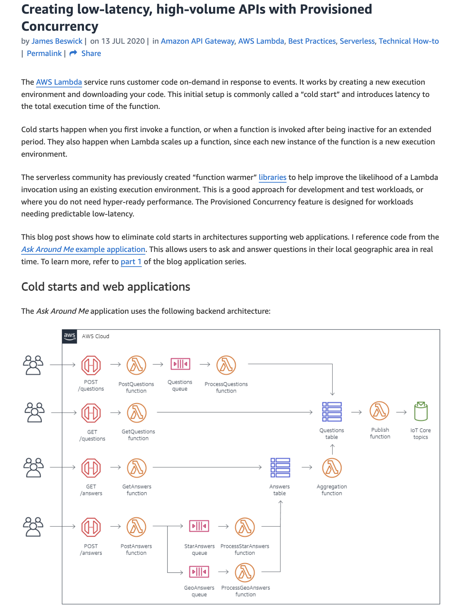
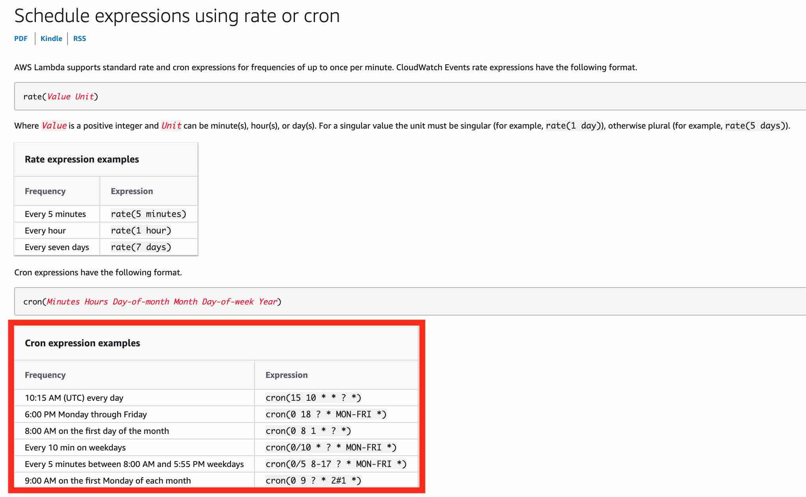
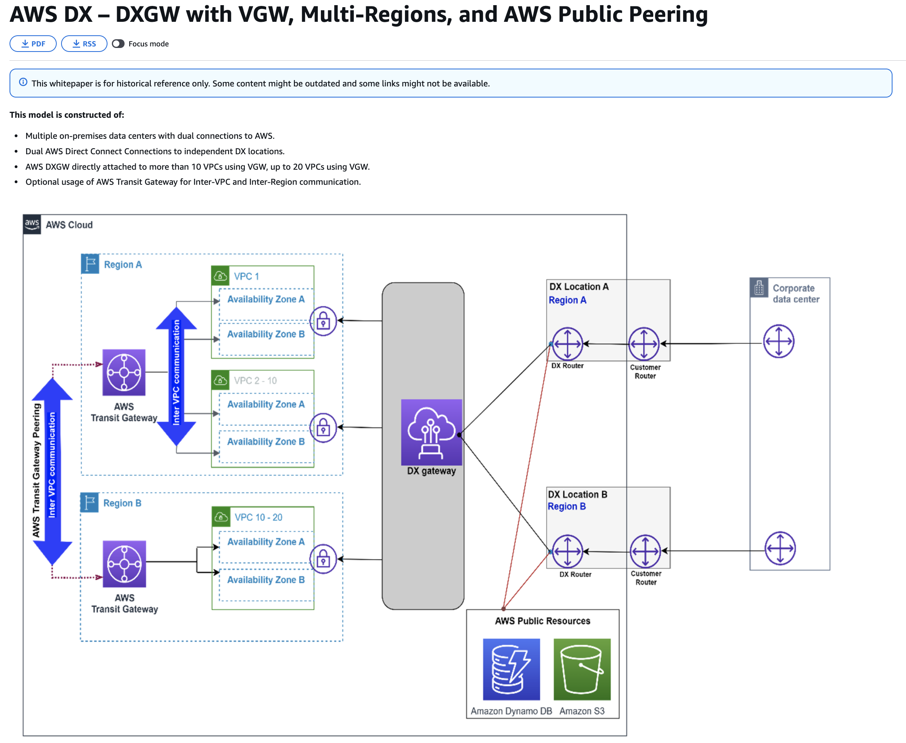

# AWS训练错题4




# 一、题目核心需求拆解（非常关键）

题目描述并不长，但信息密度很高，真正考的是**架构判断力**。

## 明确给出的需求信号

| 需求             | 架构含义                   |
| ---------------- | -------------------------- |
| Python 微服务    | 需要原生支持 Python        |
| 每秒数百请求     | 必须自动水平扩展           |
| AWS 原生         | 优先使用托管服务           |
| 自动随流量扩展   | 不能手动扩容               |
| 最少基础设施管理 | 不想管服务器               |
| 最低运维开销     | 快速构建、测试、部署       |
| 作为试点模块重构 | 迭代速度比“完美架构”更重要 |

**这些关键词几乎已经直接指向：Serverless。**

------

# 二、逐个选项分析

------

## ❌ 选项一：EC2 Spot + Auto Scaling Group

> 在 EC2 上启动 Python 后台服务，实例启动时安装依赖

### 为什么不合适？

- ❌ **运维负担极高**
  - 要管理 AMI、OS、安全补丁
- ❌ **Spot 实例会被中断**
  - 对 API 服务极不友好
- ❌ **扩容慢**
  - ASG 扩容是分钟级
- ❌ **完全不符合“低运维”**

👉 这是**传统 IaaS 思路**，与题目方向完全相反。

------

## ⚠️ 选项二：ECS + AWS Fargate（容器 + 自动扩缩）

> 使用 Docker 打包 Python 微服务，ECS Service 根据 CPU 自动扩展
>  （题目给出的“Correct answer”）

### 优点

✅ 无需管理服务器
 ✅ 支持 Python
 ✅ 企业级稳定
 ✅ 生产环境可用

### 但问题在于：

| 问题     | 说明                        |
| -------- | --------------------------- |
| 冷启动慢 | Task 启动需要时间           |
| 扩容速度 | 秒~分钟级                   |
| 复杂度   | Dockerfile、Task Definition |
| 试点成本 | 对“单模块重构”偏重          |

👉 **这是一个“正确但不最优”的方案**。

适合：

- 长时间运行服务
- 复杂依赖
- Sidecar / 多容器架构

但题目强调的是 **最小运维 + 快速试点**。

------

## ✅ 选项三：AWS Lambda + API Gateway（启用 Provisioned Concurrency）

> 使用 Lambda 运行 Python 微服务，通过 API Gateway 提供 HTTP 接口

### 为什么这是**最优解**

#### 完全命中所有要求

| 需求         | Lambda 的对应能力                  |
| ------------ | ---------------------------------- |
| Python 支持  | 原生                               |
| 高并发       | 自动并发扩展                       |
| AWS 原生     | Serverless                         |
| 零服务器管理 | 不需要 EC2                         |
| 最低运维     | 无补丁、无容量规划                 |
| 快速试点     | 几分钟即可上线                     |
| 性能稳定     | Provisioned Concurrency 消除冷启动 |

#### 架构示意

```
Client
  ↓
API Gateway
  ↓
Lambda（Python）
```

#### Provisioned Concurrency 的关键意义

- 解决冷启动
- 保障高峰期稳定延迟
- 非常适合 **突发请求型分析服务**

👉 **这是 AWS 官方最推荐的微服务起步方式**。

------

## ⚠️ 选项四：AWS App Runner

> 直接从 GitHub 构建并部署 Python 应用

### 优点

- 操作简单
- 自动扩缩
- 不需要 Docker 经验

### 不足

| 不足点   | 原因         |
| -------- | ------------ |
| 扩容速度 | 不如 Lambda  |
| 成本模型 | 高并发下更贵 |
| 灵活性   | 不如 Lambda  |
| 架构本质 | 仍是常驻服务 |

👉 更适合：

- 常驻 Web 应用
- 中低并发 API

不适合：

- 高频突发流量
- 极简运维的分析型微服务

------

# 三、最终对比总结（非常适合考试）

| 方案                | 运维 | 扩容速度 | 成本   | 试点友好 |
| ------------------- | ---- | -------- | ------ | -------- |
| EC2 ASG             | ❌ 高 | ❌ 慢     | ❌ 差   | ❌        |
| ECS Fargate         | ⚠️ 中 | ⚠️ 中     | ⚠️      | ⚠️        |
| **Lambda + API GW** | ✅ 无 | ✅ 极快   | ✅ 最优 | ✅ 最优   |
| App Runner          | ✅ 低 | ⚠️        | ⚠️      | ⚠️        |


# 一、题目核心需求拆解（这是关键）

先不要看选项，先**纯读需求**：

> - 容器化的风险分析工具（Docker）
> - 依赖 **持久化数据存储**
> - 当前在 **单机 + 本地挂载 volume**
> - 想迁移到 AWS
> - **必须是 Fully Managed**
> - **不想管理 EC2、volume 或底层服务器**

从这里可以直接提炼出 5 个**硬性条件**：

| 需求             | 架构含义                     |
| ---------------- | ---------------------------- |
| Docker 容器      | ECS / EKS / Lambda container |
| 持久化存储       | ❌ 不能用临时存储             |
| 单机本地 volume  | 类似 POSIX 文件系统          |
| Fully Managed    | ❌ 不要 EC2                   |
| 不管服务器和磁盘 | ❌ EBS / Node 管理            |

👉 这道题的**关键词组合 =「容器 + 持久化 + 无服务器管理」**

------

# 二、逐个选项分析

------

## ❌ 选项一：Amazon EKS + Managed Node Groups + EBS

> 用 EKS，创建 PV / PVC，手动管理 EBS 生命周期

### 为什么不符合？

- ❌ **仍然在管理 EC2（Node Group）**
- ❌ **EBS 是单 AZ、单节点绑定**
- ❌ **存储生命周期要手动管理**
- ❌ 运维复杂度高（K8s + 存储）

👉 EKS 适合：

- 已经有 Kubernetes 团队
- 多集群 / 多租户
- 自定义调度和控制

👉 **但完全不符合“不想管服务器”的前提**

------

## ❌ 选项二：AWS Lambda（容器）+ /tmp + S3 同步

> 使用 Lambda 容器运行，数据存在 /tmp，再同步 S3

### 这是一个**典型陷阱选项**

问题点非常致命：

| 问题                       | 解释         |
| -------------------------- | ------------ |
| ❌ /tmp 是临时的            | 容器重启即丢 |
| ❌ Lambda 非持久化          | 不保证状态   |
| ❌ 同步逻辑复杂             | 易出错       |
| ❌ 不符合“本地 volume 语义” | 行为不一致   |

👉 Lambda 适合：

- 无状态计算
- 事件驱动
- 短任务

👉 **不适合需要“像磁盘一样”的持久化数据**

------

## ❌ 选项三：ECS Fargate + “挂载 S3 到容器”

> 使用脚本把 S3 mount 到容器里

### 这是**非常典型的错误做法**

原因：

- ❌ **S3 不是文件系统**
- ❌ 不支持 POSIX 语义
- ❌ 无法可靠 mount（除非 hack）
- ❌ 并发 / 一致性问题严重

AWS 官方立场非常明确：

> **S3 ≠ 文件系统**

👉 如果程序原本依赖本地 volume，这种方案是**架构反模式**。

------

## ✅ 正确答案：Amazon ECS + Fargate + Amazon EFS

> 使用 ECS Fargate，挂载 EFS 作为持久化存储

### 为什么这是**唯一完全匹配的方案**

#### 1️⃣ 完全 Fully Managed

| 组件        | 管理责任 |
| ----------- | -------- |
| ECS Fargate | AWS 管   |
| 服务器      | AWS 管   |
| 扩缩容      | AWS 管   |
| EFS         | AWS 管   |

👉 **你只管容器和路径**

------

#### 2️⃣ EFS 完美替代“本地挂载 volume”

| 本地 volume 特性 | EFS 对应能力 |
| ---------------- | ------------ |
| POSIX 文件系统   | ✅            |
| 持久化           | ✅            |
| 多次重启不丢数据 | ✅            |
| 容器可直接 mount | ✅            |

而且：

- 支持多任务访问
- 不绑定单个实例
- 自动扩展容量

------

#### 3️⃣ ECS Fargate + EFS 是官方推荐组合

这是 AWS **标准架构模式**：

```
Docker Container
     ↓
ECS Fargate Task
     ↓
EFS Mount (/data)
```

**非常适合：**

- 原本跑在单机 Docker
- 依赖本地磁盘
- 不想引入 Kubernetes

------

# 三、为什么这题不是 Lambda？

这点在考试中非常重要。

### 判断口诀（记住这条）

> ❗ **只要题目出现： “本地 volume / 文件系统 / 持久化磁盘语义” → Lambda 直接排除**

Lambda 的定位是：

- 无状态
- 短生命周期
- 临时存储（/tmp）

------

# 四、最终对比总结（考试速记表）

| 方案                  | 是否无服务器 | 持久化存储 | 运维成本 | 是否匹配 |
| --------------------- | ------------ | ---------- | -------- | -------- |
| EKS + EBS             | ❌            | ✅          | ❌ 高     | ❌        |
| Lambda + /tmp         | ✅            | ❌          | ⚠️        | ❌        |
| ECS + S3 mount        | ✅            | ❌          | ⚠️        | ❌        |
| **ECS Fargate + EFS** | ✅            | ✅          | ✅ 低     | ✅        |

------

# 五、最终结论（考试标准答案）

👉 **使用 Amazon ECS（Fargate 启动类型）+ Amazon EFS 挂载作为持久化存储**

这是：

- 最接近原本「单机 Docker + 本地 volume」的云化方案
- 同时满足 **Fully Managed**
- 完全不需要管理 EC2 / 磁盘
- AWS 官方推荐的容器持久化模式


# 一、题目需求拆解（先不看选项）

> - **混合云架构**（本地数据中心 + AWS）
> - **Web 日志归档**
> - **只有最常访问的日志需要本地缓存**
> - **所有日志都要备份到 Amazon S3**
> - 本地要 **低延迟访问**
> - 云端要 **完整、低成本存储**

这几个关键词非常重要：

| 关键词                   | 含义            |
| ------------------------ | --------------- |
| Hybrid cloud             | 本地 + AWS 协同 |
| Cached data locally      | 本地不是全量    |
| Frequently accessed      | 热数据          |
| Backup all logs to S3    | 冷数据、归档    |
| Low-latency local access | 本地缓存        |

👉 **核心模式：本地缓存 + 云端全量存储**

------

# 二、正确答案解析（为什么是 Cached Volume）

## ✅ 正确答案

**AWS Volume Gateway – Cached Volume**

### 它的工作方式（非常贴合题意）

- 🔹 **主数据存储在 Amazon S3**
- 🔹 **本地仅缓存“最近 / 常访问的数据块”**
- 🔹 自动进行缓存管理（LRU 等）
- 🔹 本地访问 = 低延迟
- 🔹 S3 = 全量、低成本、持久化

### 用一句话概括

> **S3 是主存储，本地是缓存**

这正好对应题目里的：

> “only the most frequently accessed logs are available as cached data locally”

------

### 架构直觉图（脑补即可）

```
On-Prem Server
   │
   │  (hot logs)
   ▼
Cached Volume (Local Cache)
   │
   │  (all logs)
   ▼
Amazon S3 (Full Archive)
```

------

# 三、为什么 Stored Volume 是错误的（重点）

## ❌ 错误选项

**AWS Volume Gateway – Stored Volume**

### Stored Volume 的真实行为

| 特性               | Stored Volume    |
| ------------------ | ---------------- |
| 主存储位置         | **本地数据中心** |
| S3 角色            | 仅做备份         |
| 本地磁盘需求       | 很大             |
| 是否“只缓存热数据” | ❌ 否             |

意思是本地也是全量存储，同时S3作为备份

### 问题在哪？

题目说的是：

> **“只有最常访问的日志在本地”**

而 Stored Volume 是：

> **“所有数据都在本地”**

👉 完全反着来

------

### 一句话区分（考试必背）

> ❗ **Stored Volume = 本地是主存储**
>  ❗ **Cached Volume = S3 是主存储**

------

# 四、为什么其他选项也不对

------

## ❌ Snowball Edge Storage Optimized

- Snowball 是：
  - 数据迁移
  - 离线 / 边缘计算
- ❌ 不是持续运行的缓存系统
- ❌ 不适合日志归档 + 实时访问

👉 用 Snowball 来做缓存 = 用卡车当硬盘

------

## ❌ AWS Direct Connect

- Direct Connect 是：
  - **网络连接服务**
- ❌ 不存储数据
- ❌ 不缓存数据

👉 这是**概念混淆型选项**

------

# 五、四种 Storage Gateway 模式快速对照（考试神器）

| 模式              | 主存储位置 | 本地用途     | 典型场景           |
| ----------------- | ---------- | ------------ | ------------------ |
| **Cached Volume** | S3         | 热数据缓存   | 日志归档、历史数据 |
| Stored Volume     | 本地       | 全量数据     | 低延迟数据库       |
| File Gateway      | S3         | NFS/SMB 接口 | 文件共享           |
| Tape Gateway      | S3 Glacier | 虚拟磁带     | 备份系统           |

------

# 六、最终结论（标准答案表述）

👉 **推荐使用 AWS Volume Gateway – Cached Volume**

- 在本地缓存最常访问的日志，保证低延迟
- 在 **Amazon S3** 中存储全部日志，实现低成本、持久化归档
- 非常适合 **混合云 + 日志归档 + 热/冷数据分层** 的场景


# 一、最终正确答案（应选三项）

✅ **正确的三项是：**

1. **Service control policy (SCP) affects all users and roles in the member accounts, including root user of the member accounts**
    👉 SCP 会影响成员账号中的 **所有用户和角色，包括 root 用户**
2. **If a user or role has an IAM permission policy that grants access to an action that is either not allowed or explicitly denied by the applicable service control policy (SCP), the user or role can't perform that action**
    👉 如果 IAM 允许，但 SCP 不允许或显式拒绝，**依然不能执行该操作**
3. **Service control policy (SCP) does not affect service-linked role**
    👉 SCP **不影响 Service-Linked Role（服务关联角色）**

------

# 二、核心概念先澄清（非常重要）

在理解选项前，一定要牢牢记住 **SCP 的本质**：

> **SCP 定义的是“最大可用权限边界”，而不是直接授予权限**

有效权限 =
 **IAM 权限 ∩ SCP 允许范围**

------

# 三、逐条选项详细解析

------

## ✅ 选项 1（正确）

> **SCP affects all users and roles in the member accounts, including root user**

### 为什么正确？

- SCP **作用于整个成员账号**
- **root 用户也不能绕过 SCP**
- SCP 是组织级控制，优先级高于 IAM

📌 官方要点：

> Even the root user in a member account is subject to SCPs.

👉 **这是 SCP 最常考、最容易错的点之一**

------

## ❌ 选项 2（错误）

> **SCP affects service-linked roles**

### 为什么错误？

- **Service-Linked Role（SLR）是 AWS 服务自己用的角色**
- AWS 明确规定：
  - **SCP 不会影响 Service-Linked Roles**
- 否则 AWS 内部服务会被“误伤”

👉 所以：
 ❌ *SCP affects service-linked roles* → **错误**

------

## ❌ 选项 3（错误）

> **即使 SCP 不允许，只要 IAM 允许，仍然可以执行**

### 为什么错误？

这是一个**典型的“权限优先级陷阱”**

#### 实际规则是：

| 情况                    | 结果     |
| ----------------------- | -------- |
| IAM 允许 + SCP 允许     | ✅ 可以   |
| IAM 允许 + SCP 未允许   | ❌ 不可以 |
| IAM 允许 + SCP 显式拒绝 | ❌ 不可以 |
| IAM 拒绝                | ❌ 不可以 |

👉 **SCP 是“天花板”，不是“地板”**

所以这个说法是 ❌ **完全错误**

------

## ✅ 选项 4（正确）

> **If IAM allows but SCP does not allow or explicitly denies → can't perform**

### 为什么正确？

这是 SCP 的**核心定义**：

> SCP controls the **maximum permissions** available in an account

📌 一句话总结：

> **SCP 拒绝 > IAM 允许**

------

## ✅ 选项 5（正确）

> **SCP does not affect service-linked role**

### 为什么正确？

和前面解释一致：

- Service-Linked Role：
  - 由 AWS 服务创建
  - 用于代表服务执行操作
- **SCP 不会限制它们**

👉 这是 AWS 为了保证服务正常运行的“安全豁免”

------

## ❌ 选项 6（错误）

> **SCP affects all users and roles, excluding root user**

### 为什么错误？

- **root 用户不会绕过 SCP**
- SCP 作用于整个账号
- 这是对 SCP 的严重误解

👉 正确说法应是：
 **including root user**

------

# 四、最终正确 / 错误对照表（考试速查）

| 选项                             | 结论 | 原因               |
| -------------------------------- | ---- | ------------------ |
| SCP 影响 root 用户               | ✅    | SCP 作用于整个账号 |
| SCP 影响 service-linked role     | ❌    | AWS 服务豁免       |
| IAM 允许可绕过 SCP               | ❌    | SCP 是最大权限边界 |
| IAM 允许但 SCP 不允许 → 不可执行 | ✅    | 正确权限模型       |
| SCP 不影响 service-linked role   | ✅    | 官方规则           |
| SCP 不影响 root 用户             | ❌    | 错误理解           |

------

# 五、考试必背口诀（强烈推荐）

🎯 **SCP 三大铁律**

1. **SCP 是“最大权限边界”，不是授权**
2. **SCP 影响所有用户和角色，包括 root**
3. **SCP 不影响 Service-Linked Role**

或者一句更狠的：

> **SCP 面前，root 也得低头； IAM 再大，超不过 SCP； AWS 自己的角色，SCP 管不了。**


# 一、先看清楚题目本质（这是关键）

> - 应用实际托管在：`yourapp.provider.com`
> - 你希望用户访问：`www.your-domain.com`
> - `your-domain.com` 由 **Amazon Route 53** 管理
> - 应用**不在 AWS 上**，而是在**第三方 provider**

👉 这道题考的不是“DNS 基础”，而是 **“跨域名 + 第三方托管” 的正确 DNS 选择**。

------

# 二、核心判断逻辑（考试必用）

先问自己两个问题：

### ❓1. 目标是 **域名** 还是 **IP 地址**？

- 目标是：`yourapp.provider.com`
- 👉 **这是一个域名，不是 IP**

### ❓2. 目标资源是不是 **AWS 资源**？

- 托管在 provider（第三方）
- 👉 **不是 AWS 资源**

**这两个条件已经基本锁死答案了。**

------

# 三、正确答案解析

## ✅ 正确答案：**Create a CNAME record**

### 为什么 CNAME 是正确的？

**CNAME（Canonical Name）作用：**

> 把一个域名指向另一个域名

也就是说：

```
www.your-domain.com  ──CNAME──▶  yourapp.provider.com
```

### 这正好满足题目需求：

| 需求            | CNAME 是否满足 |
| --------------- | -------------- |
| 指向域名        | ✅              |
| 第三方 provider | ✅              |
| Route 53 支持   | ✅              |
| 不需要 IP       | ✅              |

👉 **这是标准做法，也是现实中最常见的场景**

------

# 四、为什么其他选项是错的（逐个拆）

------

## ❌ A Record（错误）

> A Record = 域名 → IP 地址

问题在于：

- 你并不知道 `yourapp.provider.com` 的 IP
- 即使知道，也可能随时变化
- A 记录 **不能指向域名**

👉 ❌ 不符合 DNS 规则

------

## ❌ Alias Record（错误，但很容易被选）

这是**最容易被误选的选项**。

### Alias Record 是什么？

- Route 53 的 **AWS 专用扩展**
- 用来指向：
  - ALB / NLB
  - CloudFront
  - S3 Website
  - API Gateway

⚠️ **前提：目标必须是 AWS 资源**

------

### 本题为什么不能用 Alias？

| 条件                 | 本题情况 |
| -------------------- | -------- |
| 目标是 AWS 资源？    | ❌ 否     |
| 目标在 Route 53 内？ | ❌ 否     |
| 支持第三方域名？     | ❌ 否     |

👉 所以 **Alias 直接排除**

------

## ❌ PTR Record（错误）

- PTR 是 **反向 DNS**
- 用于：IP → 域名
- 常用于邮件服务器

👉 和本题 **完全无关**

------

# 五、DNS 选择速记表（考试神器）

| 场景                  | 正确记录    |
| --------------------- | ----------- |
| 域名 → IP             | A           |
| 域名 → 域名（第三方） | ✅ **CNAME** |
| 域名 → AWS 资源       | Alias       |
| IP → 域名             | PTR         |

------

# 六、最终结论（一句话版）

👉 因为你的应用托管在 **第三方域名**（`yourapp.provider.com`），而不是 AWS 资源，也不是固定 IP，
 👉 **正确做法是创建一个 CNAME 记录**，将 `www.your-domain.com` 指向 `yourapp.provider.com`。

------

## 🎯 考试秒选口诀

> **指向“别人家的域名” → CNAME 指向“AWS 自家的资源” → Alias**

如果你愿意，我可以继续帮你：

- 📌 出一组 **Route 53 记录类型陷阱题**
- 📌 总结 **A / CNAME / Alias 的终极对比表**
- 📌 讲清楚 **为什么 Root Domain 不能用 CNAME**





# 一、先做需求拆解（不看选项）

题目给了非常多**关键数字和行为特征**，这些都是**用来“锁答案”的信号**：

### 明确条件

| 条件                         | 含义             |
| ---------------------------- | ---------------- |
| 多种 ECS Task                | 并发、分布式     |
| 运行在 ECS EC2 集群          | 多实例并发访问   |
| 所有 task 的输出和状态要存储 | **共享存储**     |
| 每个 task 输出约 20MB        | 写入频繁         |
| 同时可能有几百个 task        | **高并发 I/O**   |
| 总数据量 ≤ 1TB               | 存储容量不大     |
| 高频读写                     | **吞吐量是关键** |

👉 **这不是“容量问题”，而是“吞吐量问题”**

------

# 二、先快速排除明显错误选项

------

## ❌ Amazon DynamoDB

> 用 DynamoDB 存 task 输出和状态

### 为什么不合适？

- DynamoDB 适合：
  - Key-Value
  - 小对象
  - 高频查询
- 但这里：
  - 每个 task 写 **20MB**
  - DynamoDB 单 item 最大 **400KB**
- ❌ 完全不适合存文件型输出

👉 **直接排除**

------

## ❌ Amazon EBS 挂载到 ECS 集群实例

> 用一个 EBS volume 挂载到 ECS EC2 实例

### 致命问题

| 问题                   | 说明         |
| ---------------------- | ------------ |
| 单 AZ                  | EBS 绑定实例 |
| 不能多实例共享         | ❌            |
| 并发 task 无法安全访问 | ❌            |
| 不适合集群             | ❌            |

👉 **EBS ≠ 共享文件系统**

------

# 三、真正的选择点：EFS Bursting vs Provisioned

剩下两个都是 **Amazon EFS**，这是对的方向。

接下来考的是：
 👉 **你能不能看懂“吞吐量模型”**

------

# 四、为什么 Bursting Throughput 是错的（重点）

## ❌ Amazon EFS – Bursting Throughput

### Bursting 模式的规则（必须懂）

- 吞吐量 = 和 **存储容量挂钩**
- 规则大致是：
  - 存得越多 → 可 burst 越高
- 小文件系统 = **吞吐能力很低**

### 本题的关键冲突

| 条件           | 影响                |
| -------------- | ------------------- |
| 总数据 ≤ 1TB   | Bursting 吞吐上限低 |
| 几百 task 并发 | 需要稳定高吞吐      |
| 高频读写       | 不能靠 burst        |

👉 **Burst 模式 = 偶尔爆发，不是持续高并发**

⚠️ 一旦 burst credit 用完：

- 吞吐量会被限速
- 任务会明显变慢甚至阻塞

------

# 五、为什么 Provisioned Throughput 是正确答案

## ✅ Amazon EFS – Provisioned Throughput

### 它解决的正是本题的问题

| 需求          | Provisioned Throughput |
| ------------- | ---------------------- |
| 高频读写      | ✅                      |
| 几百并发 task | ✅                      |
| 吞吐稳定      | ✅                      |
| 与容量解耦    | ✅                      |
| 总容量不大    | ✅                      |

### 核心优势一句话

> **吞吐量与存储大小无关，由你显式指定**

这正好匹配题目：

> 数据总量 ≤ 1TB，但并发和 I/O 很高

------

# 六、一句话对比（考试必背）

> ❗ **EFS Bursting：容量大 → 吞吐高**
>  ❗ **EFS Provisioned：吞吐高 ≠ 容量大**

------

# 七、最终对照表（考试速查）

| 方案                | 并发 | 吞吐稳定性 | 是否匹配 |
| ------------------- | ---- | ---------- | -------- |
| EBS                 | ❌    | ❌          | ❌        |
| DynamoDB            | ❌    | ❌          | ❌        |
| EFS Bursting        | ⚠️    | ❌          | ❌        |
| **EFS Provisioned** | ✅    | ✅          | ✅        |

------

# 八、最终结论（标准答案表述）

👉 **推荐使用 Amazon EFS 并启用 Provisioned Throughput 模式**

原因：

- ECS 多任务并发访问
- 高频读写
- 数据量小但吞吐需求高
- 需要稳定、可预测的性能


下面是这道 **AWS 混合云 + 大规模 VPC 互联 + Direct Connect 架构题** 的**完整中文解析**。这题是 **SAA / SAP 级别的典型“网络架构升级题”**，重点考你是否能从 **“点对点” 思维升级到 “Hub-and-Spoke”**。

------

## 一、先做需求拆解（不看选项）

题目给了非常明确、而且**非常“刻意”的网络信号**：

### 已知现状

- 有 **AWS Direct Connect（DX）**（专线）
- 本地数据中心 ↔ AWS
- **25 个 VPC**
- 同一 Region
- CIDR **不重叠**（这是为路由做准备）
- 每个 VPC 都有 **private VIF**
- 架构在持续扩展

### 明确目标

| 目标                    | 含义                               |
| ----------------------- | ---------------------------------- |
| 所有 VPC 之间互通       | **VPC-to-VPC 全互联（Full Mesh）** |
| VPC ↔ On-Prem 互通      | 混合云统一网络                     |
| 可扩展                  | 不能是 N² 连接                     |
| 降低 private VIF 复杂度 | 不要 25 条 DX VIF                  |
| 最低运维成本            | 自动路由、少手工                   |

👉 **这是标准的： “多 VPC + Direct Connect + 全互联” 场景**

------

## 二、正确答案先给出（应选两个）

✅ **正确组合是：**

1. **创建 AWS Transit Gateway，并将 25 个 VPC 全部挂载到 Transit Gateway，启用路由传播**
2. **创建一个 Transit Virtual Interface（Transit VIF），并将其关联到 Transit Gateway**

这两个必须 **同时出现**，缺一不可。

------

## 三、为什么这是最优解（架构级解释）

------

### ✅ 选项一：AWS Transit Gateway + VPC Attachments（正确）

> Create an AWS Transit Gateway and attach all 25 VPCs to it

#### 这是“全互联 + 可扩展”的核心

**AWS Transit Gateway** 的本质是：

> 一个 **中心路由枢纽（Hub）**
>  代替 VPC 之间的 **点对点 Mesh**

#### 解决了什么问题？

| 问题             | Transit Gateway 的作用    |
| ---------------- | ------------------------- |
| 25 个 VPC 全互通 | ✅ Hub-and-Spoke           |
| 路由复杂         | ✅ 自动传播                |
| 扩展性           | ✅ 新 VPC 只需 1 次 Attach |
| 运维成本         | ✅ 不需要手写路由          |

📌 如果不用 TGW：

- 25 个 VPC → 需要 **300+ 条 VPC Peering**
- 路由表直接爆炸

------

### ✅ 选项二：Transit VIF + Direct Connect（正确）

> Create a transit VIF and associate it with the transit gateway

#### 这是 **Direct Connect 与 TGW 的唯一正确连接方式**

Direct Connect 有三种 VIF：

| VIF 类型        | 用途                |
| --------------- | ------------------- |
| Private VIF     | 单 VPC（VGW）       |
| Public VIF      | 公共 AWS 服务       |
| **Transit VIF** | **Transit Gateway** |

📌 题目明确说：

> 想减少 **每个 VPC 一个 private VIF 的复杂度**

👉 **Transit VIF = 一个 VIF 管所有 VPC**

这一步解决的是：

- 本地数据中心 ↔ 所有 VPC
- 不再需要 25 条 private VIF
- BGP 路由集中管理

------

## 四、为什么其他选项是错的（逐一拆）

------

### ❌ Site-to-Site VPN 到每个 VPC（错误）

- 25 个 VPC = 25 条 VPN
- 每条 VPN 2 个 tunnel
- 50+ BGP session

❌ **完全不“低运维”**
 ❌ 与 Direct Connect 的高可用、稳定性目标冲突

------

### ❌ 每个 VPC 一个 VGW + 手动路由（错误）

- 仍然是 **点对点思维**
- 路由必须人工维护
- 扩展性极差

❌ 这是 **TGW 出现之前的老架构**

------

### ❌ PrivateLink 作为 VPC 互联（错误）

- **PrivateLink 不是网络互联**
- 只能访问“服务”，不能做全网路由
- 不支持 on-prem mesh

❌ 这是 **概念混淆型选项**

------

## 五、最终架构（脑中要能画出来）

```
On-Prem DC
     │
Direct Connect
     │
Transit VIF
     │
Transit Gateway
 ┌───┼────┬────┬───┐
VPC1 VPC2 VPC3 ... VPC25
```

📌 特点总结：

- 一个 DX
- 一个 Transit VIF
- 一个 Transit Gateway
- N 个 VPC Attachments
- 自动路由传播

------

## 六、考试速记结论（非常重要）

🎯 **出现以下关键词，直接锁 TGW + Transit VIF：**

- 多个 VPC（>5）
- 全互联 / Full mesh
- Direct Connect
- 减少 private VIF
- 混合云

👉 **答案一定包含：**

- Transit Gateway
- Transit VIF

------

## 七、一句话终极总结

> **要在 AWS 中实现大规模 VPC 全互联并统一接入 Direct Connect， 最低运维成本、最高扩展性的方案就是： AWS Transit Gateway + Direct Connect Transit VIF**





## 一、先给出最终正确答案（应选三项）

✅ **正确选项是：**

1. **NAT instance supports port forwarding**
2. **NAT instance can be used as a bastion server**
3. **Security Groups can be associated with a NAT instance**

❌ **错误选项是：**

- NAT gateway supports port forwarding
- Security Groups can be associated with a NAT gateway
- NAT gateway can be used as a bastion server

------

## 二、先搞清楚本质区别（非常关键）

在 AWS 中：

- **NAT Gateway** 是 **完全托管的网络服务**
- **NAT Instance** 是 **你自己管理的一台 EC2 实例**

这一本质差异，直接决定了哪些功能“能”或“不能”。

------

## 三、逐条选项解析（为什么对 / 为什么错）

------

### ❌ NAT gateway supports port forwarding（错误）

**为什么错？**

- **NAT Gateway 不能做端口转发**
- 它的能力是固定的：
  - 仅支持 **私网 → 公网的出站流量**
  - 不支持入站连接
  - 不支持自定义 NAT 规则

📌 NAT Gateway 是“黑盒服务”，你无法配置 iptables。

👉 **结论：错误**

------

### ❌ Security Groups can be associated with a NAT gateway（错误）

**为什么错？**

- NAT Gateway **不能绑定 Security Group**
- 它只受以下控制：
  - 子网的 **Route Table**
  - 子网的 **Network ACL**

📌 Security Group 只适用于：

- EC2
- ENI
- ALB / NLB（部分场景）

👉 **结论：错误**

------

### ❌ NAT gateway can be used as a bastion server（错误）

**为什么错？**

- Bastion Server 的定义：
  - 用于 **SSH / RDP 登录**
- NAT Gateway：
  - 不支持入站连接
  - 不支持端口监听
  - 不是一台服务器

👉 **完全不可能作为 Bastion**

------

### ✅ NAT instance supports port forwarding（正确）

**为什么对？**

- NAT Instance 本质是 **EC2**
- 你可以：
  - 配置 `iptables`
  - 设置端口映射
  - 做 DNAT / SNAT

📌 这是 **NAT Gateway 永远做不到的能力**

👉 **结论：正确**

------

### ✅ NAT instance can be used as a bastion server（正确）

**为什么对？**

- NAT Instance 是 EC2
- 可以：
  - 开 22 / 3389 端口
  - 作为跳板机（Bastion）
  - 登录私有子网实例

📌 虽然**不推荐**（安全 & 单点问题），但**技术上完全可行**

👉 **结论：正确**

------

### ✅ Security Groups can be associated with a NAT instance（正确）

**为什么对？**

- NAT Instance = EC2
- 所有 EC2 都可以绑定 Security Group

📌 你可以：

- 控制入站 / 出站流量
- 限制端口
- 配合 Bastion 使用

👉 **结论：正确**

------

## 四、终极对照表（考试神器）

| 能力                | NAT Gateway | NAT Instance  |
| ------------------- | ----------- | ------------- |
| 需要管理 EC2        | ❌           | ✅             |
| 自动扩展            | ✅           | ❌             |
| 高可用              | ✅           | ❌（需自己做） |
| 绑定 Security Group | ❌           | ✅             |
| 端口转发            | ❌           | ✅             |
| 作为 Bastion        | ❌           | ✅             |
| 运维复杂度          | 低          | 高            |


## 一、问题本质先讲清楚（这是关键）

题目中的“怪现象”其实是 **AWS 的一个刻意设计**：

> 在 **不同 AWS 账号** 中，
>  **同一个 AZ 名称（如 us-west-2a）并不一定指向同一个物理数据中心**。

也就是说：

- 账号 A 的 `us-west-2a`
- 账号 B 的 `us-west-2a`

👉 **可能是两个完全不同的物理 AZ**

这正是你看到“选了同一个默认子网，但 AZ 仍然不同”的原因。

------

## 二、正确答案解析

### ✅ 正确答案

**Use Availability Zone (AZ) ID to uniquely identify the Availability Zones across the two AWS Accounts**

------

### 为什么 AZ ID 才是正确解法？

#### 1️⃣ AZ Name 是“账号本地映射”

- `us-west-2a / 2b / 2c`
- 是 **账号级别的逻辑标签**
- AWS 会在账号创建时 **随机映射** 到真实物理 AZ

👉 **不能用于跨账号对齐**

------

#### 2️⃣ AZ ID 是“全球唯一、物理一致”的

AZ ID 的形式是：

- `use2-az1`
- `use2-az2`
- `use2-az3`

这些 AZ ID：

- 在所有 AWS 账号中 **指向同一个物理数据中心**
- 是 AWS 官方提供的 **跨账号对齐机制**

📌 这正是 **Amazon Web Services** 用来解决多账号部署一致性的方式。

------

### 实际做法（你应该怎么操作）

1. 在两个账号中分别查看 AZ 列表
2. 找到 **相同的 AZ ID**（例如 `use2-az1`）
3. 在各自账号中选择 **映射到该 AZ ID 的子网**
4. 启动 EC2 实例

👉 即使 AZ 名称不同（一个是 a，一个是 b），**只要 AZ ID 相同，物理位置就是同一个 AZ**

------

## 三、为什么其他选项是错的

------

### ❌ 使用 default subnet 来识别 AZ（错误）

- Default Subnet：
  - 是账号级资源
  - AZ 名称映射仍然不同
- ❌ **不能跨账号保证一致**

------

### ❌ 使用 default VPC 来识别 AZ（错误）

- Default VPC：
  - 只是网络容器
  - 和物理 AZ 对齐 **没有任何关系**

------

### ❌ 联系 AWS Support（错误）

- 这是 **正常且预期的行为**
- AWS 不会为你“强行对齐 AZ 名称”
- 官方推荐方式就是 **AZ ID**

------

## 四、考试必背结论（非常重要）

🎯 **只要题目出现以下关键词，直接选 AZ ID：**

- 多 AWS 账号
- 同一个 Region
- 需要在“同一 Availability Zone”
- AZ 名称对不上

👉 **答案一定是：Availability Zone ID**


关于 **Region / AZ / AZ Name / AZ ID** 的所有关键点一次性收拢👇

------

## 一、最重要的结论（先记住）

> **选择哪个 Region，决定数据在哪个国家 / 地理范围； 选择 AZ，只是在这个 Region 内选择不同的失败域； 不存在“东京 AZ 实际跑到美国”的情况。**

------

## 二、Region / AZ 的物理含义（一句话版）

| 概念                       | 真正含义                                |
| -------------------------- | --------------------------------------- |
| **Region**                 | 地理 + 法律 + 网络边界（国家 / 大区域） |
| **Availability Zone (AZ)** | Region 内的**独立失败域**               |
| **Data Center**            | AZ 内部的一个或多个物理机房             |

------

## 三、AZ Name vs AZ ID（最容易混淆的点）

### 1️⃣ AZ Name（如 ap-northeast-1a）

- **账号级标签**
- 在不同账号中：
  - 名字一样
  - **物理 AZ 可能不同**
- 不能用于跨账号物理对齐

------

### 2️⃣ AZ ID（如 apne1-az1）

- **物理唯一标识**
- 跨账号一致
- 同一个 AZ ID = 同一个真实 AZ（同一失败域）

👉 **跨账号要对齐物理 AZ，必须用 AZ ID**

------

## 四、AWS“随机映射”到底随机了什么？

> **只在“同一个 Region 内”随机映射 AZ Name → 物理 AZ**

❌ 不会跨 Region
 ❌ 不会跨国家
 ❌ 不会跑到美国

------

## 五、AZ 有没有意义？结论是：有，而且非常大

### 在单账号内（99% 场景）

- AZ 选择：
  - 决定高可用
  - 决定失败域隔离
  - 决定跨 AZ 成本和延迟

👉 **这是 AWS 架构设计的基础**

------

### 在跨账号场景

- AZ Name 没意义
- **AZ ID 才有意义**

------

## 六、常见误区快速纠正

| 误解                         | 正确理解               |
| ---------------------------- | ---------------------- |
| 同名 AZ 在不同账号是同一机房 | ❌                      |
| AZ 只是一个数据中心          | ❌（AZ 可含多个 DC）    |
| AZ 可能跨国家                | ❌                      |
| Region 只是逻辑概念          | ❌（强物理 & 法律边界） |

------

## 七、一句话终极记忆口诀（强烈推荐）

> **Region 决定“在哪个国家” AZ 决定“失败域隔离” AZ Name 是账号标签 AZ ID 才是物理真相**

------


## 一、先把需求翻译成“架构语言”（非常关键）

题目关键信息其实非常明确：

- 使用 **AWS Organizations**
- **多个 AWS 账号**
- **多个国家 / 多个 Region**
- 想要 **统一、强制、可重复的资源配置**
  - 比如：
    - EC2 实例类型必须一致
    - Lambda 必须使用指定 IAM Role
- 希望是一个 **一致的资源部署流程**

👉 这已经不是“部署一次”的问题，而是：

> **跨账号 + 跨 Region + 集中控制 + 可扩展的配置治理**

------

## 二、正确答案先给出

✅ **正确答案：**

**Use AWS CloudFormation StackSets to deploy the same template across AWS accounts and regions**

------

## 三、为什么 CloudFormation StackSets 是“唯一正确解”

### 1️⃣ StackSets 的定位就是为这个场景设计的

**AWS CloudFormation StackSets** 的核心能力是：

> **从一个管理账号， 将同一个 CloudFormation 模板 自动部署到多个 AWS 账号、多个 Region**

而且可以：

- 和 **AWS Organizations** 原生集成
- 自动对新账号生效
- 集中更新 / 回滚
- 不需要在每个账号手工操作

------

### 2️⃣ 完全命中题目所有要求

| 题目要求    | StackSets 是否满足 |
| ----------- | ------------------ |
| 多 AWS 账号 | ✅                  |
| 多 Region   | ✅                  |
| 统一配置    | ✅                  |
| 集中管理    | ✅                  |
| 可扩展      | ✅                  |
| 标准化治理  | ✅                  |

👉 **这是 AWS 官方推荐的“多账号资源治理”方式**

------

## 四、为什么其他选项是错的（逐一拆）

------

### ❌ 使用 CloudFormation 模板手动部署（错误）

> “Use AWS CloudFormation templates to deploy the same template across accounts and regions”

问题在于：

- 你得：
  - 手动登录每个账号
  - 每个 Region 单独部署
- ❌ 无法集中管理
- ❌ 无法保证长期一致性
- ❌ 新账号不会自动继承配置

👉 **这只是“模板复用”，不是“统一治理”**

------

### ❌ 使用 CloudFormation Stack（错误）

> “Use AWS CloudFormation stacks…”

- Stack 是：
  - **单账号**
  - **单 Region**
- 不支持：
  - 跨账号
  - 跨 Region
  - 组织级部署

👉 **Stack ≠ StackSets**

------

### ❌ 使用 AWS Resource Access Manager（AWS RAM）（错误）

> “Use AWS RAM to deploy the same template…”

**AWS Resource Access Manager** 的作用是：

- **共享已有资源**
  - 子网
  - Transit Gateway
  - License
- ❌ **不能部署资源**
- ❌ **不能执行 CloudFormation**

👉 这是一个**概念混淆型选项**

------

## 五、什么时候“普通 Stack”才够用？

仅限以下情况：

- 单一 AWS 账号
- 单一 Region
- 没有治理需求
- 没有组织结构

一旦出现：

- 多账号
- Organizations
- 标准化配置
- 合规 / 治理

👉 **StackSets 直接锁定**

------

## 六、考试秒选口诀（强烈建议记住）

🎯 **看到以下关键词，直接选 StackSets：**

- AWS Organizations
- 多账号
- 多 Region
- 统一资源配置
- 集中部署

👉 **答案 99% 是：CloudFormation StackSets**

------

## 七、一句话终极总结

> **当企业使用 AWS Organizations，并希望在多个账号、多个 Region 中强制执行统一的资源配置标准时，最佳、最低运维成本的解决方案就是使用 AWS CloudFormation StackSets。**


AWS Config和CloudFormation

 **AWS Config** 在这类“统一配置”的题目里**经常被拿来混淆**，我们把它**一次性讲清楚**：
 👉 **AWS Config 能做什么、不能做什么、什么时候该用、什么时候不该用。**

------

## 一句话结论（先给你）

> **AWS Config 是“审计与纠偏”，不是“资源创建与部署”。**
>  **它不能替代 CloudFormation StackSets。**

------

## 一、先回到题目的“真正目标”

题目想要的是：

> **“在多个账号、多个 Region 中，统一创建资源，并且一开始就符合预定义配置。”**

关键词是：
 👉 **resource provisioning（资源部署）**

这点非常关键。

------

## 二、AWS Config 的定位（本质）

**AWS Config** 的核心能力是：

| 能力     | 说明           |
| -------- | -------------- |
| 记录配置 | 资源配置快照   |
| 持续监控 | 配置是否被改   |
| 合规检查 | 是否符合规则   |
| 触发告警 | 不合规时通知   |
| 自动修复 | *在某些情况下* |

👉 注意：
 **AWS Config ≠ 部署工具**

------

## 三、AWS Config 能不能“统一配置资源”？

### ❌ 不能（这是重点）

AWS Config：

- ❌ 不能创建 EC2
- ❌ 不能创建 Lambda
- ❌ 不能部署 IAM Role
- ❌ 不能“保证资源一开始就符合标准”

它只能：

> **“事后检查 + 发现不合规”**

------

## 四、那 AWS Config 是干什么用的？（正确用途）

### ✅ 正确使用场景

| 场景             | AWS Config 是否适合 |
| ---------------- | ------------------- |
| 资源是否符合规范 | ✅                   |
| 是否有人乱改配置 | ✅                   |
| 合规 / 审计      | ✅                   |
| 持续监控         | ✅                   |
| 强制部署标准资源 | ❌                   |

举个例子：

- 你规定：

  > EC2 只能用 `t3.medium`

- 有人手动创建了 `m5.large`

👉 AWS Config 会：

- 标记为 **Non-compliant**
- 发送告警
- （可选）触发修复 Lambda

但它 **不会帮你创建正确的 EC2**。

------

## 五、为什么本题不能选 AWS Config？

题目要求的是：

> **“set up a consistent resource provisioning process”**

也就是说：

- 一开始就要对
- 所有账号、所有 Region 都一致
- 是“部署层面”的问题

而 AWS Config 是：

> **“资源已经存在以后，才来检查”**

👉 **方向不对**

------

## 六、正确的分工模型（非常重要）

在真实企业架构中，**正确做法从来不是二选一，而是组合**👇

### ✅ 正确架构模式

| 层级             | 工具                             |
| ---------------- | -------------------------------- |
| **创建 / 部署**  | **AWS CloudFormation StackSets** |
| **持续合规检查** | AWS Config                       |
| **强制边界**     | SCP（Service Control Policies）  |

------

### 用一句话描述这个组合：

> **StackSets 负责“你只能这样建”； AWS Config 负责“你有没有偷偷改”。**

------

## 七、如果题目这样问，答案才会是 AWS Config

你以后在考试中可以这样判断 👇

### ✅ 会选 AWS Config 的题目关键词

- audit
- compliance
- monitor
- detect drift
- configuration history
- ensure resources remain compliant
- continuously evaluate

------

### ❌ 不会选 AWS Config 的关键词

- provision
- deploy
- create resources
- standardize deployment
- consistent provisioning

------

## 八、回到这道题的最终判断

题目是：

> 多账号 + 多 Region
>  **统一资源部署配置**

👉 **唯一正确答案仍然是：**

✅ **AWS CloudFormation StackSets**

AWS Config 在这里：

- 不是最优
- 甚至不是“正确方向”

------

## 九、终极记忆口诀（很实用）

> **StackSets = 建的时候就对**
>  **Config = 建完以后盯着你**


# 一句话先给你结论

> **CloudFormation 模板本质上是一个“声明式的 AWS 资源蓝图”， 描述：要创建什么资源、用什么配置、资源之间如何关联。**

------

## 一、CloudFormation 模板是什么格式？

CloudFormation 模板本质是一个 **文本文件**，支持：

- **YAML（最常用、推荐）**
- JSON（可读性差，较少用）

------

## 二、CloudFormation 模板的核心组成（重点）

一个标准的 CloudFormation 模板通常包含以下 **9 大部分**（不是都必须）：

```
AWSTemplateFormatVersion
Description
Metadata
Parameters
Mappings
Conditions
Resources   ←【最核心】
Outputs
Transform
```

下面我们一项一项讲清楚。

------

## 三、每一部分是干什么的？

------

### 1️⃣ AWSTemplateFormatVersion（几乎不用改）

```
AWSTemplateFormatVersion: '2010-09-09'
```

- 固定值
- 表示模板规范版本
- **不是 API 版本**

👉 可选，但基本都会写

------

### 2️⃣ Description（强烈推荐）

```
Description: >
  Deploy a two-tier web application with EC2 and ALB
```

- 纯说明文字
- 最多 1024 字符
- **对团队协作非常重要**

------

### 3️⃣ Metadata（给人或工具看的）

```
Metadata:
  Author: DevOps Team
  Version: 1.0
```

- 不参与资源创建
- 给工具 / 人 / CI 用
- 很多公司用来标记 Owner、环境

------

### 4️⃣ Parameters（模板的“输入参数”）

```
Parameters:
  InstanceType:
    Type: String
    Default: t3.micro
    AllowedValues:
      - t3.micro
      - t3.small
```

**作用：**

- 让模板可复用
- 不同环境传不同值（dev / prod）

👉 **StackSets、CI/CD 都离不开 Parameters**

------

### 5️⃣ Mappings（静态映射表）

```
Mappings:
  RegionMap:
    us-east-1:
      AMI: ami-123
    ap-northeast-1:
      AMI: ami-456
```

**作用：**

- 不可变的 key-value 映射
- 常用于：
  - Region → AMI
  - 环境 → 配置

👉 不接受运行时输入

------

### 6️⃣ Conditions（条件创建）

```
Conditions:
  IsProd: !Equals [ !Ref Env, prod ]
```

**作用：**

- 控制资源是否创建
- 控制属性值

```
Resources:
  ProdOnlyResource:
    Type: AWS::S3::Bucket
    Condition: IsProd
```

👉 非常适合 **多环境一套模板**

------

### 7️⃣ ⭐ Resources（核心中的核心）

```
Resources:
  MyEC2:
    Type: AWS::EC2::Instance
    Properties:
      InstanceType: t3.micro
      ImageId: ami-xxx
```

👉 **没有 Resources，就不是 CloudFormation 模板**

在这里你可以定义：

- EC2
- VPC / Subnet
- IAM Role / Policy
- ALB / ASG
- Lambda
- RDS
- S3
- 几乎所有 AWS 资源

------

### 8️⃣ Outputs（给“外部世界”的返回值）

```
Outputs:
  InstanceId:
    Value: !Ref MyEC2
```

**作用：**

- 给人看
- 给别的 Stack 用（跨 Stack 引用）
- 给 CI/CD 取值

👉 StackSets / 多 Stack 协作很常见

------

### 9️⃣ Transform（高级用法）

```
Transform: AWS::Serverless-2016-10-31
```

- 用于：
  - **AWS SAM**
  - 宏（Macro）
- 把“简写模板”转换为完整模板

------

## 四、CloudFormation 模板里的“三种东西”（很好记）

你可以这样记 👇

| 类型     | 作用                  |
| -------- | --------------------- |
| **输入** | Parameters            |
| **逻辑** | Mappings / Conditions |
| **结果** | Resources / Outputs   |

------

## 五、CloudFormation 是“声明式”的（非常重要）

你不是在说：

> “先创建 VPC，再创建 Subnet，再创建 EC2”

而是在说：

> “我需要一个 VPC、一个 Subnet、一个 EC2，
>  它们的关系是这样。”

👉 **CloudFormation 自动解决顺序、依赖、回滚**

------

## 六、一个极简完整示例（直觉版）

```
AWSTemplateFormatVersion: '2010-09-09'
Description: Simple EC2

Parameters:
  InstanceType:
    Type: String
    Default: t3.micro

Resources:
  MyEC2:
    Type: AWS::EC2::Instance
    Properties:
      InstanceType: !Ref InstanceType
      ImageId: ami-0abcdef

Outputs:
  InstanceId:
    Value: !Ref MyEC2
```

------

## 七、这和你前面问的 StackSets 有什么关系？

> **StackSets = 把“同一个 CloudFormation 模板” 同步部署到多个账号 / Region**

所以：

- 模板写的是 **“资源长什么样”**
- StackSets 决定 **“部署到哪里、部署多少份”**

------

## 八、终极一句话总结（记住这个）

> **CloudFormation 模板描述的是： “我要什么资源，用什么配置，资源之间怎么连。”**