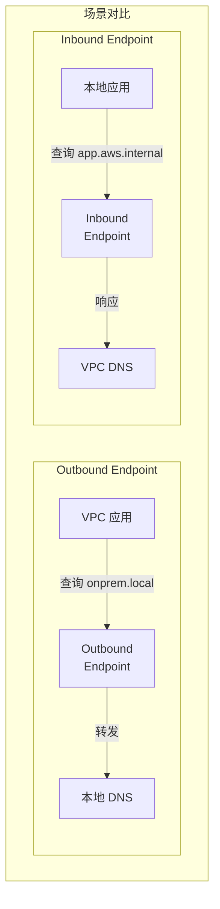

## Route 53 完整知识体系重建

## 一、Route 53 是什么？

### 三大核心功能

yaml

```yaml
1. 域名注册商（Domain Registrar）:
   - 买域名的地方
   - 如：example.com
   
2. DNS 服务（DNS Service）:
   - 把域名转换成 IP
   - example.com → 192.168.1.1
   
3. 健康检查（Health Checking）:
   - 监控端点是否健康
   - 自动故障转移
```

## 二、核心概念详解

### 1. Hosted Zone（托管区域）

#### Public Hosted Zone（公有托管区域）

yaml

```yaml
是什么:
  - 互联网上的 DNS 记录
  - 任何人都能查询
  
例子:
  www.example.com → 54.231.1.1 (CloudFront)
  api.example.com → 13.250.1.1 (ALB)
  
创建后得到:
  - 4 个 Route 53 名称服务器
  - 需要在域名注册商处配置这些 NS 记录
  
成本: $0.50/月 per zone
```

#### Private Hosted Zone（私有托管区域）

yaml

```yaml
是什么:
  - VPC 内部的 DNS 记录
  - 只有关联的 VPC 能查询
  
例子:
  database.internal → 10.0.1.100 (RDS)
  app.corp → 10.0.2.50 (EC2)
  
特点:
  - 必须关联一个或多个 VPC
  - 可跨账号、跨区域关联
  - 不会暴露到互联网
  
成本: $0.50/月 per zone
```

### 对比示例

bash

```bash
# Public Hosted Zone
$ nslookup www.example.com
# ✅ 互联网上任何地方都能查

# Private Hosted Zone  
$ nslookup db.internal
# ❌ 只在关联的 VPC 内能查
```

### 2. Route 53 Resolver（解析器）

#### 默认 VPC Resolver

yaml

```yaml
每个 VPC 自带的 DNS 解析器:
  位置: VPC CIDR + 2 (如 10.0.0.2)
  
默认行为:
  1. 查询 Private Hosted Zone（如果有）
  2. 查询 Public DNS
  3. 无法查询本地数据中心 DNS
```

#### Resolver Endpoints（解析端点）

mermaid



##### Outbound Endpoint 详解

yaml

```yaml
用途: AWS → 查询 → 外部 DNS

工作原理:
  1. 在 VPC 中创建 ENI（弹性网络接口）
  2. 作为 DNS 查询的出口
  3. 将特定域名查询转发到外部 DNS
  
配置要素:
  - 至少 2 个 AZ，每个 AZ 一个 IP
  - 安全组控制（出站 UDP 53）
  - 转发规则指定域名和目标 DNS
  
场景:
  - 查询公司内部域名
  - 查询合作伙伴私有域名
  
成本: $0.125/小时 per IP
```

##### Inbound Endpoint 详解

yaml

```yaml
用途: 外部 → 查询 → AWS DNS

工作原理:
  1. 在 VPC 中创建 ENI 监听 DNS 查询
  2. 外部网络将其作为 DNS 服务器
  3. 响应 Private Hosted Zone 的查询
  
配置要素:
  - 至少 2 个 AZ，每个 AZ 一个 IP
  - 安全组控制（入站 UDP 53）
  - 外部 DNS 配置条件转发
  
场景:
  - 本地应用访问 AWS 私有资源
  - 混合云环境双向 DNS 解析
  
成本: $0.125/小时 per IP
```

### 3. 记录类型

#### 常见记录类型

yaml

```yaml
A 记录:
  域名 → IPv4
  example.com → 192.168.1.1

AAAA 记录:
  域名 → IPv6
  example.com → 2001:0db8:85a3::8a2e

CNAME 记录:
  域名 → 另一个域名
  www.example.com → example.com
  ⚠️ 不能用于根域名

ALIAS 记录（Route 53 特有）:
  域名 → AWS 资源
  example.com → ALB/CloudFront/S3
  ✅ 可以用于根域名
  ✅ 免费查询

MX 记录:
  邮件服务器
  example.com → mail.example.com

TXT 记录:
  文本信息
  域名验证、SPF 等
```

### 4. 路由策略

yaml

```yaml
简单路由（Simple）:
  - 单个资源
  - 随机返回多个值之一

加权路由（Weighted）:
  - 按权重分配流量
  - 蓝绿部署：90% 旧版本，10% 新版本

延迟路由（Latency）:
  - 选择延迟最低的区域
  - 全球应用优化

故障转移（Failover）:
  - 主备切换
  - 配合健康检查

地理位置（Geolocation）:
  - 基于用户位置
  - 内容本地化

地理邻近（Geoproximity）:
  - 基于资源和用户位置
  - 可调整偏差

多值应答（Multivalue）:
  - 返回多个健康的 IP
  - 类似简单路由但有健康检查
```

## 三、实战场景详解

### 场景 1：纯 AWS 环境

yaml

```yaml
需求: 
  - EC2 访问 RDS
  - 使用友好域名

方案:
  1. 创建 Private Hosted Zone: corp.internal
  2. 添加 A 记录: db.corp.internal → RDS endpoint
  3. 关联 VPC
  
结果:
  EC2 可以用 db.corp.internal 访问数据库
```

### 场景 2：混合云环境（原题场景）

yaml

```yaml
需求:
  - AWS 应用访问本地服务
  - 本地 DNS 服务器: 10.0.0.53
  - 本地域名: onprem.local

方案:
  1. 创建 Outbound Endpoint
  2. 创建转发规则:
     - 域名: *.onprem.local
     - 目标: 10.0.0.53:53
  3. 关联到 VPC
  
DNS 查询流程:
  App → VPC Resolver → Outbound Endpoint 
  → VPN → 本地 DNS → 返回 IP
```

### 场景 3：双向 DNS 解析

yaml

```yaml
需求:
  - AWS 访问本地
  - 本地访问 AWS

方案:
  Outbound Endpoint:
    - *.onprem.local → 10.0.0.53
  
  Inbound Endpoint:
    - 提供 IP: 10.1.1.10, 10.1.2.10
    - 本地 DNS 配置转发:
      *.aws.internal → 10.1.1.10
  
  Private Hosted Zone:
    - aws.internal
    - 各种 AWS 资源记录
```

## 四、配置示例

### 创建 Outbound Endpoint（CLI）

bash

```bash
# 1. 创建端点
aws route53resolver create-resolver-endpoint \
  --creator-request-id unique-string \
  --name onprem-outbound \
  --direction OUTBOUND \
  --security-group-ids sg-0123456789abcdef0 \
  --ip-addresses \
    SubnetId=subnet-11111,Ip=10.0.1.10 \
    SubnetId=subnet-22222,Ip=10.0.2.10

# 2. 创建转发规则  
aws route53resolver create-resolver-rule \
  --creator-request-id unique-string \
  --name forward-to-onprem \
  --rule-type FORWARD \
  --domain-name onprem.local. \
  --resolver-endpoint-id rslvr-out-xxxxx \
  --target-ips \
    Ip=10.0.0.53,Port=53

# 3. 关联规则到 VPC
aws route53resolver associate-resolver-rule \
  --resolver-rule-id rr-xxxxx \
  --vpc-id vpc-xxxxx
```

### 创建 Private Hosted Zone（控制台）

yaml

```yaml
步骤:
  1. Route 53 控制台 → Hosted Zones
  2. Create Hosted Zone
  3. 填写:
     - Domain name: internal.company
     - Type: Private
     - VPC: 选择要关联的 VPC
  4. 创建后添加记录:
     - A: app.internal.company → 10.0.1.100
     - CNAME: www.internal.company → app.internal.company
```

## 五、费用总结

yaml

```yaml
Hosted Zones:
  Public/Private: $0.50/月 per zone
  查询费用: $0.40 per 百万次查询

Resolver Endpoints:
  Inbound/Outbound: $0.125/小时 per IP
  最少 2 个 IP = $0.25/小时 = ~$180/月
  处理费: $0.40 per 百万次查询

健康检查:
  HTTP/HTTPS/TCP: $0.50/月 per check
  
域名:
  .com: ~$12/年
  .io: ~$39/年
```

## 六、故障排查

### DNS 不工作检查清单

bash

~~~bash
# 1. VPC 中测试 DNS 解析
$ nslookup example.internal
$ dig example.internal

# 2. 检查 Private Hosted Zone 关联
aws route53 list-hosted-zones-by-vpc \
  --vpc-id vpc-xxxxx \
  --vpc-region us-east-1

# 3. 检查 Resolver Rules
aws route53resolver list-resolver-rules

# 4. 检查安全组
- Outbound: 允许 UDP 53 出站
- Inbound: 允许 UDP 53 入站

# 5. 检查 NACL
- 允许 UDP 53 双向

# 6. VPC DNS 设置
- enableDnsHostnames: true
- enableDnsSupport: true
```

## 七、记忆技巧

### 1. 方向记忆
```
Outbound = Out = 出去 = AWS 查外面
Inbound = In = 进来 = 外面查 AWS

"出找外，入被找"
```

### 2. Zone 类型
```
Public = 公园 = 谁都能进
Private = 私宅 = 只有家人(VPC)能进
```

### 3. 记录类型
```
A = Address (IPv4)
AAAA = Address×4 (IPv6，4个A)
CNAME = Canonical Name (别名)
ALIAS = AWS 特供 (免费)
~~~

### 4. 考试要点

yaml

```yaml
看到 "混合云 DNS":
  - 想到 Resolver Endpoints
  
看到 "AWS 查询本地":
  - 选 Outbound Endpoint
  
看到 "本地查询 AWS":
  - 选 Inbound Endpoint
  
看到 "VPC 内部域名":
  - 选 Private Hosted Zone
  
看到 "降低延迟":
  - 选 Latency routing
  
看到 "灾难恢复":
  - 选 Failover routing
```

## 八、总结对比表

```
功能Public ZonePrivate ZoneOutboundInbound
作用互联网 DNSVPC 内 DNSAWS→外部外部→AWS
可见性全球仅 VPC--
典型记录www.comdb.internal--
成本$0.50/月$0.50/月$180+/月$180+/月
使用场景公司官网内部服务查本地DNS本地查AWS
```

记住：**Route 53 = DNS 瑞士军刀**，什么 DNS 需求都能解决！